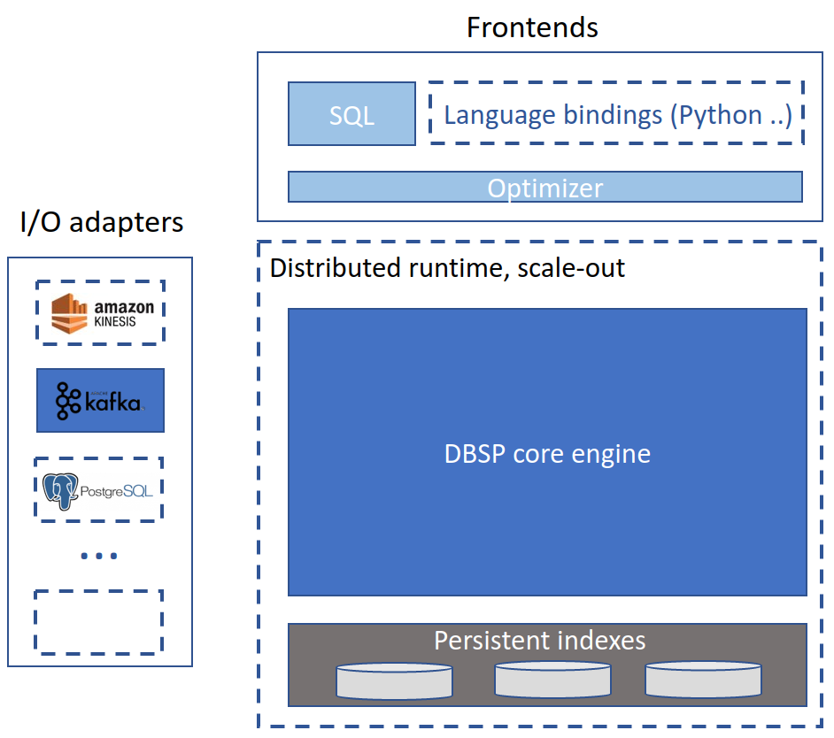

[](https://opensource.org/licenses/MIT)
[](https://github.com/vmware/database-stream-processor/actions)
[](https://codecov.io/gh/vmware/database-stream-processor)

# Database Stream Processor

Database Stream Processor (DBSP) is a framework for computing over data streams
that aims to be more expressive and performant than existing streaming engines.

## DBSP Mission Statement

Computing over streaming data is hard.  Streaming computations operate over
changing inputs and must continuously update their outputs as new inputs arrive.
They must do so in real time, processing new data and producing outputs with a
bounded delay.

We believe that software engineers and data scientists who build streaming data
pipelines should not be exposed to this complexity.  They should be able to
express their computations as declarative queries and use a streaming engine to
evaluate these queries correctly and efficiently.  DBSP aims to be such an
engine.  To this end we set the following high-level objectives:

1. **Full SQL support and more.**  While SQL is just the first of potentially
many DBSP frontends, it offers a reference point to characterize the
expressiveness of the engine.  Our goal is to support the complete SQL syntax
and semantics, including joins and aggregates, correlated subqueries, window
functions, complex data types, time series operators, UDFs, etc.  Beyond
standard SQL, DBSP supports recursive queries, which arise for instance in graph
analytics problems.

1. **Scalability in multiple dimensions.**  The engine scales with the number and
complexity of queries, streaming data rate and the amount of state the system
maintains in order to process the queries.

1. **Performance out of the box.**  The user should be able to focus on the
business logic of their application, leaving it to the system to evaluate this
logic efficiently.

## Theory

The above objectives can only be achieved by building on a solid mathematical
foundation.  The formal model that underpins our system, also called DBSP, is
described in the accompanying paper (link points to an earlier version while
we prepare the camera-ready version of the paper):

- [Budiu, Chajed, McSherry, Ryzhyk, Tannen. DBSP: Automatic
  Incremental View Maintenance for Rich Query Languages, Conference on
  Very Large Databases, August 2023, Vancouver,
  Canada](https://arxiv.org/abs/2203.16684)

The model provides two things:

1. **Semantics.** DBSP defines a formal language of streaming operators and
queries built out of these operators, and precisely specifies how these queries
must transform input streams to output streams.

1. **Algorithm.** DBSP also gives an algorithm that takes an arbitrary query and
generates a dataflow program that implements this query correctly (in accordance
with its formal semantics) and efficiently.  Efficiency here means, in a
nutshell, that the cost of processing a set of input events is proportional to
the size of the input rather than the entire state of the database.

## DBSP Concepts

DBSP unifies two kinds of streaming data: time series data and change data.

- **Time series data** can be thought of as an infinitely growing log indexed by
  time.

- **Change data** represents updates (insertions, deletions, modifications) to
  some state modeled as a table of records.

In DBSP, a time series is just a table where records are only ever added and
never removed or modified.  As a result, this table can grow unboundedly; hence
most queries work with subsets of the table within a bounded time window.  DBSP
does not need to wait for all data within a window to become available before
evaluating a query (although the user may choose to do so): like all queries,
time window queries are updated on the fly as new inputs become available.  This
means that DBSP can work with arbitrarily large windows as long as they fit
within available storage.

DBSP queries are composed of the following classes of operators that apply to
both time series and change data:

1. **Per-record operators** that parse, validate, filter, transform data streams
one record at a time.

1. The complete set of **relational operators**: select, project, join,
aggregate, etc.

1. **Recursion**: Recursive queries express iterative computations, e.g.,
partitioning a graph into strongly connected components.  Like all DBSP queries,
recursive queries update their outputs incrementally as new data arrives.

In addition, DBSP supports **windowing operators** that group time series data
into time windows, including various forms of tumbling and sliding windows,
windows driven by watermarks, etc.

## Architecture

The following diagram shows the architecture of the DBSP platform.  Solid
blocks indicate components that we are currently working on; white blocks with
dashed borders are on our TODO list.

<p align="center">
  
</p>

The DBSP core engine is written in Rust and provides a Rust API for building
data-parallel dataflow programs by instantiating and connecting streaming
operators.  Developers can use this API directly to implement complex
streaming queries.  We are also developing a
[compiler from SQL to DBSP](https://github.com/vmware/sql-to-dbsp-compiler) that
enables engineers and data scientists to use the engine via a familiar
query language.  In the future, we will add DBSP bindings for languages
like Python and Scala.

At runtime, DBSP can consume inputs from and send outputs to
event streams, e.g., Kafka, databases, e.g., Postgres, and data warehouses,
e.g., Snowflake.

The distributed runtime will extend DBSP's data-parallel execution model to
multiple nodes for high availability and throughput.

## Applications

*TODO*

## Documentation

The project is still in its early days.  API and internals documentation is
coming soon.

*TODO*

# Contributing

## Setting up git hooks

Execute the following command to make `git commit` check the code before commit:

```shell
GITDIR=$(git rev-parse --git-dir)
ln -sf $(pwd)/tools/pre-push ${GITDIR}/hooks/pre-push
```

## Running Benchmarks against DBSP

The repository has a number of benchmarks available in the `benches` directory that provide a comparison of DBSP's performance against a known set of tests.

Each benchmark has its own options and behavior, as outlined below.

### Nexmark Benchmark

You can run the complete set of Nexmark queries, with the default settings, with:

```shell
cargo bench --bench nexmark --features with-nexmark
```

By default this will run each query with a total of 100 million events emitted at 10M per second (by two event generator threads), using 2 CPU cores for processing the data.

To run just the one query, q3, with only 10 million events, but using 8 CPU cores to process the data and 6 event generator threads, you can run:

```shell
cargo bench --bench nexmark --features with-nexmark -- --query q3 --max-events 10000000 --cpu-cores 8 --num-event-generators 6
```

For further options that you can use with the Nexmark benchmark,

```shell
cargo bench --bench nexmark --features with-nexmark -- --help
```

An extensive blog post about the implementation of Nexmark in DBSP:
<https://liveandletlearn.net/post/vmware-take-3-experience-with-rust-and-dbsp/>
