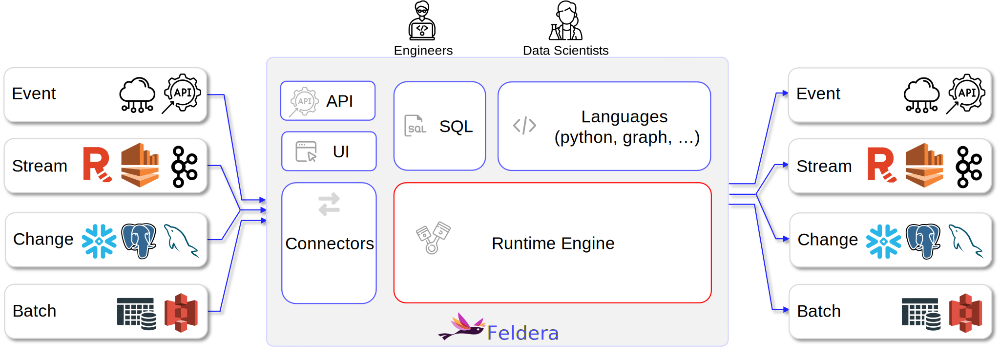

<h1 align="center">
  <a href="https://feldera.com">
    <picture>
      <source height="125" media="(prefers-color-scheme: dark)" srcset="https://raw.githubusercontent.com/feldera/docs.feldera.com/refs/heads/main/static/img/logo-color-light.svg">
      
    </picture>
  </a>
  <br>
  <br>
  <a href="https://opensource.org/licenses/MIT">
    
  </a>
  <a href="https://github.com/feldera/feldera/actions/workflows/ci.yml">
    
  </a>
  <a href="https://github.com/feldera/feldera/actions/workflows/ci-nightly.yml" >
    
  </a>
  <a href="https://github.com/feldera/feldera/actions/workflows/containers.yml">
    
  </a>
  <a href="https://www.feldera.com/community">
    
  </a>
  <a href="https://discord.gg/5YBX9Uw5u7">
    
  </a>
  <a href="https://try.feldera.com/">
    
  </a>
</h1>

<p align="center">
  <em><b><a href="https://feldera.com">Feldera</a></b></em> is a fast query engine for <b>incremental computation</b>. Feldera has the <a href="#-theory">unique</a> ability to <b>evaluate arbitrary SQL programs incrementally</b>, making it more powerful, expressive and performant than existing alternatives like batch engines, warehouses, stream processors or streaming databases.
</p>

---

## 🔥 Incremental Computation Engine

Our approach to incremental computation is simple. A Feldera `pipeline` is a set of SQL tables and views. Views can be
deeply nested.
Users start, stop or pause pipelines to manage and advance a computation.
Pipelines continuously process
**changes**, which are any number of inserts, updates or deletes to a set of tables. When the pipeline receives changes,
Feldera **incrementally** updates all the views by only looking at the changes and it completely avoids recomputing over
older data.
While a pipeline is running, users can inspect the results of the views at any time.

Our approach to incremental computation makes Feldera incredibly fast (millions of events per second on a laptop).
It also enables **unified offline and online compute** over both live and historical data. Feldera users have built batch
and real-time
feature engineering pipelines, ETL pipelines, various forms of incremental and periodic analytical jobs over batch data,
and more.

## 🎯 Our defining Features

1. **Full SQL support and more.**  Our engine is the only one in existence that can evaluate full SQL
   syntax and semantics completely incrementally. This includes joins and aggregates, group by, correlated subqueries,
   window functions, complex data types, time series operators, UDFs, and
   recursive queries. Pipelines can process deeply nested hierarchies of views.

2. **Fast out-of-the-box performance.**  Feldera users have reported getting complex use cases
   implemented in 30 minutes or less, and hitting millions
   of events per second in performance on a laptop without any tuning.

3. **Datasets larger than RAM.** Feldera is designed to handle datasets
   that exceed the available RAM by spilling efficiently to disk, taking advantage of recent advances in NVMe storage.

4. **Strong guarantees on consistency and freshness.** Feldera is strongly consistent. It
   also [guarantees](https://www.feldera.com/blog/synchronous-streaming/) that the state of the views always corresponds
   to what you'd get if you ran the queries in a batch system for the same input.

5. **Connectors for your favorite data sources and destinations.** Feldera connects to myriad batch and streaming data
   sources, like Kafka, HTTP, CDC streams, S3, Data Lakes, Warehouses and more.
   If you need a connector that we don't yet support, [let us know](https://github.com/feldera/feldera/issues).

6. **Fault tolerance**. Feldera can gracefully restart from the exact
   point of an abrupt shutdown or crash, picking up from where it left
   off without dropping or duplicating input or output. Fault
   tolerance is a preview feature that requires support from input and
   output connectors.

7. **Seamless ad-hoc queries**. You can run ad-hoc SQL queries on a running or paused pipeline to inspect or debug the
   state of materialized views. While these queries are evaluated in batch mode using Apache Datafusion, their
   results are consistent with the incremental engine's output for the same queries, aside from minor dialect and
   rounding differences.

## 💻 Architecture

The following diagram shows Feldera's architecture



## ⚡️ Quick start with Docker

First, make sure you have [Docker](https://docs.docker.com/) installed. Then run the
following command:

```text
docker run -p 8080:8080 --tty --rm -it ghcr.io/feldera/pipeline-manager:0.36.0
```

Once the container image downloads and you see the Feldera logo on your terminal, visit
the WebConsole at [http://localhost:8080](http://localhost:8080).
We suggest going through our [tutorial](https://docs.feldera.com/tutorials/basics/) next.

We also have instructions to run Feldera using [Docker Compose](https://docs.feldera.com/get-started),
if you'd like to experiment with Kafka and other auxiliary services.

## ⚙️ Running Feldera from sources

To run Feldera from sources, first install required dependencies:

- [Rust tool chain](https://www.rust-lang.org/tools/install)
- cmake
- libssl-dev
- Java Development Kit (JDK), version 19 or newer
- maven
- [Bun](https://bun.sh/docs/installation)

After that, the first step is to build the SQL compiler:

```
cd sql-to-dbsp-compiler
./build.sh
```

Next, from the repository root, run the pipeline-manager:

```
cargo run --bin=pipeline-manager --features pg-embed
```

As with the Docker instructions above, you can now visit
[http://localhost:8080](http://localhost:8080) on your browser to see the
Feldera WebConsole.

## 📖 Documentation

To learn more about Feldera Platform, we recommend going through the
[documentation](https://docs.feldera.com).

* [Getting started](https://docs.feldera.com/get-started)
* [Feldera basics](https://docs.feldera.com/tutorials/basics/)
* [Tutorials](https://docs.feldera.com/tutorials)
* [SQL reference](https://docs.feldera.com/sql/)
* [API reference](https://docs.feldera.com/api)
* [Python SDK](https://docs.feldera.com/python/)

## 🤖 Benchmarks

Feldera is generally [faster and uses less memory](https://www.feldera.com/blog/nexmark-vs-flink)
than systems like stream processors. Our Benchmarks are performed by our CI on every commit that goes in
`main`. If you want to see all the results, please visit [benchmarks.feldera.io](https://benchmarks.feldera.io/).

<p float="left" align="middle">
  
</p>

## 👍 Contributing

The software in this repository is governed by an open-source license.
We welcome contributions. Here are some [guidelines](CONTRIBUTING.md).

## 🎓 Theory

Feldera Platform achieves its objectives by building on a solid mathematical
foundation. The formal model that underpins our system, called DBSP, is
described in the accompanying paper:

- [Budiu, Chajed, McSherry, Ryzhyk, Tannen. DBSP: Automatic
  Incremental View Maintenance for Rich Query Languages, Conference on
  Very Large Databases, August 2023, Vancouver,
  Canada](https://docs.feldera.com/vldb23.pdf)

- Here is [a presentation about DBSP](https://www.youtube.com/watch?v=iT4k5DCnvPU) at the 2023
  Apache Calcite Meetup.

The model provides two things:

1. **Semantics.** DBSP defines a formal language of streaming operators and
   queries built out of these operators, and precisely specifies how these queries
   must transform input streams to output streams.

1. **Algorithm.** DBSP also gives an algorithm that takes an arbitrary query and
   generates an incremental dataflow program that implements this query correctly (in accordance
   with its formal semantics) and efficiently. Efficiency here means, in a
   nutshell, that the cost of processing a set of input events is proportional to
   the size of the input rather than the entire state of the database.
