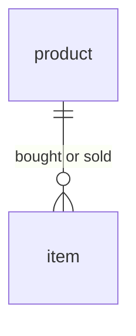

# Demo: ProductItems (continuous)

The use case is of a data model that captures items being
bought and sold in an item store.

## Data model

There are two tables: `product` and `item` in a one-to-many relationship.



## Data generation

Data generation is as follows:

- A fixed number of products is generated
- A target number of item entries (inserts and updates) is set
- When an item is added, it has a `sold_at` timestamp of `NULL`
- A minimum and maximum number of available items (= not sold)
  is maintained in an imaginary item store
- If the minimum is not satisfied, a new item is added
- Else, if the maximum has been reached, an existing
  available item is sold
- Else, there is a 50% chance of a new item to be added, and
  a 50% chance of an existing available item to be sold

## Usage

1. **Kafka:** setup of a Kafka server with the following setup:
   - Two topics:
     - `demo-productitems-product` with unlimited retention
     - `demo-productitems-item` with time- or space-limited retention
   - Authorization setup with authentication:
     - A consumer user with read permission on the topics
       (`<consume-username>`, `<consume-password>`)
     - A producer user with write permission on the topics
       (`<produce-username>`, `<produce-password>`)

2. **Generate demo.json:** using its template, generate the final demo.json:
   ```
   python3 generate_demo_json.py
   ```
   ... which will generate `demo.json`. This will need to be hosted somewhere
   accessible over the network (see step 4).

3. **Setup secrets:** set up several Feldera connector secrets
   by following the [instructions](https://www.feldera.com/docs/cloud/secret-management):
   - productitems-bootstrap-servers
   - productitems-consume-sasl-username
   - productitems-consume-sasl-password

4. **Start Feldera:** start the Feldera instance providing as argument
   how to reach the generated *demo.json*:
   ```
   ... --demos https://raw.githubusercontent.com/feldera/feldera/main/demo/demos/productitems-continuous/demo.json
   ```

5. **Data generation**
   1. Start a container and enter its shell
   2. Install `python3` and the required modules using `pip3`
   3. Copy over `generate_continuous_data.py`
   4. Start the data generation script, for example:
      ```
      python3 generate_continuous_data.py \
          --num-product=100 \
          --min-items-available=200 \
          --max-items-available=500 \
          --num-item-entries=1000000000000000000 \
          --target-item-entry-rate-per-second=10 \
          --bootstrap-servers [bootstrap-servers] \
          --security-protocol [security-protocol] \
          --sasl-mechanism [sasl-mechanism] \
          --sasl-username [produce-sasl-username] \
          --sasl-password [produce-sasl-password]
      ```
