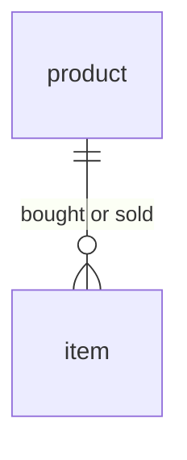

# Demo: ProductItems

The use case is of a data model that captures items being
bought and sold in an item store.

## Data model

There are two tables: `product` and `item` in a one to many relationship.



## Data generation

Data generation is as follows:

- A fixed number of products is generated
- A target number of item entries (inserts and updates) is set
- When an item is added, it has a `sold_at` timestamp of `NULL`
- A minimum and maximum number of available items (= not sold)
  is maintained in an imaginary item store
- If the minimum is not satisfied, a new item is added
- Else, if the maximum has been reached, an existing
  available item is sold
- Else, there is a 50% chance of a new item to be added, and
  a 50% chance of an existing available item to be sold

## Usage

Run the following:
```
python3 generate.py
```

to generate the JSON data files (`data-product.json` and `data-item.json`).
In addition, the python file reads the SQL program and outputs it as a
JSON-serialized string (useful to update `demo.json`).

This demo is originally designed as a pre-built demo (see `demo.json`).
The demo URL with the current branch is:

```
https://raw.githubusercontent.com/feldera/feldera/canned-demo-warehouse/demo/demos/productitems/demo.json
```

**Manual run steps:**

1. Create a program named `productitems-program` with as its SQL the content of `program.sql`
2. Create a pipeline named `productitems-pipeline` that uses the program
3. With a `curl` request feed in the `product` data:
   ```
   curl -X POST 'http://localhost:8080/v0/pipelines/productitems-pipeline/ingress/PRODUCT?format=json&array=false' -d '@data-product.json'
   ```
4. With a `curl` request feed in the `item` data:
   ```
   curl -X POST 'http://localhost:8080/v0/pipelines/productitems-pipeline/ingress/ITEM?format=json&array=false' -d '@data-item.json'
   ```
