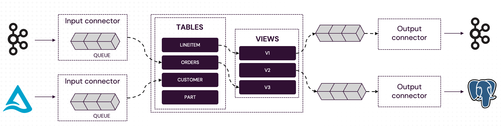

# Synchronous Processing with Completion Tokens

Completion tokens enable synchronous processing on top of Feldera’s asynchronous pipelines, allowing
users to precisely track when a specific set of inputs has been fully processed by the pipeline.

## Background

Feldera pipelines process data **asynchronously**. While the incremental SQL engine is evaluating
earlier inputs, input connectors continue ingesting data into internal buffers, and output connectors
write prior results to external sinks.



However, the SQL engine itself is **synchronous** and **strongly consistent**. It processes inputs in
discrete transactions—each transaction: ingests a set of records from input connectors, processes them
to completion and outputs **all** resulting changes to the output views before moving on to the next
transaction.

This enables Feldera to determine precisely when a specific set of inputs has been fully processed,
from ingest all the way to writing results to data sinks. Completion tokens expose this capability via
a simple API.

## Completion tokens

A completion token is an opaque handle representing a specific point in the input stream from one connector.
The client can use the completion token to check whether all inputs ingested before the token was issued have
been fully processed, and the resulting outputs have been written to all data sinks attached to the pipeline.

Completion tokens can be used to implement synchronous processing as follows:

1. Submit data to the pipeline.
2. Generate a completion token.
3. Wait for processing to complete by checking the token's status.

Completion tokens have several important properties:

* A completion token is tied to a specific input connector and only tracks inputs
 received from this connector.

* The pipeline can continue process new inputs, including from the same input connector, while the client
 is waiting on a completion token.

* The client can generate any number of completion tokens for the same or different connectors to
 track the status of multiple inputs at the same time.

This enables efficient, overlapping execution: clients can push additional inputs while
waiting for earlier inputs to be processed.

## Hot to generate a completion token

There are two ways to generate a completion token, depending on the type of the input connector:

1. The [HTTP input connector](/connectors/sources/http) returns a token
 in response to every [`/ingress`](https://docs.feldera.com/api/push-data-to-a-sql-table) request.
 This token tracks completion for the data ingested as part of this request.

2. For all other input connectors, use the
 [`/completion_token`](https://docs.feldera.com/api/generate-a-completion-token-for-an-input-connector)
 endpoint to generate a token. This token tracks all inputs ingested by the connector
 before the endpoint was invoked.

## Checking completion status

To check the processing status of a token, call the
[`/completion_status`](https://docs.feldera.com/api/check-the-status-of-a-completion-token-returned-by-the-ingress-or-completion-token)
endpoint with the token.  The endpoint returns
`"complete"` if the data associated with the token has been fully processed and all outputs derived from
it have been written to all connected data sinks.  It returns `"inprogress"` otherwise.

## Example

We will use the Supply Chain pipeline from the [Feldera Basics Tutorial](/tutorials/basics/) as an example.
Select Feldera Basics tutorial in the "Use cases and tutorials" section of the WebConsole in your
local Feldera deployment or in the [Feldera online sandbox](https://try.feldera.com/) to create the
pipeline. We will use the following table from the tutorial in this example:

```sql
CREATE TABLE price (
    part BIGINT NOT NULL,
    vendor BIGINT NOT NULL,
    price DECIMAL
) WITH ('connectors' = '[{
    "name": "tutorial-price-s3",
    "transport": {
        "name": "url_input",
        "config": {
            "path": "https://feldera-basics-tutorial.s3.amazonaws.com/price.json"
        }
    },
    "format": {
        "name": "json"
    }
}]');
```

### Step 1. Push data via HTTP

  ```shell
  curl -s -X 'POST' http://127.0.0.1:8080/v0/pipelines/supply-chain/ingress/PRICE?format=json -d '
  {"insert": {"part": 1, "vendor": 2, "price": 10000}}
  {"insert": {"part": 2, "vendor": 1, "price": 15000}}
  {"insert": {"part": 3, "vendor": 3, "price": 9000}}'| jq
  ```

  Sample response (completion token):

  ```json
  {
    "token": "eyJ1IjoiMDE5NmIxMjAtNjIwMy03YjkwLWI2YmQtMTY4OTBkZjE1ZTI4IiwiZSI6MywiYyI6M30="
  }
  ```

### Step 2. Generate a token for the URL input connector

  Let us generate another completion token for the URL input connector attached to the table.

  ```shell
  curl -s -X 'GET' http://127.0.0.1:8080/v0/pipelines/supply-chain/tables/PRICE/connectors/tutorial-price-s3/completion_token | jq
  ```

  > Note that this endpoint requires the user to explicitly assign a name to the connector (`"name": "tutorial-price-s3"`)
  in the SQL table declaration.

  This returns another completion token:

  ```json
  {
    "token": "eyJ1IjoiMDE5NmIxMjAtNjIwMy03YjkwLWI2YmQtMTY4OTBkZjE1ZTI4IiwiZSI6MSwiYyI6M30="
  }
  ```

### Step 3. Check the status of both tokens

  ```shell
  curl -s -X 'GET' http://127.0.0.1:8080/v0/pipelines/supply-chain/completion_status?token=eyJ1IjoiMDE5NmIxMjAtNjIwMy03YjkwLWI2YmQtMTY4OTBkZjE1ZTI4IiwiZSI6MywiYyI6M30= | jq
  ```

  ```json
  {
    "status": "complete"
  }
  ```

  ```shell
  curl -s -X 'GET' http://127.0.0.1:8080/v0/pipelines/supply-chain/completion_status?token=eyJ1IjoiMDE5NmIxMjAtNjIwMy03YjkwLWI2YmQtMTY4OTBkZjE1ZTI4IiwiZSI6MSwiYyI6M30= | jq
  ```

  ```json
  {
    "status": "complete"
  }
  ```
