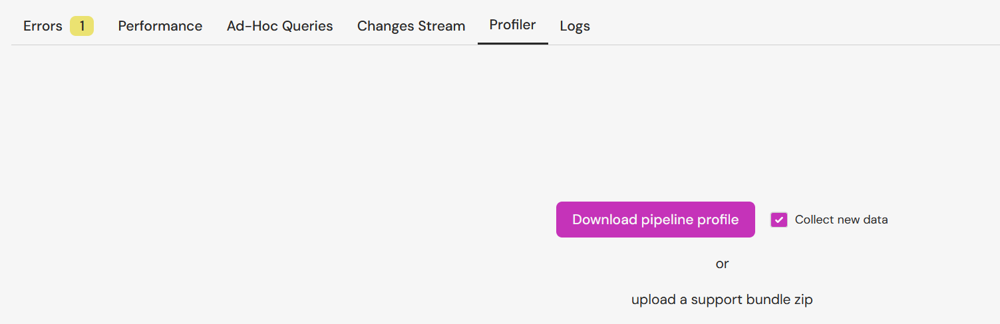
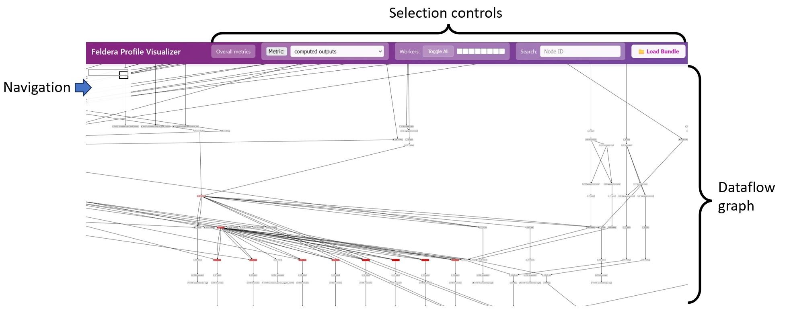
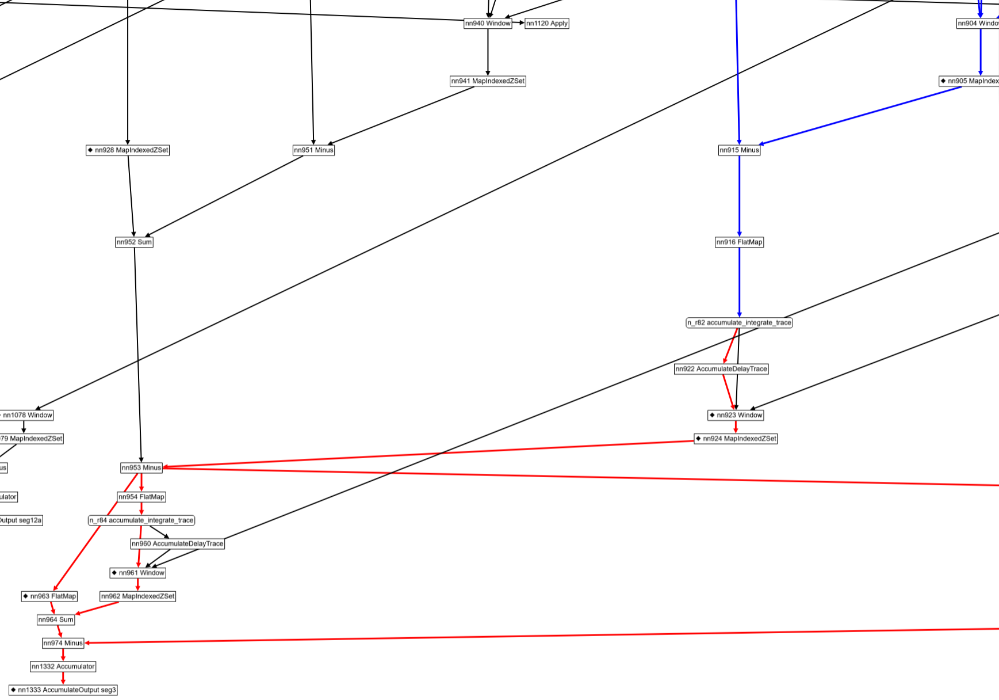
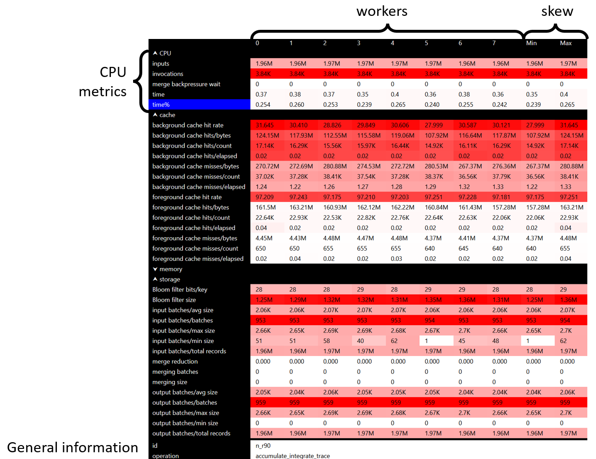
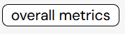
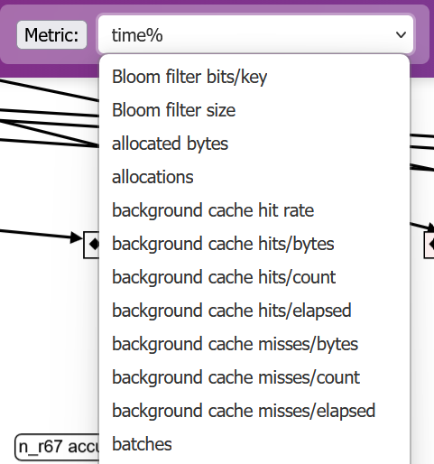
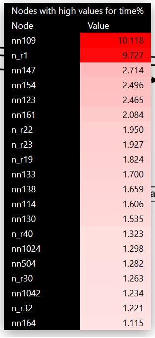
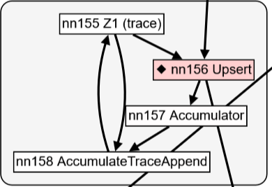
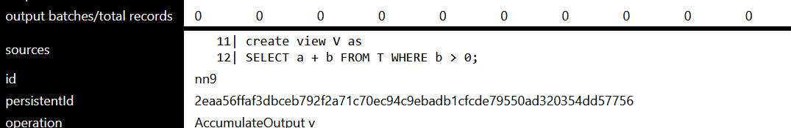

# Visualizing Pipeline Profiles

## Preliminaries

The Feldera SQL compiler transforms a query into a dataflow graph.  A
dataflow graph is a representation of a program composed of two kinds
of objects: nodes and edges.  Nodes (also called operators) represent
computations, and edges show how data flows between nodes.  Dataflow
graphs can be represented visually as networks of boxes and arrows:
the boxes are the computations, while the arrows show how data
produced by a node is consumed by other nodes.  For SQL programs you
can think of the nodes as roughly representing the SQL primitive
operations, while each edge represents a collection: the result
produced by the node when it receives inputs.

Feldera queries run continuously, each receiving many input changes
and producing many output changes.  So multiple Feldera views are
compiled into a single *pipeline*, which then runs for a long time,
receiving inputs and producing outputs.

["Profiling"](https://en.wikipedia.org/wiki/Profiling_(computer_programming))
in programming is the technique of measuring and understanding the
behavior of computer programs.

The Feldera engine contains lots of *instrumentation* code which
collects measurements about the behavior of each operator.  These
measurements are aggregated into *measurement statistics*.  For
example, the code may measure how much time an operator spends to
process each change.  During the lifetime of a pipeline each operator
may be invoked millions of times, so the information is summarized,
for example as the "total time" spent executing this operator.

There are many interesting measurements that may be collected; other
examples are: how much data is received by the operator, how much data
is produced by the operator (note that an operator like `WHERE`
produces less data than it receives), how much data was written to
disk, how much memory was allocated by an operator, when searching for
a value what is the success rate (for `JOIN` operations), etc.

Feldera pipelines are designed to take advantage of multiple CPU cores
(and will soon use multiple computers as well, each with multiple
cores).  When you start a pipeline you specify a number of cores, and
each operator of the dataflow graph is instantiated once for every
core.  The profiling code collects information for each core.

## Visualizing profile information

The profile visualization tool lets you display the dataflow graph of
the program.  There are two ways to use the tool:

- the tool is integrated with the Feldera [WEB-based
  user-interface](https://docs.feldera.com/interface/web-console)

- the tool can be used by developers for offline analysis of [support
  bundles](https://docs.feldera.com/operations/guide/#diagnosing-performance-issues)
  which contain profiling information.

## Starting the profile visualization from the web UI

The web app monitoring panel has a "profiler" tab which enables the
collection of visualization of profile data:



The UI allows collecting a new bundle or uploading a bundle received
as a zip file from a third party.

## Profiler visualization UI

The profiler visualization interface is shown in the following
image:



### Navigation the dataflow graph

The visualization is designed for navigating very large dataflow
graphs, possibly much larger that can fit comfortably on the screen.
The navigation aid on the top-left displays two rectangles:

- the light grey rectangle is the bounding box of the dataflow graph

- the dark grey rectangle represents the browser window

Double-clicking on this navigation aid will recenter the dataflow
graph, fitting it on the screen.

The mouse wheel can be used to zoom-in and zoom-out the dataflow
graph.

The mouse gestures of grabbing and dragging can be used to pan
horizontally and vertically.

Nodes can be moved as well using the mouse, i.e., to declutter edges,
but information about moved nodes is lost when nodes are expanded or
contracted, as described below.

### Hierarchical dataflow graphs

Some nodes in a dataflow graph are in turn composed of other nodes and
edges.  Such nodes are shown with rounded corners.  Double-clicking on
such a node will expand it into the component nodes.  Double-clicking
on an expanded node will contract it.


Unfortunately, expanding a node that has many components may change
the layout of the overall layout of the graph on the screen
significantly.

### Displaying node metrics

The user can mouse-over a node to display various measurements
collected for the node.  The measurements are displayed in a table.

Clicking on a node will make the table of measurements "sticky": the
table will remain visible until either the user presses the ESCAPE
key, or the user clicks on another node.

### Understanding graph reachability

Mousing over a node, or clicking on a node will also compute all nodes
upstream and downstream of the selected node.  The downstream edges
are displayed in red, and the upstream edges are displayed in blue.
Note that graphs may contain "back" edges; the reachability
information displayed currently stops at back-edges.



### The table displaying node metrics

The metrics collected for a node are displayed as a table:



The table has one row for each measurement type.  Related measurements
are grouped together in *sections* which can be collapsed by clicking
on the section header.  The previous figure highlights the CPU
section.

By default the table has one column for each worker thread that
executes the operator (this can be controlled as described below).
Differences between workers indicate data skew.  The last two columns
display the maximum and minimum values of the measurements across all
workers for a node.  A big difference between these two columns is
also indicative of skew.

The table also displays general node information, such as the node
operation type and node name, which can aid in navigation and
debugging.

The table cells are colored according to the *magnitude* of the
measurements.  A deep red measurement has a high magnitude, while a
white measurement has a low magnitude.  What is "high" or "low" is
determined by comparing the measurements across all operators and
workers in the entire dataflow graph.  For example, if the node taking
most of the time in the graph requires 10% of the computation time,
then a deep red value means "10%" (and not 100%).

The table display is essentially a heatmap of the resource
consumption.

The units of the measurement used in the table are the "natural" ones:
bytes for memory, seconds for time, values between 0 and 100 for
percentages.

Note that the set of metrics displayed varies between different kinds
of nodes.  For example, a node which does not store data on disk will
not have storage-related metrics.

The measurements for a composite node (that expands into multiple
sub-nodes) are the sum of the measurements for all the individual
component nodes.

### Global metrics

The toplevel menu contains a button labeled "Overall metrics".
Clicking on this button will display aggregate metrics collected for
the entire pipeline.  The information is shown using the same tabular
display as used for individual nodes.  Note that this information is
not simply the "sum" of the information for all operators; this
information is especially attributed to the entire pipeline by the
profile collection code.



### Selecting the node highlight metric

The "metric" drop-down box allows selecting a metric that the user
wants to focus on.  All graph nodes are colored according to their
maximum value (across all workers) for this metric.  A red node has a
high value, while a white node has a low value.



#### Finding nodes with high value of a metric

Clicking on the button labeled "top 20 nodes" will display a table with
nodes that have a high value with respect to this metric:



The rows in this table can be clicked; clicking on a node will center
the display around that node.

### Worker information selection

The toplevel menu contains a row of checkboxes: one for each worker.
By deselecting some checkboxes the user can choose which workers to
focus on.  The "toggle all" button will complement the current
selection.


### Searching a node by name

The search box allows searching a node by name.  The display will be
centered around the node.  (In the future we may allow searching by
attributes as well.)


### Cross-referencing with SQL

Some, but not all, nodes of the dataflow graph can be directly linked
with source SQL expressions.  A node that has source position
information is displayed using a little diamond sign:



The source position information for these nodes is shown in the table
of metrics, in a row labeled "sources":



The source code includes line numbers.

Note that there is generally a many-to-many relationship between nodes
and source statements: multiple source statements may be assigned to a
dataflow graph node, or multiple dataflow graph nodes may be used to
implement a single source SQL statement.  Some dataflow graphs do not
directly correspond to any SQL statement.

## Profiling pipelines using samply

:::info Samply fork requirement
Currently, Feldera uses a fork at [feldera/samply](https://github.com/feldera/samply) as the upstream version doesn't work in EKS environments.
To inspect the profiles generated by pipelines, you must install [v0.13.2](https://github.com/feldera/samply/releases/tag/v0.13.2) or later of the fork, as some previously unstable features have changed between upstream release [v0.13.1](https://github.com/mstange/samply/releases/tag/samply-v0.13.1) and our fork.
:::

### Local environments

Before profiling in local environments, ensure the following requirements are met:

1. **Install samply**: Download and install samply version `0.13.2` or later from the [latest release](https://github.com/feldera/samply/releases).

2. **Configure kernel settings**: Verify that `/proc/sys/kernel/perf_event_paranoid` is set to 1 or lower.
   If the value is higher than 1, you can temporarily allow profiling with:
   ```bash
   echo -1 | sudo tee /proc/sys/kernel/perf_event_paranoid
   ```

### Enterprise environments

For pipelines running in enterprise Kubernetes environments, profiling must be explicitly enabled during installation.

To enable profiling, install Feldera with the Helm flag `pipeline.allowProfiling` set to `true`.

This flag adds the `PERFMON` capability to the pipeline pod to enable profiling.

### Example usage

#### Trigger profiling

```bash
# Start a 60 second profiling session
curl -X POST "http://localhost:8080/v0/pipelines/my-pipeline/samply_profile?duration_secs=60"
```

#### Retrieve the profile

Wait for `duration_secs` for the profiling to complete. Then make a `GET` request to fetch the latest profile.

```bash

# Retrieve the profile (after the session completes)
curl "http://localhost:8080/v0/pipelines/my-pipeline/samply_profile" -o prof.json.gz
```

##### Failures
- `400 Bad Request`: If no profiles have been triggered or completed yet
- `500 Internal Server Error`: If there was an error during profiling

#### Inspect the profile

Use the Feldera fork of `samply` as described above to load the profile:

```bash
samply load prof.json.gz
```