# Visualizing Pipeline Profiles

import OpenSupportBundleIcon from '../../../js-packages/web-console/src/assets/icons/feldera-material-icons/stethoscope.svg';
import liveFromPipeline from './open-live-pipeline.png';
import liveFromViewer from './open-live-viewer.png';
import historyFromHome from './open-history-home.png';
import uploadFromHome from './open-upload-home.png';
import uploadFromPipeline from './open-upload-pipeline.png';
import uploadFromViewer from './open-upload-viewer.png';

{/* A screenshot at the size of the UI: the images are captured at 2 device pixels for each CSS pixel. */}
export const Shot = ({src, alt}) => 

## Preliminaries

The Feldera SQL compiler transforms a query into a circuit. The profile
viewer draws the circuit as a *circuit diagram*. A circuit diagram has two
kinds of objects:

| Object | What it is |
|---|---|
| Node (operator) | A computation. Most nodes roughly represent a SQL operation, for example a join or an aggregate. |
| Edge | A directed flow of data in the circuit. It carries the changes that the node produces when it receives inputs. |

Feldera queries run continuously, each receiving many input changes
and producing many output changes.  So multiple Feldera views are
compiled into a single *pipeline*, which then runs for a long time,
receiving inputs and producing outputs.

["Profiling"](https://en.wikipedia.org/wiki/Profiling_(computer_programming))
in programming is the technique of measuring and understanding the
behavior of computer programs.

The Feldera engine contains lots of *instrumentation* code which
collects measurements about the behavior of each operator.  These
measurements are aggregated into *measurement statistics*.  For
example, the code may measure how much time an operator spends to
process each change.  During the lifetime of a pipeline each operator
may be invoked millions of times, so the information is summarized,
for example as the "total time" spent executing this operator.

There are many interesting measurements that may be collected; other
examples are: how much data is received by the operator, how much data
is produced by the operator (note that an operator like `WHERE`
produces less data than it receives), how much data was written to
disk, how much memory was allocated by an operator, when searching for
a value what is the success rate (for `JOIN` operations), etc.

Feldera pipelines are designed to take advantage of multiple CPU cores
(and will soon use multiple computers as well, each with multiple
cores).  When you start a pipeline you specify a number of cores, and
each operator of the circuit diagram is instantiated once for every
core.  The profiling code collects information for each core.

## Opening the profile viewer

The profile viewer is integrated into the [Web Console](https://docs.feldera.com/interface/web-console) - the browser-based dashboard of the Feldera instance.
It can be used by developers for offline analysis of [support bundles](https://docs.feldera.com/operations/guide/#diagnosing-performance-issues)
which contain profiling information.

The profile viewer shows the circuit diagram of a pipeline, with the
measurements for every node. It reads the profiles from a *support bundle*. A support bundle
contains profiles at multiple points in time.

You can get a support bundle in three ways. Each way starts from one or more pages of the Web
Console:

| To | Home page | Pipeline page | Profile viewer |
|---|---|---|---|
| Download a bundle from a pipeline | Not available | Click **View profile**.<br/><Shot src={liveFromPipeline} alt="The View profile button" /> | Click **Load profile**, then **Download profile**.<br/><Shot src={liveFromViewer} alt="Download profile in the Load profile menu" /> |
| Open a bundle that you opened before | Click <OpenSupportBundleIcon className="inline-icon" title="Open support bundle" />, then click the bundle.<br/><Shot src={historyFromHome} alt="A bundle in the list of recent support bundles" /> | Not available | Not available |
| Upload a bundle zip file | Click <OpenSupportBundleIcon className="inline-icon" title="Open support bundle" />, then **Upload support bundle**.<br/><Shot src={uploadFromHome} alt="Upload support bundle in the Open support bundle dialog" /> | Click the arrow next to **View profile**, then **Open support bundle**.<br/><Shot src={uploadFromPipeline} alt="Open support bundle in the View profile menu" /> | Click **Load profile**, then **Open support bundle**.<br/><Shot src={uploadFromViewer} alt="Open support bundle in the Load profile menu" /> |

After you select a zip file, click **View profile** to open it in a new tab.

| Support bundle | What is in it |
|---|---|
| Downloaded from a pipeline | The profiles that Feldera collected and stored at earlier points in time. If the pipeline is running and **Collect new data** is checked, the live metrics are recorded as an additional profile. |
| Uploaded | The profiles in the zip file, for example a bundle from the [diagnostics guide](/operations/guide#diagnosing-performance-issues). The console adds the file to the list of bundles that you opened before. |

The menus that download a bundle also have these items:

| Menu item | What it does |
|---|---|
| Download support bundle | Saves the support bundle as a zip file. It does not open the viewer. |
| Collect new data | When checked, the pipeline records a new profile. When it is off, you get the profile that the pipeline made last. |

## The parts of the viewer

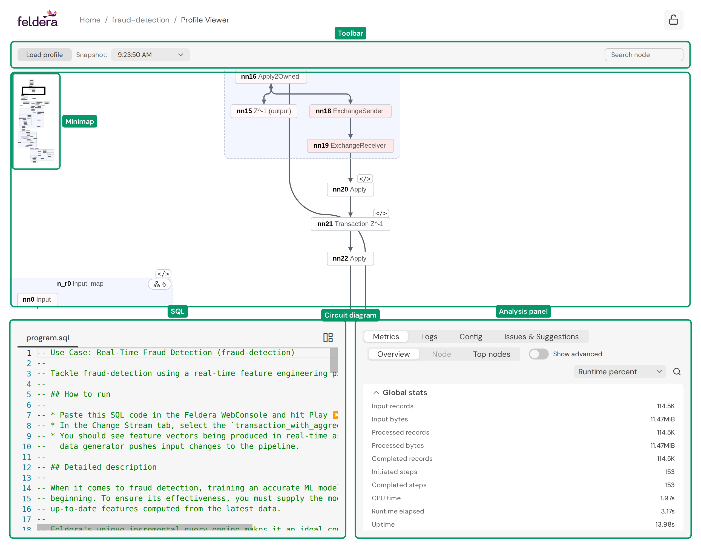

| Part | What it shows |
|---|---|
| Toolbar | **Load profile** gets a new bundle. **Snapshot** selects one of the profiles in the bundle. **Search node** finds a node. |
| Minimap | A small picture of the full diagram, with an outline of the part that is on screen |
| Circuit diagram | The nodes and edges of the pipeline |
| SQL | The program of the pipeline. A click on a node selects its SQL here. |
| Analysis panel | The tabs **Metrics**, **Logs**, **Config** and **Issues & Suggestions** |

The analysis panel has these tabs:

| Tab | Content |
|---|---|
| Metrics | The measurements of the full pipeline, of one node, or of the nodes with the highest values |
| Logs | The pipeline log from the bundle |
| Config | The pipeline configuration from the bundle |
| Issues & Suggestions | Problems that the viewer found in the bundle, with a severity and a category for each |

The button in the corner of the SQL panel moves the SQL panel to the full
height of the window. You can drag the borders between the panels.

## Moving around the diagram

The diagram can be much larger than the window.

| To | Do this |
|---|---|
| Zoom | Turn the mouse wheel |
| Pan | Hold LMB and drag the background of the diagram |
| Go to another part of the diagram | Click or drag on the minimap |
| See the full diagram | Double-click the minimap |
| Find a node | Type in **Search node** input, then press Enter |

## Regions

The compiler puts related nodes into *regions*. For example, a region can
hold all the nodes of one SQL view. An expanded region has a dashed
border, and its nodes are inside it:

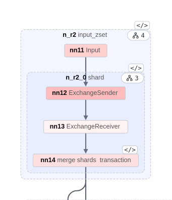

A collapsed region is one box. The chip at its top right shows the number
of nodes in it. A collapsed region also shows the names of the tables and
views in it. When you move the pointer over a top-level region, the region
glows, and the chip changes to a square (expand) or a dash (collapse):

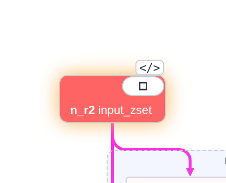

| To | Do this |
|---|---|
| Collapse or expand a region | Double-click it, or click the "child count" chip at its top right |
| See the measurements of a region | Click it |

A small pipeline opens with all its regions expanded.

The measurements of a region come from the nodes in it. Some are the sum
of the nodes (for example time and storage). Others are the largest value
of the nodes (for example averages, percents, minimums and maximums).

## Selecting a node

| Action | Result |
|---|---|
| Move the pointer over a node | The node glows and its edges change color. The analysis panel does not change. |
| Click a node | The node stays selected. The **Node** view of the **Metrics** tab shows its measurements, and the SQL panel selects the SQL that the node comes from. |
| Press Escape | The selection is removed. |

### Paths through the diagram

When a node is selected, the edges show the paths through it:

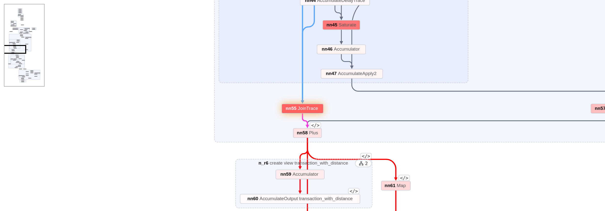

| Edge color | Meaning |
|---|---|
| Magenta | An edge out of the selected node |
| Light blue | An edge into the selected node |
| Red | An edge further downstream, on a path that starts at the selected node |
| Blue | An edge further upstream, on a path that ends at the selected node |
| Gray | An edge that is not on a path through the selected node |

A diagram can have back edges, for example in a recursive query. The paths
stop at a back edge.

### Nodes and SQL

A node with a `</>` chip has an associated SQL source position:

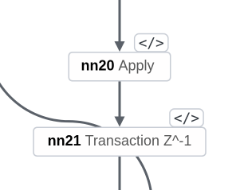

When you click such a node, the SQL panel selects the SQL statements of
the node and scrolls to them:

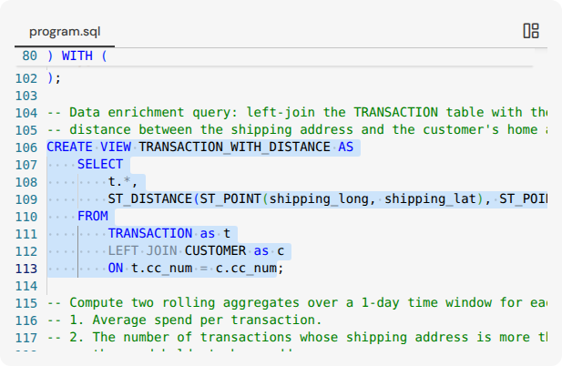

A click on a region selects the SQL of all the nodes in it. The relation
between nodes and SQL statements is many-to-many. One statement can
compile into many nodes, and one node can do the work of many statements.
Some nodes have no SQL source position.

## The Metrics tab

The **Metrics** tab has three views:

| View | Content |
|---|---|
| Overview | The global statistics of the pipeline, then the measurements of the full diagram |
| Node | The measurements of the node or region that you clicked last |
| Top nodes | The nodes with the highest values of the selected metric |

### Overview

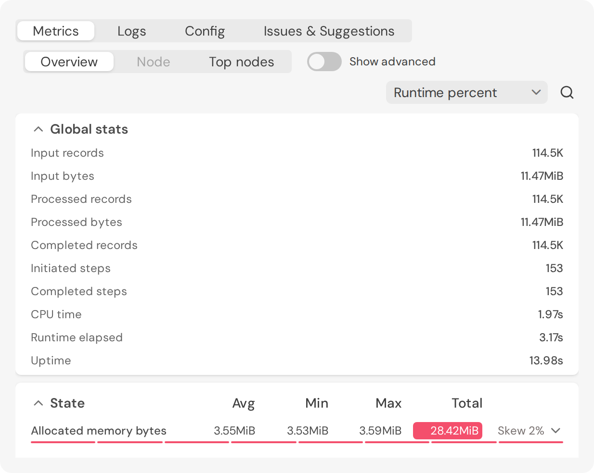

The global statistics come from the pipeline itself, for example the
number of records that the pipeline received and processed, and its CPU
time. They are not the sum of the measurements of the nodes.

### Node

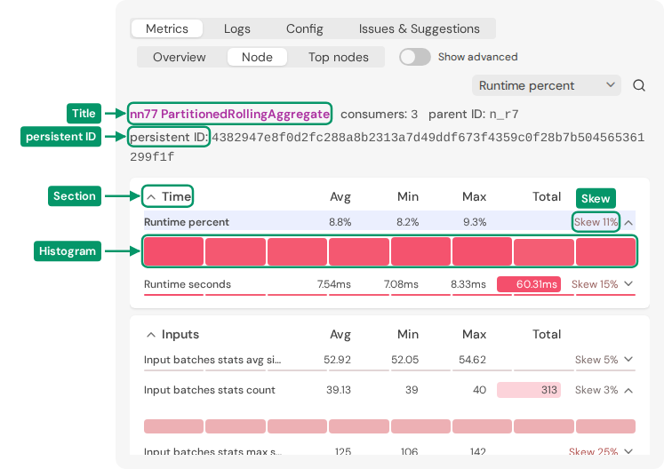

| Part | What it shows |
|---|---|
| Title | The node ID and its operation. Click it to jump to the node in the diagram. |
| consumers | The number of nodes that read the output of this node |
| persistent ID | An ID of the node that does not change when the program is compiled again |
| Section | A group of related measurements, for example **Time** or **State**. Click the title of a section to collapse or expand it. |
| Avg, Min, Max, Total | The average, minimum, maximum and sum of the measurement across the workers |
| Bars | One bar for each worker. Move the pointer over a bar to see its value. |
| Skew | How much the workers differ. Click it to make the bars taller. |

The section that holds the selected metric is first, and it does not
collapse. In it, the selected metric is the first row.

The colors compare a measurement to the same measurement in all the
nodes of the diagram. The stronger the red, the higher the value. So a red
value is high for this diagram, but not necessarily high in general.

Turn on **Show advanced** to show more measurements. The measurements
change with the type of node. For example, a node that keeps no state
has no **State** section.

### Selecting the metric

The metric list is above the measurements. The selected metric:

- sets the color of each node in the diagram, from white (low) to red
  (high). The color uses the largest value across the workers.
- sorts the **Top nodes** view.

Type in the list to find a metric.

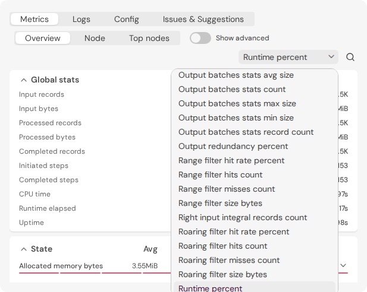

### Top nodes

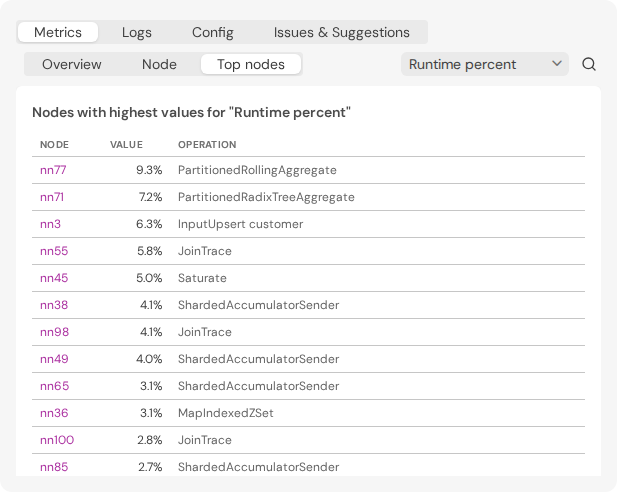

**Top nodes** lists the nodes that have a value for the selected metric,
from the highest value to the lowest. Click a node ID to show the node in
the diagram.

## Searching

### Searching for a node

**Search node** finds a node by one of these, in this sequence:

1. The node ID, for example `nn21`.
2. The name of a table or a view. An exact match is prioritized over a part
   of a name.
3. A part of the persistent ID of the node.

The viewer expands the regions that hold the node, moves the node to the
center of the window, and makes it glow:

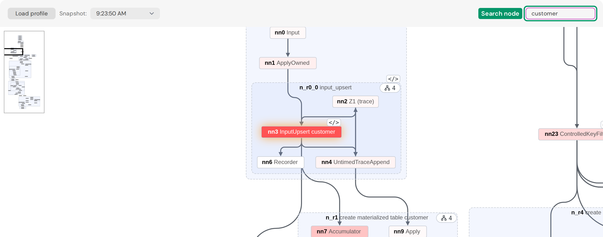

### Searching in a tab

The magnifier button at the top right of the analysis panel searches the
tab that is shown:

| Tab | What the search finds |
|---|---|
| Metrics | The title of a section, the name or ID of a metric, or a row of **Top nodes** |
| Logs | A log line that contains the text |
| Issues & Suggestions | An issue that contains the text |

Press Enter for the next match, and Shift+Enter for the previous match.

### Keyboard

| Keys | Where you clicked last | Result |
|---|---|---|
| `Ctrl-F` (`Cmd-F` on macOS) | In the diagram | Moves the focus to **Search node** |
| `Ctrl-F` (`Cmd-F` on macOS) | Anywhere else | Opens the search of the tab that is shown. It selects the old text, so you can type a new search immediately. |
| Escape | | Removes the node selection, or closes the search |

The **Config** tab does not have its own search. On this tab, `Ctrl-F`
opens the search of the browser.

## Profiling pipelines using samply

:::info Samply fork requirement

Currently, Feldera uses a fork at
[feldera/samply](https://github.com/feldera/samply) as the upstream
version doesn't work in EKS environments.  To inspect the profiles
generated by pipelines, you must install
[v0.13.2](https://github.com/feldera/samply/releases/tag/v0.13.2) or
later of the fork, as some previously unstable features have changed
between upstream release
[v0.13.1](https://github.com/mstange/samply/releases/tag/samply-v0.13.1)
and our fork.

:::

### Local environments

Before profiling in local environments, ensure the following requirements are met:

1. **Install samply**: Download and install samply version `0.13.2` or later from the [latest release](https://github.com/feldera/samply/releases).

2. **Configure kernel settings**: Verify that `/proc/sys/kernel/perf_event_paranoid` is set to 1 or lower.
   If the value is higher than 1, you can temporarily allow profiling with:
   ```bash
   echo -1 | sudo tee /proc/sys/kernel/perf_event_paranoid
   ```

### Enterprise environments

Profiling a pipeline in Kubernetes needs two capabilities on the
pipeline container:

| Capability | What samply needs it for                                                  |
|------------|---------------------------------------------------------------------------|
| `PERFMON`  | Opening perf events under the node's `kernel.perf_event_paranoid` setting. |
| `IPC_LOCK` | Mapping the perf ring buffer beyond the container's `RLIMIT_MEMLOCK`.      |

Install or upgrade Feldera with the Helm value `pipeline.allowProfiling`
set to `true`, and the chart grants both.  On a cluster that accepts
them, nothing else is needed.

#### When profiling still fails

The pipeline log carries the same `perf_event_paranoid` advice for
either failure.  The first line tells them apart:

| samply error                                                      | Cause                                                     |
|-------------------------------------------------------------------|-----------------------------------------------------------|
| `Failed to start profiling: Operation not permitted`               | The container lacks `PERFMON`.                            |
| `Failed to start profiling: mmap failed: Operation not permitted`  | The container lacks `IPC_LOCK`.                           |

In both cases, check what the pod actually got.  Capabilities appear on
the pod, not on the pipeline's service:

```bash
kubectl get pod -n <pipeline-namespace> <pipeline-pod> \
  -o jsonpath='{.spec.containers[0].securityContext.capabilities.add}'
```

The command prints `["PERFMON","IPC_LOCK"]` when both are in place.

If a capability is missing, `pipeline.allowProfiling` is not reaching
this pipeline.  Check that the value is set, and stop and start the
pipeline so that it picks up the change.  A pipeline that uses a custom
template through `pipeline_template_configmap` needs both capabilities
added to that template by hand.

The chart started granting `IPC_LOCK` in Feldera `0.328.0`.  Earlier
versions grant `PERFMON` alone, and no Helm value adds `IPC_LOCK` to
them.  A pipeline running there needs either an upgrade of the Feldera
release to `0.328.0` or later, or the node kernel setting below.

If a capability is still missing after all of that, cluster policy is
removing it.  If both are listed and profiling still fails, the node or
the platform underneath it denies the operation.  Either way, relax the
node kernel setting, and contact Feldera support if that does not help.

#### Relaxing the node kernel setting

`kernel.perf_event_paranoid` defaults to `2`.  Setting it to `-1`
replaces both capabilities: it permits all perf events and skips the
memlock check.  The value `1` that the log suggests replaces `PERFMON`
alone, and the ring buffer mmap still fails.

The setting is not namespaced, so no pod can set it for itself.  It has
to be applied to the node.

:::warning

The setting applies to the whole node, so it relaxes the restriction for
every pod scheduled there.  Confine it to a node pool dedicated to
pipelines.

:::

How to apply it depends on the node operating system.  On EKS,
[Karpenter](https://karpenter.sh) often provisions Bottlerocket nodes,
which have no shell and accept configuration only as TOML in `userData`:

```yaml
apiVersion: karpenter.k8s.aws/v1
kind: EC2NodeClass
metadata:
  name: feldera-pipelines
spec:
  amiSelectorTerms:
    - alias: bottlerocket@latest
  # role, subnetSelectorTerms and securityGroupSelectorTerms unchanged
  userData: |
    [settings.kernel.sysctl]
    "kernel.perf_event_paranoid" = "-1"
```

Quote both the key and the value.  Karpenter merges the block with the
settings it generates itself.  Existing nodes keep their old value, so
replace them before profiling.  On other node operating systems, apply
the same sysctl through cloud-init user data or a node bootstrap script.

### Example usage

#### Trigger profiling

```bash
# Start a 60 second profiling session
curl -X POST 'http://localhost:8080/v0/pipelines/my-pipeline/samply_profile?duration_secs=60'
```

#### Retrieve the profile

Wait for `duration_secs` for the profiling to complete. Then make a `GET` request to fetch the latest profile.

```bash

# Retrieve the profile (after the session completes)
curl 'http://localhost:8080/v0/pipelines/my-pipeline/samply_profile' -o prof.json.gz
```

##### Failures
- `400 Bad Request`: If no profiles have been triggered or completed yet
- `500 Internal Server Error`: If there was an error during profiling

#### Inspect the profile

Use the Feldera fork of `samply` as described above to load the profile:

```bash
samply load prof.json.gz
```
