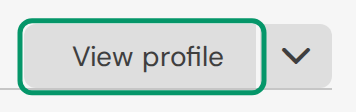
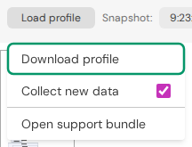
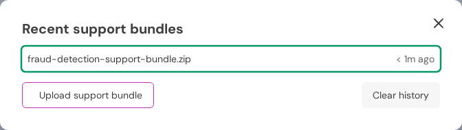
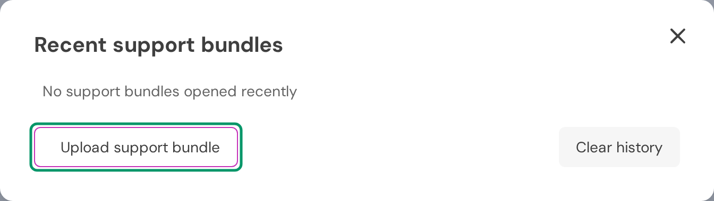
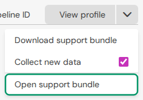
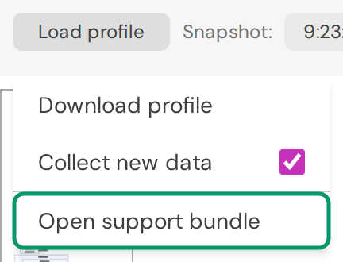
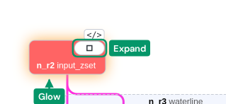
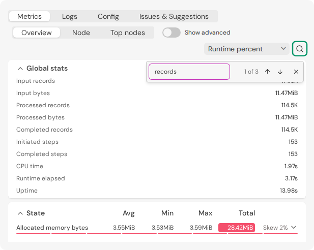

# Visualizing Pipeline Profiles

{/* The icons are imported, not referenced as images: an imported SVG is drawn inline, so it takes the color of the text. */}
import OpenSupportBundleIcon from '../../../js-packages/web-console/src/assets/icons/feldera-material-icons/stethoscope.svg';
import SearchIcon from '../../../js-packages/common-ui/src/lib/icons/search.svg';

## Preliminaries

The Feldera SQL compiler transforms a program into a *dataflow graph*. The
profile viewer draws the dataflow graph. A dataflow graph has these kinds of
objects:

| Object | What it is |
|---|---|
| Node (operator) | A computation. A SQL operation, for example a join or an aggregate, usually compiles into many nodes. |
| Edge | A directed flow of data between two nodes. It carries the changes that a node produces when it receives inputs. |
| Region | A node that contains another dataflow graph. See [Regions](#regions). |

Feldera queries run continuously, each receiving many input changes
and producing many output changes.  So multiple Feldera views are
compiled into a single *pipeline*, which then runs for a long time,
receiving inputs and producing outputs.

["Profiling"](https://en.wikipedia.org/wiki/Profiling_(computer_programming))
in programming is the technique of measuring and understanding the
behavior of computer programs.

The Feldera engine contains lots of *instrumentation* code which
collects measurements about the behavior of each node.  These
measurements are aggregated into *measurement statistics*.  For
example, the code may measure how much time a node spends to
process each change.  During the lifetime of a pipeline each node
may be invoked millions of times, so the information is summarized,
for example as the "total time" spent executing this node.

There are many interesting measurements that may be collected; other
examples are: how much data is received by the node, how much data
is produced by the node (note that a node for `WHERE`
produces less data than it receives), how much data was written to
disk, how much memory was allocated by a node, when searching for
a value what is the success rate (for `JOIN` operations), etc.

Feldera pipelines are designed to take advantage of multiple CPU cores
(and will soon use multiple computers as well, each with multiple
cores).  When you start a pipeline you specify a number of *workers*.
Each node of the dataflow graph runs on all the worker threads of each
host of the pipeline.  The profiling code collects measurements for each
worker.

## Opening the profile viewer

The profile viewer is part of the [Web Console](https://docs.feldera.com/interface/web-console),
the browser-based dashboard of the Feldera instance. It shows the
dataflow graph of a pipeline, with the measurements of each node.

The viewer reads the profiles from a [support bundle](https://docs.feldera.com/operations/guide/#diagnosing-performance-issues).
A support bundle may contain profiles at multiple points in time. The
viewer shows the measurements as they were when the profile was
collected. It does not update them live.

You can open a profile in the viewer in three ways:

| To | Home page | Pipeline page | Profile viewer |
|---|---|---|---|
| Download a profile from a pipeline | Not available | Click **View profile**.<br/> | Click **Load profile**, then **Download profile**.<br/> |
| Open a bundle that you opened before | Click <OpenSupportBundleIcon className="inline-icon" title="Open support bundle" />, then click the bundle.<br/> | Not available | Not available |
| Upload a bundle zip file | Click <OpenSupportBundleIcon className="inline-icon" title="Open support bundle" />, then **Upload support bundle**.<br/> | Click the arrow next to **View profile**, then **Open support bundle**.<br/> | Click **Load profile**, then **Open support bundle**.<br/> |

After you select a zip file, click **View profile** to open it in a new tab.

| Support bundle | Profiles in it |
|---|---|
| Downloaded from a pipeline | The profiles that the pipeline collected at earlier points in time. If the pipeline is running and **Collect new data** is checked in the menu, the pipeline also collects a new profile now. |
| Uploaded | The profiles in the zip file, for example a bundle from the [diagnostics guide](/operations/guide#diagnosing-performance-issues). The Web Console adds the file to the list of bundles that you opened before. |

## The parts of the viewer


| Part | What it shows |
|---|---|
| Toolbar | **Load profile** gets a new bundle. **Snapshot** selects one of the profiles in the bundle. **Search node** finds a node. |
| Minimap | A map that shows which part of the dataflow graph is in the window |
| Dataflow graph | The nodes and edges of the pipeline |
| SQL | The SQL program of the pipeline. A click on a node selects its SQL here, if the node has a SQL source position. |
| Analysis panel | The tabs **Metrics**, **Logs**, **Config** and **Issues & Suggestions** |

The analysis panel has these tabs:

| Tab | Content |
|---|---|
| Metrics | The measurements of the pipeline, of the current node, or of the top nodes. See [Displaying measurements](#displaying-measurements). |
| Logs | The pipeline log from the bundle |
| Config | The pipeline configuration from the bundle |
| Issues & Suggestions | Problems that triage rules found in the bundle. See [Issues & Suggestions](#issues-and-suggestions). |

The button in the top right corner of the SQL panel stretches it to the full
height of the window.

## Moving around the dataflow graph

The dataflow graph can be much larger than the window.

| To | Do this |
|---|---|
| Zoom | Turn the mouse wheel |
| Pan | Click and drag the background of the dataflow graph |
| Go to another part of the dataflow graph | Click or drag on the minimap |
| See the full dataflow graph | Double-click the minimap |
| Find a node | Type a node ID, a table or view name, or a persistent ID in **Search node**, then press Enter. See [Searching for a node](#searching-for-a-node). |

## The current node

Click a node to make it the *current node*. The other parts of the
viewer show information about the current node:

| Action | Result |
|---|---|
| Move the pointer over a node | The node glows. The other parts of the viewer do not change. |
| Click a node | The node becomes the current node and glows. The **Node** view of the **Metrics** tab shows its measurements, the SQL panel selects the SQL of the node, if the node has a SQL source position, and the edges show its [reachability](#reachability). |
| Press Escape | There is no current node. |

### Nodes and SQL

A node with a Code chip has an associated SQL source position:


When you click such a node, the SQL panel selects the SQL statements of
the node and scrolls to them:


A click on a region selects the SQL of all the nodes in it. The relation
between nodes and SQL statements is many-to-many. One statement can
compile into many nodes, and one node can do the work of many statements.
Some nodes have no SQL source position.

### Reachability

The edges show the paths through the current node:


| Edge color | Meaning |
|---|---|
| Magenta | An edge out of the current node |
| Light blue | An edge into the current node |
| Red | An edge further downstream, on a path that starts at the current node |
| Blue | An edge further upstream, on a path that ends at the current node |
| Gray | An edge that is not on a path through the current node |

Most dataflow graphs have back edges: each integrator has one. The paths
stop at a back edge.

## Regions

Some nodes contain another dataflow graph. These nodes are *regions*. You
can expand a region to see the nodes in it. An expanded region has a dashed
border, and its nodes are inside it:


A collapsed region is shown as a node:


| Decoration | Meaning |
|---|---|
| Name | The node ID of the region, and the names of the tables and views in it |
| Child count chip | The number of nodes in the region. The nodes in nested regions count, and the nested regions do not. |
| Code chip | The region has a SQL source position. See [Nodes and SQL](#nodes-and-sql). |

When you move the pointer over a top-level region, the region glows, and
the child count chip changes to a square (expand) or a dash (collapse):



| To | Do this |
|---|---|
| Collapse or expand a region | Double-click it, or click its child count chip |
| Make a region the current node | Click it |

A small pipeline opens with all its regions expanded.

## Displaying measurements

The measurements are values that the running pipeline collects for each
node. You can display them, and use them to troubleshoot performance
problems.

Each measurement is a value of a *metric*, for example **Runtime percent**.
There are many metrics, and one of them is always the *current metric*.
See [The current metric](#the-current-metric).

The **Metrics** tab has three views:

| View | Content |
|---|---|
| Overview |  The global statistics of the pipeline, and the aggregated measurements of all nodes |
| Node | The measurements of the current node |
| Top nodes | The top nodes according to the current metric |

### Per-pipeline measurements

The **Overview** view shows the global statistics of the pipeline, for
example the number of records that the pipeline received and processed,
and its CPU time. Then it shows the measurements for the full dataflow graph.


### Per-node measurements

The **Node** view shows the measurements of the current node, in tables
that group related measurements. The measurements of a region are
aggregated measurements of the nodes in it.

Each node runs on multiple *worker* threads on each host of the pipeline.
The profile has a value of each measurement for each worker. The Node view
shows these values, and how much they differ between the workers.


| Part | What it shows |
|---|---|
| Title | The node ID and the name of its operator. Click it to center the dataflow graph on this node. |
| consumers | The number of nodes that read the output of this node |
| persistent ID | Two nodes with the same persistent ID compute the same result from the same table inputs. So the two nodes, and all the nodes before them, are semantically equivalent. |
| Section | A table of related measurements, for example **Time** or **State**. Click the title of a section to collapse or expand it. |
| Avg, Min, Max, Total | The average, minimum, maximum and sum of the measurement across the workers |
| Histogram | One bar for each worker. Move the pointer over a bar to see its value. |
| Skew | A measure of the resource imbalance between the workers. Higher skew is generally bad. Click it to make the histogram taller. |

The section that holds the current metric is shown first, and it does not
collapse. In it, the current metric is the first row.

Some measurements have a red background. The intensity of the red shows how
important the measurement is, relative to the highest values of that
measurement in the whole dataflow graph.

Each node has only some of the measurements. For example, a node that
keeps no state has no **State** section. Turn on **Show advanced** to show
more measurements.

### The current metric

To change the current metric, use the **Select metric** box at the top
right of the **Metrics** tab:


The current metric colors each node of the dataflow graph. The color
shows how important the node is for this metric, when compared with the
other nodes.

### Top nodes

**Top nodes** lists the nodes that have a value for the current metric.
The node most worthy of attention is first. Click a node ID to center the
dataflow graph on that node.


## Issues & Suggestions {#issues-and-suggestions}

The **Issues & Suggestions** tab shows the results of triage rules that
the viewer runs on the bundle. The number on the tab is the number of
results. Each result has:

| Part | What it shows |
|---|---|
| Severity | **Critical**, **Medium** or **Low** |
| Category | The area of the problem, for example **Storage** or **Connector** |
| Rule and message | The rule that found the problem, and what it found |
| Show details | The data that the rule found |

Use **Filter by severity** and **Filter by category** to show only some of
the results. If the Feldera instance has no triage rules, the tab shows
"No issues found".

## Searching

### Searching for a node

**Search node** allows you to search for a node by one of these, in this
order:

1. The node ID, for example `nn21`.
2. The name of a table or a view. An exact match is prioritized over a part
   of a name.
3. A part of the persistent ID of the node.

When you press Enter, the viewer expands the regions that hold the node,
centers the node in the window, and makes it glow. The node does not
become the current node. Click it to make it the current node.


### Searching in a tab

The <SearchIcon className="inline-icon" title="Search" /> button at the top right of the analysis
panel searches the open tab below it:



| Tab | What the search finds |
|---|---|
| Metrics | The title of a section, the name or ID of a metric, or a row of **Top nodes** |
| Logs | A log line that contains the text |
| Issues & Suggestions | A result that contains the text |

Press Enter for the next match, and Shift+Enter for the previous match.

### Keyboard search

| Keys | Where you clicked last | Result |
|---|---|---|
| `Ctrl-F` (`Cmd-F` on macOS) | In the dataflow graph | Moves the focus to **Search node** |
| `Ctrl-F` (`Cmd-F` on macOS) | Anywhere else | Opens the search of the open tab. It selects the old text, so you can type a new search immediately. |
| Escape | | Removes the current node, or closes the search |

The **Config** tab does not have its own search. On this tab, `Ctrl-F`
opens the search of the browser.

## Profiling pipelines using samply

:::info Samply fork requirement

Currently, Feldera uses a fork at
[feldera/samply](https://github.com/feldera/samply) as the upstream
version doesn't work in EKS environments.  To inspect the profiles
generated by pipelines, you must install
[v0.13.2](https://github.com/feldera/samply/releases/tag/v0.13.2) or
later of the fork, as some previously unstable features have changed
between upstream release
[v0.13.1](https://github.com/mstange/samply/releases/tag/samply-v0.13.1)
and our fork.

:::

### Local environments

Before profiling in local environments, ensure the following requirements are met:

1. **Install samply**: Download and install samply version `0.13.2` or later from the [latest release](https://github.com/feldera/samply/releases).

2. **Configure kernel settings**: Verify that `/proc/sys/kernel/perf_event_paranoid` is set to 1 or lower.
   If the value is higher than 1, you can temporarily allow profiling with:
   ```bash
   echo -1 | sudo tee /proc/sys/kernel/perf_event_paranoid
   ```

### Enterprise environments

Profiling a pipeline in Kubernetes needs two capabilities on the
pipeline container:

| Capability | What samply needs it for                                                  |
|------------|---------------------------------------------------------------------------|
| `PERFMON`  | Opening perf events under the node's `kernel.perf_event_paranoid` setting. |
| `IPC_LOCK` | Mapping the perf ring buffer beyond the container's `RLIMIT_MEMLOCK`.      |

Install or upgrade Feldera with the Helm value `pipeline.allowProfiling`
set to `true`, and the chart grants both.  On a cluster that accepts
them, nothing else is needed.

#### When profiling still fails

The pipeline log carries the same `perf_event_paranoid` advice for
either failure.  The first line tells them apart:

| samply error                                                      | Cause                                                     |
|-------------------------------------------------------------------|-----------------------------------------------------------|
| `Failed to start profiling: Operation not permitted`               | The container lacks `PERFMON`.                            |
| `Failed to start profiling: mmap failed: Operation not permitted`  | The container lacks `IPC_LOCK`.                           |

In both cases, check what the pod actually got.  Capabilities appear on
the pod, not on the pipeline's service:

```bash
kubectl get pod -n <pipeline-namespace> <pipeline-pod> \
  -o jsonpath='{.spec.containers[0].securityContext.capabilities.add}'
```

The command prints `["PERFMON","IPC_LOCK"]` when both are in place.

If a capability is missing, `pipeline.allowProfiling` is not reaching
this pipeline.  Check that the value is set, and stop and start the
pipeline so that it picks up the change.  A pipeline that uses a custom
template through `pipeline_template_configmap` needs both capabilities
added to that template by hand.

The chart started granting `IPC_LOCK` in Feldera `0.328.0`.  Earlier
versions grant `PERFMON` alone, and no Helm value adds `IPC_LOCK` to
them.  A pipeline running there needs either an upgrade of the Feldera
release to `0.328.0` or later, or the node kernel setting below.

If a capability is still missing after all of that, cluster policy is
removing it.  If both are listed and profiling still fails, the node or
the platform underneath it denies the operation.  Either way, relax the
node kernel setting, and contact Feldera support if that does not help.

#### Relaxing the node kernel setting

`kernel.perf_event_paranoid` defaults to `2`.  Setting it to `-1`
replaces both capabilities: it permits all perf events and skips the
memlock check.  The value `1` that the log suggests replaces `PERFMON`
alone, and the ring buffer mmap still fails.

The setting is not namespaced, so no pod can set it for itself.  It has
to be applied to the node.

:::warning

The setting applies to the whole node, so it relaxes the restriction for
every pod scheduled there.  Confine it to a node pool dedicated to
pipelines.

:::

How to apply it depends on the node operating system.  On EKS,
[Karpenter](https://karpenter.sh) often provisions Bottlerocket nodes,
which have no shell and accept configuration only as TOML in `userData`:

```yaml
apiVersion: karpenter.k8s.aws/v1
kind: EC2NodeClass
metadata:
  name: feldera-pipelines
spec:
  amiSelectorTerms:
    - alias: bottlerocket@latest
  # role, subnetSelectorTerms and securityGroupSelectorTerms unchanged
  userData: |
    [settings.kernel.sysctl]
    "kernel.perf_event_paranoid" = "-1"
```

Quote both the key and the value.  Karpenter merges the block with the
settings it generates itself.  Existing nodes keep their old value, so
replace them before profiling.  On other node operating systems, apply
the same sysctl through cloud-init user data or a node bootstrap script.

### Example usage

#### Trigger profiling

```bash
# Start a 60 second profiling session
curl -X POST 'http://localhost:8080/v0/pipelines/my-pipeline/samply_profile?duration_secs=60'
```

#### Retrieve the profile

Wait for `duration_secs` for the profiling to complete. Then make a `GET` request to fetch the latest profile.

```bash

# Retrieve the profile (after the session completes)
curl 'http://localhost:8080/v0/pipelines/my-pipeline/samply_profile' -o prof.json.gz
```

##### Failures
- `400 Bad Request`: If no profiles have been triggered or completed yet
- `500 Internal Server Error`: If there was an error during profiling

#### Inspect the profile

Use the Feldera fork of `samply` as described above to load the profile:

```bash
samply load prof.json.gz
```
