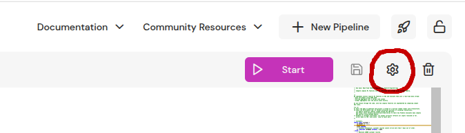

import ApiSchema from '@theme/ApiSchema';
import Tabs from '@theme/Tabs';
import TabItem from '@theme/TabItem';

# Pipeline Settings

Pipelines come with a set of configuration settings to toggle features, tune performance, and help with operations. If you're on the Enterprise Edition, you will likely need to configure the resources section to tune the CPU, memory, and storage resources used by the Pipeline depending on your infrastructure needs. Other than that, users rarely need to deviate from the supplied defaults.

### Editing configuration
.
You can edit all pipeline settings when the pipeline is `Stopped` with storage cleared, and a limited subset when it storage is in use.
<Tabs
  defaultValue="web-console"
  values={[
    {label: 'Web Console', value: 'web-console'},
    {label: 'Python SDK', value: 'python'},
    {label: 'Feldera CLI', value: 'fda'},
    {label: 'HTTP API', value: 'api'},
  ]}>
  <TabItem value="web-console">
    Press the gear button in the top right corner of the code editor to access the dialog where you can edit the runtime and program configuration JSON.

    
  </TabItem>
  <TabItem value="python">
    You can use `RuntimeConfig.from_dict()` to set the runtime configuration of a pipeline.

    Example: [Runtime configuration of a Pipeline](pathname:///python/examples.html#runtime-configuration-of-a-pipeline)
  </TabItem>
  <TabItem value="fda">
    You can toggle the storage for a pipeline with
    ```bash
      fda set-config {pipeline_name} storage [true|false]
    ```
  </TabItem>
  <TabItem value="api">
    Include only `runtime_config` or `program_config` fields in the body of a [PATCH `/v0/pipelines/{pipeline_name}`](/api/patch-pipeline), e.g. :
    ```bash
      curl -X PATCH "http://localhost:8080/v0/pipelines/feature-engineering" -H "Content-Type: application/json" -d '{"runtime_config":{"workers":8,"fault_tolerance":{"model":"none","checkpoint_interval_secs":60},"resources":{"memory_mb_max":16000}},"program_config":{"profile":"dev"}}' -s -o /dev/null
    ```
  </TabItem>
</Tabs>

### Runtime configuration

:::important
Make sure to appropriately size resource limits (memory and storage), the number of worker threads and the storage backend to utilize available cluster resources.
:::

<div className='theme-api-markdown' >
<ApiSchema pointer="#/components/schemas/RuntimeConfig"/>
</div>

### Program configuration

The "optimized" compilation profile (default) should be used when running production pipelines where performance is important.

The "optimized_symbols" profile adds minimal debug information (to display line number and file information in backtraces).
It can lead to significantly larger pipeline binary sizes (can be up to 2x in practice). However, it is useful to run with this
profile if you want to debug unexpected panics during pipeline execution.

<div className='theme-api-markdown' >
<ApiSchema pointer="#/components/schemas/ProgramConfig"/>
</div>
