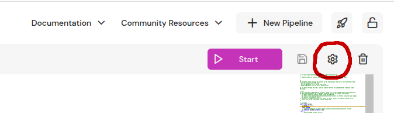

import ApiSchema from '@theme/ApiSchema';
import Tabs from '@theme/Tabs';
import TabItem from '@theme/TabItem';

# Pipeline Settings

Pipelines come with a set of configuration settings to toggle features, tune performance, and help with operations. If you're on the Enterprise Edition, you will likely need to configure the resources section to tune the CPU, memory, and storage resources used by the Pipeline depending on your infrastructure needs. Other than that, users rarely need to deviate from the supplied defaults.

### Editing configuration
.
You can edit all pipeline settings when the pipeline is `Stopped` with storage cleared, and a limited subset when it storage is in use.
<Tabs
  defaultValue="web-console"
  values={[
    {label: 'Web Console', value: 'web-console'},
    {label: 'Python SDK', value: 'python'},
    {label: 'Feldera CLI', value: 'fda'},
    {label: 'HTTP API', value: 'api'},
  ]}>
  <TabItem value="web-console">
    Press the gear button in the top right corner of the code editor to access the dialog where you can edit the runtime and program configuration JSON.

    
  </TabItem>
  <TabItem value="python">
    You can use `RuntimeConfig.from_dict()` to set the runtime configuration of a pipeline.

    Example: [Runtime configuration of a Pipeline](pathname:///python/examples.html#runtime-configuration-of-a-pipeline)
  </TabItem>
  <TabItem value="fda">
    You can toggle the storage for a pipeline with
    ```bash
      fda set-config {pipeline_name} storage [true|false]
    ```
  </TabItem>
  <TabItem value="api">
    Include only `runtime_config` or `program_config` fields in the body of a [PATCH `/v0/pipelines/{pipeline_name}`](/api/patch-pipeline), e.g. :
    ```bash
      curl -X PATCH "http://localhost:8080/v0/pipelines/feature-engineering" -H "Content-Type: application/json" -d '{"runtime_config":{"workers":8,"fault_tolerance":{"model":"none","checkpoint_interval":"60s"},"resources":{"memory_mb_max":16000}},"program_config":{"profile":"dev"}}' -s -o /dev/null
    ```
  </TabItem>
</Tabs>

### Runtime configuration

:::important
Make sure to appropriately size resource limits (memory and storage), the number of worker threads and the storage backend to utilize available cluster resources.
:::

<div className='theme-api-markdown' >
<ApiSchema pointer="#/components/schemas/RuntimeConfig"/>
</div>

#### Durations

Every setting that holds a length of time, such as
`fault_tolerance.checkpoint_interval` or `clock_resolution`,
takes a string made of a number and a unit: `"500ms"`, `"30s"`, `"1h30m"`,
`"30d"`. The units are `ns`, `us`, `ms`, `s`, `m`, `h`, and `d`; several terms
in a row are summed. The older spelling of each setting, such as
`checkpoint_interval_secs`, is an alias of the current one and still works,
as does a bare number.

A bare number is read in the unit the older spelling implied, **whichever of
the two names it is written under**: `clock_resolution_usecs: 1` and
`clock_resolution: 1` both mean one microsecond, because the setting they
reach is the same one. The current names carry no unit, so write the unit:
`clock_resolution: "1s"`. Either bare form makes the pipeline log a warning
quoting the duration to write instead, and a later release stops accepting
them. Writing both spellings of one setting is an error.

The Delta connector's `log_retention_duration` is the one exception: it passes
its value through to Delta Lake, which has its own `"interval 30 days"`
syntax.

#### Runtime configuration edit restrictions

The runtime configuration cannot be edited at all if the pipeline is not stopped.

If the pipeline is stopped, but its storage has not been cleared, the following runtime configuration fields cannot be
edited:
- `workers`
- `hosts`
- `fault_tolerance`
- `resources.storage_mb_max`
- `resources.namespace`
- `resources.storage_class`
- `clock_timezone_offset`

### Program configuration

The "optimized" compilation profile (default) should be used when running production pipelines where performance is important.

The "optimized_symbols" profile adds minimal debug information (to display line number and file information in backtraces).
It can lead to significantly larger pipeline binary sizes (can be up to 2x in practice). However, it is useful to run with this
profile if you want to debug unexpected panics during pipeline execution.

<div className='theme-api-markdown' >
<ApiSchema pointer="#/components/schemas/ProgramConfig"/>
</div>
