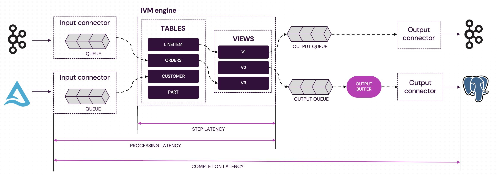

import Tabs from '@theme/Tabs';
import TabItem from '@theme/TabItem';

# Measuring Pipeline Latency

Incremental View Maintenance (IVM) enables Feldera to quickly incorporate changes to input data into analytical queries.
In practice it is often important to know exactly how much processing delay a Feldera pipeline introduces to your application.
This article covers the key latency metrics Feldera exposes, and explain how they can help you measure
and understand the end-to-end processing latency of your pipelines.

## Background: Understanding pipeline latency

A Feldera pipeline processes data in several stages:

* **Input connectors** read data from the data source (e.g., a database table or a Kafka stream) and parse it
  into a stream of data change events (inserts, deletes, and updates to SQL tables).
  The connector buffers incoming data in its input queue until the IVM engine is ready to
  process it. If the pipeline keeps up with data arrival, input queues stay nearly empty. When data arrives
  faster than the engine can process it, the queue fills up, leading to higher latency.
* **IVM engine** repeatedly dequeues batches of changes from
  input queues and computes updates to all affected output views.
* **Output queues** buffer outputs produced by the engine until output connectors process them. If an output
  connector keeps up with changes, its queue is nearly empty. Otherwise, changes accumulate in the queue,
  leading to higher end-to-end latencies.
* **[Output buffers](/connectors#configuring-the-output-buffer)** can be optionally configured for output
  connectors to batch multiple updates before sending them to the connector. They increase the end-to-end
  latency by delaying outputs up to a user-configurable bound.
* **Output connectors** serialize output updates and send them to target data sinks.



## Latency metrics

A pipeline exposes key latency metrics through its [`/metrics`](/api/get-pipeline-metrics/)
endpoint.  See complete list of metrics [here](/operations/metrics).

### Completion latency (`input_connector_completion_latency_seconds`)

**Scope**: Per input connector

**Definition**: End-to-end latency, from ingestion of a batch by the input connector until all resulting outputs have been sent to all sinks.

**Reported as**: Histogram over the last 600 seconds or 10,000 batches (whichever is smaller).

Note that the granularity of a batch is determined by the input connector, e.g., a Kafka connector
can read and enqueue multiple messages at a time. The Delta Lake connector

### Processing latency (`input_connector_processing_latency_seconds`)

**Scope**: Per input connector

**Definition**: Latency from ingestion of a batch until the IVM engine has computed all updates (before they are delivered to sinks).

**Reported as**: Histogram over the last 600 seconds or 10,000 batches (whichever is smaller).

### Step latency (`dbsp_step_latency_seconds`)

**Scope**: Pipeline-wide

**Definition**: Time the IVM engine takes to complete a single processing step.

**Reported as**: Histogram over the last 60 seconds or 1,000 steps (whichever is smaller).

## Measuring end-to-end latency with input frontiers

The metrics above capture *internal* pipeline delays only.
They exclude the time between when data is written to the source and when it is picked up by Feldera,
e.g., the time between a new message was written Kafka until it was dequeued by the pipeline.
Accounting for this latency is essential to measuring the pipeline's contribution to the
end-to-end processing latency of your application.

While this latency is not measured by the pipeline itself, the pipeline exposes
metadata that helps the user to measure this latency. This per-connector metadata is only
available for certain connector types,
via the [`/stats`](/api/get-pipeline-stats)
endpoint in the `.inputs[<connector_index>].completed_frontier` field.
It describes the latest offset in the input data stream fully processed by the pipeline.
It includes the following fields:

| Field         | Description                                                                                   | Format                                |
|---------------|-----------------------------------------------------------------------------------------------|---------------------------------------|
| `metadata`    | Connector-specific metadata that describes the latest offset in the input stream fully processed by the pipeline (e.g., Kafka partition/offset pairs). | connector-specific (see below)|
| `ingested_at` | Timestamp when data was ingested from the wire.                                               | RFC 3339 timestamp                    |
| `processed_at`| Timestamp when the IVM engine finished processing it.                                         | RFC 3339 timestamp                    |
| `completed_at`| Timestamp when all resulting outputs were delivered to all sinks.                             | RFC 3339 timestamp                    |

The `completed_frontier` property is currently supported for the following connectors:
* [Kafka input connector](/connectors/sources/kafka)
* [Delta Lake connector](/connectors/sources/delta)

These connectors support the following metadata formats:

<Tabs>
    <TabItem value="delta" label="Delta Lake">
    ```json
    {
        "version": N
    }
    ```
    where `version` is the latest Delta table version processed by the pipeline.
    </TabItem>

    <TabItem value="kafka" label="Kafka">
    ```json
    {
        "offsets": [
        {
            "start": START_OFFSET1,
            "end": END_OFFSET1
        },
        {
            "start": START_OFFSET2,
            "end": END_OFFSET2,
        },
        ...
        ]
    }
    ```
    where the `offsets` array stores the offset range in the last processed batch per Kafka partition.
    </TabItem>
</Tabs>

### Example

Consider a [Delta Lake connector](/connectors/sources/delta) that reports the following completed frontier:

```json
{
    "metadata": {
        "version":10
    },
    "ingested_at":"2025-09-20T22:32:32.916501+00:00",
    "processed_at":"2025-09-20T22:33:34.112410+00:00",
    "completed_at":"2025-09-20T22:33:34.112414+00:00"
}
```

When this data is reported,
this means that the pipeline has fully processed all Delta table versions up to version 10.
To determine how far behind the current state of the Delta table the pipeline lags,
we have to go outside of Feldera to query the timestamp of the
the first Delta table version after version 10 (if any). For example, using Spark SQL:

```sql
WITH history AS (
  DESCRIBE HISTORY my_table
)
SELECT
  CASE WHEN version = 11 THEN timestamp END AS v11_timestamp,
  (unix_timestamp(now()) - unix_timestamp(v11_timestamp)) AS seconds_between
FROM history;
```

which produces output similar to this:

```
+-----------------------+----------------+
| v11_timestamp         | seconds_between|
+-----------------------+----------------+
| 2025-09-20 22:31:15   |             5  |
+-----------------------+----------------+
```

This means that the outputs written by the pipeline to its data sinks reflect the contents of the Delta table
as of 5 seconds ago.

## Related topics

* [Completion tokens](/connectors/completion-tokens)
