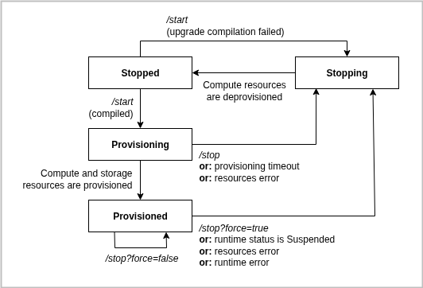
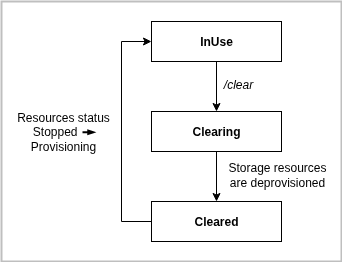
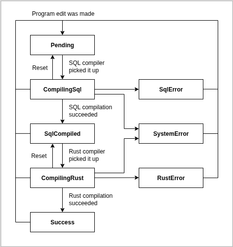

# Reference: Pipeline lifecycle

A pipeline's lifecycle goes through several states as the control plane allocates compute and storage resources for it.
This page is a reference guide that explains the underlying state machines, aimed at Feldera contributors and advanced users.

The status of a pipeline, returned by the [status endpoint](/api/get-pipeline)
consists of four related yet separate statuses:

- **Resources status:** whether compute and storage resources are provisioned to run the pipeline.
- **Storage status:** whether storage resources are in use or are (being) cleared.
- **Runtime status:** status reported by the pipeline process itself regarding its current activity.
- **Program status:** whether the SQL (with UDF) is being or has been compiled to an executable.

For convenience, there is additionally a **combined status** that combines the resources status
with the runtime status as they are complementary.

## Resources status

There are two categories of resources: **storage** and **compute** resources.
The backing that provides these resources depends on the Feldera edition:

- **OSS edition:**
  - Storage resources: a local directory
  - Compute resources: a local process

- **Enterprise edition:**
  - Storage resources: Kubernetes PersistentVolumeClaim (PVC)
  - Compute resources: Kubernetes StatefulSet, Service and ConfigMap
  - The StatefulSet pod keeps the pipeline process continuously alive.
  - Provisioning means the creation of the Kubernetes objects and passing the first health check,
    conversely deprovisioning means the deletion of the Kubernetes objects.

### Resources status API

The resources status reflects whether storage is (being) provisioned and whether compute is (being)
provisioned or deprovisioned.

You control this through the `/start` and `/stop` endpoints:

- `/start` sets the desired status to `Provisioned`
- `/stop` sets the desired status to `Stopped`

These calls return right away, but the actual provisioning or deprovisioning happens asynchronously
and may take time. Storage can only be deprovisioned when the resources status is `Stopped`, and its
state is tracked by the storage status.

**Relevant API fields:**
- `deployment_id` (set becoming `Provisioning`, unset becoming `Stopping`)
- `deployment_config` (set becoming `Provisioning`, unset becoming `Stopping`)
- `deployment_error` (set becoming `Stopping` (if error), unset becoming `Provisioning`)
- `deployment_initial` (set when desired status becomes `Provisioned`, unset becoming `Stopping`
  or desired status becomes `Stopped` while status is still `Stopped`)
- `deployment_resources_status`
- `deployment_resources_status_since`
- `deployment_resources_desired_status`
- `deployment_resources_desired_status_since`

### Resources status table

| Resources status | Compute resources    | Storage resources                         | Storage status | Program status | Runtime status |
|------------------|----------------------|-------------------------------------------|----------------|----------------|----------------|
| **Stopped***     | Deprovisioned.       | Any                                       | Any            | Any            | -              |
| **Provisioning** | Being provisioned.   | Already provisioned or being provisioned. | InUse          | Success        | -              |
| **Provisioned*** | Provisioned.         | Provisioned.                              | InUse          | Success        | Any            |
| **Stopping**     | Being deprovisioned. | Provisioned.                              | InUse          | Success        | -              |
(*) Also a possible desired status

### Resources status diagram

**Resource status diagram notes:**

- **Compilation requirement:** A pipeline must be compiled (program status `Success`) before it can move
  from `Stopped` → `Provisioning`. If `/start` is called before compilation ("early start"), it waits until
  compilation succeeds (then goes to `Provisioning`) or fails (then goes to `Stopping`).
- **Provisioning timeout:** **Provisioning** has a max time limit (e.g., waiting for Kubernetes objects to
  become healthy). If it times out, the pipeline automatically stops.
  - _Example:_ Pods in a StatefulSet take too long to schedule.
  - _Example:_ PersistentVolumeClaim (PVC) allocation took too long.
- **Resources error:** A fatal, unrecoverable issue with compute or storage. Temporary unavailability
  (like pod rescheduling) doesn’t count.
  - _Example:_ StorageClass can’t allocate a PVC due to lack of space.
  - _Example:_ StatefulSet deleted.
  - _Example:_ Process terminated (OSS).
- **Runtime error:** The pipeline itself fails irrecoverably.
  - _Example:_ Pipeline circuit panicked
- ****Stopping** due to error:** If provisioning timeout, resources error or runtime error occurs, it will
  transition to **Stopping** with the corresponding error set.
- **Initial runtime desired status for /start:** Use `/start?initial=standby|paused|running` (default: `running`)
  to control the initial state. Once set to `Paused` or `Running` (also at runtime), you can’t return to `Standby`.
- **Graceful stop:** Use `/stop?force=false` (default) to request the pipeline to stop cleanly: shut down the circuit
  and checkpoint before compute is deprovisioned. Only applies when resources are `Provisioned`; the `force` parameter
  is ignored otherwise.

## Storage status

Storage is created when the pipeline enters `Provisioning`, but is not removed during `Stopping`.
This lets you stop and restart a pipeline while keeping existing storage.
When the pipeline is `Stopped`, you can explicitly choose to deprovision (“clear”) the storage.
What “clearing” does depends on the edition.

- **OSS edition:** removing the local directory.
- **Enterprise edition:** deleting the Kubernetes PersistentVolumeClaim.

### Storage status API

The storage status shows whether storage is provisioned, being cleared, or already cleared.
Deprovisioning is triggered with the `/clear` endpoint, but only when resources are `Stopped`.
While clearing, the pipeline cannot be started.

There is no "desired" storage status. Calling `/clear` sets the status to `Clearing` and
returns immediately. The actual cleanup runs asynchronously, and once finished the status
becomes `Cleared`.

**Relevant API fields:**
- `storage_status`

### Storage status table

| Storage status | Storage resources                                                                                                           |
|----------------|-----------------------------------------------------------------------------------------------------------------------------|
| **Cleared**    | Deprovisioned                                                                                                               |
| **Clearing**   | Being deprovisioned.                                                                                                        |
| **InUse**      | Likely provisioned. It is possible it is not provisioned if the pipeline is stopped at the early beginning of Provisioning. |

### Storage status diagram

## Runtime status

The runtime status only exists when resources are `Provisioned`, since it reflects the state of the running pipeline
process. Unlike other statuses, it isn’t controlled by the runner but reported by the pipeline process itself.

### Runtime status API

The runner polls the pipeline to track both runtime status and desired status.

- At startup, `/start?initial=standby|running|paused` sets the initial desired status.
- During runtime, you can change it with `/activate`, `/resume`, `/pause`, or `/stop?force=false`.

These endpoints only work when resources are `Provisioned` and the runtime status is not `Unavailable`.
The one exception to this is `/stop?force=false`, which will result in a forceful stop if resources is not
`Provisioned`.

**Relevant API fields:**
- `deployment_runtime_status`
- `deployment_runtime_status_since`
- `deployment_runtime_desired_status`
- `deployment_runtime_desired_status_since`

### Runtime status table

| Runtime status        | Description                                                                                                                                                                                                                                                                                                                                                  |
|-----------------------|--------------------------------------------------------------------------------------------------------------------------------------------------------------------------------------------------------------------------------------------------------------------------------------------------------------------------------------------------------------|
| **Unavailable**       | Unable to determine the current runtime status. This status is never returned by the pipeline endpoint itself, but only determined by the runner. This can occur notably in two scenarios: (1) the runner is unable to (in time) receive a response for its sent request to the pipeline status endpoint, or (2) it received back a 503 Service Unavailable. |
| **Standby***          | The pipeline constantly pulling the latest checkpoint to S3 but not processing any inputs.                                                                                                                                                                                                                                                                   |
| **AwaitingApproval*** | The pipeline has been modified and is currently awaiting the user's approval to proceed with bootstrapping modified views. See [Modifying a Pipeline](/pipelines/modifying) for details.                                                                                                                                                                     |
| **Initializing**      | The input and output connectors are establishing connections to their data sources and sinks respectively.                                                                                                                                                                                                                                                   |
| **Bootstrapping**     | The pipeline was modified since the last time it was started, and is currently computing modified views. See [Modifying a Pipeline](/pipelines/modifying) for details.                                                                                                                                                                                       |
| **Replaying**         | Input records that were stored in the journal but were not yet processed, are being processed first.                                                                                                                                                                                                                                                         |
| **Paused***           | The input connectors are paused.                                                                                                                                                                                                                                                                                                                             |
| **Running***          | The input connectors are running.                                                                                                                                                                                                                                                                                                                            |
| **Suspended***        | The circuit is terminated and a final checkpoint has been made. This status is normally not observed as the resources (desired) status will become Stopped once it is detected.                                                                                                                                                                              |
(*) Also a possible desired status

### Runtime status diagram

There are several transition restrictions:
- **Standby only once:** A pipeline can only have (desired) status `Standby` once (or unless the storage is cleared).
  Once the pipeline has been set to become `Paused` or `Running`, it is not allowed to again set desired status to
  `Standby`.
- **Suspended can only be cleared by stop-and-start:** Once a pipeline has been suspended, it can only again become
  `Paused` or `Running` again by stopping (which will happen automatically) and starting the pipeline.

The diagram will be added in the future.

## Program status (compilation status)

The program status only varies during the pipeline `Stopped` resources status, as the pipeline
can only be edited in that status, and it must have successfully compiled before being started.

### Program status API

Whenever the fields relevant to the pipeline program are edited, the program will be automatically
recompiled.

**Relevant API fields:**
- `program_status`
- `program_status_since`
- `program_code`
- `program_config`
- `udf_rust`
- `udf_toml`
- `program_info` (set when becoming `SqlCompiled`, unset when becoming `Pending`)
- `program_error` (set when becoming `SystemError`, `SqlError` or `RustError`,
  unset when becoming `Pending`)
- `program_version`

### Program status table

| Program status    | Description                                                                                                    |
|-------------------|----------------------------------------------------------------------------------------------------------------|
| **Pending**       | Pipeline program is not compiled, and is awaiting being picked up for SQL compilation.                         |
| **CompilingSql**  | A compiler is compiling the pipeline program SQL.                                                              |
| **SqlCompiled**   | The SQL has been compiled to Rust code. The pipeline program is awaiting being picked up for Rust compilation. |
| **CompilingRust** | A compiler is compiling the pipeline program Rust code (both generated and from UDFs).                         |
| **Success**       | The pipeline program is successfully compiled and can be run.                                                  |
| **SystemError**   | A system error (e.g., out of disk space) occurred, causing either SQL or Rust compilation to fail.             |
| **SqlError**      | An error in the SQL caused its compilation to fail.                                                            |
| **RustError**     | An error in the generated or UDF Rust code caused its compilation to fail.                                     |

### Program status diagram

**Program status diagram notes:**

- **Resets:** If the SQL or Rust compiler goes down during compilation, upon restart it
  will reset the compilation status before picking up a new job.
- **Rust caching:** Rust compilation makes use of multiple crates to enable faster compilation
  through parallelism and caching of already prior compiled crates.

## Combined status

Because runtime status is not only set if the resources status is `Provisioned`, the API for
convenience has a combination status which combines resources status and runtime status

### Combined status API

**Relevant API fields:**
- `deployment_status`
- `deployment_status_since`
- `deployment_desired_status`
- `deployment_desired_status_since`

### Combined status table

- The combined statuses are all resources statuses except `Provisioned` joint with the runtime statuses.
- The combined desired status are all resources desired status except `Provisioned` joint with the runtime
  desired statuses.

### Combined status diagram

The diagram is the resources status diagram with the box for `Provisioned` replaced with the diagram of
runtime status.
