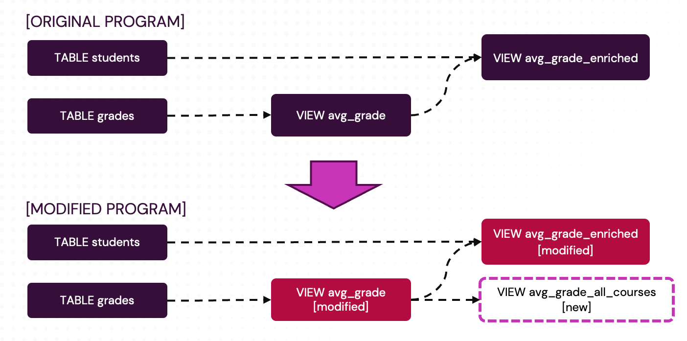

# Modifying a Pipeline While Preserving its State

:::note Enterprise-only feature
This feature is only available in Feldera Enterprise Edition.
:::

:::warning
This is an experimental feature and may undergo significant
changes, including non-backward-compatible modifications, in future releases of
Feldera.
:::

## Overview

Feldera supports **incremental pipeline modification** through a feature called **bootstrapping**.
This allows you to evolve your SQL pipelines by adding, removing, or modifying table and view
definitions without having to discard the pipeline's existing state and re-ingest all historical data
from scratch.

When you modify a pipeline:
- **New and modified views** are computed from existing pipeline state
- **Views not affected by the change** continue using their existing state
- **Input data** does not need to be re-ingested (unless table schemas change)
- **New and modified connectors** are added to the pipeline

## Introduction

Feldera incrementally processes changes to input data. But what happens when the program
itself needs to change, e.g., the user would like to add, remove, or modify a view definition?
Feldera is able to handle such changes incrementally as well by only recomputing
the modified view and any views derived from it. Whenever possible, it uses existing state
in tables and internal indexes maintained by the incremental view maintenance engine
as inputs to evaluate affected views.

This process of building new or modified views from existing state in the pipeline
is called **bootstrapping**. Bootstrapping allows you to evolve your SQL pipeline without
having to re-ingest all historical data from scratch.

<!-- Unless one of the table definitions changes as well, bootstrapping new or modified
views doesn't require re-ingesting input data. -->

## How bootstrapping works

In this section we describe steps involved in modifying a pipeline while preserving its state.

### 1. Stop the pipeline

The pipeline must be stopped before it can be modified. During the `/stop` operation, the state
of the pipeline is checkpointed in storage. Alternatively, if the pipeline crashes or gets force-stopped,
its recent state is preserved in the last [periodic checkpoint](/pipelines/fault-tolerance), as long as checkpointing is
enabled.  This state will later be used to bootstrap the modified pipeline.

### 2. Modify the pipeline

The user modifies the pipeline by making arbitrary changes to its SQL code.
This way many changes across multiple tables and views can be performed at
the same time. This is particularly useful when working with nested views, where
a change to one of the views, such as adding a new column, may require updates to all
downstream views that depend on it.

### 3. Restart the pipeline

When a modified pipeline is restarted, it performs the following operations:

1. Opens its latest checkpoint if one exists.

2. Compares the checkpointed program with the new version being started.
   If the program has not been modified since the checkpoint was made, resumes
   the pipeline from the checkpoint.

3. If the program has been modified, the behavior depends on the `bootstrap_policy`
   argument passed to the pipeline on startup (see [API section](#api) below):

   * `bootstrap_policy=await_approval` (default) - the pipeline stops in the `AwaitingApproval`
     state. Its `deployment_runtime_status_details` property (returned by the [pipeline status endpoint](/api/get-pipeline))
     lists tables, views, and connectors
     affected by the changes.
     At this point the pipeline is paused until the user signals their intention.
     The user can either approve the changes by calling the
     [`/approve`](/api/approve-bootstrap)
     API or terminate the pipeline using [`/stop?force=true`](/api/stop-pipeline).

   * `bootstrap_policy=allow` - the pipeline proceeds to bootstrap modified views
      as described in the [Bootstrapping](#bootstrapping) section below.

   * `bootstrap_policy=reject` - the pipeline is stopped with an error message
     listing pipeline modifications. Its checkpointed state is preserved. The user can
     choose to undo modifications or change `bootstrap_policy` and restart the pipeline
     again.

## Bootstrapping

If pipeline modifications have been approved, the pipeline goes into the `Bootstrapping` state
and performs the following actions:

1. Discards any state that has been invalidated, such as state that belongs to deleted or modified
   views.

2. The state of any new or modified tables is truncated; all connectors attached to these tables
   are reset to their initial state. Once bootstrapping completes, these tables will start empty and
   will be populated with data received from input connectors.

   * A table is considered modified if types, names or the order of its columns have changed in any way,
     its primary key constraint has changed, or its `materialized` or `append_only` properties were added
     or removed.

   * A table is NOT considered modified if only its connector definitions have changed.

   * Any views derived from modified tables are considered modified. During bootstrapping, these
     views will be evaluated against the empty table. After bootstrapping completes, the views will be
     incrementally updated as the table is populated with data from the input connectors.

3. Evaluates new and modified views based on existing state inside the pipeline and
   outputs the complete contents of these views to all attached output connectors.
   This is similar to how the pipeline outputs data while ingesting historical data during regular backfill.

   * A view is considered modified if its query was altered in any way or if its `MATERIALIZED` attribute
     was added or removed.

   * A view is NOT considered modified if only its connector definitions have changed.

:::warning Data Sink Cleanup Required
The pipeline does not output retractions for the old contents of modified views.
You must clear any connected data sinks before approving the modified pipeline to
avoid duplicate or stale data.
:::

The pipeline does not ingest any inputs during bootstrapping. Once bootstrapping completes,
the pipeline moves to the `Running` state, where it resumes ingesting and incrementally processing data
from input connectors. Input connectors that were not modified in the new version of the pipeline and
whose tables have not changed resume ingestion from their checkpointed position in the input stream;
other input connectors will start from the initial state specified in their configuration.

## Caveats and limitations

### Caveat 1: Feldera runtime upgrade can modify the pipeline

Recompiling a pipeline with a new version of Feldera can modify its query plan and trigger
bootstrapping even if its SQL code has not changed.

Feldera pipelines are compiled and executed using the SQL runtime associated with the
installed version of the Feldera platform.
After a Feldera upgrade, existing pipelines continue using the runtime with which they
were originally compiled; however once the pipeline is recompiled, either via the
[`/update_runtime` request](/api/recompile-pipeline)
or by editing its SQL code, it will use the SQL runtime
associated with the current version of the Feldera platform. This new runtime may generate
a slightly different query plan for the same SQL tables and views, which will require going through the bootstrapping process.
The affected views will be recomputed from scratch and streamed to the output connectors even
though their contents haven't changed.

If this is undesirable, use one of the following methods to avoid updating the SQL runtime of a pipeline:

1. Avoid updating pipeline's runtime. As long as you don't invoke `/update_runtime` or modify
   the pipeline's code, it will continue running with its original runtime.

2. Pin the pipeline to a specific runtime version using the [`runtime_version` property](/pipelines/lifecycle).

### Caveat 2: Starting from an S3 checkpoint

Normally, when restarting, a pipeline continues from the checkpoint taken at the point when the pipeline was stopped, containing
the pipeline's latest state. If the pipeline crashed or was [force-stopped](/api/stop-pipeline), it will pick up the
last [periodic checkpoint](/pipelines/configuration/#program-configuration), if any.

Alternatively, the user can start the pipeline from a checkpoint in an S3-compatible object
store, created using the [S3 sync](https://docs.feldera.com/pipelines/checkpoint-sync) feature. This checkpoint may have been created by an older
version of the same pipeline or even by a different pipeline.  This situation is handled in the
same way: the pipeline computes a diff between the current and the checkpointed query plan, bootstraps
any new and modified views and clears any tables that are not part of the checkpoint.

### Caveat 3: Views that have not been modified may require bootstrapping

The Feldera SQL compiler performs some global optimizations across multiple views. Modifying or
removing one of the views can affect these optimizations, potentially changing the query plan
for other views, not directly affected by the change.

### Limitation 1: Tables must be materialized

Bootstrapping relies on existing pipeline state to initialize new and modified views.
[Materializing](/sql/materialized) all tables in the program by declaring them with `'materialized' = 'true'`
ensures that the pipeline can be bootstrapped after arbitrary changes from this materialized
state.

A program where not all tables are materialized may fail to start from a checkpoint and require
clearing the pipeline's state and restarting the pipeline from scratch instead.

### Limitation 2: Bootstrapping does not work with `LATENESS`

Programs with [`LATENESS` annotations](/tutorials/time-series) currently cannot be bootstrapped. These annotations are used
by the query engine to discard state that can no longer affect any future updates to any view.
However, if the modified program contains new views that may depend on the discarded data, they cannot be computed.

We currently do not implement the analysis needed to detect such changes and instead take the more coarse-grained
approach of simply rejecting changes to pipelines with `LATENESS`. Such pipelines must be
backfilled from scratch after any change by clearing their state before restarting.

### Limitation 3: Table evolution is not yet supported

Adding, removing or renaming a table column will clear the table's state and require the table
to be ingested from scratch.

### Limitation 4: The pipeline does not detect changes to UDFs

Feldera currently assumes that a UDF whose name and signature have not changed does not change its behavior.
If the user modifies the implementation of a UDF without changing its signature, they need to either clear the
state of the pipeline or rename the UDF to trigger the bootstrapping of any views that depend on the modified UDF.

## API

In this section we describe the REST API elements related to bootstrapping.
All of this functionality is also available via the Python SDK and the `fda` CLI tool.

* The `bootstrap_policy` argument to the [`/start` endpoint](/api/stop-pipeline). This argument specifies how the pipeline should
  behave when the checkpointed version of the program differs from the current version. The supported values are
  `await_approval`, `allow`, and `reject`. The default value is `await_approval`. See the
  [Restart the pipeline](#3-restart-the-pipeline) section above for details.

* Two runtime states reported by the [pipeline status endpoint](/api/get-pipeline) in the `deployment_runtime_status` field:
  * `AwaitingApproval` - When starting the pipeline with `bootstrap_policy=await_approval`, if the pipeline
    requires bootstrapping, it will stop in the `AwaitingApproval` state waiting for the user to approve the
    changes. While in this state, the `deployment_runtime_status_details` field lists added, modified, and removed
    tables, views, and connectors in JSON format.
    The pipeline exits this state when the user either approves the pipeline via the `/approve` API
    or force-stops the pipeline with `/stop?force=true`.
  * `Bootstrapping` - In this state the pipeline evaluates new and modified views. Once bootstrapping completes,
    the pipeline automatically moves into the `Running` or `Paused` state.

* The [`/approve` endpoint](/api/approve-bootstrap).
  Invoking this endpoint transitions the pipeline from the `AwaitingApproval` to `Bootstrapping` state.

## WebConsole

Bootstrapping is also supported via the WebConsole. The WebConsole always starts pipelines with `bootstrap_policy=await_approval`.
If the pipeline has changed since the last checkpoint, it shows a dialog with the list of detected pipeline changes where the user can
approve the changes or stop the pipeline.

## How different types of changes are handled

This section describes how the bootstrapping process handles different types of changes
to your pipeline.

### Views

#### Adding a view

New views are evaluated during bootstrapping; their full contents are sent to all attached output connectors.

#### Modifying a view

A view is modified when the user changes its SQL definition or as a side effect of a change to an upstream
view or a runtime upgrade. The old state of modified views is discarded; the view is evaluated from
scratch, and its full contents are sent to all attached output connectors.

#### Removing a view

The view, all of its connectors, and all internal indexes used to maintain the view incrementally
are discarded.

### Tables

#### Adding a table

New tables are created empty.
Note that renaming an existing table is treated as deleting the old table and creating a new one.

#### Modifying a table

Modifying a table clears the state of the table and all views that depend on it during bootstrapping.
All table connectors are reset to their initial states.

#### Removing a table

All state of the deleted table is discarded.

### Connectors

#### Adding a connector

* New *input* connectors are initialized according to their configuration.
  They are activated after bootstrapping completes and the pipeline moves to
  the `Running` state.

* New *output* connectors attached to *new or modified* views are activated during
  bootstrapping. They receive the complete contents of the view computed during
  bootstrapping.

* New *output* connectors attached to *existing* views are activated after the
  pipeline moves to the `Running` state. These connectors only receive new changes
  to the views.

Feldera uses connector names to uniquely identify connectors within the scope of
a table or view. Renaming a connector is treated as deleting the old connector
and adding a new connector with an identical configuration.

We recommend explicitly naming all connectors. Anonymous connectors
are automatically assigned names based on the order of their declaration. Such
automatic names are less stable than explicitly assigned names and can cause
spurious changes to be detected in modified pipelines.

#### Modifying a connector

* Modified input connectors are initialized according to the new configuration.
  Any checkpointed state (e.g., the latest offset ingested by the connector)
  is discarded and the connector is reset to its initial state.
  Any data previously ingested by the connector is not affected.

* Modified output connectors are initialized according to the new configuration.

#### Removing a connector

When an input connector is removed, any records previously ingested by the connector
remain in the table.

## Example

In this example, we use the Python SDK to demonstrate how to modify a running pipeline and bootstrap the changes.
We start with a pipeline that tracks student grades and computes average grades per class
within a specific date range. Then we transform the pipeline by:

1. Extending the date range in the `avg_grade` view, which causes the `avg_grade_enriched`
   view to change as well.

2. Adding a new `avg_grade_all_courses` view that computes the overall average across all courses.



```python
from decimal import Decimal
from feldera.enums import BootstrapPolicy, PipelineStatus
from feldera.pipeline_builder import PipelineBuilder
from feldera.runtime_config import RuntimeConfig
from tests import TEST_CLIENT, enterprise_only
from .helper import (
    gen_pipeline_name,
)

# SQL program parameterized by start and end dates.
def gen_sql(start_date, end_date):
    return f"""create table students (
  id bigint,
  name varchar
) with (
  'materialized' = 'true'
);

create table grades (
  student_id bigint,
  class string,
  grade decimal(5,2),
  class_date date
) with (
  'materialized' = 'true'
);

-- Average grade per student per class over a fixed date range.
create view avg_grade as
select
  student_id,
  class,
  AVG(grade) as class_avg
from grades
where
  class_date >= date '{start_date}' and class_date <= date '{end_date}'
group by student_id, class;

-- Similar to avg_grade, but contains student name instead of Id.
create materialized view avg_grade_enriched as
select
  name as student_name,
  class,
  class_avg
from
  avg_grade join students on avg_grade.student_id = students.id;
"""

# Create and start the pipeline.
pipeline = PipelineBuilder(
    TEST_CLIENT,
    pipeline_name,
    sql=gen_sql("2025-09-01", "2025-12-15"),
).create_or_replace()

pipeline.start()
assert pipeline.status() == PipelineStatus.RUNNING

# Feed some input data.
pipeline.execute("insert into students values (1, 'Alice'), (2, 'Bob')")
pipeline.execute("""insert into grades values
(1, 'algebra', 97, '2025-09-15'),
(1, 'physics', 89, '2025-11-15'),
(2, 'algebra', 85, '2025-10-22'),
(2, 'physics', 93, '2025-12-05'),
(1, 'algebra', 95, '2026-01-15'),
(1, 'physics', 87, '2026-03-15'),
(2, 'algebra', 98, '2026-04-22'),
(2, 'physics', 91, '2026-05-05')
""")

# Validate outputs.
result = list(pipeline.query("SELECT * FROM avg_grade_enriched order by student_name, class"))
assert result == [
    {"student_name": "Alice", "class": "algebra", "class_avg": Decimal("97.00")},
    {"student_name": "Alice", "class": "physics", "class_avg": Decimal("89.00")},
    {"student_name": "Bob", "class": "algebra", "class_avg": Decimal("85.00")},
    {"student_name": "Bob", "class": "physics", "class_avg": Decimal("93.00")},
]

pipeline.stop(force=True)

additional_view = """
create materialized view avg_grade_all_courses as
select
  student_id,
  avg(class_avg) as avg
from avg_grade
group by student_id;"""

# Make two changes to the pipeline:
# 1. Add a new view.
# 2. Modify the avg_grade view, extending its date range.
pipeline.modify(
    sql=gen_sql("2025-09-01", "2026-06-10") + additional_view
)

# Start the pipeline with await_approval bootstrap policy.
pipeline.start(bootstrap_policy=BootstrapPolicy.AWAIT_APPROVAL)
assert pipeline.status() == PipelineStatus.AWAITINGAPPROVAL

# When in the AwaitingApproval state, deployment_runtime_status_details shows
# changes between the current and the checkpointed version of the pipeline.
# Note: the avg_grade_enriched view is modified, as it depends on the modified avg_grade view.
diff = pipeline.deployment_runtime_status_details()

assert diff == {
    "added_input_connectors": [],
    "added_output_connectors": [],
    "modified_input_connectors": [],
    "modified_output_connectors": [],
    "program_diff": {
        "added_tables": [],
        "added_views": ["avg_grade_all_courses"],
        "modified_tables": [],
        "modified_views": ["avg_grade", "avg_grade_enriched"],
        "removed_tables": [],
        "removed_views": [],
    },
    "program_diff_error": None,
    "removed_input_connectors": [],
    "removed_output_connectors": []}

# Approve the changes and wait for the pipeline to complete bootstrapping new
# and modified views and reach the RUNNING state.
pipeline.approve()

pipeline.wait_for_status(PipelineStatus.RUNNING, timeout=300)

# The new outputs should reflect input data within the modified date range.
result = list(pipeline.query("SELECT * FROM avg_grade_enriched order by student_name, class"))

assert result == [
    {"student_name": "Alice", "class": "algebra", "class_avg": Decimal("96.00")},
    {"student_name": "Alice", "class": "physics", "class_avg": Decimal("88.00")},
    {"student_name": "Bob", "class": "algebra", "class_avg": Decimal("91.50")},
    {"student_name": "Bob", "class": "physics", "class_avg": Decimal("92.00")},
]

result = list(pipeline.query("SELECT * FROM avg_grade_all_courses order by student_id"))
assert result == [
    {"student_id": 1, "avg": Decimal("92.00")},
    {"student_id": 2, "avg": Decimal("91.75")},
]
```

## Summary

Pipeline modification with bootstrapping enables you to evolve your Feldera pipelines incrementally:

**Key Benefits:**
- Modify SQL definitions without re-ingesting historical data
- Add new views computed from existing state
- Change multiple tables and views atomically
- Review and approve changes before they take effect

**Workflow:**
1. Stop the pipeline (state is automatically checkpointed)
2. Modify the SQL code
3. Restart with desired `bootstrap_policy` (default: `await_approval`)
4. Review changes in `deployment_runtime_status_details`
5. Approve changes via `/approve` endpoint (if using `await_approval`)
6. Wait for bootstrapping to complete and pipeline to reach `Running` state
