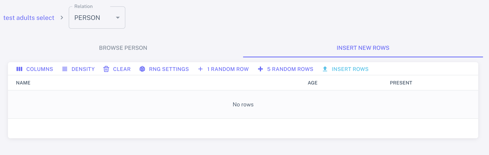
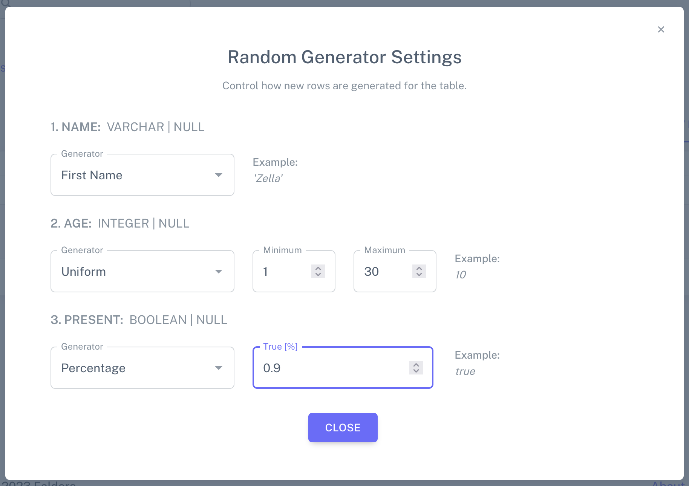
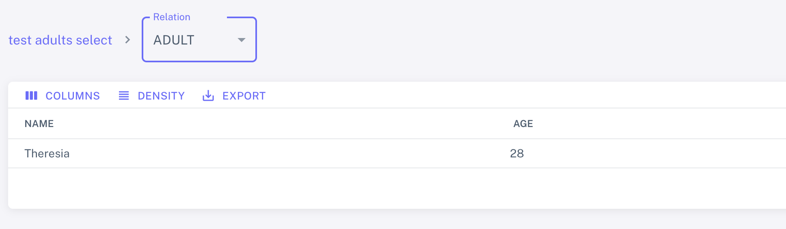

# Testing your first SQL program

In this section, we demonstrate how to debug a new SQL program with the
WebConsole. We are reusing the code from the previous tutorial as an example:

```sql
CREATE TABLE Person
(
    name    VARCHAR,
    age     INT,
    present BOOLEAN
) with ('materialized' = 'true');
CREATE MATERIALIZED VIEW Adult AS SELECT Person.name, Person.age FROM Person WHERE Person.age > 18;
```

Enter the code in the SQL editor. Once the program compiled successfully, (as
indicated by the green `SUCCESS` badge in the UI editor), you can go to the
pipeline builder and create a new pipeline by giving it a name and selecting the
program you just added. There is no need to define or attach any connectors to
it.

Next, go to pipeline management and press the <icon icon="bx:play-circle" />
button to start the pipeline. Once the pipeline has started, on the left side of
the row, press the downward arrow <icon icon="material-symbols:expand-more" />
to expand.

To test the program, you can send data to it directly through the UI.
Press the <icon icon="bx:upload" /> button on the right end of the `Person` table. A new page
opens with a table that is empty:



You can press the Generate 1 Random Row or Generate 5 Random Rows buttons to
fill the table with data. You can also configure more precisely what random
data is generated for every field by opening the `RNG Settings`:



Once you are happy with the generated rows (you can edit them after generation
by double clicking the cells in the table), press `INSERT ROWS` which persists
the your rows in the table. Switch the tab from `INSERT NEW ROWS` to `BROWSE
PERSON` to see the content you just added in the table. If you have multiple
tables in the program, you can repeat this process until you filled all tables
with content.

Finally, inspect the views of your program to verify if the data that shows up
is correct. In our example, we would only want to see the rows from `Person`
where the `age` is over 18.


