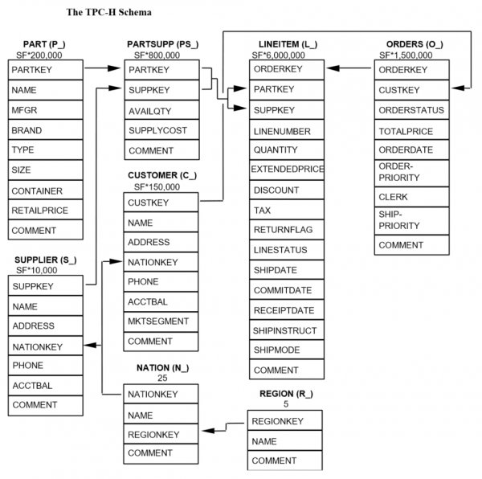

# Part 1: Create a Spark SQL batch job

This tutorial demonstrates how to convert a traditional batch job into an
incremental pipeline. As a starting point, in this section, we build a simple
batch job using Apache Spark in Databricks. For this purpose, we utilize the
TPC-H workload.

The [TPC-H specification](https://www.tpc.org/tpch/) describes itself as
follows:

> The TPC-H is a decision support benchmark. It consists of a suite of business
oriented ad-hoc queries and concurrent data modifications. The queries and the
data populating the database have been chosen to have broad industry-wide
relevance. This benchmark illustrates decision support systems that examine
large volumes of data, execute queries with a high degree of complexity, and
give answers to critical business questions.

The raw data, stored in Delta Lake format, is publicly available in a S3 bucket
at `s3://batchtofeldera`.

## TPC-H Schema



## Step-by-Step Guide

Before we can create a table from our Delta Tables in S3, we must first setup
a datasource.

- Expand the Databricks Console Sidebar.
- Click on **Data Ingestion** under the **Data Engineering** section.
- Click on **Create table from Amazon S3** under the **Files** section.
- Provide credentials / IAM role to connect to S3.

### Table Definitions

Create a new SQL notebook with the following table definitions:

```sql
-- Spark SQL
CREATE TABLE IF NOT EXISTS lineitem LOCATION 's3://batchtofeldera/lineitem';
CREATE TABLE IF NOT EXISTS orders LOCATION 's3://batchtofeldera/orders';
CREATE TABLE IF NOT EXISTS part LOCATION 's3://batchtofeldera/part';
CREATE TABLE IF NOT EXISTS customer LOCATION 's3://batchtofeldera/customer';
CREATE TABLE IF NOT EXISTS supplier LOCATION 's3://batchtofeldera/supplier';
CREATE TABLE IF NOT EXISTS nation LOCATION 's3://batchtofeldera/nation';
CREATE TABLE IF NOT EXISTS region LOCATION 's3://batchtofeldera/region';
CREATE TABLE IF NOT EXISTS partsupp LOCATION 's3://batchtofeldera/partsupp';
```

The tables in our S3 bucket have the following sizes:


| Table    | Records |
|----------|---------|
| customer | 15.0k   |
| lineitem | 601k    |
| nation   | 25      |
| orders   | 150k    |
| part     | 20.0k   |
| partsupp | 80.0k   |
| region   | 5       |
| supplier | 1.00k   |

### Queries

Add TPC-H queries as views to the notebook. For instance, the following view
specifies query **Q1: Pricing Summary Report**

```sql
create view q1
as select
	l_returnflag,
	l_linestatus,
	sum(l_quantity) as sum_qty,
	sum(l_extendedprice) as sum_base_price,
	sum(l_extendedprice * (1 - l_discount)) as sum_disc_price,
	sum(l_extendedprice * (1 - l_discount) * (1 + l_tax)) as sum_charge,
	avg(l_quantity) as avg_qty,
	avg(l_extendedprice) as avg_price,
	avg(l_discount) as avg_disc,
	count(*) as count_order
from
	lineitem
where
	l_shipdate <= date '1998-12-01' - interval '90' day
group by
	l_returnflag,
	l_linestatus
order by
	l_returnflag,
	l_linestatus;
```

Similarly, we define the remaining queries up to TPC-H Q10.

<details>
<summary> Full Spark SQL Code </summary>

```sql
-- Spark SQL
CREATE TABLE IF NOT EXISTS lineitem LOCATION 's3://batchtofeldera/lineitem';
CREATE TABLE IF NOT EXISTS orders LOCATION 's3://batchtofeldera/orders';
CREATE TABLE IF NOT EXISTS part LOCATION 's3://batchtofeldera/part';
CREATE TABLE IF NOT EXISTS customer LOCATION 's3://batchtofeldera/customer';
CREATE TABLE IF NOT EXISTS supplier LOCATION 's3://batchtofeldera/supplier';
CREATE TABLE IF NOT EXISTS nation LOCATION 's3://batchtofeldera/nation';
CREATE TABLE IF NOT EXISTS region LOCATION 's3://batchtofeldera/region';
CREATE TABLE IF NOT EXISTS partsupp LOCATION 's3://batchtofeldera/partsupp';

create view q1
as select
	l_returnflag,
	l_linestatus,
	sum(l_quantity) as sum_qty,
	sum(l_extendedprice) as sum_base_price,
	sum(l_extendedprice * (1 - l_discount)) as sum_disc_price,
	sum(l_extendedprice * (1 - l_discount) * (1 + l_tax)) as sum_charge,
	avg(l_quantity) as avg_qty,
	avg(l_extendedprice) as avg_price,
	avg(l_discount) as avg_disc,
	count(*) as count_order
from
	lineitem
where
	l_shipdate <= date '1998-12-01' - interval '90' day
group by
	l_returnflag,
	l_linestatus
order by
	l_returnflag,
	l_linestatus;

create view q2
as select
	s_acctbal,
	s_name,
	n_name,
	p_partkey,
	p_mfgr,
	s_address,
	s_phone,
	s_comment
from
	part,
	supplier,
	partsupp,
	nation,
	region
where
	p_partkey = ps_partkey
	and s_suppkey = ps_suppkey
	and p_size = 15
	and p_type like '%BRASS'
	and s_nationkey = n_nationkey
	and n_regionkey = r_regionkey
	and r_name = 'EUROPE'
	and ps_supplycost = (
		select
			min(ps_supplycost)
		from
			partsupp,
			supplier,
			nation,
			region
		where
			p_partkey = ps_partkey
			and s_suppkey = ps_suppkey
			and s_nationkey = n_nationkey
			and n_regionkey = r_regionkey
			and r_name = 'EUROPE'
	)
order by
	s_acctbal desc,
	n_name,
	s_name,
	p_partkey
limit 100;

create view q3
as select
	l_orderkey,
	sum(l_extendedprice * (1 - l_discount)) as revenue,
	o_orderdate,
	o_shippriority
from
	customer,
	orders,
	lineitem
where
	c_mktsegment = 'BUILDING'
	and c_custkey = o_custkey
	and l_orderkey = o_orderkey
	and o_orderdate < date '1995-03-15'
	and l_shipdate > date '1995-03-15'
group by
	l_orderkey,
	o_orderdate,
	o_shippriority
order by
	revenue desc,
	o_orderdate
limit 10;

create view q4
as select
	o_orderpriority,
	count(*) as order_count
from
	orders
where
	o_orderdate >= date '1993-07-01'
	and o_orderdate < date '1993-07-01' + interval '3' month
	and exists (
		select
			*
		from
			lineitem
		where
			l_orderkey = o_orderkey
			and l_commitdate < l_receiptdate
	)
group by
	o_orderpriority
order by
	o_orderpriority;

create view q5
as select
	n_name,
	sum(l_extendedprice * (1 - l_discount)) as revenue
from
	customer,
	orders,
	lineitem,
	supplier,
	nation,
	region
where
	c_custkey = o_custkey
	and l_orderkey = o_orderkey
	and l_suppkey = s_suppkey
	and c_nationkey = s_nationkey
	and s_nationkey = n_nationkey
	and n_regionkey = r_regionkey
	and r_name = 'ASIA'
	and o_orderdate >= date '1994-01-01'
	and o_orderdate < date '1994-01-01' + interval '1' year
group by
	n_name
order by
	revenue desc;

create view q6
as select
	sum(l_extendedprice * l_discount) as revenue
from
	lineitem
where
	l_shipdate >= date '1994-01-01'
	and l_shipdate < date '1994-01-01' + interval '1' year
	and l_discount between .06 - 0.01 and .06 + 0.01
	and l_quantity < 24;

create view q7
as select
	supp_nation,
	cust_nation,
	l_year,
	sum(volume) as revenue
from
	(
		select
			n1.n_name as supp_nation,
			n2.n_name as cust_nation,
			year(l_shipdate) as l_year,
			l_extendedprice * (1 - l_discount) as volume
		from
			supplier,
			lineitem,
			orders,
			customer,
			nation n1,
			nation n2
		where
			s_suppkey = l_suppkey
			and o_orderkey = l_orderkey
			and c_custkey = o_custkey
			and s_nationkey = n1.n_nationkey
			and c_nationkey = n2.n_nationkey
			and (
				(n1.n_name = 'FRANCE' and n2.n_name = 'GERMANY')
				or (n1.n_name = 'GERMANY' and n2.n_name = 'FRANCE')
			)
			and l_shipdate between date '1995-01-01' and date '1996-12-31'
	) as shipping
group by
	supp_nation,
	cust_nation,
	l_year
order by
	supp_nation,
	cust_nation,
	l_year;

create view q8
as select
	o_year,
	sum(case
		when nation = 'BRAZIL' then volume
		else 0
	end) / sum(volume) as mkt_share
from
	(
		select
			year(o_orderdate) as o_year,
			l_extendedprice * (1 - l_discount) as volume,
			n2.n_name as nation
		from
			part,
			supplier,
			lineitem,
			orders,
			customer,
			nation n1,
			nation n2,
			region
		where
			p_partkey = l_partkey
			and s_suppkey = l_suppkey
			and l_orderkey = o_orderkey
			and o_custkey = c_custkey
			and c_nationkey = n1.n_nationkey
			and n1.n_regionkey = r_regionkey
			and r_name = 'AMERICA'
			and s_nationkey = n2.n_nationkey
			and o_orderdate between date '1995-01-01' and date '1996-12-31'
			and p_type = 'ECONOMY ANODIZED STEEL'
	) as all_nations
group by
	o_year
order by
	o_year;

create view q9
as select
	nation,
	o_year,
	sum(amount) as sum_profit
from
	(
		select
			n_name as nation,
			year(o_orderdate) as o_year,
			l_extendedprice * (1 - l_discount) - ps_supplycost * l_quantity as amount
		from
			part,
			supplier,
			lineitem,
			partsupp,
			orders,
			nation
		where
			s_suppkey = l_suppkey
			and ps_suppkey = l_suppkey
			and ps_partkey = l_partkey
			and p_partkey = l_partkey
			and o_orderkey = l_orderkey
			and s_nationkey = n_nationkey
			and p_name like '%green%'
	) as profit
group by
	nation,
	o_year
order by
	nation,
	o_year desc;

create view q10
as select
	c_custkey,
	c_name,
	sum(l_extendedprice * (1 - l_discount)) as revenue,
	c_acctbal,
	n_name,
	c_address,
	c_phone,
	c_comment
from
	customer,
	orders,
	lineitem,
	nation
where
	c_custkey = o_custkey
	and l_orderkey = o_orderkey
	and o_orderdate >= date '1993-10-01'
	and o_orderdate < date '1993-10-01' + interval '3' month
	and l_returnflag = 'R'
	and c_nationkey = n_nationkey
group by
	c_custkey,
	c_name,
	c_acctbal,
	c_phone,
	n_name,
	c_address,
	c_comment
order by
	revenue desc
limit 20;
```
</details>

### Running the batch job

Next, we query these views to simulate a batch job:

```sql
select * from q1;
select * from q2;
select * from q3;
select * from q4;
select * from q5;
select * from q6;
select * from q7;
select * from q8;
select * from q9;
select * from q10;
```

We run these queries on a Databricks cluster with the following specification:

```
Databricks Runtime Version: 15.4 LTS (includes Apache Spark 3.5.0, Scala 2.12)
Workers: 2
Worker Type: m6i.large, 8 GB Memory, 2 Cores
Driver Type: m6i.large, 8 GB Memory, 2 Cores
```

Runtime: **40.99 seconds**.

If we modify the input tables by adding or removing a few records and then rerun
the queries, they will still take approximately 40 seconds to complete.

## Takeaways

Updating the output of a batch job incurs the same cost as the initial run, even
when the input changes are small. **As a result, keeping batch job results up to
date can be both time-consuming and expensive.**
