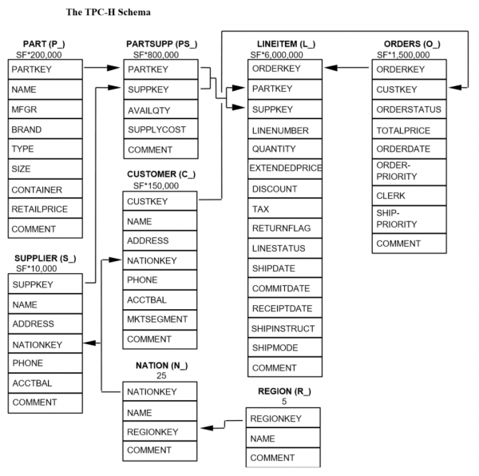

# Part 1: Create a Spark SQL batch job

This tutorial demonstrates how to convert a traditional batch job into an
incremental pipeline. As a starting point, in this section, we build a simple
batch job using Apache Spark in Databricks. For this purpose, we utilize the
TPC-H workload.

The [TPC-H specification](https://www.tpc.org/tpch/) describes itself as
follows:

> The TPC-H is a decision support benchmark. It consists of a suite of business
oriented ad-hoc queries and concurrent data modifications. The queries and the
data populating the database have been chosen to have broad industry-wide
relevance. This benchmark illustrates decision support systems that examine
large volumes of data, execute queries with a high degree of complexity, and
give answers to critical business questions.

The raw data, stored in Delta Lake format, is publicly available in a S3 bucket
at `s3://feldera-demo-datasets/tpch/sf0.1` in region `us-west-1`, readable without
credentials.

## TPC-H Schema



## Step-by-Step Guide

Before we can create a table from our Delta Tables in S3, we must first setup
a datasource.

- Expand the Databricks Console Sidebar.
- Click on **Data Ingestion** under the **Data Engineering** section.
- Click on **Create table from Amazon S3** under the **Files** section.
- Provide credentials / IAM role to connect to S3.

### Table Definitions

Create a new SQL notebook with the following table definitions:

```sql
-- Spark SQL
CREATE TABLE IF NOT EXISTS lineitem location 's3://feldera-demo-datasets/tpch/sf0.1/lineitem';
CREATE TABLE IF NOT EXISTS orders location 's3://feldera-demo-datasets/tpch/sf0.1/orders';
CREATE TABLE IF NOT EXISTS part location 's3://feldera-demo-datasets/tpch/sf0.1/part';
CREATE TABLE IF NOT EXISTS customer location 's3://feldera-demo-datasets/tpch/sf0.1/customer';
CREATE TABLE IF NOT EXISTS supplier location 's3://feldera-demo-datasets/tpch/sf0.1/supplier';
CREATE TABLE IF NOT EXISTS nation location 's3://feldera-demo-datasets/tpch/sf0.1/nation';
CREATE TABLE IF NOT EXISTS region location 's3://feldera-demo-datasets/tpch/sf0.1/region';
CREATE TABLE IF NOT EXISTS partsupp location 's3://feldera-demo-datasets/tpch/sf0.1/partsupp';
```

The tables in our S3 bucket have the following sizes:


| Table    | Records |
|----------|---------|
| customer | 15.0k   |
| lineitem | 601k    |
| nation   | 25      |
| orders   | 150k    |
| part     | 20.0k   |
| partsupp | 80.0k   |
| region   | 5       |
| supplier | 1.00k   |

### Queries

Add TPC-H queries as views to the notebook. For instance, the following view
specifies query **Q1: Pricing Summary Report**

```sql
CREATE VIEW q1
AS SELECT
	l_returnflag,
	l_linestatus,
	SUM(l_quantity) AS sum_qty,
	SUM(l_extendedprice) AS sum_base_price,
	SUM(l_extendedprice * (1 - l_discount)) AS sum_disc_price,
	SUM(l_extendedprice * (1 - l_discount) * (1 + l_tax)) AS sum_charge,
	AVG(l_quantity) AS avg_qty,
	AVG(l_extendedprice) AS avg_price,
	AVG(l_discount) AS avg_disc,
	COUNT(*) AS count_order
FROM
	lineitem
WHERE
	l_shipdate <= DATE '1998-12-01' - INTERVAL '90' DAY
GROUP BY
	l_returnflag,
	l_linestatus
ORDER BY
	l_returnflag,
	l_linestatus;
```

Similarly, we define the remaining queries up to TPC-H Q10.

<details>
<summary> Full Spark SQL Code </summary>

```sql
-- Spark SQL
CREATE TABLE IF NOT EXISTS lineitem location 's3://feldera-demo-datasets/tpch/sf0.1/lineitem';
CREATE TABLE IF NOT EXISTS orders location 's3://feldera-demo-datasets/tpch/sf0.1/orders';
CREATE TABLE IF NOT EXISTS part location 's3://feldera-demo-datasets/tpch/sf0.1/part';
CREATE TABLE IF NOT EXISTS customer location 's3://feldera-demo-datasets/tpch/sf0.1/customer';
CREATE TABLE IF NOT EXISTS supplier location 's3://feldera-demo-datasets/tpch/sf0.1/supplier';
CREATE TABLE IF NOT EXISTS nation location 's3://feldera-demo-datasets/tpch/sf0.1/nation';
CREATE TABLE IF NOT EXISTS region location 's3://feldera-demo-datasets/tpch/sf0.1/region';
CREATE TABLE IF NOT EXISTS partsupp location 's3://feldera-demo-datasets/tpch/sf0.1/partsupp';

CREATE VIEW q1
AS SELECT
	l_returnflag,
	l_linestatus,
	SUM(l_quantity) AS sum_qty,
	SUM(l_extendedprice) AS sum_base_price,
	SUM(l_extendedprice * (1 - l_discount)) AS sum_disc_price,
	SUM(l_extendedprice * (1 - l_discount) * (1 + l_tax)) AS sum_charge,
	AVG(l_quantity) AS avg_qty,
	AVG(l_extendedprice) AS avg_price,
	AVG(l_discount) AS avg_disc,
	COUNT(*) AS count_order
FROM
	lineitem
WHERE
	l_shipdate <= DATE '1998-12-01' - INTERVAL '90' DAY
GROUP BY
	l_returnflag,
	l_linestatus
ORDER BY
	l_returnflag,
	l_linestatus;

CREATE VIEW q2
AS SELECT
	s_acctbal,
	s_name,
	n_name,
	p_partkey,
	p_mfgr,
	s_address,
	s_phone,
	s_comment
FROM
	part,
	supplier,
	partsupp,
	nation,
	region
WHERE
	p_partkey = ps_partkey
	AND s_suppkey = ps_suppkey
	AND p_size = 15
	AND p_type LIKE '%BRASS'
	AND s_nationkey = n_nationkey
	AND n_regionkey = r_regionkey
	AND r_name = 'EUROPE'
	AND ps_supplycost = (
		SELECT
			MIN(ps_supplycost)
		FROM
			partsupp,
			supplier,
			nation,
			region
		WHERE
			p_partkey = ps_partkey
			AND s_suppkey = ps_suppkey
			AND s_nationkey = n_nationkey
			AND n_regionkey = r_regionkey
			AND r_name = 'EUROPE'
	)
ORDER BY
	s_acctbal DESC,
	n_name,
	s_name,
	p_partkey
LIMIT 100;

CREATE VIEW q3
AS SELECT
	l_orderkey,
	SUM(l_extendedprice * (1 - l_discount)) AS revenue,
	o_orderdate,
	o_shippriority
FROM
	customer,
	orders,
	lineitem
WHERE
	c_mktsegment = 'BUILDING'
	AND c_custkey = o_custkey
	AND l_orderkey = o_orderkey
	AND o_orderdate < DATE '1995-03-15'
	AND l_shipdate > DATE '1995-03-15'
GROUP BY
	l_orderkey,
	o_orderdate,
	o_shippriority
ORDER BY
	revenue DESC,
	o_orderdate
LIMIT 10;

CREATE VIEW q4
AS SELECT
	o_orderpriority,
	COUNT(*) AS order_count
FROM
	orders
WHERE
	o_orderdate >= DATE '1993-07-01'
	AND o_orderdate < DATE '1993-07-01' + INTERVAL '3' MONTH
	AND EXISTS (
		SELECT
			*
		FROM
			lineitem
		WHERE
			l_orderkey = o_orderkey
			AND l_commitdate < l_receiptdate
	)
GROUP BY
	o_orderpriority
ORDER BY
	o_orderpriority;

CREATE VIEW q5
AS SELECT
	n_name,
	SUM(l_extendedprice * (1 - l_discount)) AS revenue
FROM
	customer,
	orders,
	lineitem,
	supplier,
	nation,
	region
WHERE
	c_custkey = o_custkey
	AND l_orderkey = o_orderkey
	AND l_suppkey = s_suppkey
	AND c_nationkey = s_nationkey
	AND s_nationkey = n_nationkey
	AND n_regionkey = r_regionkey
	AND r_name = 'ASIA'
	AND o_orderdate >= DATE '1994-01-01'
	AND o_orderdate < DATE '1994-01-01' + INTERVAL '1' YEAR
GROUP BY
	n_name
ORDER BY
	revenue DESC;

CREATE VIEW q6
AS SELECT
	SUM(l_extendedprice * l_discount) AS revenue
FROM
	lineitem
WHERE
	l_shipdate >= DATE '1994-01-01'
	AND l_shipdate < DATE '1994-01-01' + INTERVAL '1' YEAR
	AND l_discount BETWEEN .06 - 0.01 AND .06 + 0.01
	AND l_quantity < 24;

CREATE VIEW q7
AS SELECT
	supp_nation,
	cust_nation,
	l_year,
	SUM(volume) AS revenue
FROM
	(
		SELECT
			n1.n_name AS supp_nation,
			n2.n_name AS cust_nation,
			YEAR(l_shipdate) AS l_year,
			l_extendedprice * (1 - l_discount) AS volume
		FROM
			supplier,
			lineitem,
			orders,
			customer,
			nation n1,
			nation n2
		WHERE
			s_suppkey = l_suppkey
			AND o_orderkey = l_orderkey
			AND c_custkey = o_custkey
			AND s_nationkey = n1.n_nationkey
			AND c_nationkey = n2.n_nationkey
			AND (
				(n1.n_name = 'FRANCE' AND n2.n_name = 'GERMANY')
				OR (n1.n_name = 'GERMANY' AND n2.n_name = 'FRANCE')
			)
			AND l_shipdate BETWEEN DATE '1995-01-01' AND DATE '1996-12-31'
	) AS shipping
GROUP BY
	supp_nation,
	cust_nation,
	l_year
ORDER BY
	supp_nation,
	cust_nation,
	l_year;

CREATE VIEW q8
AS SELECT
	o_year,
	SUM(CASE
		WHEN nation = 'BRAZIL' THEN volume
		ELSE 0
	END) / SUM(volume) AS mkt_share
FROM
	(
		SELECT
			YEAR(o_orderdate) AS o_year,
			l_extendedprice * (1 - l_discount) AS volume,
			n2.n_name AS nation
		FROM
			part,
			supplier,
			lineitem,
			orders,
			customer,
			nation n1,
			nation n2,
			region
		WHERE
			p_partkey = l_partkey
			AND s_suppkey = l_suppkey
			AND l_orderkey = o_orderkey
			AND o_custkey = c_custkey
			AND c_nationkey = n1.n_nationkey
			AND n1.n_regionkey = r_regionkey
			AND r_name = 'AMERICA'
			AND s_nationkey = n2.n_nationkey
			AND o_orderdate BETWEEN DATE '1995-01-01' AND DATE '1996-12-31'
			AND p_type = 'ECONOMY ANODIZED STEEL'
	) AS all_nations
GROUP BY
	o_year
ORDER BY
	o_year;

CREATE VIEW q9
AS SELECT
	nation,
	o_year,
	SUM(amount) AS sum_profit
FROM
	(
		SELECT
			n_name AS nation,
			YEAR(o_orderdate) AS o_year,
			l_extendedprice * (1 - l_discount) - ps_supplycost * l_quantity AS amount
		FROM
			part,
			supplier,
			lineitem,
			partsupp,
			orders,
			nation
		WHERE
			s_suppkey = l_suppkey
			AND ps_suppkey = l_suppkey
			AND ps_partkey = l_partkey
			AND p_partkey = l_partkey
			AND o_orderkey = l_orderkey
			AND s_nationkey = n_nationkey
			AND p_name LIKE '%green%'
	) AS profit
GROUP BY
	nation,
	o_year
ORDER BY
	nation,
	o_year DESC;

CREATE VIEW q10
AS SELECT
	c_custkey,
	c_name,
	SUM(l_extendedprice * (1 - l_discount)) AS revenue,
	c_acctbal,
	n_name,
	c_address,
	c_phone,
	c_comment
FROM
	customer,
	orders,
	lineitem,
	nation
WHERE
	c_custkey = o_custkey
	AND l_orderkey = o_orderkey
	AND o_orderdate >= DATE '1993-10-01'
	AND o_orderdate < DATE '1993-10-01' + INTERVAL '3' MONTH
	AND l_returnflag = 'R'
	AND c_nationkey = n_nationkey
GROUP BY
	c_custkey,
	c_name,
	c_acctbal,
	c_phone,
	n_name,
	c_address,
	c_comment
ORDER BY
	revenue DESC
LIMIT 20;
```
</details>

### Running the batch job

Next, we query these views to simulate a batch job:

```sql
SELECT * FROM q1;
SELECT * FROM q2;
SELECT * FROM q3;
SELECT * FROM q4;
SELECT * FROM q5;
SELECT * FROM q6;
SELECT * FROM q7;
SELECT * FROM q8;
SELECT * FROM q9;
SELECT * FROM q10;
```

We run these queries on a Databricks cluster with the following specification:

```
Databricks Runtime Version: 15.4 LTS (includes Apache Spark 3.5.0, Scala 2.12)
Workers: 2
Worker Type: m6i.large, 8 GB Memory, 2 Cores
Driver Type: m6i.large, 8 GB Memory, 2 Cores
```

Runtime: **40.99 seconds**.

If we modify the input tables by adding or removing a few records and then rerun
the queries, they will still take approximately 40 seconds to complete.

## Takeaways

Updating the output of a batch job incurs the same cost as the initial run, even
when the input changes are small. **As a result, keeping batch job results up to
date can be both time-consuming and expensive.**
