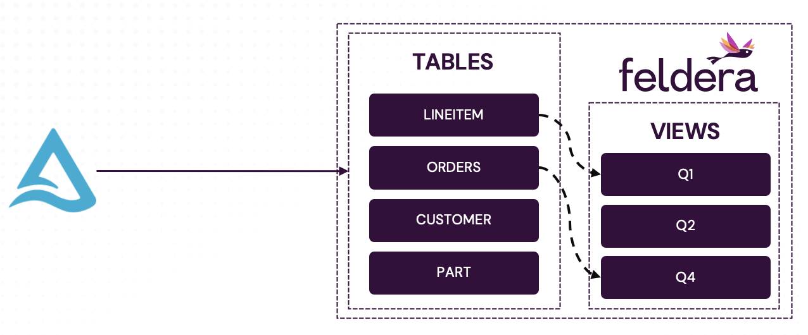

# Part 2. Convert the Batch Job into a Feldera Pipeline

We now convert the Spark batch job from the previous section into an
**always-on**, incremental Feldera pipeline.
Specifically, in this section of the tutorial we:

- Create Feldera tables and configure them to ingest input records from the Delta Lake.
- Define a set of views identical to the ones we declared in Spark.
- Load initial table snapshots and compute initial contents of the views.
- Demonstrate incremental computation: add new records to the tables and observe
  instant changes to the views.


The implementation described in this section is available as a
[pre-packaged example in the Feldera online sandbox](https://try.feldera.com/create/?name=accelerating-batch-analytics)
as well as in your local Feldera installation.



<details>
<summary> Full Feldera SQL code </summary>

```sql
CREATE TABLE lineitem (
        l_orderkey    INTEGER NOT NULL,
        l_partkey     INTEGER NOT NULL,
        l_suppkey     INTEGER NOT NULL,
        l_linenumber  INTEGER NOT NULL,
        l_quantity    DECIMAL(15,2) NOT NULL,
        l_extendedprice  DECIMAL(15,2) NOT NULL,
        l_discount    DECIMAL(15,2) NOT NULL,
        l_tax         DECIMAL(15,2) NOT NULL,
        l_returnflag  CHAR(1) NOT NULL,
        l_linestatus  CHAR(1) NOT NULL,
        l_shipdate    DATE NOT NULL,
        l_commitdate  DATE NOT NULL,
        l_receiptdate DATE NOT NULL,
        l_shipinstruct CHAR(25) NOT NULL,
        l_shipmode     CHAR(10) NOT NULL,
        l_comment      VARCHAR(44) NOT NULL
) WITH (
 'connectors' = '[{
    "transport": {
      "name": "delta_table_input",
      "config": {
        "uri": "s3://feldera-demo-datasets/tpch/sf0.1/lineitem",
        "aws_skip_signature": "true",
        "aws_region": "us-west-1",
        "mode": "snapshot_and_follow"
      }
    }
 }]'
);

CREATE TABLE orders  (
        o_orderkey       INTEGER NOT NULL,
        o_custkey        INTEGER NOT NULL,
        o_orderstatus    CHAR(1) NOT NULL,
        o_totalprice     DECIMAL(15,2) NOT NULL,
        o_orderdate      DATE NOT NULL,
        o_orderpriority  CHAR(15) NOT NULL,
        o_clerk          CHAR(15) NOT NULL,
        o_shippriority   INTEGER NOT NULL,
        o_comment        VARCHAR(79) NOT NULL
) WITH (
 'connectors' = '[{
    "transport": {
      "name": "delta_table_input",
      "config": {
        "uri": "s3://feldera-demo-datasets/tpch/sf0.1/orders",
        "aws_skip_signature": "true",
        "aws_region": "us-west-1",
        "mode": "snapshot_and_follow"
      }
    }
 }]'
);

CREATE TABLE part (
        p_partkey     INTEGER NOT NULL,
        p_name        VARCHAR(55) NOT NULL,
        p_mfgr        CHAR(25) NOT NULL,
        p_brand       CHAR(10) NOT NULL,
        p_type        VARCHAR(25) NOT NULL,
        p_size        INTEGER NOT NULL,
        p_container   CHAR(10) NOT NULL,
        p_retailprice DECIMAL(15,2) NOT NULL,
        p_comment     VARCHAR(23) NOT NULL
) WITH (
 'connectors' = '[{
    "transport": {
      "name": "delta_table_input",
      "config": {
        "uri": "s3://feldera-demo-datasets/tpch/sf0.1/part",
        "aws_skip_signature": "true",
        "aws_region": "us-west-1",
        "mode": "snapshot_and_follow"
      }
    }
 }]'
);

CREATE TABLE customer (
        c_custkey     INTEGER NOT NULL,
        c_name        VARCHAR(25) NOT NULL,
        c_address     VARCHAR(40) NOT NULL,
        c_nationkey   INTEGER NOT NULL,
        c_phone       CHAR(15) NOT NULL,
        c_acctbal     DECIMAL(15,2)   NOT NULL,
        c_mktsegment  CHAR(10) NOT NULL,
        c_comment     VARCHAR(117) NOT NULL
) WITH (
 'connectors' = '[{
    "transport": {
      "name": "delta_table_input",
      "config": {
        "uri": "s3://feldera-demo-datasets/tpch/sf0.1/customer",
        "aws_skip_signature": "true",
        "aws_region": "us-west-1",
        "mode": "snapshot_and_follow"
      }
    }
 }]'
);

CREATE TABLE supplier (
        s_suppkey     INTEGER NOT NULL,
        s_name        CHAR(25) NOT NULL,
        s_address     VARCHAR(40) NOT NULL,
        s_nationkey   INTEGER NOT NULL,
        s_phone       CHAR(15) NOT NULL,
        s_acctbal     DECIMAL(15,2) NOT NULL,
        s_comment     VARCHAR(101) NOT NULL
) WITH (
 'connectors' = '[{
    "transport": {
      "name": "delta_table_input",
      "config": {
        "uri": "s3://feldera-demo-datasets/tpch/sf0.1/supplier",
        "aws_skip_signature": "true",
        "aws_region": "us-west-1",
        "mode": "snapshot_and_follow"
      }
    }
 }]'
);

CREATE TABLE partsupp (
        ps_partkey     INTEGER NOT NULL,
        ps_suppkey     INTEGER NOT NULL,
        ps_availqty    INTEGER NOT NULL,
        ps_supplycost  DECIMAL(15,2)  NOT NULL,
        ps_comment     VARCHAR(199) NOT NULL
) WITH (
 'connectors' = '[{
    "transport": {
      "name": "delta_table_input",
      "config": {
        "uri": "s3://feldera-demo-datasets/tpch/sf0.1/partsupp",
        "aws_skip_signature": "true",
        "aws_region": "us-west-1",
        "mode": "snapshot_and_follow"
      }
    }
 }]'
);

CREATE TABLE nation  (
        n_nationkey  INTEGER NOT NULL,
        n_name       CHAR(25) NOT NULL,
        n_regionkey  INTEGER NOT NULL,
        n_comment    VARCHAR(152)
) WITH (
 'connectors' = '[{
    "transport": {
      "name": "delta_table_input",
      "config": {
        "uri": "s3://feldera-demo-datasets/tpch/sf0.1/nation",
        "aws_skip_signature": "true",
        "aws_region": "us-west-1",
        "mode": "snapshot_and_follow"
      }
    }
 }]'
);

CREATE TABLE region  (
        r_regionkey  INTEGER NOT NULL,
        r_name       CHAR(25) NOT NULL,
        r_comment    VARCHAR(152)
) WITH (
 'connectors' = '[{
    "transport": {
      "name": "delta_table_input",
      "config": {
        "uri": "s3://feldera-demo-datasets/tpch/sf0.1/region",
        "aws_skip_signature": "true",
        "aws_region": "us-west-1",
        "mode": "snapshot_and_follow"
      }
    }
 }]'
);

CREATE MATERIALIZED VIEW q1
AS SELECT
	l_returnflag,
	l_linestatus,
	SUM(l_quantity) AS sum_qty,
	SUM(l_extendedprice) AS sum_base_price,
	SUM(l_extendedprice * (1 - l_discount)) AS sum_disc_price,
	SUM(l_extendedprice * (1 - l_discount) * (1 + l_tax)) AS sum_charge,
	AVG(l_quantity) AS avg_qty,
	AVG(l_extendedprice) AS avg_price,
	AVG(l_discount) AS avg_disc,
	COUNT(*) AS count_order
FROM
	lineitem
WHERE
	l_shipdate <= DATE '1998-12-01' - INTERVAL '90' DAY
GROUP BY
	l_returnflag,
	l_linestatus
ORDER BY
	l_returnflag,
	l_linestatus;

CREATE MATERIALIZED VIEW q2
AS SELECT
	s_acctbal,
	s_name,
	n_name,
	p_partkey,
	p_mfgr,
	s_address,
	s_phone,
	s_comment
FROM
	part,
	supplier,
	partsupp,
	nation,
	region
WHERE
	p_partkey = ps_partkey
	AND s_suppkey = ps_suppkey
	AND p_size = 15
	AND p_type LIKE '%BRASS'
	AND s_nationkey = n_nationkey
	AND n_regionkey = r_regionkey
	AND r_name = 'EUROPE'
	AND ps_supplycost = (
		SELECT
			MIN(ps_supplycost)
		FROM
			partsupp,
			supplier,
			nation,
			region
		WHERE
			p_partkey = ps_partkey
			AND s_suppkey = ps_suppkey
			AND s_nationkey = n_nationkey
			AND n_regionkey = r_regionkey
			AND r_name = 'EUROPE'
	)
ORDER BY
	s_acctbal DESC,
	n_name,
	s_name,
	p_partkey
LIMIT 100;

CREATE MATERIALIZED VIEW q3
AS SELECT
	l_orderkey,
	SUM(l_extendedprice * (1 - l_discount)) AS revenue,
	o_orderdate,
	o_shippriority
FROM
	customer,
	orders,
	lineitem
WHERE
	c_mktsegment = 'BUILDING'
	AND c_custkey = o_custkey
	AND l_orderkey = o_orderkey
	AND o_orderdate < DATE '1995-03-15'
	AND l_shipdate > DATE '1995-03-15'
GROUP BY
	l_orderkey,
	o_orderdate,
	o_shippriority
ORDER BY
	revenue DESC,
	o_orderdate
LIMIT 10;

CREATE MATERIALIZED VIEW q4
AS SELECT
	o_orderpriority,
	COUNT(*) AS order_count
FROM
	orders
WHERE
	o_orderdate >= DATE '1993-07-01'
	AND o_orderdate < DATE '1993-07-01' + INTERVAL '3' MONTH
	AND EXISTS (
		SELECT
			*
		FROM
			lineitem
		WHERE
			l_orderkey = o_orderkey
			AND l_commitdate < l_receiptdate
	)
GROUP BY
	o_orderpriority
ORDER BY
	o_orderpriority;

CREATE MATERIALIZED VIEW q5
AS SELECT
	n_name,
	SUM(l_extendedprice * (1 - l_discount)) AS revenue
FROM
	customer,
	orders,
	lineitem,
	supplier,
	nation,
	region
WHERE
	c_custkey = o_custkey
	AND l_orderkey = o_orderkey
	AND l_suppkey = s_suppkey
	AND c_nationkey = s_nationkey
	AND s_nationkey = n_nationkey
	AND n_regionkey = r_regionkey
	AND r_name = 'ASIA'
	AND o_orderdate >= DATE '1994-01-01'
	AND o_orderdate < DATE '1994-01-01' + INTERVAL '1' YEAR
GROUP BY
	n_name
ORDER BY
	revenue DESC;

CREATE MATERIALIZED VIEW q6
AS SELECT
	SUM(l_extendedprice * l_discount) AS revenue
FROM
	lineitem
WHERE
	l_shipdate >= DATE '1994-01-01'
	AND l_shipdate < DATE '1994-01-01' + INTERVAL '1' YEAR
	AND l_discount BETWEEN .06 - 0.01 AND .06 + 0.01
	AND l_quantity < 24;

CREATE MATERIALIZED VIEW q7
AS SELECT
	supp_nation,
	cust_nation,
	l_year,
	SUM(volume) AS revenue
FROM
	(
		SELECT
			n1.n_name AS supp_nation,
			n2.n_name AS cust_nation,
			YEAR(l_shipdate) AS l_year,
			l_extendedprice * (1 - l_discount) AS volume
		FROM
			supplier,
			lineitem,
			orders,
			customer,
			nation n1,
			nation n2
		WHERE
			s_suppkey = l_suppkey
			AND o_orderkey = l_orderkey
			AND c_custkey = o_custkey
			AND s_nationkey = n1.n_nationkey
			AND c_nationkey = n2.n_nationkey
			AND (
				(n1.n_name = 'FRANCE' AND n2.n_name = 'GERMANY')
				OR (n1.n_name = 'GERMANY' AND n2.n_name = 'FRANCE')
			)
			AND l_shipdate BETWEEN DATE '1995-01-01' AND DATE '1996-12-31'
	) AS shipping
GROUP BY
	supp_nation,
	cust_nation,
	l_year
ORDER BY
	supp_nation,
	cust_nation,
	l_year;


CREATE MATERIALIZED VIEW q8
AS SELECT
	o_year,
	SUM(CASE
		WHEN nation = 'BRAZIL' THEN volume
		ELSE 0
	END) / SUM(volume) AS mkt_share
FROM
	(
		SELECT
			YEAR(o_orderdate) AS o_year,
			l_extendedprice * (1 - l_discount) AS volume,
			n2.n_name AS nation
		FROM
			part,
			supplier,
			lineitem,
			orders,
			customer,
			nation n1,
			nation n2,
			region
		WHERE
			p_partkey = l_partkey
			AND s_suppkey = l_suppkey
			AND l_orderkey = o_orderkey
			AND o_custkey = c_custkey
			AND c_nationkey = n1.n_nationkey
			AND n1.n_regionkey = r_regionkey
			AND r_name = 'AMERICA'
			AND s_nationkey = n2.n_nationkey
			AND o_orderdate BETWEEN DATE '1995-01-01' AND DATE '1996-12-31'
			AND p_type = 'ECONOMY ANODIZED STEEL'
	) AS all_nations
GROUP BY
	o_year
ORDER BY
	o_year;

CREATE MATERIALIZED VIEW q9
AS SELECT
	nation,
	o_year,
	SUM(amount) AS sum_profit
FROM
	(
		SELECT
			n_name AS nation,
			YEAR(o_orderdate) AS o_year,
			l_extendedprice * (1 - l_discount) - ps_supplycost * l_quantity AS amount
		FROM
			part,
			supplier,
			lineitem,
			partsupp,
			orders,
			nation
		WHERE
			s_suppkey = l_suppkey
			AND ps_suppkey = l_suppkey
			AND ps_partkey = l_partkey
			AND p_partkey = l_partkey
			AND o_orderkey = l_orderkey
			AND s_nationkey = n_nationkey
			AND p_name LIKE '%green%'
	) AS profit
GROUP BY
	nation,
	o_year
ORDER BY
	nation,
	o_year DESC;


CREATE MATERIALIZED VIEW q10
AS SELECT
	c_custkey,
	c_name,
	SUM(l_extendedprice * (1 - l_discount)) AS revenue,
	c_acctbal,
	n_name,
	c_address,
	c_phone,
	c_comment
FROM
	customer,
	orders,
	lineitem,
	nation
WHERE
	c_custkey = o_custkey
	AND l_orderkey = o_orderkey
	AND o_orderdate >= DATE '1993-10-01'
	AND o_orderdate < DATE '1993-10-01' + INTERVAL '3' MONTH
	AND l_returnflag = 'R'
	AND c_nationkey = n_nationkey
GROUP BY
	c_custkey,
	c_name,
	c_acctbal,
	c_phone,
	n_name,
	c_address,
	c_comment
ORDER BY
	revenue DESC
LIMIT 20;
```
</details>


## Table Definitions

We create tables for the TPC-H benchmark, with input connectors configured to
read data from our S3 bucket, e.g.:

```sql
-- Feldera SQL
CREATE TABLE lineitem (
        l_orderkey    INTEGER NOT NULL,
        l_partkey     INTEGER NOT NULL,
        l_suppkey     INTEGER NOT NULL,
        l_linenumber  INTEGER NOT NULL,
        l_quantity    DECIMAL(15,2) NOT NULL,
        l_extendedprice  DECIMAL(15,2) NOT NULL,
        l_discount    DECIMAL(15,2) NOT NULL,
        l_tax         DECIMAL(15,2) NOT NULL,
        l_returnflag  CHAR(1) NOT NULL,
        l_linestatus  CHAR(1) NOT NULL,
        l_shipdate    DATE NOT NULL,
        l_commitdate  DATE NOT NULL,
        l_receiptdate DATE NOT NULL,
        l_shipinstruct CHAR(25) NOT NULL,
        l_shipmode     CHAR(10) NOT NULL,
        l_comment      VARCHAR(44) NOT NULL
) WITH (
 'connectors' = '[{
    "transport": {
      "name": "delta_table_input",
      "config": {
        "uri": "s3://feldera-demo-datasets/tpch/sf0.1/lineitem",
        "aws_skip_signature": "true",
        "aws_region": "us-west-1",
        "mode": "snapshot_and_follow"
      }
    }
 }]'
);
```

We use the following Delta Lake connector configuration:

- `uri` - location of the Delta table.
- `aws_skip_signature` - disables authentication for the public S3 bucket.
- `aws_region` - AWS region where the bucket is hosted.
- `mode` - Delta Lake ingest mode. The `snapshot_and_follow` mode configures the
  connector to read the current snapshot of the Delta table on pipeline startup,
and then switch to the `follow` mode, ingesting new updates to the table in
real-time.

Refer to [Delta Lake Input Connector documentation](/connectors/sources/delta)
for details of Delta Lake connector configuration.

:::note

Note that our SQL table declaration explicitly lists table columns and their
types.  In the future Feldera will support extracting these declarations
automatically from Delta table metadata.

:::

## View definitions

The TPC-H SQL queries we used with Spark can be used in Feldera without
modification, e.g.:

```sql
CREATE MATERIALIZED VIEW q1
AS SELECT
	l_returnflag,
	l_linestatus,
	SUM(l_quantity) AS sum_qty,
	SUM(l_extendedprice) AS sum_base_price,
	SUM(l_extendedprice * (1 - l_discount)) AS sum_disc_price,
	SUM(l_extendedprice * (1 - l_discount) * (1 + l_tax)) AS sum_charge,
	AVG(l_quantity) AS avg_qty,
	AVG(l_extendedprice) AS avg_price,
	AVG(l_discount) AS avg_disc,
	COUNT(*) AS count_order
FROM
	lineitem
WHERE
	l_shipdate <= DATE '1998-12-01' - INTERVAL '90' DAY
GROUP BY
	l_returnflag,
	l_linestatus
ORDER BY
	l_returnflag,
	l_linestatus;
```

:::note

In general, Feldera is not fully compatible with Spark SQL. Existing Spark SQL queries
may require porting to Feldera SQL.

:::


Note that we declare the view as [materialized](/sql/materialized), instructing Feldera
to maintain the complete up-to-date snapshot of the view, that can be queried
using [ad-hoc queries](/sql/ad-hoc) as described below.


## Backfill

Run the program in the [Feldera Sandbox](https://try.feldera.com).  It should take
approximately **5 seconds** to process all data in the Delta Lake (**867k records**).
At this point Feldera has ingested all records in the Delta tables, computed the initial
contents of the views, and is ready to process incremental input changes.

We can inspect [materialized](https://docs.feldera.com/sql/materialized) tables
and views using [ad-hoc queries](/sql/ad-hoc), e.g., type the following query in the Ad-Hoc Queries
tab in the Feldera Web Console:

```sql
SELECT * FROM q1;
```

**Output:**

| l_returnflag | l_linestatus | sum_qty | sum_base_price | sum_disc_price | sum_charge      | avg_qty | avg_price | avg_disc | count_order |
|--------------|--------------|---------|----------------|----------------|-----------------|---------|-----------|----------|-------------|
| A            | F            | 3774200 | 5320753880.69  | 5054096266.682 | 5256751331.449  | 25.53   | 36002.12  | 0.05     | 147790      |
| N            | O            | 7459297 | 10512270008.9  | 9986238338.384 | 10385578376.585 | 25.54   | 36000.92  | 0.05     | 292000      |
| R            | F            | 3785523 | 5337950526.47  | 5071818532.942 | 5274405503.049  | 25.52   | 35994.02  | 0.04     | 148301      |
| N            | F            | 95257   | 133737795.84   | 127132372.651  | 132286291.229   | 25.3    | 35521.32  | 0.04     | 3765        |

## Incremental changes

We have configured the Delta Lake connectors in the `snapshot_and_follow` mode,
which ingests changes from the transaction log of the Delta table in real-time
following initial backfill. Unfortunately, the tables in our demo are static, so we
will not observe any changes this way. Instead we demonstrate incremental
computation by using ad hoc queries to add a new `LINEITEM`:

```sql
INSERT INTO lineitem VALUES (1, 5, 4, 1, 50, 0.80, 0.65, 0.10, 'B', 'C', '1998-09-01', '1998-09-01', '1998-09-01', 'DELIVER IN PERSON', 'TRUCK', 'new record insertion')
```

This query completes instantly, returning the number of inserted records:

| count |
|-------|
| 1     |

At this point Feldera has added the new record to the input table and incementally
updated all views affected by the change.  We can for instance view the updated output
of `q1`:

```sql
SELECT * FROM q1;
```

| l_returnflag | l_linestatus | sum_qty | sum_base_price | sum_disc_price | sum_charge      | avg_qty | avg_price | avg_disc | count_order |
|--------------|--------------|---------|----------------|----------------|-----------------|---------|-----------|----------|-------------|
| A            | F            | 3774200 | 5320753880.69  | 5054096266.682 | 5256751331.449  | 25.53   | 36002.12  | 0.05     | 147790      |
| N            | O            | 7459297 | 10512270008.9  | 9986238338.384 | 10385578376.585 | 25.54   | 36000.92  | 0.05     | 292000      |
| R            | F            | 3785523 | 5337950526.47  | 5071818532.942 | 5274405503.049  | 25.52   | 35994.02  | 0.04     | 148301      |
| N            | F            | 95257   | 133737795.84   | 127132372.651  | 132286291.229   | 25.3    | 35521.32  | 0.04     | 3765        |
| B            | C            | 50      | 0.80           | 0.28           | 0.308           | 50      | 0.80      | 0.65     | 1           |

Note the new row that has been added to the view.

Recall that with Spark, every input change, no matter how small, required running the
entire batch job from scratch.

There is another way to observe incremental changes in Feldera. Select the set of views
you are interested in in the Changes Stream tab in the Web Console and insert more records
using ad-hoc queries.  The corresponding changes will show up in the Change Stream tab.

## Takeaways

- We converted the Spark batch job into an **always-on**, incremental pipeline.
- We demonstrated incremental computation by adding a new record and **instantly**
  observing changes in the output the view, without needing to re-run the pipeline.

In the next part of this tutorial, we will demonstrate how to orchestrate different input
connectors in order to ingest historical and real-time data from multiple
sources.
