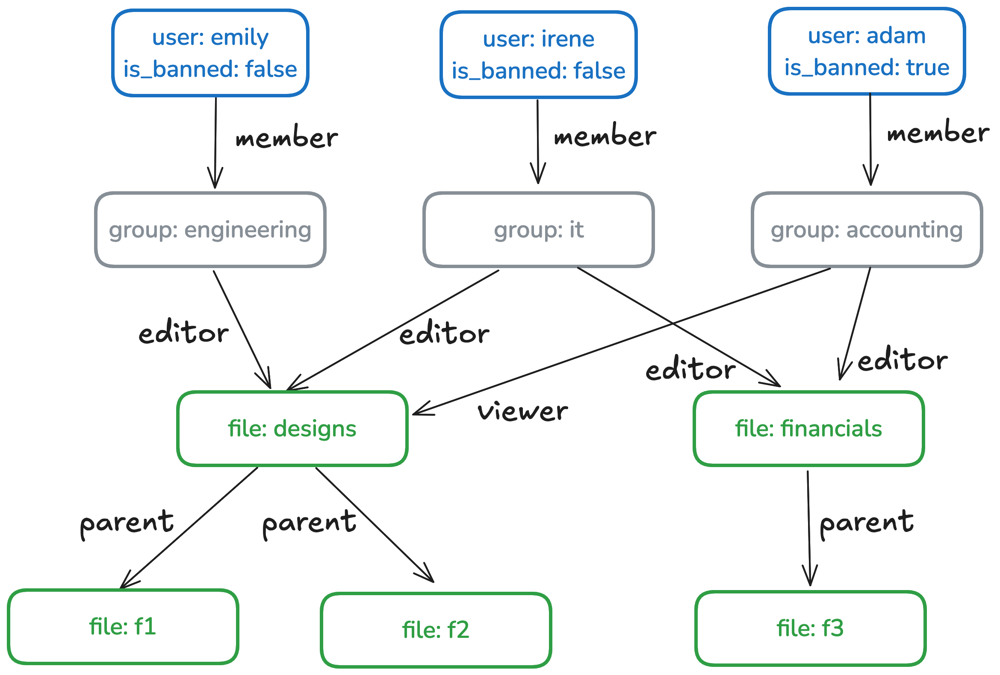
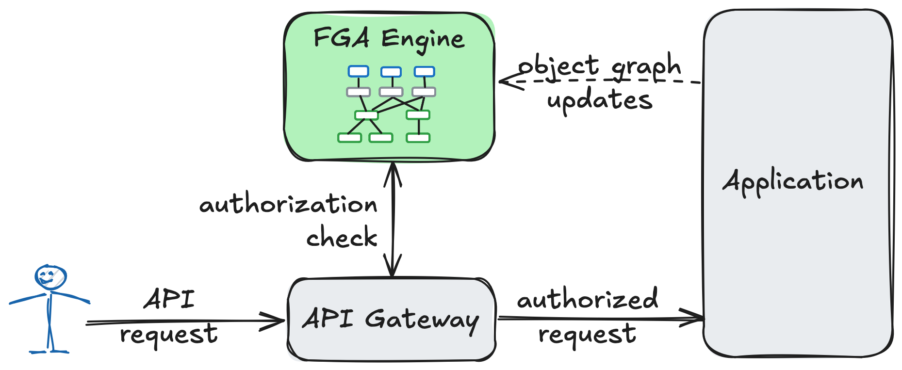
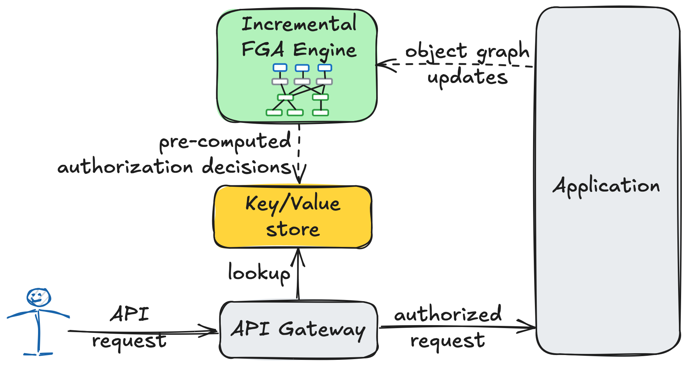

# Use Case: Fine-Grained Authorization

This use case demonstrates how to build a high-performance, real-time **policy engine** using Feldera.
A policy engine enforces access control **rules** that determine which actions users can perform on various
resources, and under which conditions.
We focus on a family of access control models called **Fine-Grained-Authorization** (FGA) models, which were
first popularized by Google's [Zanzibar](https://research.google/pubs/zanzibar-googles-consistent-global-authorization-system/)
system.

**We demonstrate how Feldera's best-in-class support for incremental computation and mutually recursive SQL queries
enables users to implement complex authorization policies with only a few lines of SQL, and to
handle authorization queries efficiently and consistently at scale.**

This guide is designed for the following audiences:

* **Application developers seeking to add an efficient authorization layer to their applications.**
  Example: You’re building a collaborative wiki platform, and need a robust access control layer.
  By defining a declarative access control policy as a set of rules, you can use Feldera to evaluate these rules across millions of
  objects and thousands of users cost-effectively.

* **Policy engine developers looking to scale their compute layer.**
  Example: You’re developing your own FGA engine, similar to [OpenFGA](https://openfga.dev/), and need a query
  engine that can efficiently evaluate complex rule sets over large dynamic object graphs.

In this guide, we will:

* [Introduce the basics of FGA](#fga-basics)
* Discuss how FGA benefits from [incremental computation](#fga-as-an-incremental-computation-problem)
  and [mutually recursive SQL queries](#fga-and-recursion).
* Build two types of FGA engines using Feldera:
  1. [Static FGA Engine](/use_cases/fine_grained_authorization/static): Implements a fixed set of access control rules,
     suitable for enforcing a predefined authorization policy created by application developers.
  2. [Dynamic FGA Engine](/use_cases/fine_grained_authorization/dynamic): Supports a dynamically evolving set of rules,
     ideal for configurable policies where both system objects and authorization rules can change at runtime.

By the end of this guide, you will have a clear understanding of how to leverage Feldera to build scalable and
efficient policy engines.

## FGA basics

### Object graph

An FGA policy is defined over an **object graph**, where nodes represent system objects such as users,
documents, bank accounts, shopping carts, etc. The edges in this graph capture the **relationships**
between these objects, such as `parent`, `owner`, `member`, etc. The specific types of objects and relationships
vary depending on the application’s requirements, allowing developers to implement application-specific
authorization policies.

#### Example: shared file manager

We will use a simple shared file management service as a running example throughout this guide.
This application works with three types of objects:

- **Users** represent individual users of the service.
- **User groups** group users with similar permissions.
- **Files and folders**. For simplicity, we model files and folders using a single object type. A folder
  is simply a file that has one or more children.

Objects are connected by the following relationships:
- `member` - a relationship between a user and a group.
- `parent` - a relationship between files that defines the folder hierarchy.
- `editor` - a relationship between a group and a file that gives the group the permission to read or write the file.
- `viewer` - a relationship between a group and a file that gives the group the permission to read the file.

We use `relationship(object1, object2)` notation for relationships, e.g., `member(alice, engineering)`, `parent(folder1, file1)`,
`editor(admins, folder1)`, etc.

Here is an example object graph that shows several users, groups, and files.  Note that objects can have
**attributes**, e.g., `is_banned`.

<a id="example-object-graph"></a>


### Rules

An FGA policy consists of rules that derive new relationships from the object graph.  A rule consists
of **prerequisites** that must hold for the rule to fire and the **derived clause** that holds if the prerequisites
are satisfied. The language of valid rules depends on a specific FGA implementation. In this tutorial we
consider two most common types of rules:

1. Rules with one prerequisite:
  ```
  relationship1(object1, object2) and condition(object1, object2) -> relationship2(object1, object2)
  ```
  where `condition` is an arbitrary predicate over atributes of `object1` and `object2`.  This rule states
  that if there exists relationship `relationship1` between `object1` and `object2`, which satisfy `condition`,
  then `object1` and `object2` are related by `relationship2`.

2. Rules with two prerequisites:
  ```
  relationship1(object1, object2) and relationship2(object2, object3) and condition(object1, object3) -> relationship3(object1, object3)
  ```

More complex rules, e.g., rules with more than two prerequisites or rules with arbitrary combinations of `and` and `or`
operators, can be decomposed into these two basic types. Some FGA implementations allow negative prerequisites of the
form `not relationship1(object1, object2)`. Such rules can be expressed in Feldera, but we leave them out for simplicity.

#### Example

We define the following derived relationships in our file manager example:
- `group-can-read(group, file)` - `group` is allowed to read `file`.
- `group-can-write(group, file)` - `group` is allowed to write `file`.
- `user-can-read(user, file)` - `user` is allowed to read `file`.
- `user-can-write(user, file)` - `user` is allowed to write `file`.

These relationships are governed by the following rules:
* **Rule 1:** `editor(group, file) -> group-can-write(group, file)` - if a group is an editor of a file, it can write this file.
* **Rule 2:** `group-can-write(group, file1) and parent(file1, file2) -> group-can-write(group, file2)` - if a group can write
  a file, then it can write any of its children.
* **Rule 3:** `viewer(group, file) -> group-can-read(group, file)` - if a group is a viewer of a file, then it can read this file.
* **Rule 4:** `group-can-write(group, file) -> group-can-read(group, file)` - the write permission to a file implies the read
  permission to the same file.
* **Rule 5:** `group-can-read(group, file1) and parent(file1, file2) -> group-can-read(group, file2)` - if a group can read a file,
  then it can read any of its children.
* **Rule 6:** `member(user, group) and group-can-write(group, file) and (not user.is_banned) -> user-can-write(user, file)` - if a user is a member
  of a group that can write a file and the user is not banned, then the user can write the file.
* **Rule 7:** `member(user, group) and group-can-read(group, file) and (not user.is_banned) -> user-can-read(user, file)` - if a user is a member
  of a group that can read a file and the user is not banned, then the user can read the file.

Given these rules, we can derive the following access permissions to file `f1` from the example object graph above:
* `group-can-write(engineering, f1)`
* `group-can-write(it, f1)`
* `group-can-read(engineering, f1)`
* `group-can-read(it, f1)`
* `group-can-read(accounting, f1)`
* `user-can-write(emily, f1)`
* `user-can-read(emily, f1)`
* `user-can-write(irene, f1)`
* `user-can-read(irene, f1)`

### FGA system architecture

At runtime, the FGA engine is invoked to validate every API request from a client, ensuring that the user making
the request has the required permissions. This validation is performed by evaluating the FGA rules against the
object graph. The graph, maintained by the application, evolves in real-time as objects and relationships are added,
removed, and modified.



## FGA as an incremental computation problem

Building an efficient FGA engine is a challenging task.
In large-scale applications, the engine may need to process thousands of authorization requests
per second, over a massive object graph. Each request can require an expensive graph traversal.
The dynamic nature of the graph makes it hard to cache authorization decisions without compromising consistency.

**Incremental computation offers an elegant solution to this challenge.** Instead of evaluating authorization
decisions from scratch for every request, the idea is to precompute all authorization decisions in advance
and store them in a key-value store, reducing runtime authorization checks to simple, efficient lookups.
As the object graph evolves, incremental computation ensures that only rule derivations affected by the
change are updated, avoiding full recomputation.  **An efficient incremental query engine like Feldera can
update the computation within milliseconds after the object graph changes even for very large graphs,
making sure that runtime authorization checks reflect the current state of the system.**



Precomputing all authorization decisions is often impractical in real-world scenarios, because there can be too
many of them. In a system with 1 million users and 1 million public objects, the policy engine could derive
10^12 `user-can-read` relationships.  We thefore need to optimize the computation to prevent such a blow-up.
We will discuss some relevant optimizations [below](/use_cases/fine_grained_authorization/dynamic#optimizations).

## FGA and recursion

The FGA engine must perform iterative graph traversal, where, at each step, it evaluates FGA
rules to derive new relationships based on previously discovered ones.  In the file manager
example, the engine iteratively traverses the folder hierarchy to determine all files that
are readable or writable by each user group.

Expressing such iterative computations in standard SQL is not possible without support for recursive
queries. While many modern SQL dialects offer recursive CTEs, their capabilities are limited. Most
notably, they do not support multiple mutually recursive views, which are essential for evaluating more
complex authorization rules.

An incremental FGA engine must go a step further by updating recursive computations dynamically as
the object graph changes, placing the problem far beyond the capabilities of most query engines.

**Feldera addresses these challenges by offering support for incremental evaluation of arbitrary SQL
programs, including programs with [mutually recursive views](/sql/recursion).**
In the following sections we will see how this unique capability allows it to handle complex, iterative
computations efficiently while keeping up with real-time changes to the object graph.
