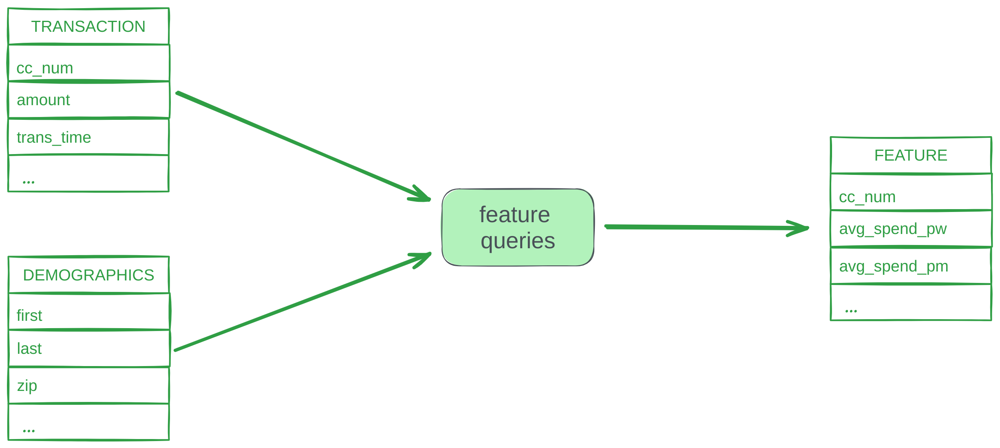
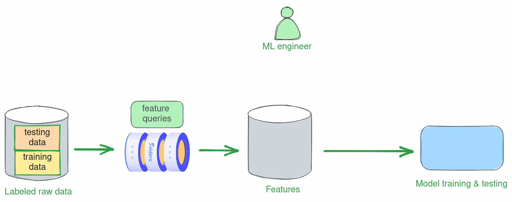
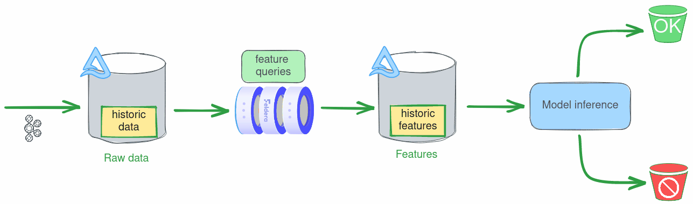

# Use Case: Real-time Feature Engineering for Credit Card Fraud Detection

In this article, we use Feldera to build a real-time credit card fraud detection system. This falls under the umbrella
of real-time feature engineering, where we transform raw data (credit card and user activity) into features that better
represent the underlying problem to an ML model. We
will go through the following steps of building the application:

* Writing SQL queries that define several interesting features, based on data
  enrichment and rolling aggregates.

* Using these queries to compute feature vectors with Feldera and train an ML
  model on a historical data set stored in a Delta Lake.

* Using the same queries to compute feature vectors over a real-time stream of
  credit card transaction data. **By simply connecting new data sources and
  sinks, the SQL queries used for training the model on batch inputs work
  seamlessly on streaming data for real-time inference.**

The entire use case is implemented as a Python script written using the Feldera
[Python SDK](pathname:///python/). It is available from our [github
repository](https://github.com/feldera/feldera/blob/main/demo/project_demo10-FraudDetectionDeltaLake/run.py)
and can be run from the command line or from your favorite Python notebook
environment.

## Credit card fraud detection

Credit card fraud detection is a classic application of real-time feature
engineering. Here, data comes in a stream of transactions, each with attributes
like card number, purchase time, vendor, and amount. Additionally, the fraud
detector has access to a slowly changing table with demographics information
about cardholders, such as age and address.



## Input data

We used a publicly available [Synthetic Credit Card Transaction
Generator](https://github.com/namebrandon/Sparkov_Data_Generation) to generate
two labeled datasets, both with 1000 user profiles. We will use the first
dataset for model training and testing, and the second dataset -- for real-time
inference. We stored the datasets in the [Delta Lake format](https://delta.io/)
in two public S3 buckets:

* Training dataset:
    * Demographics table: `s3://feldera-fraud-detection-data/demographics_train/`
    * Transaction table: `s3://feldera-fraud-detection-data/transaction_train/`

* Inference dataset:
    * Demographics table: `s3://feldera-fraud-detection-data/demographics_train/`
    * Transaction table: `s3://feldera-fraud-detection-data/transaction_train/`

## Model training and testing

Finding an optimal set of features to train a good ML model is an iterative
process. At every step, the data scientist trains and tests a model using
currently selected feature queries on an array of labeled historical data. The
results of each experiment drive the next refinement of feature queries. In
this scenario, feature vectors are computed in batch mode over a slice of
historical data, e.g., data collected over a two-week timeframe.



Below we walk the reader through one iteration of this process: we define a
set of features, train a model using these features, and test its accuracy.

### Writing feature queries

We define several features over our input tables:

* Data enrichment:
    - We add demographic attributes, such as zip code, to each transaction
* Rolling aggregates:
    - average spending per transaction in the past day, week, and month
    - average spending per transaction over a 3-month timeframe on the same day of the week
    - number of transactions made with this credit card in the last 24 hours
* Other:
    - `is_weekend` - transaction took place on a weekend
    - `is_night` - transaction took place before 6am
    - `d` - day of week

The following Python function creates a SQL program,
consisting of two tables with raw input data (`TRANSACTION` and `DEMOGRAPHICS`) and
the `FEATURE` view, which computes the above features over these tables.

```python
def build_program(transactions_connectors: str, demographics_connectors: str, features_connectors: str) -> str:
    return f"""-- Credit card transactions
    CREATE TABLE TRANSACTION(
        trans_date_trans_time TIMESTAMP,
        cc_num BIGINT,
        merchant STRING,
        category STRING,
        amt DECIMAL(38, 2),
        trans_num STRING,
        unix_time BIGINT,
        merch_lat DOUBLE,
        merch_long DOUBLE,
        is_fraud BIGINT
    ) WITH ('connectors' = '{transactions_connectors}');

    -- Demographics data.
    CREATE TABLE DEMOGRAPHICS(
        cc_num BIGINT,
        first STRING,
        last STRING,
        gender STRING,
        street STRING,
        city STRING,
        state STRING,
        zip BIGINT,
        lat DOUBLE,
        long DOUBLE,
        city_pop BIGINT,
        job STRING,
        dob DATE
    ) WITH ('connectors' = '{demographics_connectors}');

    -- Feature query written in the Feldera SQL dialect.
    CREATE VIEW FEATURE
    WITH ('connectors' = '{features_connectors}')
    AS
        SELECT
           t.cc_num,
           dayofweek(trans_date_trans_time) as d,
           CASE
             WHEN dayofweek(trans_date_trans_time) IN(6, 7) THEN true
             ELSE false
           END AS is_weekend,
           hour(trans_date_trans_time) as hour_of_day,
           CASE
             WHEN hour(trans_date_trans_time) <= 6 THEN true
             ELSE false
           END AS is_night,
           -- Average spending per day, per week, and per month.
           AVG(amt) OVER window_1_day AS avg_spend_pd,
           AVG(amt) OVER window_7_day AS avg_spend_pw,
           AVG(amt) OVER window_30_day AS avg_spend_pm,
           -- Average spending over the last three months for the same day of the week.
           COALESCE(
            AVG(amt) OVER (
              PARTITION BY t.cc_num, EXTRACT(DAY FROM trans_date_trans_time)
              ORDER BY unix_time
              RANGE BETWEEN 7776000 PRECEDING and CURRENT ROW
            ), 0) AS avg_spend_p3m_over_d,
           -- Number of transactions in the last 24 hours.
           COUNT(*) OVER window_1_day AS trans_freq_24,
           amt, unix_time, zip, city_pop, is_fraud
        FROM transaction as t
        JOIN demographics as d
        ON t.cc_num = d.cc_num
        WINDOW
          window_1_day AS (PARTITION BY t.cc_num ORDER BY unix_time RANGE BETWEEN 86400 PRECEDING AND CURRENT ROW),
          window_7_day AS (PARTITION BY t.cc_num ORDER BY unix_time RANGE BETWEEN 604800 PRECEDING AND CURRENT ROW),
          window_30_day AS (PARTITION BY t.cc_num ORDER BY unix_time RANGE BETWEEN 2592000 PRECEDING AND CURRENT ROW);
      """
```

### Training and testing

We define helper functions for model training and evaluation using the
[XGBoost](https://xgboost.readthedocs.io/) framework.

<details>
<summary> Click to see full Python code </summary>

```python
from xgboost import XGBClassifier
from sklearn.model_selection import train_test_split
from sklearn.metrics import confusion_matrix


# Split input dataframe into train and test sets
def get_train_test_data(dataframe, feature_cols, target_col, train_test_split_ratio, random_seed):
    X = dataframe[feature_cols]
    y = dataframe[target_col]
    X_train, X_test, y_train, y_test = train_test_split(X, y, train_size=train_test_split_ratio,
                                                        random_state=random_seed)

    return X_train, X_test, y_train, y_test


# Train a decision tree classifier using xgboost.
# Other ML frameworks and types of ML models can be readily used with Feldera.
def train_model(dataframe, config):
    max_depth = 12
    n_estimators = 100

    X_train, X_test, y_train, y_test = get_train_test_data(
        dataframe,
        config['feature_cols'],
        config['target_col'],
        config['train_test_split_ratio'],
        config['random_seed'])

    model = XGBClassifier(
        max_depth=max_depth,
        n_estimators=n_estimators,
        objective="binary:logistic")

    model.fit(X_train, y_train.values.ravel())
    return model, X_test, y_test


# Evaluate prediction accuracy against ground truth.
def eval_metrics(y, predictions):
    cm = confusion_matrix(y, predictions)
    print("Confusion matrix:")
    print(cm)

    if len(cm) < 2 or cm[1][1] == 0:  # checking if there are no true positives
        print('No fraudulent transaction to evaluate')
        return
    else:
        precision = cm[1][1] / (cm[1][1] + cm[0][1])
        recall = cm[1][1] / (cm[1][1] + cm[1][0])
        f1 = (2 * (precision * recall) / (precision + recall))

    print(f"Precision: {precision * 100:.2f}%")
    print(f"Recall: {recall * 100:.2f}%")
    print(f"F1 Score: {f1 * 100:.2f}%")
```

</details>

The following Python snippet connects to a Feldera service
and creates a Feldera pipeline to read transaction and demographics
data from Delta tables stored in S3 and evaluate the feature query
defined above on this data. We use the
[`listen`](pathname:///python/feldera.html#feldera.pipeline.Pipeline.listen)
API to read the computed features into a [Pandas](https://pandas.pydata.org/)
dataframe. We split this dataframe into train and test sets. We
use the former to train an XGBoost model and the latter to measure model
accuracy.

```python
import pandas as pd

# Connect to the Feldera sandbox.
# Use the 'Settings' menu at try.feldera.com to generate an API key
client = FelderaClient("https://try.feldera.com", api_key= < FELDERA_API_KEY >)

# Load DEMOGRAPHICS data from a Delta table stored in an S3 bucket.
demographics_connectors = [{
    "transport": {
        "name": "delta_table_input",
        "config": {
            "uri": "s3://feldera-fraud-detection-data/demographics_train",
            "mode": "snapshot",
            "aws_skip_signature": "true"
        }
    }
}]

# Load credit card TRANSACTION data.
transactions_connectors = [{
    "transport": {
        "name": "delta_table_input",
        "config": {
            "uri": "s3://feldera-fraud-detection-data/transaction_train",
            "mode": "snapshot",
            "aws_skip_signature": "true",
            "timestamp_column": "unix_time"
        }
    }
}]

sql = build_program(json.dumps(transactions_connectors), json.dumps(demographics_connectors), '[]')

pipeline = PipelineBuilder(client, name="fraud_detection_training", sql=sql).create_or_replace()

hfeature = pipeline.listen("feature")

# Process full snapshot of the input tables and compute a dataset
# with feature vectors for use in model training and testing.
pipeline.start()
pipeline.wait_for_completion(shutdown=True)

features_pd = hfeature.to_pandas()
print(f"Computed {len(features_pd)} feature vectors")

print("Training the model")

feature_cols = list(features_pd.columns.drop('is_fraud'))

config = {
    'feature_cols': feature_cols,
    'target_col': ['is_fraud'],
    'random_seed': 45,
    'train_test_split_ratio': 0.8
}

trained_model, X_test, y_test = train_model(features_pd, config)

print("Testing the trained model")

y_pred = trained_model.predict(X_test)
eval_metrics(y_test, y_pred)
```

:::note

Here we use the [Feldera online sandbox](https://try.feldera.com).
You can also use a local instance of Feldera running in a Docker
container on http://127.0.0.1:8080.
See [instructions](/get-started/docker) for running Feldera in Docker.

:::

:::note

The full
[Python script](https://github.com/feldera/feldera/blob/main/demo/project_demo10-FraudDetectionDeltaLake/run.py)
for this use case also contains the code to write computed features
to a Delta Lake, which might be preferrable when working with larger
datasets. This functionality requires write credentials to an S3 bucket
or some other object store and is therefore disabled by default.

:::

## Real-time inference

During real-time feature computation, raw data arrives from a streaming
source like Kafka. Feldera can ingest data directly from such sources, but in
this case we will assume that Kafka is connected to a Delta table, and configure
Feldera to ingest the data by following the transaction log of the table.



There are several advantages to using this setup in production, but it is also great
for demos, as it allows us to stream data from a pre-filled table without having to
manage a Kafka queue.

We define a Python function to feed a Pandas dataframe to
our trained ML model for inference.

<summary> Click to see full Python code </summary>

```python
def inference(trained_model, df):
    print(f"\nReceived {len(df)} feature vectors.")
    if len(df) == 0:
        return

    feature_cols_inf = list(df.columns.drop('is_fraud'))
    X_inf = df[feature_cols_inf].values  # convert to numpy array
    y_inf = df["is_fraud"].values
    predictions_inf = trained_model.predict(X_inf)

    eval_metrics(y_inf, predictions_inf)
```

The next Python snippet builds another Feldera pipeline to evaluate the feature
query over streaming data and send computed feature vectors to the ML model for
inference. It is almost identical to our training setup, except that this time
we read data from the inference dataset. In addition, we configure the input
connector for the `TRANSACTION` table to ingest transaction data in the
[snapshot-and-follow](/connectors/sources/delta#delta-lake-input-connector-configuration) mode.
In this mode, the connector reads the initial snapshot of the table before following
the stream of changes in its transaction log. This **backfill** pattern is necessary
to correctly evaluate features that depend on historical data such as rolling
sums and averages.

```python
# How long to run the inference pipeline for.
INFERENCE_TIME_SECONDS = 30

print(f"\nRunning the inference pipeline for {INFERENCE_TIME_SECONDS} seconds")

# Load DEMOGRAPHICS data from a Delta table.
demographics_connectors = [{
    "transport": {
        "name": "delta_table_input",
        "config": {
            "uri": "s3://feldera-fraud-detection-data/demographics_infer",
            "mode": "snapshot",
            "aws_skip_signature": "true"
        }
    }
}]

# Read TRANSACTION data from a Delta table.
# Configure the Delta Lake connector to read the initial snapshot of
# the table before following the stream of changes in its transaction log.
transactions_connectors = [{
    "transport": {
        "name": "delta_table_input",
        "config": {
            "uri": "s3://feldera-fraud-detection-data/transaction_infer",
            "mode": "snapshot_and_follow",
            "version": 10,
            "timestamp_column": "unix_time",
            "aws_skip_signature": "true"
        }
    }
}]

sql = build_program(json.dumps(transactions_connectors), json.dumps(demographics_connectors), '[]')
pipeline = PipelineBuilder(client, name="fraud_detection_inference", sql=sql).create_or_replace()

pipeline.foreach_chunk("feature", lambda df, chunk: inference(trained_model, df))

# Start the pipeline to continuously process the input stream of credit card
# transactions and output newly computed feature vectors to a Delta table.
pipeline.start()

time.sleep(INFERENCE_TIME_SECONDS)

print(f"Shutting down the inference pipeline after {INFERENCE_TIME_SECONDS} seconds")
pipeline.shutdown()
```

Running this code produces output similar to the following:

```
Running the inference pipeline for 30 seconds

Received 8185 feature vectors.
Confusion matrix:
[[7965   98]
 [  26   96]]
Precision: 49.48%
Recall: 78.69%
F1 Score: 60.76%

Received 8183 feature vectors.
Confusion matrix:
[[7993   10]
 [  34  146]]
Precision: 93.59%
Recall: 81.11%
F1 Score: 86.90%

Received 10000 feature vectors.
Confusion matrix:
[[9823    7]
 [  53  117]]
Precision: 94.35%
Recall: 68.82%
F1 Score: 79.59%

Received 6373 feature vectors.
Confusion matrix:
[[6251   10]
 [  27   85]]
Precision: 89.47%
Recall: 75.89%
F1 Score: 82.13%

...
```

While the pipeline is running, we can monitor its progress in the Feldera Web Console.
Open [try.feldera.com] in your browser and select the `fraud_detection_inference` pipeline.

## Takeaways

In this example we used Feldera to evaluate *the same feature queries* first
over historical (batch) data and then over a combination of historical and
streaming inputs. Feldera's ability to operate on any combination of batch and
streaming sources is crucial for real-time feature engineering, as it eliminates
the need to develop multiple implementations of the same queries for development
and production environments.  **In fact, Feldera does not distinguish between
the two**. Internally, it represents all inputs as changes (inserts, deletes
and updates) to input tables. It processes changes in the same way and produces
the same outputs, whether they arrive frequently in small groups (aka streaming)
or occasionally in bigger groups (aka batch).

Upon receiving a set of changes, Feldera updates its output views without full
re-computation, by doing work proportional to the size of the change rather than
the size of the entire database. This **incremental evaluation** makes Feldera
efficient for both streaming and batch inputs.

Finally, we would like to emphaize that **Feldera is strongly consistent**. If
we pause our inference pipeline and inspect the contents of the output view
produced by Feldera so far, it will be **precisely the same as if we ran the
query on all the inputs received so far as one large batch**. Unpause the
pipeline and run it a little longer. The pipeline will receive some additional
inputs and produce additional outputs, but it still preserves the same
input/output guarantee. This property, known as **strong consistency**, ensures
that the prediction accuracy of your ML model will not be affected by incorrect
input.

## Resources

A version of this use case focusing on integration with the Delta Lake and Spark ecosystem
is published as a [blog post](https://www.feldera.com/blog/feature-engineering-part2/).
