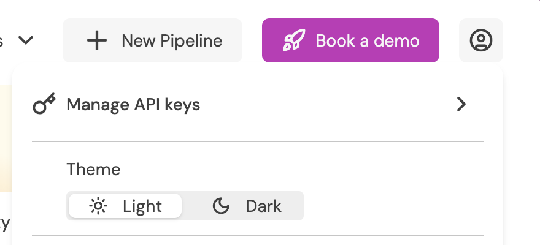

# Part 2: Push CDC events to the Feldera Pipeline

With the pipeline from [Part 1](./part1.md) running, this section streams **change data capture (CDC)** events into it and shows the Gold layer updating incrementally.

The CDC events live in the same public S3 bucket as the snapshot, partitioned by table and hour. In practice, many Feldera users with data in Delta format use our [snapshot_and_follow](/connectors/sources/delta) connector configuration, which follows the Delta log. Feldera processes the changes as soon as they are written to Delta. To make the demo more interactive, changes are pushed directly to the pipeline in JSON format.

```
s3://feldera-demos/ecommerce-cdc-0-01/cdc/<table>/<YYYY-MM-DDTHH>.json
```

Each file is newline-delimited JSON (NDJSON) in Feldera's **insert/delete** change format: every record is either `{"insert": {...}}` or `{"delete": {...}}`. An update arrives as a delete of the old row image immediately followed by an insert of the new one — for example, an order moving to `cancelled` is a delete of the prior order row and an insert of the cancelled row. These updates and deletes are what make the demo interesting: a cancellation must ripple back through historical weekly revenue, cancellation rates, and inventory alerts.

CDC is replayed by [`push_changes.py`](https://github.com/feldera/feldera/blob/main/docs.feldera.com/docs/use_cases/medallion_architecture/push_changes.py), which reads the hourly files from S3 and pushes each table to Feldera's HTTP ingress with `update_format=insert_delete` (one JSON array per request). It pushes the four tables that actually change — `bronze_orders`, `bronze_order_items`, `bronze_clickstream_events`, and `bronze_inventory_events` — all in parallel, and times each push.

## Prerequisites

```bash
pip install feldera boto3 python-dotenv
```

Point the script at your pipeline. It reads connection settings from the environment (a `.env` file works, via `python-dotenv`):

```bash
export FELDERA_URL=http://localhost:8080      # default if unset
export FELDERA_API_KEY=<your-api-key>         # only if your instance requires auth
```

If you are running this demo on try.feldera.com, you will need to generate an API key. Click the profile icon in the top right, and then click "Manage API Keys".



No AWS credentials are needed — the demo bucket is read with anonymous access in `us-west-1`.

:::note Pipeline name
`push_changes.py` defaults to the pipeline name `ecommerce-medallion-architecture`,
which matches the pipeline created from the Web Console use-case tile. Pass
`--pipeline <name>` if yours differs.
:::

## Usage

The script pushes one hour of CDC across all four tables:

```bash
python push_changes.py --pipeline ecommerce-medallion-architecture --hour 2025-11-30T00
```

| Option | Description |
|--------|-------------|
| `--hour <YYYY-MM-DDTHH>` | Hour of CDC to push, across every table. Required. |
| `--pipeline <name>` | Target pipeline (default: `ecommerce-medallion-architecture`). |
| `--feldera <url>` | Feldera URL (default: `$FELDERA_URL`, else `http://localhost:8080`). |
| `--chunk-input` | Split each table's payload into sub-1 MB chunks before pushing. Use this if a proxy in front of Feldera (e.g. nginx, whose default body limit is 1 MB) rejects large request bodies. |

To push more than one hour, loop over the hours you want:

```bash
for h in 00 01 02 03; do
  python push_changes.py --pipeline ecommerce-medallion-architecture --hour 2025-11-30T$h
done
```

A single-hour push prints something like:

```
Pushing CDC hour: 2025-11-30T00
------------------------------------------------------------
  Downloading CDC for 2025-11-30T00 from S3 (s3://feldera-demos)...
  Download complete: 4,859 rows / 1.4 MB across 4 table(s) in 0.6s
  Pushing to pipeline 'ecommerce-medallion-architecture' (all tables in parallel)...
  Per-table push latency (concurrent — these overlap):
    bronze_orders                            1,709 rows  →  0.182s
    bronze_order_items                         753 rows  →  0.071s
    bronze_clickstream_events                1,367 rows  →  0.149s
    bronze_inventory_events                  1,030 rows  →  0.094s
  All tables and views updated in 0.205s (4,859 rows across 4 tables)
```

Each push uses `wait=True`, so the timing reflects Feldera fully ingesting *and* incrementally recomputing every affected Silver and Gold view — not just accepting the bytes. The four tables are pushed concurrently, so the per-table latencies overlap and do **not** sum to the total; the final line reports the wall-clock to process the whole hourly batch. This is a good representation of how Feldera works in the real world, where the pipeline is always on and ready to process changes directly from the source data, be that Delta Lake, Kafka, Postgres, or any other connector.

## Watch a Gold view update in real time

The clearest way to see incremental maintenance is to watch alerts appear the instant their inputs change. Run this in the **Ad-hoc query** tab:

```sql
SELECT COUNT(*) FROM gold_realtime_inventory_alerts;
```

Now make a change that should generate alerts. Raising a supplier's lead time pushes every product it supplies that has recorded sales toward the CRITICAL threshold (`days_of_stock_remaining < lead_time_days * 1.5`):

```sql
INSERT INTO bronze_suppliers VALUES (7, 'Blake and Sons', 'DE', 10000, now());
```

Re-run the count immediately — it jumps within milliseconds, without a batch job or recomputation.

```sql
SELECT COUNT(*) FROM gold_realtime_inventory_alerts;
```

Or, push a real slice of history and watch the views change. With the ecommerce-medallion-architecture pipeline open, navigate to the change stream tab and select a view. `gold_realtime_inventory_alerts`, `gold_product_demand_surge`, and `gold_weekly_revenue_trend` are all great candidates.

Look at the Runtime tab to see Feldera's memory usage. The memory footprint is low and will stay that way even as data grows. The size of the change is the main factor in Feldera's memory usage.

```bash
# Push several hours of 2025-11-30 in sequence and watch the views update after each
for h in 00 01 02 03 04 05; do
  python push_changes.py --pipeline ecommerce-medallion-architecture --hour 2025-11-30T$h
done
```

```sql
-- Cancellations updated incrementally as orders flip to 'cancelled'
SELECT category, week_start, cumulative_cancellation_rate
FROM gold_cancellation_impact
ORDER BY week_start DESC, category
LIMIT 20;
```

Because the orders that get cancelled in the CDC stream belong to *past* weeks, you'll see historical `weekly_net_revenue` in `gold_weekly_revenue_trend` change and the dependent window calculations (WoW change, 4-week moving average, cumulative YTD) adjust — all without rebuilding anything.

Next, [Part 3](./part3.md) runs the same logic as a Spark batch job for comparison.
