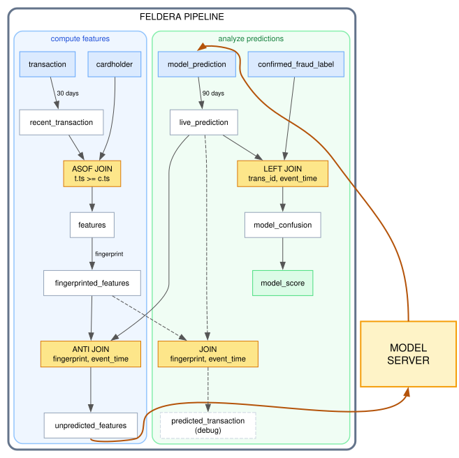

# Use Case: Keeping an ML Model in the Loop

The demo [Real-time feature engineering](../fraud_detection/fraud_detection.md) computes
the inputs an ML model needs. This article shows how a real-time Feldera pipeline can
interact with a model, feeding it data, reading the predictions back,
and measuring how good the predictions are, while the pipeline keeps running.

Calling a model from a [user-defined function](/sql/udf) generally won't work, because
UDFs in Feldera *must* be fully deterministic functions. In this article the
model runs as a separate process outside the pipeline, and the two exchange data
through a view (which supplies the model's inputs) and a table (which supplies the model's outputs).

The full SQL for the pipeline is in
[`model_scoring.sql`](https://github.com/feldera/feldera/blob/main/docs.feldera.com/docs/use_cases/model_scoring/model_scoring.sql).
A mock model server that closes the loop, and drives the whole lifecycle, is in
[`test_model_scoring.py`](https://github.com/feldera/feldera/blob/main/python/tests/runtime/test_model_scoring.py).

## The pattern

* Feature extraction is expressed in SQL. `fingerprinted_features` is the resulting
  set of **model inputs**: one row per feature vector.
* `unpredicted_features` narrows the requests to requests that have received
  no prediction answers yet.
  **This is the view the model server subscribes to**.
* The server runs the model and writes **model outputs** into the
  `model_prediction` table. It only ever inserts; the model is stateless.
* The pipeline reads that table like any other input and scores the predictions
  against ground truth as it arrives (possibly much later).



## Input data

There are 2 main input tables:

- `cardholder` holds information about credit card holders.  Notice that the primary key
   of this table contains a unique ID but also a timestamp.  This essentialle makes
   cardholders *versioned*
- `transaction` holding information about credit card transaction.  This models an append-only
   stream of transactions which are never deleted

There is an additional table `confirmed_fraud_label`, which is expected to be populated much
later than these two tables, which indicates transactions that were determined later to be
fraudulent.  This information is used to determine how good the predictions from a model were.

## Enrichment

Enriched data is produced by joining `recent_transaction` and `cardholder` using an
[`ASOF JOIN`](/tutorials/time-series#as-of-joins), which selects the version in
effect when the event happened rather than
the version current now. `recent_transaction` is `transaction` restricted to the
prediction window, so the join never sees the whole history:

```sql
FROM recent_transaction t
LEFT ASOF JOIN cardholder c
MATCH_CONDITION ( t.ts >= c.ts )
ON t.cc_num = c.cc_num
```

## Fingerprinting request for the model server

For every request the model server has to produce a prediction.
When providing a prediction, the model server has to describe which
feature the score corresponds to.  For this purpose,
requests to the model are identified by a *fingerprint* including every
feature value:

```sql
CREATE MATERIALIZED VIEW fingerprinted_features AS
SELECT
    MD5(CAST(f.trans_id AS VARCHAR) || '|' ||
        CAST(f.ts AS VARCHAR) || '|' ||
        CAST(f.amount AS VARCHAR) || '|' ||
        f.merchant_category || '|' ||
        CAST(f.zip AS VARCHAR) || '|' ||
        CAST(f.credit_limit AS VARCHAR) || '|' ||
        CAST(f.pct_of_limit AS VARCHAR) || '|' ||
        CAST(f.avg_amount_7d AS VARCHAR) || '|' ||
        CAST(f.txn_count_7d AS VARCHAR)) AS request_fingerprint,
    f.*
FROM features f
WHERE f.ts > NOW() - INTERVAL 30 DAYS;
```
:::warning

Every feature the model reads must appear in the fingerprint. A feature left out
lets a stale prediction survive a change to it.

:::

## The work queue between the pipeline and the model

A model server should hold no state. We keep the outstanding in the view `unpredicted_features`:
a request is pending when no prediction for it exists.

```sql
CREATE MATERIALIZED VIEW unpredicted_features AS
SELECT r.*
FROM fingerprinted_features r
WHERE NOT EXISTS (
    SELECT 1 FROM live_prediction p
    WHERE p.request_fingerprint = r.request_fingerprint AND p.event_time = r.ts);
```

The server subscribes to `unpredicted_features` over
[HTTP egress](/connectors/sinks/http) with `send_snapshot=true`, which replays
the outstanding set on connect. A reconnect therefore *resumes* where it left off.

We use `backpressure=true` in this demo; this prevents the pipeline from producing
requests faster than the model can serve.

### HTTP or Kafka

This demo uses HTTP so that it does not need to run additional services. In
production we would attach a [Kafka output connector](/connectors/sinks/kafka) to
`unpredicted_features` instead, and the model server would consume the topic:

```sql
CREATE MATERIALIZED VIEW unpredicted_features
WITH ('connectors' = '[{
    "transport": {
        "name": "kafka_output",
        "config": { "bootstrap.servers": "...", "topic": "prediction-requests" }
    },
    "format": { "name": "json", "config": { "update_format": "insert_delete" } }
}]')
AS ...
```

The two differ in ways that matter:

| | HTTP egress | Kafka |
|---|---|---|
| Fault tolerance | none | [supported](/pipelines/fault-tolerance) |
| Connector lifetime | created on connect, deleted on disconnect | declared, persistent |
| If the server is down | requests emitted meanwhile are missed | they wait in the topic |
| Backpressure | `backpressure=true` blocks the pipeline | none; the queue absorbs the backlog |
| Recovery on restart | `send_snapshot=true` replays the outstanding set | resume from the consumer offset |

Using HTTP, a model server that disconnects loses
whatever was emitted while it was away, and only reconnecting with
`send_snapshot=true` recovers it.

In this write-up the model server sends predictions to the pipeline
 hrough HTTP ingress; in production `model_prediction` could
declare a [Kafka input connector](/connectors/sources/kafka), which is also
fault-tolerant, and the server would append to that topic instead of posting:

```sql
CREATE TABLE model_prediction (
    ...
) WITH ('connectors' = '[{
    "transport": {
        "name": "kafka_input",
        "config": { "bootstrap.servers": "...", "topic": "predictions",
                    "start_from": "earliest" }
    },
    "format": { "name": "json", "config": { "update_format": "insert_delete" } }
}]');
```

Using Kafka in both directions makes the whole loop durable and the pipeline and
he model fully decoupled: neither has to be running for the other to make progress,
and neither talks the other directly. Replays are harmless because `model_prediction` has
a primary key, so a redelivered prediction upserts rather than duplicating.

The only way the pipeline SQL needs to change is by adding the connector declarations.

## Finite-state design

Nothing in this design retains data indefinitely, even though the input tables
may grow indefinitely.

- [`LATENESS`](/tutorials/time-series#timestamp-columns-and-lateness) bounds the
  state for both `transaction` and `cardholder`.

- A [temporal filter](/tutorials/time-series#now-and-temporal-filters) bounds the
  contents:

```sql
WHERE f.ts > NOW() - INTERVAL 30 DAYS
```

This ensures that all views that hold features only contain data from the last 30 days.

`LATENESS` and the temporal filter serve complementary purposes
([how Feldera garbage collects old state](/tutorials/time-series#how-feldera-garbage-collects-old-state)):

| Horizon | Question |
|---------|----------|
| 30 days, temporal filter on `fingerprinted_features` | how far back is it worth predicting? |
| 90 days, `LATENESS` on predictions | how long can ground truth take to arrive? |

Predictions produced by the model must be retained longer than the original requests,
allowing the ground truth to arrive delayed.

When the model server is started it produces immediately for the pipeline data
for the prediction window (last 30 days), rather than only scoring new traffic.
This enables the pipeline to evaluate the quality of the model immediately, without
waiting for 90 days.

`model_prediction` receives data written by the model.  In our implementation
the model server uses http to write to this table.  The table
has a primary key so that it holds one current answer per transaction:

```sql
CREATE TABLE model_prediction (
    event_time TIMESTAMP NOT NULL LATENESS INTERVAL 90 DAYS,
    request_fingerprint VARCHAR NOT NULL,
    trans_id BIGINT NOT NULL,
    fraud_probability DECIMAL(5, 4) NOT NULL,
    predicted_at TIMESTAMP NOT NULL,
    PRIMARY KEY (event_time, trans_id)
);
```

## Scoring the model

Ground truth usually arrives long after the prediction, and for most events it may never
arrive at all: only a small fraction of transactions are discovered to be fraudulent.
We treat by default a missing transaction label as a **negative** (a transaction with no
ground truth is assumed to be non fraudulent):

The confusion matrix is computed using a left join of the ground truth and
 the predictions. Precision and recall are estimated from these
counts. `DIV_NULL` returns `NULL` instead of failing when the denominator is
zero, so it is handy for the case when a model has predicted no fraud at all:

```sql
CREATE MATERIALIZED VIEW model_score AS
SELECT
    scored,
    true_positive,
    false_positive,
    false_negative,
    DIV_NULL(CAST(true_positive AS DECIMAL(12, 6)),
             true_positive + false_positive) AS precision_score,
    DIV_NULL(CAST(true_positive AS DECIMAL(12, 6)),
             true_positive + false_negative) AS recall_score
FROM model_confusion;
```

The `CAST` is used because otherwise the computation uses integer division.

## One model at a time

This demo scores a single model. Nothing in the pipeline verifies that a model
server is running: if none is, requests accumulate unanswered in
`unpredicted_features` until they fall out of the prediction window.

Running several models at once is possible, not shown here. It could be implemented by
having an additional table listing all deployed model versions.
