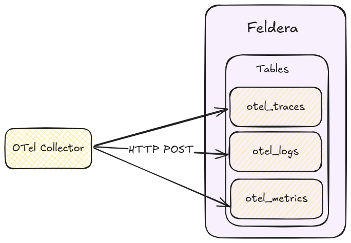
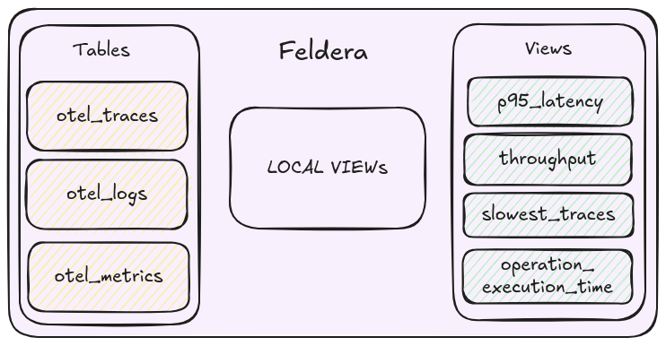

# Sending OTel data to Feldera

To push data into Feldera, we configure the OpenTelemetry (OTel) Collector to send data to Feldera via HTTP (see: [HTTP Ingress Docs](https://docs.feldera.com/connectors/sources/http)).

#### OTel Collector Configuration:

Here we configure OTel Collector to send logs, traces, and metrics to Feldera as JSON via an HTTP POST request without any compression.



Configure your OTel Collector as follows:

```yml
# src/otel-collector/otelcol-config-extras.yml in OpenTelemetry Demo

exporters:

  # Send traces to the Feldera pipeline.
  # Currently only uncompressed JSON is supported.
  otlphttp/feldera:
     logs_endpoint: http://feldera:8080/v0/pipelines/otel/ingress/otel_logs?format=json&update_format=raw
     traces_endpoint: http://feldera:8080/v0/pipelines/otel/ingress/otel_traces?format=json&update_format=raw
     metrics_endpoint: http://feldera:8080/v0/pipelines/otel/ingress/otel_metrics?format=json&update_format=raw
     encoding: json
     compression: none

service:
   pipelines:
     traces:
       receivers: [otlp]
       processors: [transform, batch]
       exporters: [spanmetrics, otlphttp/feldera, debug, otlp]

     logs:
       receivers: [otlp]
       processors: [batch]
       exporters: [otlphttp/feldera, debug]

     metrics:
       receivers: [hostmetrics, docker_stats, httpcheck/frontend-proxy, otlp, prometheus, redis, spanmetrics]
       processors: [batch]
       exporters: [otlphttp/feldera, debug]
```

Notice that we have the query parameters (see: [JSON Format Docs](https://docs.feldera.com/formats/json#encoding-data-change-events)): `format=json&update_format=raw`
- `format=json`: Specifies that the input data is JSON-formatted.
- `update_format=raw`: Indicates that the request body contains raw data, which Feldera processes as an insertion into the table.

## Pre-processing



The OTel data format contains data in arrays of fields, we want to convert them into traditional database table rows,
this would allow for easier processing in SQL.

We do this by performing a series of `UNNEST` operations.

#### Step 1: Extract Resource-Level Data

```sql
-- concat with the previous table definitions

-- (ResouceMetrics[N]) -> (Resource, ScopeMetrics[N])
CREATE LOCAL VIEW rsMetrics AS SELECT resource, scopeMetrics
FROM otel_metrics, UNNEST(resourceMetrics) as t (resource, scopeMetrics);

-- (ResouceSpans[N]) -> (Resource, ScopeSpans[N])
CREATE LOCAL VIEW rsSpans AS SELECT resource, scopeSpans
FROM otel_traces, UNNEST(resourceSpans) as t (resource, scopeSpans);

-- (ResouceLogs[N]) -> (Resource, ScopeLogs[N])
CREATE LOCAL VIEW rsLogs AS SELECT resource, scopeLogs
FROM otel_logs, UNNEST(resourceLogs) as t (resource, scopeLogs);
```

Here we `UNNEST` arrays of `ResourceSpans`, `ResourceMetrics` and `ResourceLogs` into separate rows.

#### Step 2: Extract Scope-Level Data

```sql
-- (ScopeMetrics[N]) -> (ScopeMetrics) x N
CREATE LOCAL VIEW metrics_array AS
SELECT
    resource,
    scope,
    metrics
FROM rsMetrics, UNNEST(rsMetrics.scopeMetrics) as t(scope, metrics);

-- (ScopeLogs[N]) -> (ScopeLogs) x N
CREATE LOCAL VIEW logs_array AS
SELECT
    resource,
    scope,
    logs
FROM rsLogs, UNNEST(rsLogs.scopeLogs) as t(scope, logs);

-- (ScopeSpans[N]) -> (ScopeSpans) x N
CREATE LOCAL VIEW spans_array AS
SELECT
    resource,
    scope,
    spans
FROM rsSpans, UNNEST(rsSpans.scopeSpans) as t(scope, spans);
```

Similarly, we `UNNEST` the `ScopeMetrics`, `ScopeLogs` and `ScopeSpans` into separate rows.

#### Step 3: Extract Final Metrics and Logs

```sql
-- (Metrics[N]) -> (_, Metric) x N
CREATE MATERIALIZED VIEW metrics AS
SELECT
    name,
    description,
    unit,
    sum,
    summary,
    gauge,
    histogram,
    exponentialHistogram,
    resource,
    scope,
    metadata
FROM metrics_array, UNNEST(metrics_array.metrics);

-- (Logs[N]) -> (_, Logs) x N
CREATE MATERIALIZED VIEW logs AS
SELECT
    resource,
    scope,
    attributes,
    timeUnixNano,
    observedTimeUnixNano,
    severityNumber,
    severityText,
    flags,
    traceId,
    spanId,
    eventName,
    body
FROM logs_array, UNNEST(logs_array.logs);
```

Finally, we have extracted individual `Metric` and `LogRecords` to extract individual records.

#### Step 4: Process Spans and Add Derived Fields

For spans, we not only extract individual records but also compute useful derived fields:
- `elapsedTimeMillis`: The duration of the span in milliseconds.
- `eventTime`: Timestamp indicating when the span started[^1].

[^1]: Note that in Feldera, the `TIMESTAMP` type doesn't include time zone information.

```sql
-- Convert nanoseconds to seconds
CREATE FUNCTION NANOS_TO_SECONDS(NANOS BIGINT) RETURNS BIGINT AS
(NANOS / 1000000000::BIGINT);

-- Convert nanoseconds to milliseconds
CREATE FUNCTION NANOS_TO_MILLIS(NANOS BIGINT) RETURNS BIGINT AS
(NANOS / 1000000::BIGINT);

-- Convert to TIMESTAMP type from a BIGINT that represents time in nanoseconds
CREATE FUNCTION MAKE_TIMESTAMP_FROM_NANOS(NANOS BIGINT) RETURNS TIMESTAMP AS
TIMESTAMPADD(SECOND, NANOS_TO_SECONDS(NANOS), DATE '1970-01-01');

-- (Spans[N]) -> (Span, elapsedTimeMillis, eventTime) x N
CREATE MATERIALIZED VIEW spans AS
SELECT
    resource,
    scope,
    traceId,
    spanId,
    tracestate,
    parentSpanId,
    flags,
    name,
    kind,
    startTimeUnixNano,
    endTimeUnixNano,
    attributes,
    events,
    NANOS_TO_MILLIS(endTimeUnixNano::BIGINT - startTimeUnixNano::BIGINT) as elapsedTimeMillis,
    MAKE_TIMESTAMP_FROM_NANOS(startTimeUnixNano) as eventTime
FROM spans_array, UNNEST(spans_array.spans);
```

