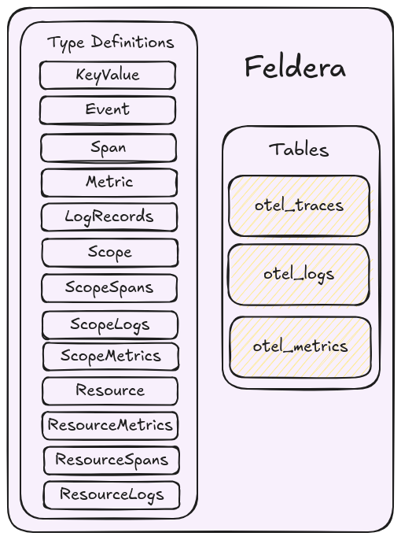
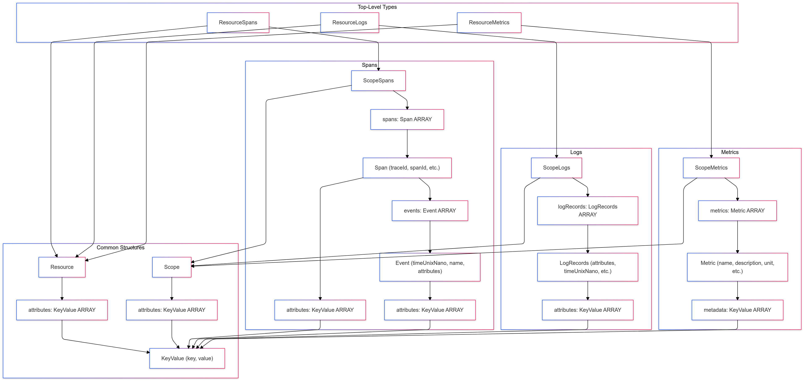

# Representing OTel Data



OpenTelemetry data is typically structured as nested JSON, which we can model as user-defined SQL types (see: [User Defined Types Docs](https://docs.feldera.com/sql/types#user-defined-types)) in Feldera
based on the [OTel Protobuf definitions](https://github.com/open-telemetry/opentelemetry-proto/tree/main/opentelemetry/proto).
While it is possible to represent the entire OTel JSON data as a `VARIANT` type ([VARIANT docs](https://docs.feldera.com/sql/json#the-variant-type)),
user-defined types are more efficient and ergonomic in cases when the JSON schema is known in advance.
Custom types also have a smaller memory footprint and offer better type checking.

Feldera SQL allows us to define these custom types as follows:

```sql
CREATE TYPE keyvalue AS (
    KEY VARCHAR,
    value VARIANT
);

CREATE TYPE event AS (
    timeunixnano CHAR(20),
    name VARCHAR,
    attributes keyvalue ARRAY
);

CREATE TYPE span AS (
    traceid VARCHAR,
    spanid VARCHAR,
    tracestate VARCHAR,
    parentspanid VARCHAR,
    flags BIGINT,
    name VARCHAR,
    kind INT,
    starttimeunixnano CHAR(20),
    endtimeunixnano CHAR(20),
    attributes keyvalue ARRAY,
    events event ARRAY
);

CREATE TYPE metric AS (
    name VARCHAR,
    description VARCHAR,
    unit VARCHAR,
    SUM VARIANT,
    gauge VARIANT,
    summary VARIANT,
    histogram VARIANT,
    exponentialhistogram VARIANT,
    metadata keyvalue ARRAY
);

CREATE TYPE logrecords AS (
    attributes keyvalue ARRAY,
    timeunixnano CHAR(20),
    observedtimeunixnano CHAR(20),
    severitynumber INT,
    severitytext VARCHAR,
    flags INT4,
    traceid VARCHAR,
    spanid VARCHAR,
    eventname VARCHAR,
    body VARIANT
);

CREATE TYPE scope AS (
    name VARCHAR,
    version VARCHAR,
    attributes keyvalue ARRAY
);

CREATE TYPE scopespans AS (
    scope scope,
    spans span ARRAY
);

CREATE TYPE scopelogs AS (
    scope scope,
    logrecords logrecords ARRAY
);

CREATE TYPE scopemetrics AS (
    scope scope,
    metrics metric ARRAY
);

CREATE TYPE resource AS (
    attributes keyvalue ARRAY
);

CREATE TYPE resourcemetrics AS (
    resource resource,
    scopemetrics scopemetrics ARRAY
);

CREATE TYPE resourcespans AS (
    resource resource,
    scopespans scopespans ARRAY
);

CREATE TYPE resourcelogs AS (
    resource resource,
    scopelogs scopelogs ARRAY
);
```

The following graph illustrates the type hierarchy of the custom types defined above:



Now that we have the type definitions to represent the OTel data, we create tables.

Tables in Feldera model input data streams.

```sql
-- concat with the type declarations above

-- Input table that ingests resource spans from the collector.
CREATE TABLE otel_traces (
    resourcespans resourcespans ARRAY
) WITH ('append_only' = 'true');

-- Input table that ingests resource logs from the collector.
CREATE TABLE otel_logs (
    resourcelogs resourcelogs ARRAY
) WITH ('append_only' = 'true');

-- Input table that ingests resource metrics from the collector.
CREATE TABLE otel_metrics (
    resourcemetrics resourcemetrics ARRAY
) WITH ('append_only' = 'true');
```


Feldera operates on changes, so any input may be an insertion or deletion.
Setting `'append_only' = 'true'`, allows Feldera to potentially optimize the programs better
and ensures only insertions are supported for this table.
