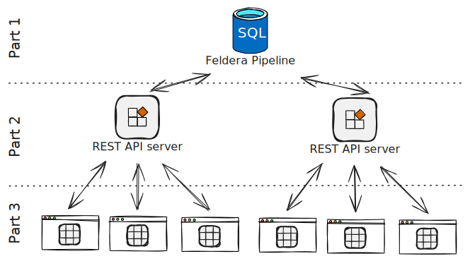

# Incremental, live web applications

In this three-part series, we’ll build a real-time, scalable, and incremental web application with Feldera by creating a collaborative online spreadsheet:

1. **Part 1 (this article):** Implement core spreadsheet logic using Feldera SQL.
2. **Part 2:** [Expose pipeline data to clients via a server](./part2.md).
3. **Part 3:** [Add a browser-based UI](./part3.md).



- The code is available in the [GitHub repo](https://github.com/feldera/techdemo-spreadsheet).

- Watch the Webinar accompanying this series on Youtube:

<LiteYouTubeEmbed id="ROa4duVqoOs" />

## Spreadsheets

Spreadsheets are everywhere (Excel, Google Sheets), and this use-case highlights how incremental computation helps with large spreadsheets (billions of cells) and many concurrent users:

- Cells can reference any other cell, making it hard to simply partition computation.
- Updates to one cell should only re-compute affected cells to avoid unncessary compute and network traffic.
- Formulas can perform arbitrary computations and chain references recursively.
- Clients view only small portions of the spreadsheet, so we only want to send relevant changes to them.

Feldera makes it easy to satisfy these requirements. Let’s start by building the “database” (our Feldera pipeline).

## A Spreadsheet Pipeline

To implement the spreadsheet in Feldera we'll:

1. Store cells in a table.
2. Determine which cells each cell references.
3. Retrieve values for those references.
4. Evaluate formulas using the referenced values.

Follow along in the Feldera Web-console or run Feldera locally or in our [online sandbox](/get-started). Create a new pipeline named `xls` and paste each SQL and Rust snippet into the Web-console.

:::info
The code used in this article is available in our [GitHub repository](https://github.com/feldera/techdemo-spreadsheet) in the `feldera` folder. While we’ll walk through each step here, you can also download the repository and follow the instructions in the README to deploy the pipeline.
:::

### Storing the Cells in a Table

We need a table to store cell content. Below is the SQL to create it:

```sql
create table spreadsheet_data (
    id bigint not null,
    ip varchar(45) not null,
    ts timestamp not null,
    raw_value varchar(64) not null,
    background integer not null
) with (
    'materialized' = 'true',
    'connectors' = '[{
        "transport": {
        "name": "datagen",
        "config": {
            "workers": 1,
            "plan": [{
                "limit": 4,
                "fields": {
                    "id": { "values": [0, 1, 2, 3] },
                    "raw_value": { "values": ["41", "1", "=B0", "=A0+C0"] }
                }
            }]
        }
    }
}]'
);
```

This table has:

* `id`: cell's id
* `ip`: the client’s IP
* `ts`: insertion timestamp
* `raw_value` cell content as written by the user
* `background`: cell background color

In the WITH clause:

* We declare the table as materialized, allowing ad-hoc queries.
* We use a datagen configuration to insert four cells with IDs 0, 1, 2, 3 and values 41, 1, =B0, and =A0+C0.

:::info
We’ll use two “coordinate systems” for cells: numeric IDs in the table and spreadsheet coordinates (letters for columns, numbers for rows). For example, B100 is the second column in row 100.

We currently limit columns to `A` through `Z`, covering numeric IDs from `0` to `1_040_000_000`. Thus, `A0` maps to cell id `0`, `Z0 → 25`, `A1 → 26`, and `Z39999999` → `1_040_000_000-1`.
:::

The four cells we added — IDs `0`, `1`, `2`, `3` — map to `A0`, `B0`, `C0`, and `D0`. When the pipeline is running, they should compute to `41`, `1`, `1`, and `42` respectively.

### Compute latest cells and find references of cells

In many database scenarios, you might expect a PRIMARY KEY on id. However, we want to keep a complete history of spreadsheet edits, so we allow multiple entries per id. This means we need a way to identify the latest value for any given cell, which we handle by looking at the timestamp (`ts`) we can do that by writing a new view for this subset of `latest_cells`.

We also need to discover if the cell references other cells (e.g., with a formula like `=A0+B0`). Extracting references from `raw_value` is tricky in SQL because it requires parsing spreadsheet formulas. To handle this, we define a Rust UDF called `mentions`, which returns an array of referenced cell IDs. Below the SQL view that uses the `mentions` function (which we’ll implement in Rust) and selects only the most recent cellll for each id in `spreadsheet_data`:

```sql
create function mentions(cell varchar(64)) returns bigint array;

create materialized view latest_cells as with
    max_ts_per_cell as (
        select
            id,
            max(ts) as max_ts
        from
            spreadsheet_data
        group by
            id
    )
select
    s.id,
    s.raw_value,
    s.background,
    ARRAY_APPEND(mentions(s.raw_value), null) as mentioned_cell_ids
from
    spreadsheet_data s
join max_ts_per_cell mt on s.id = mt.id and s.ts = mt.max_ts;
```

This SQL won’t compile yet because we haven’t implemented mentions. Here’s the Rust UDF code:

```rust
use std::collections::{BTreeMap, VecDeque};

use xlformula_engine::calculate;
use xlformula_engine::parse_formula;
use xlformula_engine::NoCustomFunction;
use xlformula_engine::types::{Formula, Value, Error, Boolean};
use chrono::DateTime;

// Returns a list of references for a spreadsheet formula
// `42 -> []` `=A0 -> [0]`, `=A0+B0 -> [0, 1]`
pub fn mentions(raw_content: Option<String>) -> Result<Option<Vec<Option<i64>>>, Box<dyn std::error::Error>> {
    let cell_content = raw_content.unwrap_or_else(|| String::new());
    let formula = parse_formula::parse_string_to_formula(&cell_content, None::<NoCustomFunction>);

    let mut formulas = VecDeque::from(vec![formula]);
    let mut references = vec![];

    while !formulas.is_empty() {
        let formula = formulas.pop_front().unwrap();
        match formula {
            Formula::Reference(reference) => {
                references.push(reference);
            },
            Formula::Iterator(iterator) => {
                formulas.extend(iterator);
            },
            Formula::Operation(expression) => {
                formulas.extend(expression.values);
            },
            _ => {}
        }
    }
    let mut cell_ids: Vec<Option<i64>> = references.iter().map(|r| cell_references_to_ids(r)).collect();
    cell_ids.sort_unstable();

    Ok(Some(cell_ids))
}

// Transforms spreadsheet coordinates to cell id's
// `A0 -> 0, B0 -> 1, C0 -> 2 ...`
fn cell_references_to_ids(crf: &str) -> Option<i64> {
    let mut col = 0;
    let mut row = 0;
    for c in crf.chars() {
        if c.is_ascii_alphabetic() {
            col = col * 26 + (c.to_ascii_uppercase() as i64 - 'A' as i64);
        } else if c.is_ascii_digit() {
            row = row * 10 + (c as i64 - '0' as i64);
        } else {
            return None;
        }
    }
    Some(col + row * 26)
}
```

We also add the following udf.toml to pull in crates from the Rust ecosystem:

```toml
xlformula_engine =  { git = "https://github.com/gz/XLFormula-Engine.git", rev = "3b39201" }
log = "0.4"
chrono = "0.4"
```

We use the [xlformula_engine](https://docs.rs/xlformula_engine) crate to parse formulas, like ``=A0+B0`, into a syntax tree:

```ascii
         Operation
       /          \
Reference(A0)   Reference(B0)
```

Our `mentions` function walks this tree and collects every Reference into a references array. A helper function, `cell_references_to_ids`, converts spreadsheet coordinates (e.g., `A0`, `B0`) to numeric cell IDs.

Once the UDF is in place, we can run the pipeline, activate the changestream for `latest_cells`, and observe output like this (some columns omitted):

| id  | raw_value | mentions       | ts                  |
| --- |:--------- |:-------------- |:------------------- |
| 0   | 41        | [ null ]       | 1970-01-01 00:00:01 |
| 1   | 1         | [ null ]       | 1970-01-01 00:00:02 |
| 2   | =B0       | [ null, 1 ]    | 1970-01-01 00:00:03 |
| 3   | =A0+C0    | [ null, 0, 2 ] | 1970-01-01 00:00:04 |

Notice null appears in every mentions array. This ensures the array isn’t empty for cells that don’t reference anything, preventing them from being excluded in future joins.

:::info

To see the latest_cells view in action, you can insert a newer value for cell 0:

```sql
insert into spreadsheet_data values (0, 0, '2025-01-01T00:00:00', '0', 0)
```

You should see two changes being emitted in the `latest_cell`
view, the removal of the cell with value `42` and a new cell with value `0`.

This setup also allows us to easily undo any changes made (by just deleting the most recent entry for a given cell).
:::

### Find the values of referenced cells

Now that we know which cells are referenced by any given cell, the next step is to retrieve the values of those referenced cells. Having both the referenced IDs and their values makes it straightforward to compute formulas later.

We accomplish this by:

* Unnesting the `mentions` array from `latest_cells`.
* Cross-joining the unnested `mentions` with `latest_cells`.
* Rejoining with `spreadsheet_data` to look up each referenced cell’s `raw_value`.

```sql
create view latest_cells_with_mentions as
select
    s.id,
    s.raw_value,
    s.background,
    m.mentioned_id
from
    latest_cells s, unnest(s.mentioned_cell_ids) as m(mentioned_id);
```

In the final line, we cross-join `latest_cells` with a new “table” created by `unnest` on the `mentions` array. Here’s how the view looks given our inserted data:

| id  | raw_value | mentioned_id |
| --- |:--------- |:------------ |
| 0   | 41        | null         |
| 1   | 1         | null         |
| 2   | =B0       | null         |
| 2   | =B0       | 1            |
| 3   | =A0+C0    | null         |
| 3   | =A0+C0    | 0            |
| 3   | =A0+C0    | 1            |

Next, we join this intermediate result with `spreadsheet_data` to find the `raw_value` for each `mentioned_id`:

```sql
create materialized view mentions_with_values as
select
    m.id,
    m.raw_value,
    m.background,
    m.mentioned_id,
    sv.raw_value as mentioned_value
from
    latest_cells_with_mentions m
        left join
    spreadsheet_data sv on m.mentioned_id = sv.id;
```

This produces the same view as above but with an added `mentioned_value` column:

| id  | raw_value | mentioned_id | mentioned_value |
| --- |:--------- |:------------ |:--------------- |
| 0   | 41        | null         | null            |
| 1   | 1         | null         | null            |
| 2   | =B0       | null         | null            |
| 2   | =B0       | 1            | 1               |
| 3   | =A0+C0    | null         | null            |
| 3   | =A0+C0    | 0            | =41             |
| 3   | =A0+C0    | 1            | =B0             |

Finally, we flatten this data by grouping `mentioned_id` and `mentioned_value` into arrays, producing one row per cell:

```sql
create materialized view mentions_aggregated as
select
    id,
    raw_value,
    background,
    ARRAY_AGG(mentioned_id) as mentions_ids,
    ARRAY_AGG(mentioned_value) as mentions_values
from
    mentions_with_values
group by
    id,
    raw_value,
    background;
```

This yields the following result:

| id  | raw_value | mentions_ids | mentions_values |
| --- |:--------- |:------------ |:--------------- |
| 0   | 41        | [ null ]     | [ null ]        |
| 1   | 1         | [ null ]     | [ null ]        |
| 2   | =B0       | [ 1 ]        | [ 1 ]           |
| 3   | =A0+C0    | [ 0, 1]      | [ 0, =B0 ]      |

### Evaluating Formulas

At this point, we have two arrays — `mentions_ids` and `mentions_values` — which let us map references in a cell’s formula to their corresponding values. To evaluate these formulas, we add a Rust UDF (`cell_value`), again leveraging the `xlformula_engine` crate.

First, we introduce a view that calls this UDF and produces a `computed_value` for each cell:

```sql
create function cell_value(cell varchar(64), mentions_ids bigint array, mentions_values varchar(64) array) returns varchar(64);

create materialized view spreadsheet_view as
select
    id,
    background,
    raw_value,
    cell_value(raw_value, mentions_ids, mentions_values) AS computed_value
from
    mentions_aggregated;
```

Below is the Rust code for our `cell_value` UDF (plus helper functions):

```rust
// Evaluates a formula "=A0+B0" and returns it's result
pub fn cell_value(raw_content: Option<String>, mentions_ids: Option<Vec<Option<i64>>>, mentions_values: Option<Vec<Option<String>>>) -> Result<Option<String>, Box<dyn std::error::Error>> {
    let cell_content = raw_content.unwrap_or_else(|| String::new());
    let formula = parse_formula::parse_string_to_formula(&*cell_content, None::<NoCustomFunction>);

    let mentions_ids = mentions_ids.unwrap_or_else(|| vec![]);
    let mentions_values = mentions_values.unwrap_or_else(|| vec![]);
    assert_eq!(mentions_ids.len(), mentions_values.len());
    let mut context = BTreeMap::new();
    for (id, value) in mentions_ids.into_iter().zip(mentions_values.into_iter()) {
        if let (Some(id), Some(value)) = (id, value) {
            context.insert(id_to_cell_reference(id), parse_as_value(value));
        }
    }
    let data_function = |s: String| context.get(&s).cloned().unwrap_or_else(|| Value::Error(Error::Value));

    let result = calculate::calculate_formula(formula, Some(&data_function));
    let result_str = calculate::result_to_string(result);
    Ok(Some(result_str))
}

// Parses a string to a xlformula Value type
// (Number, Date or String)
fn parse_as_value(input: String) -> Value {
    if let Ok(number) = input.parse::<f32>() {
        return Value::Number(number);
    }
    if let Ok(boolean) = input.parse::<bool>() {
        return Value::Boolean(if boolean { Boolean::True } else { Boolean::False });
    }
    if let Ok(date) = DateTime::parse_from_rfc3339(input.as_str()) {
        return Value::Date(date);
    }
    Value::Text(input)
}

// Transforms cell id's to spreadsheet coordinates
// e.g., 0 -> 'A0'
fn id_to_cell_reference(id: i64) -> String {
    let mut col = id % 26;
    let row = id / 26;
    let mut result = String::new();
    while col >= 0 {
        result.push((col as u8 + 'A' as u8) as char);
        col = col / 26 - 1;
    }
    result.push_str(&row.to_string());
    result
}
```

The UDF builds a `data_function` closure. When `calculate::calculate_formula` encounters a reference, the closure returns the referenced cell’s value from the arrays we passed in.

### It works, almost

If we take this code and run it, we'll find that it almost works. Looking at the `spreadsheet_view` output we see:

| id  | raw_value | computed_value |
| --- |:--------- |:-------------- |
| 0   | 41        | 41             |
| 1   | 1         | 1              |
| 2   | =B0       | 1              |
| 3   | =A0+C0    | #VALUE!        |

The system couldn't evalute the last formula.

### Resolve references recursively

Looking at the `mentions_aggregated` view, we see why cell 3 fails to compute:

| id  | raw_value | mentions_ids | mentions_values |
| --- |:--------- |:------------ |:--------------- |
| 3   | =A0+C0    | [ 0, 1 ]     | [ 0, =B0 ]      |

When the `compute_value` UDF tries to evaluate `C0` for the addition, it encounters `C0` as another reference to `B0`. Since `B0` isn’t in the original mentions array for cell 3, the UDF has no value for it.

Fortunately, Feldera SQL can do recursive queries to solve this. Instead of looking up raw values in `spreadsheet_data`, we can read computed values from `spreadsheet_view`. Although, we initially couldn’t do this (because `spreadsheet_view` didn’t yet exist, and `mentions_with_values` helps build it), recursion lets us reference a view before it’s fully defined.

Here’s how we update `mentions_with_values`:

```sql
create materialized view mentions_with_values as
select
    m.id,
    m.raw_value,
    m.background,
    m.mentioned_id,
    sv.compute_value as mentioned_value
from
    latest_cells_with_mentions m
        left join
    spreadsheet_view sv on m.mentioned_id = sv.id;
```

Note the three changes:

* We now get the final (evaluted) values for every cell:

  ```sql
  sv.compute_value as mentioned_value
  ```

* By reading them from `spreadsheet_view`:

  ```sql
  left join
      spreadsheet_view sv on m.mentioned_id = sv.id;
  ```

If you try to compile at this point, you’ll see:

```
Error in SQL statement:
Object 'spreadsheet_view' not found
   66|    spreadsheet_view sv on m.mentioned_id = sv.id;
          ^^^^^^^^^^^^^^^^
```

That’s because `spreadsheet_view` doesn’t exist when we define `mentions_with_values`. To fix this, add a **forward declaration** at the start of your program:

```sql
declare recursive view spreadsheet_view (
    id bigint not null,
    background integer not null,
    raw_value varchar(64) not null,
    computed_value varchar(64)
);
```

The compiler will also complain that the two views `mentions_with_values` and and `mentions_aggregated` need to be declared as `local` instead of materialized. This is because they can't be materialized when used as part of a recursive chain.
We can make those changes by replacing the `materialized` keyword with `local` in those two view declarations.

After recompiling and running, we'll see the following in the `spreadsheet_view` changestream:

| id  | raw_value | computed_value |
| --- |:--------- |:-------------- |
| 0   | 41        | 41             |
| 1   | 1         | 1              |
| 2   | =B0       | 1              |
| 3   | =A0+C0    | 42             |

Cell 3 is now computed correctly thanks to the recursion!

### Incremental recursive spreadsheets

Finally, let's confirm our incremental update promise: changing a single cell should trigger only minimal updates downstream.

We can test this by updating cell 0 again:


```sql
insert into spreadsheet_data values (0, 0, '2025-01-01T00:00:00', '0', 0)
```

Checking the `spreadsheet_view` changestream, we see just two cells affected:

| change | id  | raw_value | compute_value |
|:------ | --- |:--------- |:------------- |
| delete | 0   | 41        | 41            |
| delete | 3   | =A0+C0    | 42            |
| insert | 0   | 0         | 0             |
| insert | 3   | =A0+C0    | 1             |

### Conclusion

We’ve now built the core of our spreadsheet application. In [the next part](./part2.md) of this series, we’ll explore how to use Feldera’s API to serve this spreadsheet to clients, creating a publicly accessible API server.

:::info
If you compare the code in this article it with the code in the [repository](https://github.com/feldera/techdemo-spreadsheet/tree/main/feldera) you'll find that we omitted two additional views (to track API limits and statistics) for brevity.
:::
