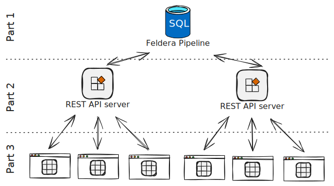

# Exposing Feldera Pipelines to many clients

This article is the second part of our series on building a billion cell spreadsheet in three parts:

1. **Part 1:** [Implement core spreadsheet logic using Feldera SQL](./part1.mdx).
2. **Part 2 (this article):** Expose pipeline data to clients via a server.
3. **Part 3:** [Add a browser-based UI](./part3.md).



Try the [live demo](https://xls.feldera.io) and see the [GitHub repo](https://github.com/feldera/techdemo-spreadsheet).

## Architecture

To make our spreadsheet accessible to multiple clients, we created a simple REST API server that acts as a layer between the Feldera pipeline and those clients.

The API server:

* Lets clients fetch cell content for a specified range and automatically receives updates when those cells change.
* Validates and forwards client updates to the pipeline.
* Is stateless, enabling easy scalability across many instances.

:::info
The code for this article is in the `server` folder of our [GitHub repository](https://github.com/feldera/techdemo-spreadsheet). Clone the repo and follow the README instructions to run and deploy the demo.
:::

## API Server

Our REST server is written in Rust using the [axum framework](https://docs.rs/axum/latest/axum/). The entry point is in the `main.rs` file:

```rust
#[tokio::main]
async fn main() {
    let _r = env_logger::try_init();

    let stats_subscription = feldera::subscribe_change_stream("spreadsheet_statistics", 128);
    let xls_subscription = feldera::subscribe_change_stream("spreadsheet_view", 4096);
    let api_limits = feldera::api_limit_table();

    let state = AppState {
        stats_subscription,
        xls_subscription,
        api_limits,
    };

    let app = Router::new()
        .route("/", get(|| async { "xls app!" }))
        .route("/api/stats", get(stats::stats))
        .route("/api/spreadsheet", get(spreadsheet::ws_handler))
        .route("/api/spreadsheet", post(spreadsheet::post_handler))
        .with_state(state);
    let listener = tokio::net::TcpListener::bind("0.0.0.0:3000").await.unwrap();
    axum::serve(
        listener,
        app.into_make_service_with_connect_info::<SocketAddr>(),
    )
    .await
    .unwrap();
}
```

Here are the two main tasks it handles:

- **Connect to change streams** of the Feldera pipeline: spreadsheet_view, spreadsheet_statistics, and api_limits. (If you’ve read the first article, you’re already familiar with spreadsheet_view.)
- **Start a web server** with three API endpoints:
    * GET /api/stats
    * GET /api/spreadsheets
    * POST /api/spreadsheets

We’ll focus on the spreadsheet endpoints and skip stats because it’s similar to fetching cell data (except it sends spreadsheet statistics).

### Sending Cell Data: `GET /api/spreadsheets`

This endpoint provides an initial snapshot of the requested Feldera spreadsheet cells, then streams any subsequent changes within that range to the client.

We use a WebSocket endpoint for a bidirectional connection, following a simple protocol:

1. **Client request** – The client requests a range of cells, sending for example: e.g., `{ from: 0, to: 4 }`

2. **Initial response** – The server returns the cell contents in ndjson format:

    ```json
    { id: 0, raw_value: 41, computed_value: 41 }
    { id: 1, raw_value: 1, computed_value: 1 }
    { id: 2, raw_value: '=B0', computed_value: 1 }
    { id: 3, raw_value: '=A0+C0', computed_value: 41 }
    ```

3. **Updates** – If cells within that range change, the server sends incremental updates:

    ```json
    { id: 0, raw_value: 0, computed_value: 0 }
    { id: 3, raw_value: 1, computed_value: 1 }
    ```

4. **Range changes** – The client can request a different range by sending a new JSON line with updated `from` and `to` values, receiving a fresh snapshot and corresponding updates.

The implementation resides in [spreadsheet.rs](https://github.com/feldera/techdemo-spreadsheet/blob/5abfb3aedc1ffa38b23341df2ed951726aef86f0/server/src/spreadsheet.rs#L46). It includes exhaustive error handling, so we’ll only show key snippets here.

The HTTP handler is brief: it upgrades the connection to WebSocket and calls `.subscribe()` on `xls_subscription` which listens to changes from Feldera’s spreadsheet_view.

```rust
pub(crate) async fn ws_handler(
    ws: WebSocketUpgrade,
    ConnectInfo(addr): ConnectInfo<SocketAddr>,
    State(state): State<AppState>,
) -> impl IntoResponse {
    debug!("{addr} connected.");
    ws.on_upgrade(move |socket| handle_socket(state.xls_subscription.subscribe(), socket, addr))
}
```

Let's look at the main logic which is in `handle_socket`. This function internally spawns **two asynchronous tasks**:

- **Client messages** – The first task listens for messages from the client in the form `{ from: x, to: y }`, indicating which cells the client wants. When such a request arrives, we send an [ad-hoc query](https://docs.feldera.com/api/execute-an-ad-hoc-sql-query-in-a-running-or-paused-pipeline) to Feldera to fetch that range and forward the result to the client:

```rust
match process_message(msg, who) {
ControlFlow::Continue(Some(region)) => {
    match adhoc_query(
        format!(
            "SELECT * FROM spreadsheet_view WHERE id >= {} and id < {}",
            region.from, region.to
        )
        .as_str(),
    )
    .await
    {
        Ok(snapshot) => {
            region_tx.send_replace(region);
            for line in snapshot.split('\n') {
                match change_fwder.send(line.to_string()).await {
                    Ok(_) => {}
                    Err(e) => {
                        warn!("Error sending change to sender task: {e}");
                        return cnt;
                    }
                }
            }
        }
        Err(e) => {
            warn!("Error querying spreadsheet_view: {e}");
            return cnt;
        }
    }
}
```

- **Change stream updates** – The second task listens to the `spreadsheet_view` change stream. If an update falls within the client’s requested cell range, it’s forwarded to the client:

```rust
let mut change_task = tokio::spawn(async move {
let mut cnt = 0;
loop {
    cnt += 1;
    match xls_changes.recv().await {
        Ok(Ok(change)) => match serde_json::from_str::<Cell>(&change) {
            Ok(cell) => {
                let region = { *region_rx.borrow_and_update() };
                if cell.id >= region.from && cell.id < region.to {
                    match change_fwder.send(change).await {
                        Ok(_) => {}
                        Err(e) => {
                            warn!("Error sending change to sender task: {e}");
                            return cnt;
                        }
                    }
                }
            }
            // ... omitted error handling
        },
    // ... omitted error handling
    }
}
});
```

#### Sending ad-hoc queries to Feldera

In the first task, the complexity of sending an [ad-hoc query](https://docs.feldera.com/api/execute-an-ad-hoc-sql-query-in-a-running-or-paused-pipeline) to Feldera is hidden behind the `adhoc_query` function. Below is the implementation.

```rust
pub(crate) async fn adhoc_query(sql: &str) -> Result<String, XlsError> {
    let url = format!("{}/v0/pipelines/{PIPELINE_NAME}/query", &*FELDERA_HOST);
    let client = Client::new();
    let response = client
        .get(url)
        .bearer_auth(&*FELDERA_API_KEY)
        .query(&[("sql", sql), ("format", "json")])
        .send()
        .await
        .map_err(XlsError::from)?;

    if !response.status().is_success() {
        return Err(XlsError::from(format!(
            "Failed to fetch data: HTTP {}: {:?}",
            response.status(),
            response.text().await.unwrap_or_else(|e| e.to_string())
        )));
    }

    let body = response.text().await.map_err(XlsError::from)?;

    Ok(body)
}
```

Here, we send an HTTP request to the `/query` endpoint of the Feldera instance, including the [auth token](https://docs.feldera.com/tutorials/rest_api/#setup). We specify the SQL query and response format, and Feldera returns a set of ndjson lines—one for each row in the result.

#### Connecting to change streams in Feldera

Similarly, the second task listens for spreadsheet changes from a broadcast channel in `match xls_changes.recv().await`. We saw this mechanism in the first article while exploring the changestream through the Webconsole. Now, we're programmatically fetching the same updates in Rust.

Recall the [line that connects to the change stream](https://github.com/feldera/techdemo-spreadsheet/blob/5abfb3aedc1ffa38b23341df2ed951726aef86f0/server/src/main.rs#L25) in main:

```rust
let xls_subscription = feldera::subscribe_change_stream("spreadsheet_view", 4096);
```

When we look at the implementation of `subscribe_change_stream`:

```rust
pub(crate) fn subscribe_change_stream(
    view_name: &str,
    capacity: usize,
) -> Sender<Result<String, XlsError>> {
    let (tx, _) = tokio::sync::broadcast::channel(capacity);
    let subscribe = tx.clone();
    let client = Client::new();
    let url = format!(
        "{}/v0/pipelines/{PIPELINE_NAME}/egress/{view_name}",
        &*FELDERA_HOST
    );
    let view = String::from(view_name);

    tokio::spawn(async move {
        loop {
            let response = client
                .post(url.clone())
                .bearer_auth(&*FELDERA_API_KEY)
                .header("Content-Type", "application/json")
                .query(&[
                    ("format", "json"),
                    ("backpressure", "false"),
                    ("array", "false"),
                ])
                .send()
                .await;

            match response {
                Ok(resp) if resp.status().is_success() => {
                    let stream = resp
                        .bytes_stream()
                        .map_err(|e| io::Error::new(io::ErrorKind::Other, e));
                    let reader = tokio_util::io::StreamReader::new(stream);
                    let mut decoder = tokio_util::codec::FramedRead::new(
                        reader,
                        tokio_util::codec::LinesCodec::new(),
                    );

                    while let Some(line) = decoder.next().await {
                        match line {
                            Ok(line) => {
                                match serde_json::from_str::<Record>(&line) {
                                    Ok(record) => {
                                        'inner: for change in
                                            record.json_data.unwrap_or_else(|| vec![]).iter().rev()
                                        {
                                            if let Change::Insert(value) = change {
                                                let mut value_str = value.to_string();
                                                value_str.push('\n');
                                                if tx.send(Ok(value_str)).is_err() {
                                                    break 'inner;
                                                }
                                            }
                                        }
                                    }
                            // ... omitted error handling
            }

            warn!("Lost connection to change stream at {url}, wait 10 seconds before retrying to get changes again");
            tokio::time::sleep(Duration::from_secs(10)).await;
        }
    });

    subscribe
}
```

we see that:

- **A new broadcast channel** is created, allowing multiple readers and a single writer to distribute changes internally in our server application.
- We connect to the change stream using the [Feldera egress endpoint](https://docs.feldera.com/api/subscribe-to-a-stream-of-updates-from-a-sql-view-or-table)
- We read and parse changes from the resulting HTTP stream sent by Feldera. Changes appear as ndjson and have the following format

    ```json
    { sequence_number: 1, json_data: [
        { insert: { id: 0, raw_value: 0, computed_value: 0 }},
        { delete: { id: 0, raw_value: 42, computed_value: 42 }},
        { delete: { id: 3, raw_value: '=A0+C0', computed_value: 42 }},
        { insert: { id: 3, raw_value: '=A0+C0', computed_value: 1 }}
    ]}
    ```
- Only `insert` records are passed to our broadcast channel, so active client subscriptions receive just the relevant updates (this is sufficient in our case because we only overwrite cells).

### Editing Cells: `POST /api/spreadsheets`

To let clients update cells, we add a POST endpoint that writes new cell content to `spreadsheet_table` in Feldera. Compared to retrieving cells, this API [is just a few lines of code](https://github.com/feldera/techdemo-spreadsheet/blob/5abfb3aedc1ffa38b23341df2ed951726aef86f0/server/src/spreadsheet.rs#L225):

```rust
pub(crate) async fn post_handler(
    headers: HeaderMap,
    ConnectInfo(addr): ConnectInfo<SocketAddr>,
    State(state): State<AppState>,
    Json(update_request): Json<UpdateRequest>,
) -> impl IntoResponse {
    // Load balancer puts the client IP in the HTTP header
    const CLIENT_IP_HEADER: &str = "Fly-Client-IP";
    let client_ip = headers.get(CLIENT_IP_HEADER).map(|ip| {
        String::from_utf8_lossy(ip.as_bytes()).chars().take(45).collect::<String>()
    }).unwrap_or(addr.ip().to_string().chars().take(45).collect::<String>());

    if state.api_limits.contains(&client_ip) {
        return (
            axum::http::StatusCode::INTERNAL_SERVER_ERROR,
            Json(serde_json::json!({"error": "API limit exceeded"})),
        );
    }
    if !UpdateRequest::ID_RANGE.contains(&update_request.id) {
        return (
            axum::http::StatusCode::BAD_REQUEST,
            Json(serde_json::json!({"error": "Invalid cell ID"})),
        );
    }
    let raw_value = update_request.raw_value.chars().take(64).collect::<String>();

    let payload = UpdatePayload {
        id: update_request.id,
        raw_value,
        background: update_request.background,
        ip: client_ip,
        ts: Utc::now().format("%Y-%m-%d %H:%M:%S%.3f").to_string(),
    };

    insert("spreadsheet_data", payload).await
}
```

Here’s what happens:

* We get the client’s IP address.
* We check if the IP is under rate limit. We haven't discussed rate limiting but it's actually quite simple to implement it thanks to writing it [as a Feldera view](https://github.com/feldera/techdemo-spreadsheet/blob/5abfb3aedc1ffa38b23341df2ed951726aef86f0/feldera/program.sql#L118) based on the `spreadsheet_data` table.
* We sanitize the input and add a timestamp.

Finally, we [insert](https://github.com/feldera/techdemo-spreadsheet/blob/5abfb3aedc1ffa38b23341df2ed951726aef86f0/server/src/feldera.rs#L159) the data using a REST call to the [Feldera ingress endpoint](https://docs.feldera.com/api/push-data-to-a-sql-table).

## Comments on Hosting

We deploy this application on [fly.io](https://fly.io). Follow the instructions in the [README](https://github.com/feldera/techdemo-spreadsheet/blob/main/README.md) to host your own instance or run it locally. In principle, any hosting provider will work. However, for real-time Feldera applications, we generally recommend avoiding serverless platforms:

- **Shared resources** – A dedicated instance can maintain a single connection to Feldera’s changestream. In serverless environments, each request might open its own connection, increasing bandwidth consumption and pipeline load.
- **Long-lived connections** – This demo uses long-running HTTP connections. Serverless platforms often limit connection duration, making reconnect logic necessary and adding unnecessary complexity.

## Conclusion

In this article, we walked through how to expose spreadsheet data to multiple clients via a simple REST server, including the logic for handling ad-hoc queries, real-time change streams, and editing cells. By leveraging Rust, Axum, and Feldera’s APIs, we can efficiently broadcast updates to any number of clients. In [the final part](./part3.md) of this series, we’ll explore adding a browser-based UI, completing our billion-cell spreadsheet solution.
