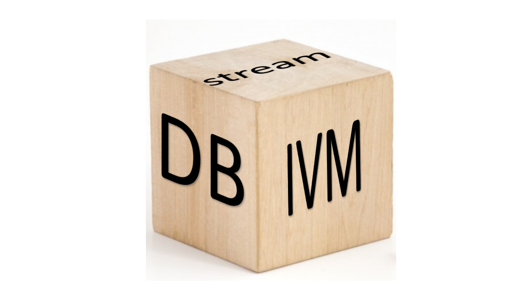

In this blog we will provide technical information related to the
products and technologies produced
[feldera.com](https://www.feldera.com).  Feldera is an early-stage
start-up that builds an incremental streaming query engine.
Significant parts of the software produced by Feldera is available
using liberal open-source licenses on
[github](https://github.com/feldera/dbsp).

We believe that what makes our software valuable is the fact that it
brings together in a seamless way several independent technologies:

- (database) query engines
- incremental computation
- streaming computation

There certainly are many companies and products that offer one or more
of these 3 features.  However, most of the existing tools make
sacrifices in one of these directions.  For example, streaming
databases tend to offer restricted query engines, or to support
incremental computations only for restricted forms of queries.

We will start this blog with a series of articles explaining how these
three seemingly disparate concepts can be unified in very natural way,
and how one can build a tool that provides all these features without
compromising in any of these dimensions.  In the figure below IVM
stands for *Incremental View Maintenance*, which is a form of
incremental computation provided by databases.

