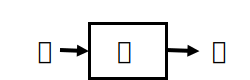
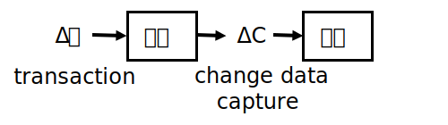

# Incremental computation

*Incremental computation* refers to computations that attempt to
reuse results that were previously computed.

Let us assume you have a program $P$ that is given an input $I$ and
produces an output $O$:



Now let's change the input by *modifying* it with some change, which
we denote by $\Delta I$:


We would like to avoid computing the entire output again, and ideally
reuse the previously computed $O$ and only adjust it by a change
$\Delta O$.  This would be great especially if the output doesn't
*change* much.

This sounds nice, but is very vague.  To make this work we have to
explain what a __change__ is (what we denoted by $\Delta$) and what it
means to change something (what we denoted by $+$).  For
general-purpose computations this in general makes no sense, but it
works very well in some important domains.

## Changes in documents

If you have used [change
tracking](https://support.microsoft.com/en-us/office/track-changes-in-word-197ba630-0f5f-4a8e-9a77-3712475e806a)
in Microsoft Word, you have encountered a version of changes.  Here is
a screenshot of Word showing changes to short document:


Word keeps track of the changes by looking at your keystrokes and
recording what is being deleted (shown with a ~~strikethrough~~) or
inserted (shown as underlined).  Notice that Word doesn't attempt to
show the minimal changes performed -- which could be shown just by the
deletion of the apostrophe `'` in *it's*, but it rather mirrors the
actions you have performed to change the document.

Change tracking is such a useful feature in Word because it allows
readers to avoid reading a whole edited document to discover what has
changed.  In general

> change tracking is mostly useful when changes are expected to be
  *small* compared to the modified object

## Changes in programs

Most programmers have encountered a natural notion of change: since
programs evolve constantly, one often speaks about the changes between
two versions of a program.  Important activities of programmers, such
as [code reviews](https://en.wikipedia.org/wiki/Code_review), often
only look at changes in programs.

There are specific tools, like
[diff](https://en.wikipedia.org/wiki/Diff) which compute changes
between text files.  Here is an example from the above Wikipedia page:

```console
$ diff original new
0a1,6
> This is an important
> notice! It should
> therefore be located at
> the beginning of this
> document!
>
11,15d16
< This paragraph contains
< text that is outdated.
< It will be deleted in the
< near future.
17c18
< check this dokument. On
---
> check this document. On
```

Here both `original` and `new` are text files.  The `diff` tool
operates on *lines*, and shows how lines in one file have to be
modified to generate the second file.  The tool `diff` describes the
difference as a set of *additions*, (abbreviated `a`), *deletions*
(`d`) and changes (`c`).  The above output shows that to change file
`original` into `new` one has to add 6 lines at starting from line 0,
delete lines 11 to 15, and then replace line 17.  The `<` sign points
to lines in the left file (`original`), while the `>` sign points to
lines in the right file.

Notice that the difference between two files can be described in
multiple ways: another way would be to delete everything in the first
file and then add everything in the second file.  The `diff` tool
tries to find a *small* set of changes, modifying as few lines as
possible.  Also, unlike Word, `diff` does not show character changes,
only full line changes.

Also, notice that `diff` changes are described as being composed of
multiple simpler changes: the example contains one insertion, one
deletion, and one modification.

`diff` can compare not only two files but it can also compare multiple
files at once.  Entire files can be inserted, deleted, renamed, or
changed individually.  Another tool,
[patch](https://en.wikipedia.org/wiki/Patch_(Unix)) can use such a
description to convert a set of old file versions into a set of newer
ones.

> Changes can be hierarchical: changes to complex objects can be
  described from changes to simpler ones

## Data and changes

Notice that we are dealing with two different kinds of structures: the
changed objects (e.g., files), and the changes between objects
(deltas, or diffs).  (One can store a change in a text file, but it's
really a different object.)

Let's call these two data structures $D$ for data, and $\Delta$ for
changes.  First we have a *diff* operation $D - D \to \Delta$: where
we use minus for the *diff*.  The diff between two data values is a
change.

We also have an inverse operation: $D + \Delta \to D$, which changes
some data by *applying* a change.  There is also a notion of an *empty
change*, which is the difference between two identical data values.

## Changing numbers

In some circumstances the data and the changes can look similar.
Consider the case of a bank account.  The value of the account is a
dollar amount -- a number.  At the end of each month we get a bank
statement describing the change in the value of the account: also a
number.  For bank accounts the changes can be both positive and
negative, but, unless you have overdraft protection, the amounts are
always positive.

This is another important lesson: applying a change to a legal data
value may not produce another legal data value.  Removing $10 from
your bank account is a legal change if you have $20, but not if you
have only $5 left.  So the validity of a change cannot be evaluated in
isolation, you have to know *what* is being changed.  Only the
application domain can decide that.

For this case the structures $D$ and $\Delta$ are identical: you can
represent both the data and the changes as numbers (but you must
include negative numbers if you want to represent all possible
changes).  *Empty* data and *empty* changes are both the number zero.
This is very convenient.  We will show up in a future blog post that
we can take advantage of this nice property even when we don't handle
just numbers.

## Databases and changes

Databases are an application domain where changes are actually
central.  Changes appear in databases in two guises, which look very
dissimilar superficially, which we describe below.  We think that this
is a historical mistake, and the two notions should be unified.

### Transactions

A database is a set of tables.  To simplify the discussion, let us
assume that the database schema does not change - i.e., the set of
tables is fixed.  (This discussion *can* handle schema changes as
well, but let's keep it simple.)  A change to the database can be
described by a set of changes, one to each table, similar to the way a
patch contains changes to multiple files.

What is a change to a table?  It is a set of insertions, deletions, or
updates to the table's rows.  Every time you execute a SQL statement
such as [INSERT](https://www.w3schools.com/sql/sql_insert.asp):
```SQL
INSERT INTO PEOPLE VALUES('John', 2)
```
you are in fact describing a *change* to that table (`PEOPLE`, in this example).
These are the simplest changes that one can apply to a table.

Similar to the way a diff change is described by multiple simple
changes, in a database real changes are described by *transactions*
which group multiple changes together.

This is an important concept, so let us highlight it:

> Transactions describe database changes

Transactions do many other things, like isolation, durability, etc,
but here we care only about their ability of describing changes that
are applied together.

As we observed previously, it is possible to describe changes that are
not always legal, such as deleting a row that doesn't exist from a
table, or inserting a row that duplicates a primary key.  Attempting
to execute such a change in a transaction will usually result in the
entire transaction being aborted.

### Change data capture

There are many applications where one would like to know what has
changed in a database.  Companies are developing sophisticated
products for this purpose, that are sold under the name [Change Data
Capture, or CDC](https://en.wikipedia.org/wiki/Change_data_capture).
A typical application of CDC is mirroring (copying) the data of a
database into a remote database for disaster recovery.  You don't want
to periodically copy all the data, but you would rather send the
changes continuously, as they happen.  So you install a CDC system in
the source database, which sends the changes to the second database,
which applies them to its contents.

> CDC describe database changes

So a diagram of the system looks roughly like this:



Notice that transactions and CDC really have the same definition.  In
practice, however, they work in completely different ways.
Transactions are expressed using SQL statements grouped into programs,
while CDC is usually expressed in a complex format (perhaps encoded as
JSON), which describes also the changes in terms of simple changes.
Recovering transactions from CDC is usually a very involved process.

We believe that in ideal world CDC and changes described by
transactions should be described in the same language.  But legacy
systems are very hard to change, so it may be a long time before this
happens.  But it is still very important to understand this conceptual
relationship.  In future articles we will show why unifying these two
concepts can have some unexpected benefits.
