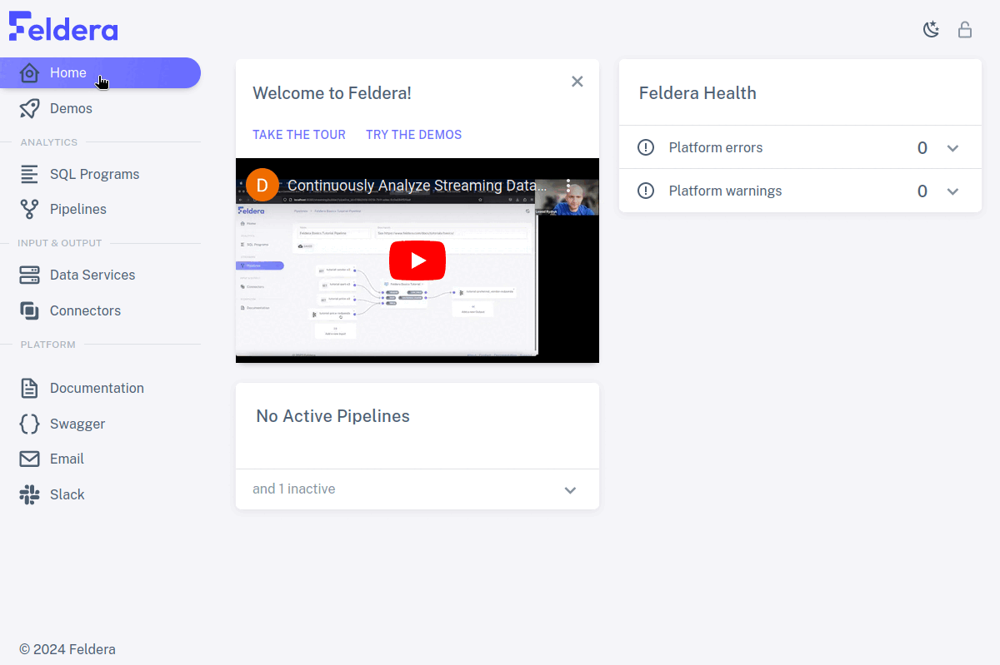
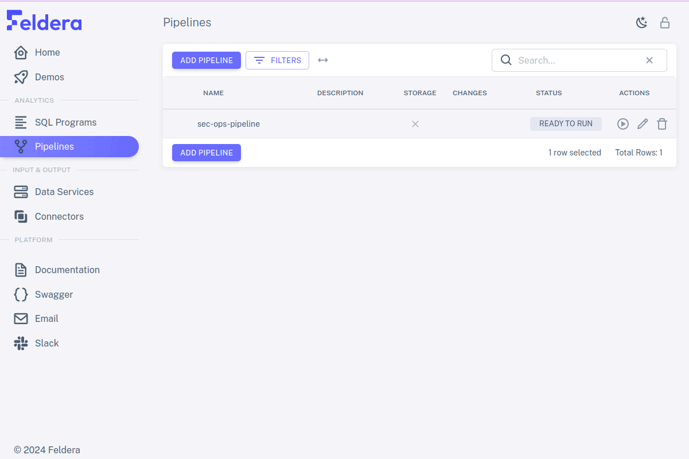
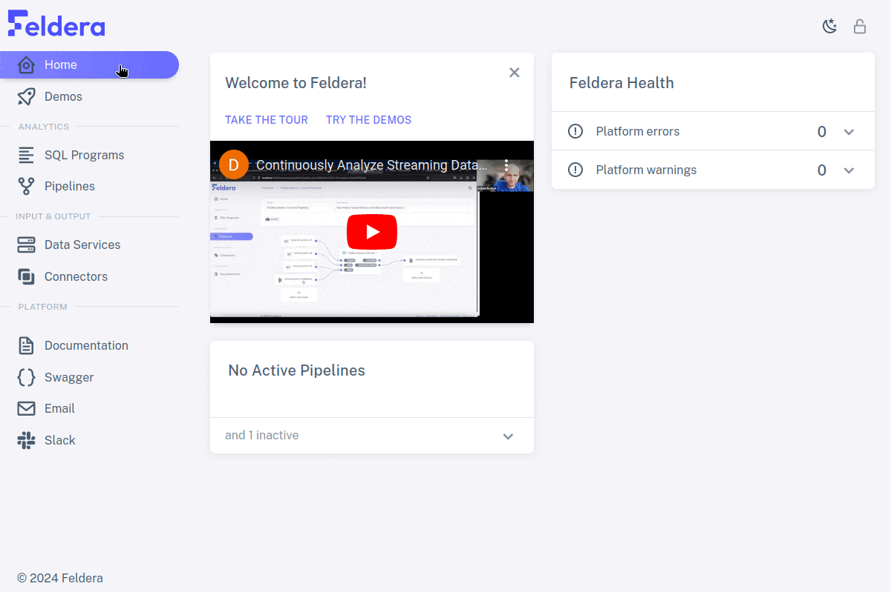

# Concepts

Feldera processes queries and produces output continuously.  When
input arrives, Feldera recomputes query results and sends the changes
to outputs.  Feldera queries are written in SQL, so users who have an
existing investment in analyzing data at rest with a SQL database can
use much of the same code to analyze data continuously with Feldera.

## Incremental processing

Feldera is fundamentally **incremental** in how it handles input,
computation, and output.

For input, being incremental means that Feldera processes data as it
arrives. Feldera does not require all of the data to be on hand before
beginning computation.

For computation, being incremental means that when new data arrives,
Feldera does a minimal amount of work to update query results, rather
than by fully recomputing them. This is much faster than fully
recomputing queries from scratch.

For output, being incremental means that Feldera outputs query results
as sets of changes from the previous output. This improves performance
and reduces output size.

# Programs

Feldera programs are written in SQL.  `CREATE TABLE` statements
specify the format of data, and `CREATE VIEW` statements specify
transformations and computations.  Views may draw data from tables and
from other views.  Feldera provides powerful SQL analysis features,
including time-series operators.

# Connectors

Feldera tables and views can work with data using HTTPS, Kafka,
Debezium, Snowflake, Delta Lake, S3, and other protocols.  New
connectors can easily be written to interface with whatever data
sources and sinks a user would find most convenient.  For testing,
Feldera even provides an input connector that generates data on the
fly.  Data connections are specified right in SQL source.

# Pipelines

A running program in Feldera continuously pulls data from sources,
runs it through a computation, and pushes the results to sinks.  The
user can start, stop, manage, and monitor pipelines.

# Foundation

Feldera is the pioneering implementation of a new theory that unifies
databases, streaming computation, and incremental view maintenance,
written by the inventors of that theory. See our
[publications](/papers) for all the details.

Feldera code is available on [Github][Feldera] using an MIT
open-source license. It consists of a Rust runtime and a SQL compiler.

[Feldera]: https://github.com/feldera/feldera
