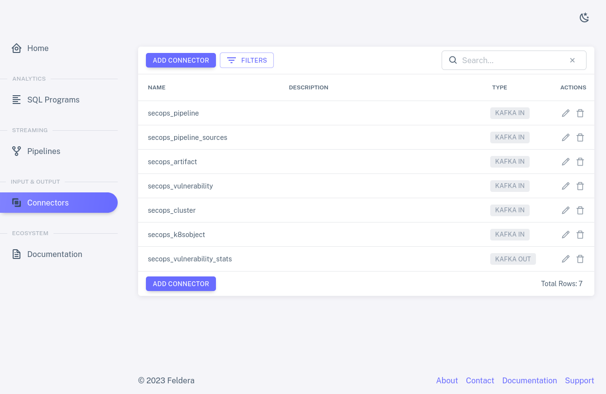
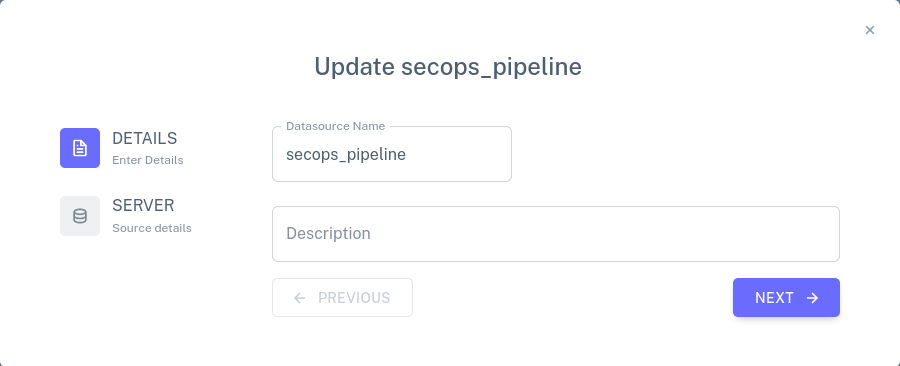
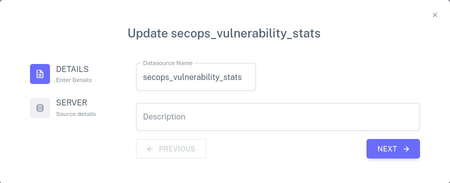

# Demo

This section provides a detailed walkthrough of the "developer
security operations" (DevSecOps) scenario included in the demo
container.  This scenario uses the Feldera Platform to analyze streams
of data about software as it is transformed from source code to binary
artifacts through CI build pipelines and deployed using Kubernetes.

The data streams also report vulnerabilities discovered in software
source code.  Our goal is to link source code vulnerabilities to the
binaries built from them directly or indirectly, to Kubernetes images
built using those vulnerable binaries, and to Kubernetes clusters
running those vulnerable images.

To follow along, set up the containers using the instructions in [Get
Started](../intro).  It's also a good idea to take the [Tour](../tour)
to familiarize yourself with Feldera concepts and user interface.

## Tables

We'll start by looking at how the DevSecOps demo defines its input
tables using SQL.  Fire up the Feldera Platform demo and visit
<http://localhost:8085/> to bring up the UI.  On the sidebar, click on
"SQL Programs", then find the "SecOps demo" row in the table of
programs and click on the pencil icon <icon icon="bx:pencil" />.  The
SQL `create table` statements at the top of the program establish the
schema and relationships shown above.

The following list describes the meaning of a record in each table:

* `pipeline`, a run of the CI build system.

* `pipeline_sources`, which links a `pipeline` with the source code
  that it used.

* `vulnerability`, a vulnerability in a `pipeline_sources`.

* `artifact`, the output from a `pipeline` and possibly a parent
  `artifact`.

* `k8sobject`, a Kubernetes image built from an `artifact`.

* `k8scluster`, a deployment of a `k8sobject`.

To see a visualization of the relationships between tables, expand the
following.

E-R diagram

```mermaid
erDiagram
    pipeline {
        bigint pipeline_id PK
        timestamp create_date
        timestamp update_date
    }
    pipeline_sources {
        bigint pipeline_id FK
        bigint git_commit_id
    }
    artifact {
       string artifact_id PK
       varchar artifact_uri
       timestamp create_date
       bigint builtby_pipeline_id FK
       bigint parent_artifact_id FK
       varchar checksum
    }
    vulnerability {
        bigint vulnerability_id PK
        timestamp discovery_date
        bigint discovered_in FK
        int severity
        varchar priority
    }
    k8scluster {
        bigint k8scluster_id PK
        varchar k8s_uri
        varchar name
    }
    k8sobject {
        bigint k8sobject_id PK
        bigint artifact_id FK
        timestamp create_date
        timestamp update_date
        varchar checksum
        bigint deployed_id FK
    }
    pipeline ||--|| pipeline_sources : "has sources"
    k8sobject ||--|| artifact : "built from"
    k8sobject ||--o{ k8scluster : "deployed as"
    vulnerability ||--|| pipeline_sources : "discovered in"
    artifact ||--o| artifact : "parent artifact"
    artifact ||--|| pipeline : "built by pipeline"
```

## Views

Now let's see how the SQL program uses views to produce output.
Scroll down in the SQL code pane that was already visible, past the
`create table` statements at the top, until the `create view`
statements are visible.  These statements go beyond what the tables
directly tell us only about vulnerabilities in particular Git commits.
Starting from that information, the views report the following:

* `pipeline_vulnerability`: Vulnerabilities in each `pipeline_sources`
  record.

* `artifact_vulnerability`: Direct vulnerabilities in each `artifact`.

* `transitive_artifact_vulnerability`: Vulnerabilities in each
  `artifact` or its chain of parents.
  
* `k8sobject_vulnerability`: Vulnerabilities in each `k8sobject`.

* `k8scluster_vulnerability`: Vulnerabilities in each `k8scluster`.

* `k8sobject_vulnerability_stats`: Statistics about vulnerabilities.

To see a visualization of the relationships between tables and views,
expand the following, which shows table names in lowercase and view
names in uppercase:

E-R diagram of tables and views

```mermaid
erDiagram
    pipeline ||--|| pipeline_sources : "has sources"
    k8sobject ||--|| artifact : "built from"
    k8sobject ||--o{ k8scluster : "deployed as"
    vulnerability ||--|| pipeline_sources : "discovered in"
    artifact ||--o| artifact : "parent artifact"
    artifact ||--|| pipeline : "built by pipeline"
    PIPELINE_VULNERABILITY ||--|| pipeline_sources : ""
    PIPELINE_VULNERABILITY ||--|| vulnerability : ""
    ARTIFACT_VULNERABILITY ||--|| artifact : ""
    ARTIFACT_VULNERABILITY ||--|| PIPELINE_VULNERABILITY : ""
    TRANSITIVE_ARTIFACT_VULNERABILITY ||--|| artifact : ""
    TRANSITIVE_ARTIFACT_VULNERABILITY ||--|| ARTIFACT_VULNERABILITY : ""
    K8SOBJECT_VULNERABILITY ||--|| k8sobject : ""
    K8SOBJECT_VULNERABILITY ||--|| TRANSITIVE_ARTIFACT_VULNERABILITY : ""
    K8SCLUSTER_VULNERABILITY ||--|| k8sobject : ""
    K8SCLUSTER_VULNERABILITY ||--|| K8SOBJECT_VULNERABILITY : ""
    K8SOBJECT_VULNERABILITY_STATS ||--|| K8SCLUSTER_VULNERABILITY : ""
    K8SOBJECT_VULNERABILITY_STATS ||--|| vulnerability : ""
    K8SOBJECT_VULNERABILITY_STATS ||--|| k8scluster : ""

```

## Pipeline

To view the DevSecOps pipeline, on the sidebar, click on Pipelines,
then on the pencil icon <icon icon="bx:pencil" /> next to SecOps Pipeline.  This displays the
pipeline structure, including the program and how it is attached to
connectors:

Only one of the views is attached to an output connector.  Attaching
tables and views to connectors is optional.  An unattached table won't
receive any data, and an unattached view won't send its output
anywhere.  We can still add data to tables and see the output to views
in the web console.

## Connectors

We saw the pipeline's input and output connectors.  Let's take a
closer look.

Click on "Connectors" on the sidebar to bring up the list of
connectors.  Now the input and output connectors in the pipeline are
listed in a table:

### Input connectors

Let's look at an input connector.  We can tell that most of the rows
in the list are input connectors because their `TYPE` is shown as
`KAFKA IN`.  Click on the pencil icon <icon icon="bx:pencil" /> on the
`secops_pipeline` row.  A dialog should pop up like the one below,
which allows the input connector's name and description to be edited.

Click on the Next button to bring up a second dialog for the
connector.  This dialog allows the connector's Kafka connection
details to be updated: one can specify how to connect to the Kafka
server, whether to read all of the data or only newly arriving data,
and which Kafka topics to read.

Close the dialog without making any changes, by clicking on the X in
the upper-right corner.

### Output connector

Now let's look at the output connector.  The only output connector on
the list is `secops_vulnerability_stats`.  Click on the pencil
icon<icon icon="bx:pencil" /> on its row.  This brings up a dialog
like the one for an input connector:

Click on the Next button to bring up a second dialog.  Here, one may
specify how to connect to a Kafka server, as for a Kafka input
connector, and the name of a topic.

Close the dialog without making any changes, by clicking on the X in
the upper-right corner.

## Running the Pipeline

Let's take a look at how the vulnerability statistics can evolve as we
feed data into the pipeline.  From the Pipelines tab, click on the
play icon.  Wait a few seconds for the pipeline to start running, then
click on <icon icon="material-symbols:expand-more" /> to expand the
list of input and output connectors, then on the eye on the row for
`K8SCLUSTER_VULNERABILITY_STATS`.  The page refreshes to show the data
in the view.  It should look something like this:

The data on the page should refresh periodically, with the numbers
changing each time.

You can view input to other tables and output to other views by
selecting them from the Relation drop-down at the top of the page. If
you select `PIPELINE`, for example, you should see fast-changing data
similar to the following:

