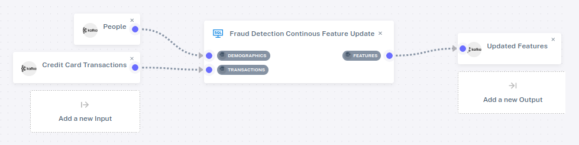

# Fraud Detection

This demo uses the same input schema and input data as the [Time
Series Enrichment](time-series-enrich) demo that we've already seen,
but it analyzes it in a more sophisticated way.  Whereas the previous
demo did a simple join, this does a more sophisticated join using
time-series analysis.  The goal is to produce features that could be
used in machine learning for detecting fraud.

To see the SQL for the fraud detection example, start the Feldera Platform demo,
visit <http://localhost:8085/>, click on "SQL Programs" in the
sidebar, and then click on the pencil icon next to Fraud Detection
Continous Feature Update.  It shows a SQL program similar to the one
for Time Series Enrichment, but with a more sophisticated join in the
view.

If you click on Pipeline Management, then on the pencil icon next to
Fraud Detection Features Pipeline, you will see the following pipeline
structure:

