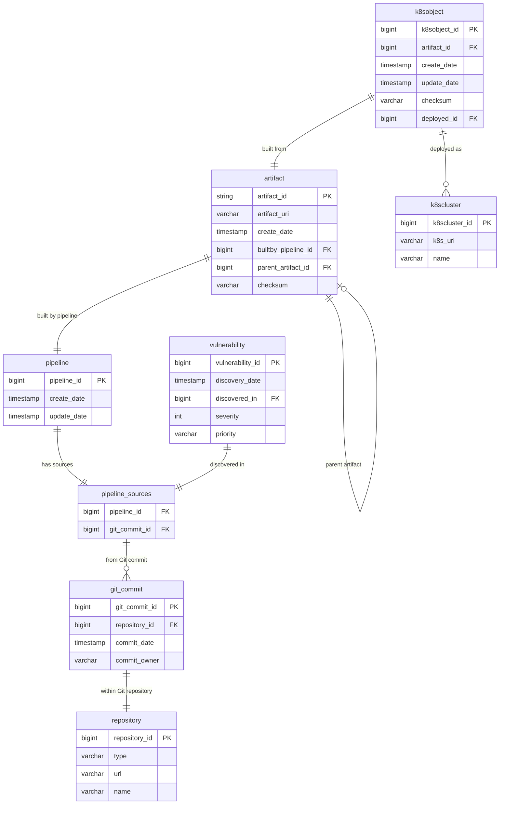

# Developer Security Operations

This demo walks through a developer security operations (DevSecOps)
scenario.  This scenario uses DBSP to analyze streams of data about
software as it is transformed from source code to binary artifacts
through CI build pipelines and deployed using Kubernetes.

The data streams also report vulnerabilities discovered in software
source code.  Our goal is to link source code vulnerabilities to the
binaries built from them directly or indirectly, to Kubernetes images
built using those vulnerable binaries, and to Kubernetes clusters
running those vulnerable images.

## Schema

Suppose each record in `pipeline` represents a run of the CI build
pipeline, using sources associated with the pipeline via
`pipeline_sources`, each record in which is associated with a Git
commit in `git_commit`, which in turn is drawn from a Git repository
represented as `repository`.  When a vulnerability is discovered, a
`vulnerability` record associates it with `pipeline_sources`.

A pipeline produces `artifact`s, which may in turn have further
`artifact`s derived from them.  A Kubernete image, represented by
`k8sobject` draws on a particular artifact, and can be deployed as
any number of Kubernetes clusters, represented by `k8scluster`.

The following diagram illustrates these relationships:

