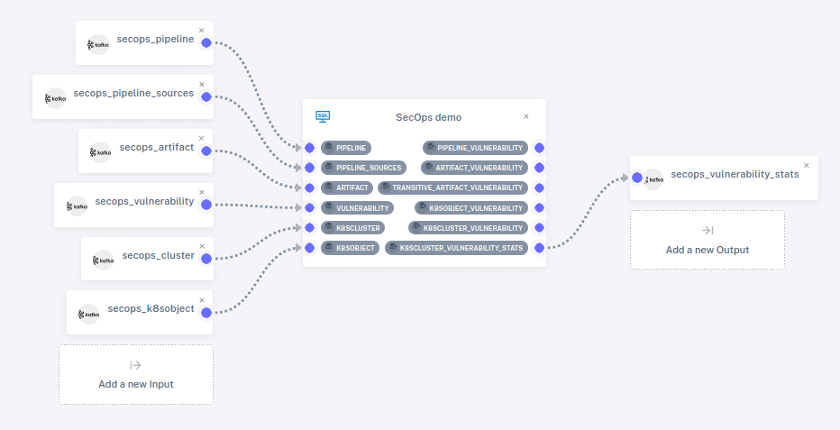

# Developer Security Operations

This demo walks through a developer security operations (DevSecOps) scenario.
This scenario uses the Feldera Platform to analyze streams of data about
software as it is transformed from source code to binary artifacts through CI
build pipelines and deployed using Kubernetes.

The data streams also report vulnerabilities discovered in software
source code.  Our goal is to link source code vulnerabilities to the
binaries built from them directly or indirectly, to Kubernetes images
built using those vulnerable binaries, and to Kubernetes clusters
running those vulnerable images.

## Schema

Suppose each record in `pipeline` represents a run of the CI build
pipeline, using sources associated with the pipeline via
`pipeline_sources`, each record in which is associated with a Git
commit in `git_commit`, which in turn is drawn from a Git repository
represented as `repository`.  When a vulnerability is discovered, a
`vulnerability` record associates it with `pipeline_sources`.

A pipeline produces `artifact`s, which may in turn have further
`artifact`s derived from them.  A Kubernete image, represented by
`k8sobject` draws on a particular artifact, and can be deployed as
any number of Kubernetes clusters, represented by `k8scluster`.

The following diagram illustrates these relationships:

## Program

The E-R diagram above is the schema for the data as provided.  We want
to know not just the vulnerabilities in source trees from specific
pipelines, as the `vulnerability` table informs us, but also in
everything derived from those: in `pipelin_source`s, `artifact`s
(directly and indirectly), `k8sobject`s, and `k8scluster`s.  Finally,
we want to track vulnerability statistics.

If we implement all of that as SQL views, we end up with the following
structure, which shows tables as before with views added as names in
upper case:

## Program and Pipeline

The demo includes a program and a pipeline.  To see the SQL for these
tables and views, start the Feldera Platform demo, visit <http://localhost:8085/>,
click on Existing Programs in the sidebar, and then click on the
pencil icon next to SecOps demo.  It shows a SQL program with a
`CREATE TABLE` command for each table and a `CREATE VIEW` command for
each view.

The demo also includes a pipeline that uses this program.  On the
sidebar, click on Pipeline Management, then on the pencil icon next to
SecOps Pipeline.  This displays the pipeline structure, including the
program and how it is attached to connectors:

This demo has significantly more tables and views than the other
examples.  This demo attaches some of them to connectors and it leaves
others unattached.  The unattached tables would provide data that is
not needed for the particular analysis that we are doing, and the
unattached views are ones that we are not yet interested in monitoring
on output.  In fact, only a single view is attached to a connector,
which is for `k8scluster_vulnerability_stats`, the view that reports
overall vulnerability statistics across Kubernetes clusters.

Let's take a look at how the vulnerability statistics can evolve as we
feed data into the pipeline.  From the Pipeline Management tab, click
on the play icon.  Wait a few seconds for the pipeline to start
running, then click on the `+` to expand the list of input and output
connectors, then on the eye on the row for
`K8SCLUSTER_VULNERABILITY_STATS`.  The page refreshes to show the data
in the view.  It should look something like this:

Until the input data is exhausted, the data on the page should refresh
periodically, with the numbers increasing each time.
