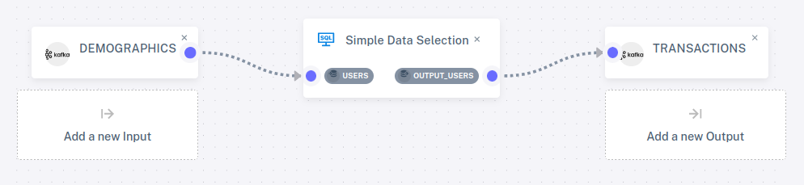
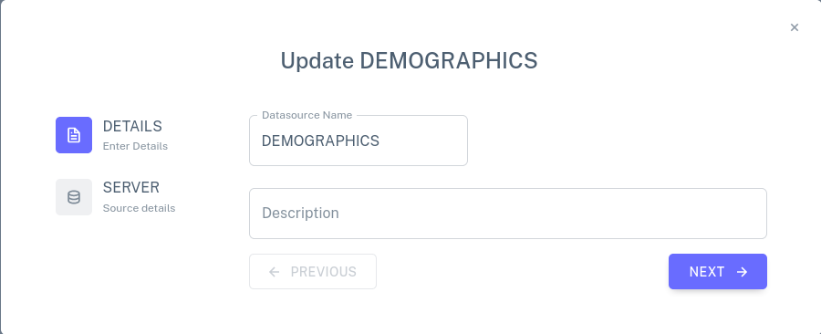
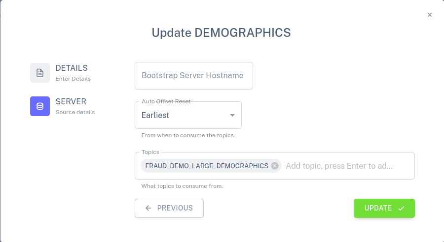
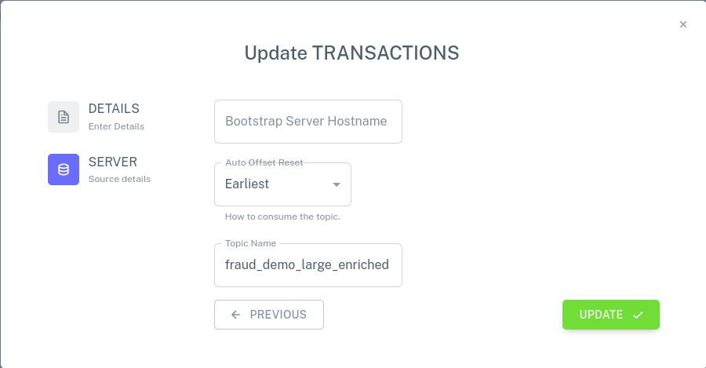

# Simple Data Selection

This demo is the simplest one in our set that still serves to
demonstrate the basics of DBSP.  Start by firing up the DBSP demo and
visiting <http://localhost:8085/>.

## SQL program

Let's look at the program first.  Click on Existing Programs in the
sidebar, and then click on the pencil icon next to Simple Data
Selection.  You should see the following SQL, which defines a table
named `users` and a view named `output_users`, where the view is
simply a copy of the table:

```sql
CREATE TABLE users (name varchar);

CREATE VIEW output_users AS SELECT * FROM users;
```

## Pipeline

The demo includes a pipeline that uses this program.  Let's examine
it.  On the sidebar, click on Pipeline Management, then on the pencil
icon next to SimpleSelect Pipeline.  This displays the pipeline
structure, including the program and how it is attached to connectors:



We can see the Simple Data Selection program in the middle, that its
`USERS` table is attached to an input connector named `DEMOGRAPHICS`,
and that its `OUTPUT_USERS` view is attached to an output connector
named `TRANSACTIONS`.

## Connectors

We found out that the pipeline uses an input connector named
`DEMOGRAPHICS` and an output connector named `TRANSACTIONS`.  Let's
look at these.

### Input connector

Start with the input connector.  Click on Existing Connectors on the
sidebar, then click on the pencil icon on the `DEMOGRAPHICS` row.  A
dialog should pop up like the one below, which allows the input
connector's name and description to be edited.



Click on the Next button to bring up a second dialog for the
connector.  This dialog allows the connector's Kafka connection
details to be updated: one can specify how to connect to the Kafka
server, whether to read all of the data or only newly arriving data,
and which Kafka topics to read.



Close the dialog without making any changes, by clicking on the X in
the upper-right corner.

### Output connector

Now let's look at the output connector.  Click on Existing Connectors
on the sidebar, then click on the pencil icon on the `TRANSACTIONS`
row.  This brings up a dialog just like the corresponding one for an
input connector.


Click on the Next button to bring up a second dialog.  Here, one may
specify how to connect to a Kafka server, as for a Kafka input
connector, and the name of a topic.



Close the dialog without making any changes, by clicking on the X in
the upper-right corner.

## Running the Pipeline

Go back to the main pipeline view, by clicking on Pipeline Management
in the sidebar.  Expand the view of the SimpleSelect Pipeline row, by
clicking on the `+` at its left side, then click on its play icon to
start the pipeline.  It should take a few seconds to start.  This
pipeline only has a tiny amount of data (3 records!), which it should
process too quickly to perceive.  The pipeline will remain running,
waiting for more data, but since no more input will arrive, the output
will not change.

Click on the eye icon for the `users` input table.  The browser will
refresh to show the contents of the input connector, three records
with the contents `user1`, `user2`, `user3`.

Click on the back button, then on the eye icon for the `output_users`
output view.  The browser will refresh to show the contents of the
output connector, three records that also have the contents `user1`,
`user2`, and `user3`.  This shows that DBSP successfully copied the
input to the output.
