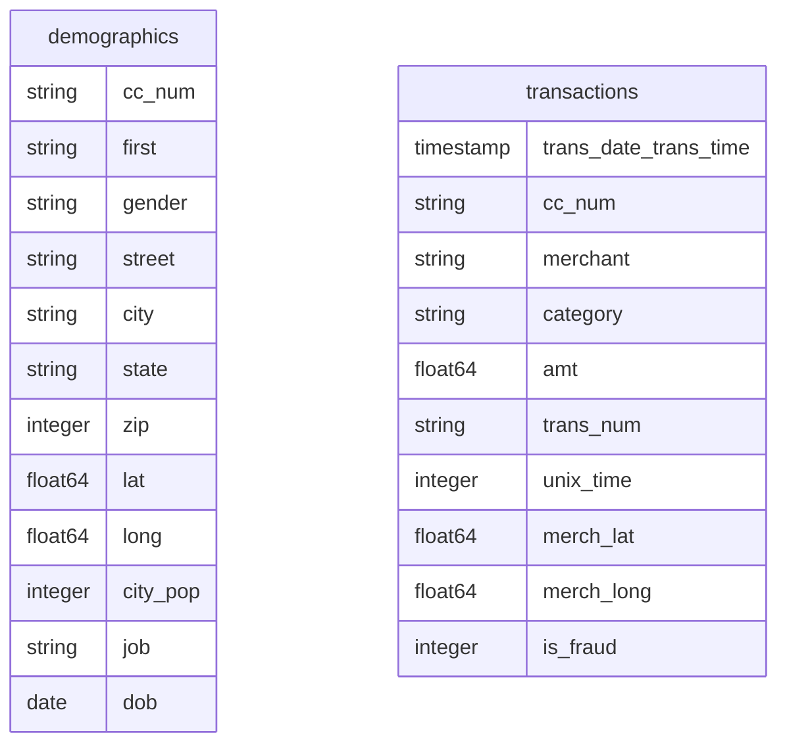
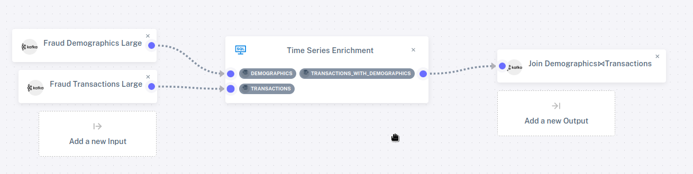

# Time Series Enrichment

The first demo, on [Simple Data Selection](simple-select), was a very
simple example of a DBSP pipeline.  Let's look at a slightly more
sophisticated example.

Suppose we have two tables.  One of them, `transactions`, reports
credit card transactions as they occur, with information such as the
transaction date and time and the amount.  The other, `demographics`,
is information associated with credit card numbers, such as the name
and address of its user:

We wish to use DBSP to join the two tables on credit card number, so
that each transaction can be associated with information about the
purchaser.  In DBSP, this can be implemented with a SQL program with a
view that joins the tables on `cc_num`.

The demo includes this example.  To see the SQL for these tables and
views, start the DBSP demo, visit <http://localhost:8085/>, click on
Existing Programs in the sidebar, and then click on the pencil icon
next to Time Series Enrichment.  It shows a SQL program with a `CREATE
TABLE` command for each table and a `CREATE VIEW` command for the
join.

The demo also includes a pipeline that uses this program.  On the
sidebar, click on Pipeline Management, then on the pencil icon next to
Time Series Enrichment Pipeline.  This displays the pipeline
structure, including the program and how it is attached to connectors:

You can view the details of the input and output connectors in the
same way described for the simple data selection demo.
