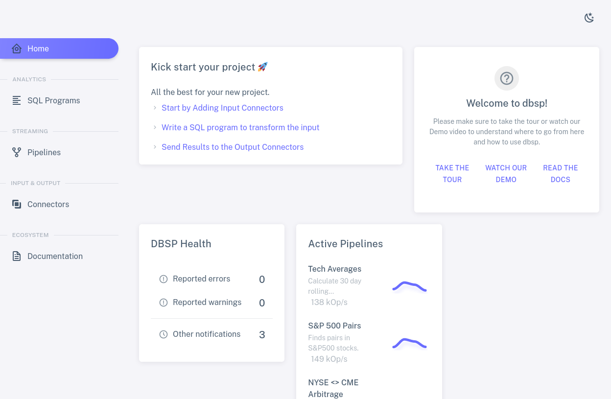
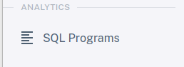
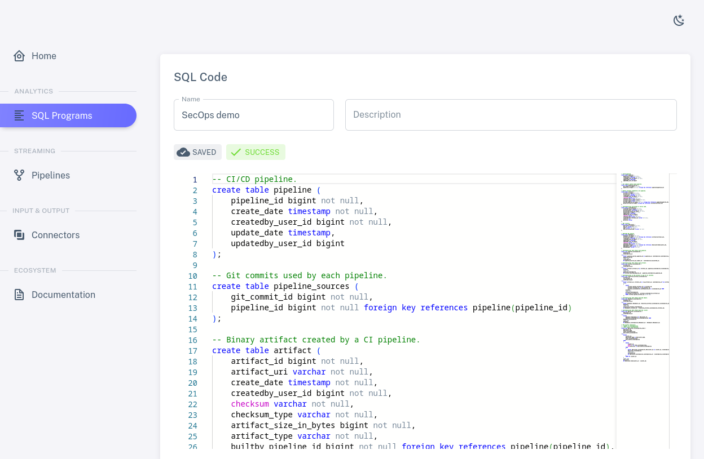
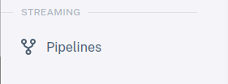
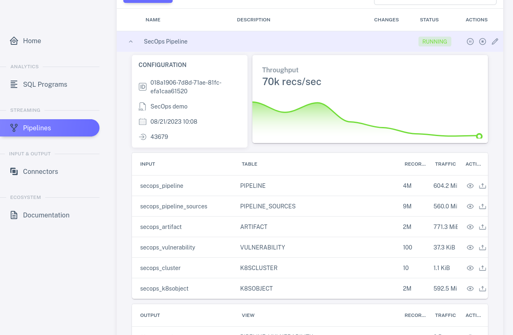
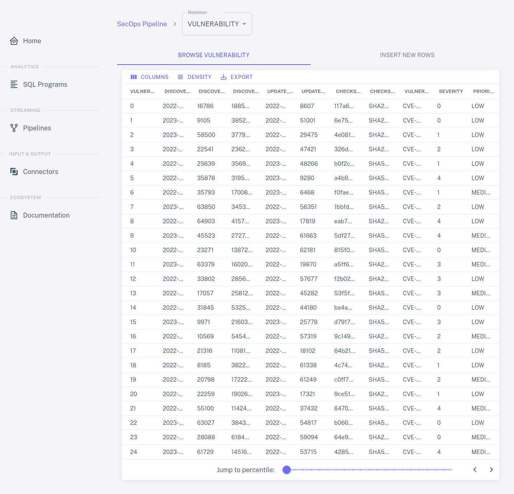

# Tour

Once you've started the DBSP demo, as described in [Get
Started](../intro), navigate to [localhost:8085](http://localhost:8085)
in your web browser to view the DBSP user interface.  A status
dashboard fills most of the home screen, as shown below, and a
sidebar on the left offers access to tabs for DBSP features:

Let's take a quick tour around the options on the sidebar.

## Analytics

The top group of tabs allows a DBSP user to define the structure of
data and specify analyses.  The user writes both of these in SQL: data
definitions as `CREATE TABLE` commands, and analyses as `CREATE VIEW`
commands.  DBSP implements a rich SQL feature set that permits
sophisticated SQL written for popular SQL databases to run with only
minimal changes.

The "SQL Editor" tab allows a user to add and name new SQL programs by
typing or pasting.

Click on "Existing Programs" to show a list of the SQL programs that
are already defined.  This list displays each program's name and
description, which one may double-click to edit.  Each program also
has a status that indicates whether it is fully compiled, and two
icons for actions: a pencil  to view or edit the
program's SQL, and a trash can  to delete it:

Click on the pencil icon for one of the rows.  This brings up the SQL
Editor for the selected program, which allows one to edit the
program's name and description and code:

Scroll through the SQL code.  It should consist of `CREATE TABLE` and
`CREATE VIEW` commands:

* `CREATE TABLE` specifies a data format.  DBSP processes streaming
  data, rather than storing it, so DBSP does not reserve disk space in
  response to table definitions.

* `CREATE VIEW` describes an analysis in terms of tables or views.
  DBSP updates views whenever it receives new data in a table.
  
## Connectors

For a DBSP program to be useful, it must be able to access data.  This
happens through **connectors**, which are divided into **input
connectors** for obtaining data from a source to feed into a table and
**output connectors** that receive data output by views. 

Let's look at the "Input & Output" tabs, which allow a user to create
and manage input and output connectors.  The following section on
pipelines will then show how to connect input and output to programs
to form streaming pipelines.

Click on "Connector Creator" to see the types of connectors that DBSP
supports.  Input and output connectors are listed separately.  Apache
[Kafka], the most widely used kind of connector, is listed twice
because DBSP supports it for both input and outputa:

Click on "Existing Connectors" to see a list of the input and output
connectors that have already been created.  The list shows each
connector's name and description, which one may double-click to edit,
along with its type.  Pencil and trash can icons allow one to edit and
delete connectors:

Click on one of the pencil icons to see what kinds of settings are
available for each connector.  The available settings vary with the
connector type.  The connectors in the demo are already set up
properly, so don't make changes.

The next section shows how to combine programs and connectors to form
streaming pipelines.

[Kafka]: https://kafka.apache.org/

## Pipelines

A user assembles a **pipeline** by attaching a program's tables to
input connectors and its views to output connectors.  The "Streaming"
tabs allow a DBSP user to set up pipelines and to start, stop, manage,
and monitor them.

The "Pipeline Builder" tab allows a user to create new pipelines.

Click on "Pipeline Management" to list the existing pipelines.  Each
row has a `+` expander, a name and description (which one can edit),
and an indication of whether the pipeline is stopped, running, or
paused.  When you start the demo for the first time, all of the
pipelines should be shown as `INACTIVE`, meaning stopped, with
available actions the familiar pencil and trash can plus a new one,
the play symbol , which starts the pipeline:

Choose a row and click on its pencil icon to view the pipeline's
connector attachments.  The box in the middle of the diagram represents the SQL
program, listing its tables on the left and its views on the right.
Input connectors are listed to the left of the box, output connectors
to the right.  Curved lines join input connectors with the tables to
which they input data and views with the output connectors to which
they output data.  Tables and views may be left without an attached connector if the
pipeline does not need them:

### Running a Pipeline

Click on the back button to return to the list of pipelines, then
click on `+` to expand a pipeline.  This shows metrics for each SQL
table and view in the pipeline's program, as well as metrics for the
pipeline as a whole.  Since the pipeline is not running, all of the
metrics are initially zero:

Click on the pipeline's play action.  The pipeline status should
change to `CREATING`, then a few seconds later to `RUNNING`, then the
metrics should start updating.  Depending on the pipeline you
selected, data might continue to arrive perpetually or for a long
time, and thus the metrics continue to update just as long, or it might
be exhausted within a few seconds and the metrics stop changing.  The
view of the running pipeline should look something like this:

Each row that lists a SQL table or view includes, in addition to names
and metrics, an eye icon  for an action to view data
received or sent through the connector.  Click on the eye for some
row to see how it works:

When you're done with the pipeline, you can temporarily pause it by
clicking on the pause icon , which replaced the
play icon when the pipeline started, and then stop it by clicking on
the stop icon  that this reveals.

Here's an example of a whole pipeline run:

