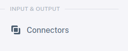
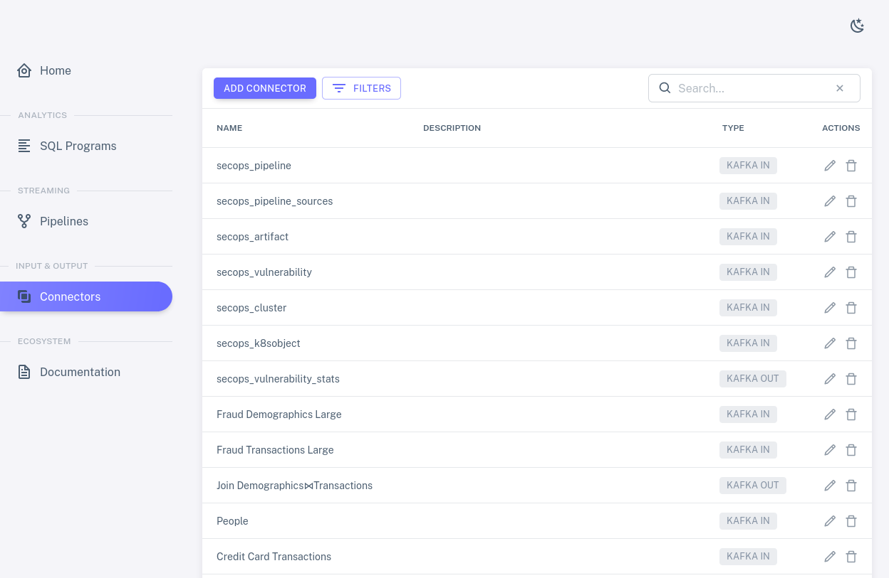
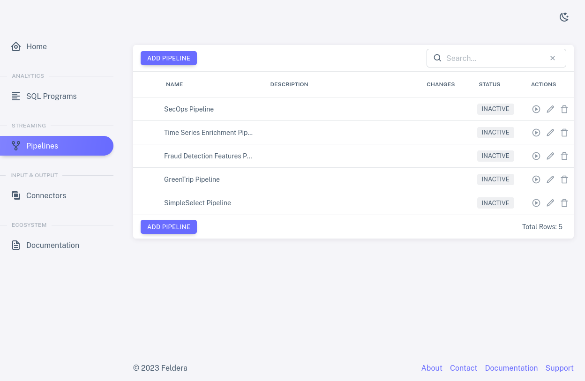

# Tour

Once you've started the DBSP demo, as described in [Get
Started](../intro), navigate to [localhost:8085](http://localhost:8085)
in your web browser to view the DBSP user interface.  A status
dashboard fills most of the home screen, as shown below, with a
sidebar on the left offering access to tabs for DBSP features:

Let's take a quick tour around the options on the sidebar.

## Analytics

The top group of tabs allows a DBSP user to define the structure of
data and specify analyses.  Both are these are written as SQL: data
definitions as `CREATE TABLE` commands, and analyses as `CREATE VIEW`
commands.  DBSP implements a rich SQL feature set that permits
sophisticated SQL written for databases such as Postgres and MySQL to
run with only minimal changes.

The "SQL Editor" tab allows a user to add and name new SQL programs by
typing them or pasting them in.

Click on "Existing Programs" to show a list of the SQL programs that
are already defined.  This list displays each program's name and
description, which one may double-click to edit.  Each program also
has a status that indicates whether it has been fully compiled, and
two icons for actions: a pencil  to view or edit
the program's SQL, and a trash can  to delete
it:

Click on the pencil icon for one of the rows.  This brings up the SQL
Editor for the selected program, which allows one to edit the
program's name and description and code:

Scroll through the SQL code.  You should see that it consists of
`CREATE TABLE` and `CREATE VIEW` commands:

* `CREATE TABLE` specifies a DBSP input stream.  For DBSP, which
  processes streaming data, rather than storing it, the term "table"
  is a misnomer, and DBSP does not store tables or prepare disk space
  for them.

* `CREATE VIEW` describes an analysis in terms of input streams or
  views.  DBSP updates views whenever it receives data on an input
  stream (those specified on `CREATE TABLE`).
  
The following section shows how one connects input sources to DBSP
input streams and views to DBSP output streams.

## Input and Output

For a DBSP program to be useful, one must connect its input streams to
input sources and its views to output sinks.  Let's look at the "Input
& Output" tabs, which allow a user to create and manage input and
output.  The following section will then show how to connect input and
output to programs to form streaming pipelines.

Click on "Connector Creator" to see the forms of input and output that
DBSP supports.  Kafka, which can be used for input or output, is the
most important kind of connector:

Click on "Existing Connectors" to see a list of the input and output
connectors that have already been created.  The list shows each
connector's name and description, which one may double-click to edit,
along with its type.  Pencil and trash can icons allow one to edit and
delete connectors:

Click on one of the pencil icons to see what kinds of options are
available for each connector.  The connectors in the demo are already
set up properly, so don't make changes.

The next section shows how to combine programs and connectors to form
streaming pipelines.

## Streaming Pipelines

A DBSP pipeline consists of a SQL program whose input streams (called
tables, in SQL) are connected to input connectors, and whose output
streams (called views, in SQL) are connected to output connectors.
With the "Streaming" tabs, a DBSP user may make and manage these
connections as well as start, stop, manage, and monitor pipelines.

The "Pipeline Builder" tab allows a user to create new pipelines.

Click on "Pipeline Management" to list the existing pipelines.  Each
row has a `+` expander, the pipeline's name and description (which one
can edit), and an indication of whether it is stopped, running, or
paused.  All of the pipelines should be shown as `INACTIVE`, meaning
stopped, with available actions the familiar pencil and trash can plus
a new one, the play symbol , which starts the
pipeline:

Choose a row and click on its pencil icon to view a pipeline's
connections in the form of a diagram.  The box in the middle of the
diagram shows SQL tables on the left and views on the right side.
Input connectors are listed to the left of the box, output connectors
to the right.  Curved lines show which input connectors feed data to
which tables and which views send data to which output connectors.
Tables and views may be left unconnected if the pipeline does not need
them:

### Running a Pipeline

Click on the back button to return to the list of pipelines, then
click on `+` to expand a pipeline.  This shows metrics for each SQL
table and view in the pipeline's program, as well as metrics for the
pipeline as a whole.  Since the pipeline is not running, all of the
metrics are initially zero:

Click on the play icon for the pipeline.  The pipeline status should
change to `CREATING`, then a few seconds later to `RUNNING`, and the
metrics should start updating.  Depending on the pipeline you
selected, data might continue to arrive perpetually or for a long
time, and thus the metric continue to update just as long, or it might
be exhausted within a few seconds and the metrics stop changing.  The
view of the running pipeline should look something like this:

Each row that lists a SQL table or view includes, in addition to names
and metrics, an eye icon  for an action to view data
received or sent through the connector.  Click on the eye for some
row to see how it works:

When you're done with the pipeline, you can temporarily pause it by
clicking on the pause icon , which replaced the
play icon when the pipeline started, and then stop it by clicking on
the stop icon  that this reveals.
