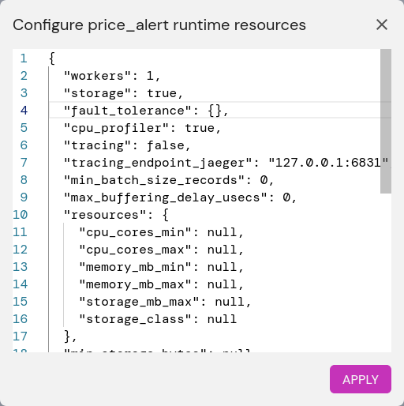

# Fault tolerance

Feldera can gracefully restart from the exact point of an abrupt
shutdown or crash, picking up from where it left off without dropping
or duplicating input or output. Fault tolerance is a preview feature
in the Feldera enterprise edition only.

## How fault tolerance works

Feldera implements fault tolerance with checkpoints and a log.  A
checkpoint is a consistent snapshot of the Feldera system's state,
including computation and the input and output adapters.
Periodically, Feldera writes a checkpoint to stable storage.  Between
checkpoints, for each batch of data that Feldera processes through the
pipeline, it logs enough information to obtain another copy of the
batch's input data later.

When a fault-tolerant pipeline restarts, it loads its state from the
most recent checkpoint, then it replays any data from input connectors
previously processed beyond that checkpoint.  If replay produces
output that was previously sent to output connectors, it discards that
output.  After replay completes, the pipeline continues with new input
that has not previously been processed.

## Fault tolerance requirements

For Feldera to run a pipeline in fault-tolerant mode, all of its input
connectors must support fault tolerance.  Some input adapters do not
yet support fault tolerance and therefore may not be part of a
fault-tolerant pipeline.  Input connectors individually document their
support for fault tolerance.

For a pipeline to be fully fault tolerant, a pipeline's output
connectors must also be fault tolerant.  Only the [Kafka output
connector](/connectors/sinks/kafka.md) supports fault tolerance as of
now.  If a fault-tolerant pipeline includes non-fault-tolerant output
connectors, then in the event of a crash and restart, Feldera may send
duplicate output to those connectors, but it will not drop output.

Feldera does not yet support fault tolerance in pipelines that use
recursive SQL or the SQL `NOW` function.

## Enabling fault tolerance

Fault tolerance requires enabling storage.  To enable storage and
fault tolerance on a pipeline, edit the pipeline's configuration one
of the following ways:

- In the web UI, click on the gear icon.  In the dialog box, change
  `storage` to  `true` and `fault_tolerance` to `{}`, e.g:

  

- Using the `fda` command line tool:

  ```
  fda set-config <pipeline> storage true
  fda set-config <pipeline> fault_tolerance true
  ```
