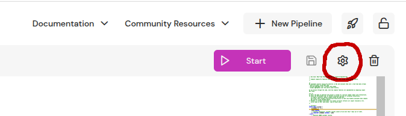

import ApiSchema from '@theme/ApiSchema';
import Tabs from '@theme/Tabs';
import TabItem from '@theme/TabItem';

# Pipeline configuration

When Feldera pipeline is created it is pre-configured for a good experience when developing and iterating on the pipeline code.
You can configure each pipeline's runtime options to better utilize your cluster's resources, ensure fault tolerance (if available) and access other functionality.
You can also configure program compilation, which is useful when switching between a development workflow and production setting.

### Editing configuration

You can generally only edit pipeline configuration when it is `Shutdown`. When the pipeline is `Suspended`, you can only edit certain options.
<Tabs
  defaultValue="web-console"
  values={[
    {label: 'Web Console', value: 'web-console'},
    {label: 'Python SDK', value: 'python'},
    {label: 'Feldera CLI', value: 'fda'},
    {label: 'HTTP API', value: 'api'},
  ]}>
  <TabItem value="web-console">
    Press the gear button in the top right corner of the code editor to access the dialog where you can edit the runtime and program configuration JSON.

    
  </TabItem>
  <TabItem value="python">
    You can use [feldera_client.create_or_update_pipeline()](http://localhost:3000/python/feldera.rest.html#feldera.rest.feldera_client.FelderaClient.create_or_update_pipeline) to update `program_config` and `runtime_config` fields.
  </TabItem>
  <TabItem value="fda">
    You can toggle the storage for pipeline `p1` with
    ```bash
      fda set-config p1 storage [true/false]
    ```
  </TabItem>
  <TabItem value="api">
    Include only `runtime_config` or `program_config` fields in the body of a [PATCH `/v0/pipelines/{pipeline_name}`](/api/partially-update-a-pipeline), e.g. :
    ```bash
      curl -X PATCH "http://localhost:8080/v0/pipelines/feature-engineering" -H "Content-Type: application/json" -d '{"runtime_config":{"workers":8,"fault_tolerance":{"model":"none","checkpoint_interval_secs":60},"resources":{"memory_mb_max":16000}},"program_config":{"profile":"dev"}}' -s -o /dev/null
    ```
  </TabItem>
</Tabs>

### Runtime configuration

:::important
Make sure to correctly configure resource limits (memory and storage), the number of worker threads and the storage backend to properly utilize your cluster's resources when going to production.
:::

<div className='theme-api-markdown' >
<ApiSchema pointer="#/components/schemas/RuntimeConfig"/>
</div>

### Program configuration

:::important
Make sure to use the "optimized" compilation profile when going to production.
:::

<div className='theme-api-markdown' >
<ApiSchema pointer="#/components/schemas/ProgramConfig"/>
</div>