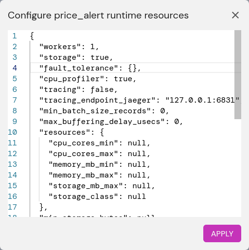

# Fault tolerance and suspend/resume

Feldera supports the following ways to gracefully stop a pipeline and
later restart it from the same point:

* Pause and resume.  A paused pipeline continues to run and occupy
  memory on its host, but it does not ingest any more input until
  resumed.  A paused pipeline does finish processing input it has
  already ingested; afterward, it uses only enough CPU to answer HTTP
  requests.

  In the web UI, the ⏸️ button pauses a pipeline and ▶️ resumes it.

  Every Feldera pipeline supports pause and resume.

* Suspend and resume.  When the user suspends a pipeline, it writes a
  checkpoint to storage and then exits.  When the user resumes the
  pipeline, it uses the checkpoint to resume from the exact point
  where it left off, without dropping or duplicating input or output.

  Suspending a pipeline allows it to resume gracefully on a different
  host or with a modified configuration.  With Feldera deployed in
  Kubernetes, suspending a pipeline temrinates its current pod while
  keeping its state in EBS or S3.  The pipeline can then resume in a
  new pod which can have more or fewer resources than the original
  pod.

  The "suspend" API suspends a pipeline, and the "start" API (or ▶️ in
  the web UI) resumes it.

  Suspend and resume is in the Feldera enterprise edition only.  For a
  pipeline to support suspend and resume, a pipeline must use
  [fault-tolerant connectors](#fault-tolerant-connectors) and have
  storage configured.

* At-least-once fault tolerance.  The pipeline regularly (by default,
  every minute) writes a checkpoint to storage.  If the pipeline
  crashes, then it resumes from the most recent checkpoint, restarting
  input connectors from the point just before the checkpoint.  Any
  output already produced beyond the checkpoint will be produced
  again, meaning that, overall, output records are produced at least
  once.

  At-least-once fault tolerance is in the Feldera enterprise edition
  only, with the same configuration requirements as suspend and
  resume.  Writing checkpoints has some performance cost so, in
  addition, it must be enabled explicitly on a pipeline.

  An at-least-once fault tolerant pipeline can also be suspended and
  resumed.

* Exactly once fault tolerance.  This extends at-least-once fault
  tolerance with input and output journaling so that the pipeline
  restarts from the exact state prior to any unplanned, abrupt
  shutdown or crash.  Restart of a fault-tolerant pipeline does not
  drop or duplicate input or output, meaning that each output record
  is produced exactly once.

  Exactly once fault tolerance is in the Feldera enterprise edition
  only, with the same configuration requirements as suspend and
  resume.  Journaling adds some performance cost to periodic
  checkpointing so, in addition, it must be enabled explicitly on a
  pipeline.

  A fault-tolerant pipeline can also be suspended and resumed.

> ⚠️ Feldera resolves [secrets](../connectors/secret-references.md)
> once at pipeline startup.  Storage for fault tolerant pipelines and
> suspended pipelines will contain resolved secrets.

The following sections describes these features in more detail.

## Implementation

Feldera implements these features by writing a **checkpoint** to
storage, that is, a consistent snapshot of the Feldera system's state,
including computation and the input and output adapters.  On resume,
Feldera loads its state from the checkpoint, and then restarts each of
the connectors at the point where it left off.

In addition, exactly once fault tolerance writes additional data to a
separate **journal** between checkpoints.  For each batch of data that
Feldera processes through the pipeline, it writes enough information
to the journal to obtain another copy of the batch's input data later.

When an exactly once fault-tolerant pipeline restarts, it loads its
state from the most recent checkpoint, then it replays any data from
input connectors previously processed beyond that checkpoint.  If
replay produces output that was previously sent to output connectors,
it discards that output.  After replay completes, the pipeline
continues with new input that has not previously been processed.

## Fault-tolerant connectors

For Feldera to suspend and resume, or to enable fault-tolerance, all
of the pipeline's input connectors must support fault tolerance.  Some
input adapters do not yet support fault tolerance and therefore may
not be part of a pipeline that supports these features.  Input
connectors individually document their support for fault tolerance.

For a pipeline to fully support either feature, its output connectors
must also be fault tolerant.  Only the [Kafka output
connector](/connectors/sinks/kafka.md) supports fault tolerance as of
now.  If a fault-tolerant pipeline includes non-fault-tolerant output
connectors, then in the event of a crash and restart, Feldera may send
duplicate output to those connectors, but it will not drop output.

Feldera does not yet support fault tolerance or suspend and resume in
pipelines that use the SQL `NOW` function.

## Enabling suspend and resume and fault tolerance

To enable suspend and resume or fault tolerance in an enterprise
Feldera pipeline:

1. Ensure that all of the pipeline's connectors support fault tolerance, as
   described in the previous section.

2. Recent versions of Feldera enable storage in new pipelines by
   default.  If storage is not yet enabled, enable it in one of the
   following ways:

   - In the web UI, click on the gear icon ⚙️.  In the dialog box,
     change `storage` to `{}`, e.g.:

     

     Then click on the Apply button.  (For more storage options, click
     on the ⚙️ again, to see that `{}` has been expanded to show the
     available settings.)

   - Using the `fda` command line tool:

     ```
     fda set-config <pipeline> storage true
     ```

3. To additionally enable fault tolerance:

   - In the web UI, click on the gear icon ⚙️.  In the dialog box, find
     `fault_tolerance`, and then `model` inside it, and change its
     value to `"exactly_once"`, then click on the Apply button.  If
     clicking on Apply does not dismiss the dialog box, then either
     storage has not been enabled or the running version of Feldera is
     not the enterprise edition.

   - With the `fda` command line tool, use one of these commands:

     ```
     fda set-config <pipeline> fault_tolerance at_least_once
     fda set-config <pipeline> fault_tolerance exactly_once
     ```
