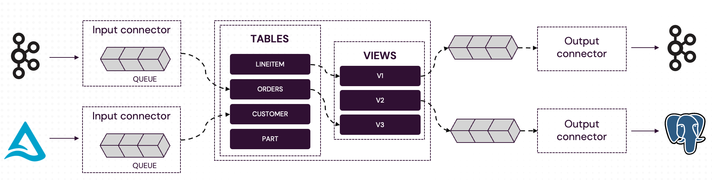

# Pipelines

Feldera expresses incremental computations via `Pipelines`. A `Pipeline` is defined using SQL tables and views. Pipelines receive input data
through input connectors. Pipelines can send the results computed by views to destinations via output connectors.

## Pipeline architecture

The diagram below illustrates the internal architecture of a Feldera pipeline:



1. **Input connectors** ingest data from external sources such as message queues, databases, data lakehouses.  A pipeline can have multiple
  input connectors of different types, including several connectors feeding the same table.  An input connector buffers data in its
  internal queue until the pipeline is ready to accept more inputs.

2. **Incremental SQL engine**. The Feldera SQL engine ingests buffered input data as changes to internal SQL tables. It performs
  **Incremental View Maintenance (IVM)**, efficiently computing updates to SQL views based on input changes.

3. **Output connectors** send changes to external data sinks. Like input connectors, a pipeline can have any number of
  output connectors of different types and there can be multiple output connectors attached to the same table.  Output data is buffered
  in an internal queue until the connector is ready to send it downstream.

## Connectors

A connector is a combination of two things: a transport and often a format. The transport describes where the input data comes from or output data is sent to (e.g., Kafka,
S3, PubSub and so on). The format defines the shape or envelope of the data (e.g., JSON, CSV, Parquet and more). Typically, the format has to be compatible
with the schema of the tables and views.

Read the references below to learn more about SQL pipeline features.

```mdx-code-block
import DocCardList from '@theme/DocCardList';

<DocCardList />
```
