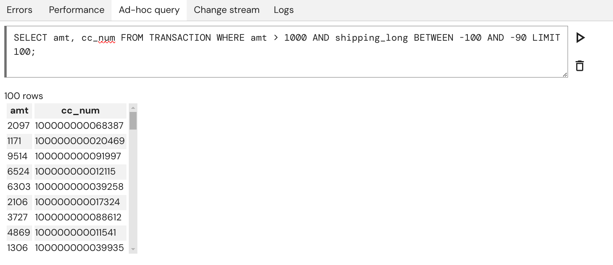
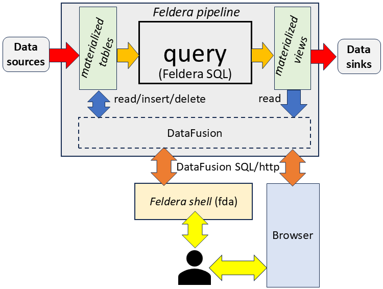

# Ad-hoc SQL Queries

You can run ad-hoc SQL queries on a running or paused pipeline. Unlike Feldera SQL programs that define pipelines and
are evaluated incrementally, ad-hoc queries are evaluated in batch mode,
using the [datafusion engine](https://datafusion.apache.org).

Ad-hoc queries provide a way to query the state of a [materialized](/sql/materialized) tables and views. They are designed to aid
development and debugging, so you need to be aware of their limitations to avoid potential confusion.

## Limitations

:::info

Tables and views are only accessible to `SELECT` ad-hoc queries if they are declared as [materialized](/sql/materialized).

:::

As of now, there are differences between the SQL dialects of Feldera SQL programs and ad-hoc queries.
This is because they use different engines (Apache Calcite for Feldera SQL vs. Apache Datafusion for ad-hoc queries).
See below for some examples.

Currently, only `SELECT` and `INSERT` statements are supported. You can not create or alter tables and views using
ad-hoc SQL.

### Differences between Feldera SQL and Ad-hoc Queries

For the common subset of SQL, results should be consistent, aside from minor differences
like floating-point rounding or decimal precision handling.

However, there are some known, notable differences in the SQL dialect between Feldera SQL and
ad-hoc queries that need to be taken into account:

- The order of output rows is non-deterministic in both dialects without the `ORDER BY` clause.
- Feldera SQL ignores the outermost order by clause.
- Feldera SQL's `TIMESTAMP_TRUNC(x, MINUTE)` is `DATE_TRUNC('MINUTE', x)` in ad-hoc queries.
- Feldera SQL's `SORT_ARRAY()` is `ARRAY_SORT()` in ad-hoc queries.
- Casting integers to timestamp conversion is interpreted as seconds in ad-hoc SQL and as milliseconds
  in Feldera SQL.
  (`SELECT 1729595568::TIMESTAMP;` will yield `2024-10-22T11:12:48` in ad-hoc queries and
  `1970-01-21 00:26:35` in Feldera SQL).
- Ad-hoc SQL can not perform as-of joins.

We will continue to improve the consistency between the two engines in future releases.

## Usage

Ad-hoc queries can be executed via different Feldera tools both when the pipeline is running or paused.

### Feldera Web Console

You can issue ad-hoc queries by opening the "Ad-hoc query" tab of the pipeline and typing a SQL `SELECT` or `INSERT`
query in the input text field. To submit the query, press `Enter` or the Play <icon icon="bx:play" /> button next
to the query. To start a new line, press `Shift + Enter`. After successful execution of the query you will see a table
containing the results. You can abort a long-running query by clicking the Stop <icon icon="bx:play" /> button or
pressing `Ctrl + C`.



### Feldera CLI

```bash
fda exec pipeline-name "SELECT * FROM materialized_view;"
```

```bash
cat query.sql | fda exec pipeline-name -s
```

Alternatively, you can enter the `fda shell` command to open an interactive shell and execute queries.

```bash
fda shell pipeline-name
```

Refer to [CLI docs](/reference/cli) for more details.

### Feldera Python SDK

You can execute adhoc queries via the Python SDK using the [.query](pathname:///python/feldera.html#feldera.pipeline.Pipeline.query) method, which returns a generator of Python Dictionaries:
```py
gen_obj = pipeline.query("SELECT * FROM materialized_view;")
output = list(gen_obj)
```

There are variations of the `.query` method that return response in different formats:
- [.query_tabular](pathname:///python/feldera.html#feldera.pipeline.Pipeline.query_tabular)
  Returns a generator of `String`.
- [.query_parquet](pathname:///python/feldera.html#feldera.pipeline.Pipeline.query_parquet)
  Saves the output of this query to the parquet file.

For `INSERT` queries it is recommended to use the [execute](pathname:///python/feldera.html#feldera.pipeline.Pipeline.execute) method:

```py
pipeline.execute("INSERT INTO tbl VALUES(1, 2, 3);")
```

### REST API

Consult the [query endpoint](/api/execute-an-ad-hoc-sql-query-in-a-running-or-paused-pipeline) reference to run ad-hoc queries directly through the API.

## Architecture

Ad-hoc queries are evaluated using the Apache Datafusion SQL engine against a consistent snapshot of the pipeline's
tables and views. This is achieved using a form of [Multiversion concurrency control](https://en.wikipedia.org/wiki/Multiversion_concurrency_control).
The datafusion engine reads data directly from the pipeline's storage layer, which is shared with the
Feldera SQL engine.



Ad-hoc queries can use CPU resources, memory and, to a lesser extent, storage (for intermediate results),
especially if they are complex or involve scanning large datasets. Since these resources are shared with the
Feldera SQL engine, such queries may reduce pipeline performance during ad-hoc query execution.

## Examples

### Inserting Complex Data Types

Given the following Feldera SQL program:

```sql
create type struct_typ as (
  a int,
  b varchar
);

create table complex_types (
    a int array not null,
    b struct_typ not null,
    json variant not null,
    m map<varchar, int>,
    tup row(one int not null, two int not null)
) with ('materialized' = 'true');
```

An ad-hoc query to insert data into the `complex_types` table would look like this:

```sql
insert into complex_types values ([1,2,3], struct(2, 'b'), '{"field": 3}', MAP(['answer'], [42]), struct(2, 3));
```

## See also

- Blog post [on inspecting Feldera Pipelines](https://www.feldera.com/blog/inspecting-feldera-pipelines).
- Tutorial using the [Feldera Web Console](/tutorials/basics/part1) to run ad-hoc queries.
