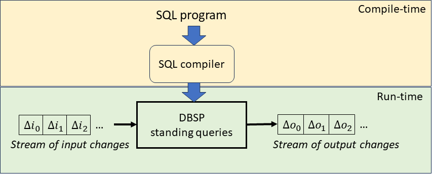

# Introduction

## Documentation sources

Parts of this documentation are adapted from the Postgres Database
documentation, governed by the [Postgres
license](https://postgrespro.com/postgresql_license).

Parts of this documentation are adapted from the Calcite
documentation, governed by the [Apache 2.0
License](https://github.com/apache/calcite/blob/main/LICENSE).

## Feldera, DBSP and incremental view maintenance

Feldera's implementation is based on a query engine optimized
for *incremental view maintenance*. This engine is called Database Stream
Processor, DBSP.

Feldera is used in the following way:

- users define a set of database tables in Feldera. These tables
  become *inputs* for DBSP.
- users define a set of database views.  The views become *outputs* for DBSP.
  The views can be defined either in Rust, using the DBSP library, or can be
  implemented in standard SQL, and compiled to Rust using the SQL to DBSP
  compiler.
- the compiled DBSP program is started
- DBSP assumes that the tables are initially empty
- users inform DBSP of any *changes* of the input tables
- in response DBSP computes the *changes* to the output views caused
  by these changes and emits them as outputs

A DBSP program behaves as a *streaming system*.  A stream is simply a
sequence of changes.  Thus DBSP implements *standing queries*: the
queries are installed prior to the data arrival, and then are
continuously executed for each input change.  A DBSP standing query
transforms a stream of input table changes into a stream of output
view changes.

Notice that an input change can affect multiple tables.  Moreover,
input changes can contain both insertions and deletions from the input
tables.  Similarly, for each input change there is a corresponding
output change that affects all output views.  Changes in the output
views are specified in terms of insertions and deletions.

## Limitations

DBSP is not a database, it is just a query engine.  DBSP is not
designed to replace a standard database, but to work in conjunction
with an existing one.

Differences between DBSP and a database:

- A traditional database offers *ad-hoc* queries: these queries are
  executed only once, on the current state of the database.  DBSP
  queries are standing queries, and are designed to be executed
  continuously.

- A traditional database offers durable storage of data.  In general,
  DBSP does store the contents of the data, either for the tables or
  the defined views.  DBSP will only store sufficient data to compute
  the changes.  DBSP *can* be configured to store the data for tables
  and views, but it does not provide a simple mechanism to manipulate
  or query the data in such tables or views using ad-hoc queries.

- DBSP does not provide any concurrency control mechanisms, or
  transactions.  DBSP is simply a stream processing engine, where each
  input change produces a corresponding output change.

- Other traditional database constructs, such as foreign keys,
  triggers, multi-version concurrency control, indexes, do not make
  sense for a system like DBSP.

- Currently the SQL compiler does not support recursive queries, or
  graph queries, but we plan to add support for these

## Supported SQL Constructs

Despite these limitations, DBSP offers a powerful set of features:

- A rich set of data types, including the standard SQL datatypes,
  dates, times, intervals, arrays

- Arbitrary SQL queries, including the standard relational algebra,
  `GROUP BY`, aggregations, user-defined functions, joins of several
  flavors, `UNNEST`, and window queries

There are many good introductions to SQL on the Internet.  This
document is not intended as a tutorial, but only as a specification of
the features of SQL implemented on top of DBSP.

SQL as a language has been standardized for a long time.
Unfortunately, the standard leaves underspecified many important
behaviors. Thus each SQL implementation is slightly different.

The SQL to DBSP compiler is implemented on top of the [Apache
Calcite](https://calcite.apache.org/) infrastructure. While Calcite is
a very flexible and customizable platform, it makes several choices
regarding the SQL language semantics. Our implementation mostly
follows these choices. This document describes specifics of our
implementation.
