# Use Case: Security Operations

Once you've started the Feldera demo, as described in [Get
Started](/get-started/docker), navigate to http://127.0.0.1:8080
in your web browser to view the Feldera user interface.  A status
dashboard fills most of the home screen, as shown below, and a
sidebar on the left offers access to tabs for Feldera features:

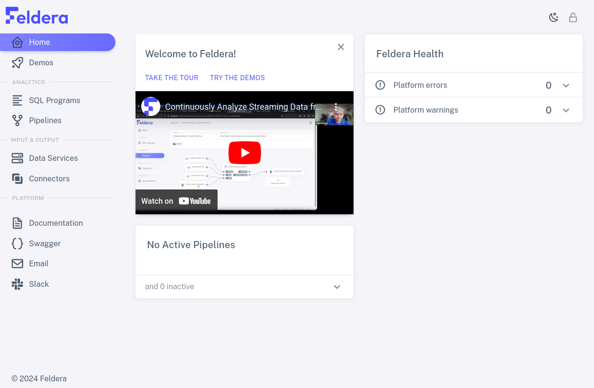

Let's take a quick tour around the options on the sidebar.

## Analytics

Click on the "SQL Programs" tab.  This tab
allows a Feldera user to define the structure of
data and specify analyses.  The user writes both of these in SQL: data
definitions as `CREATE TABLE` commands, and analyses as `CREATE VIEW`
commands.  Feldera implements a rich SQL feature set that permits
sophisticated SQL written for popular SQL databases to run with only
minimal changes.

In addition to an "Add SQL Program" button for creating a new program,
this tab displays a list of each existing program's name and
description, which one may double-click to edit. Each program also
has a status that indicates whether it is fully compiled, and two
icons for actions: a pencil <icon icon="bx:pencil" /> to view or edit the
program's SQL, and a trash can <icon icon="bx:trash-alt" /> to delete it:

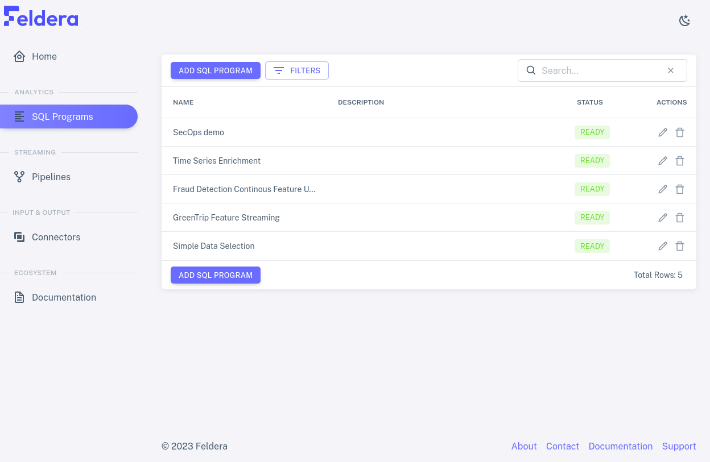

Click on the pencil icon for one of the rows. This brings up the SQL
Editor for the selected program, which allows one to edit the
program's name and description and code:

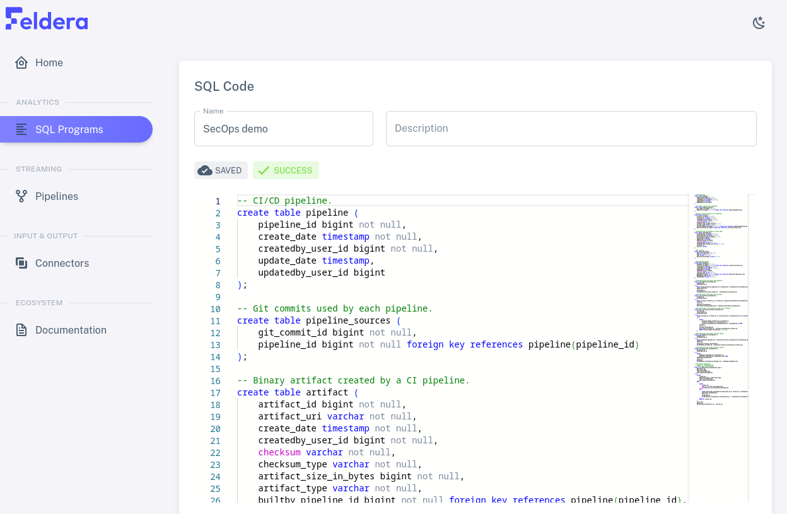

Scroll through the SQL code. It should consist of `CREATE TABLE` and
`CREATE VIEW` commands:

* `CREATE TABLE` specifies a data format.  Feldera processes streaming
  data, rather than storing it, so Feldera does not reserve disk space in
  response to table definitions.

* `CREATE VIEW` describes an analysis in terms of tables or views.
  Feldera updates views whenever it receives new data in a table.

## Connectors

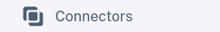

For a Feldera program to be useful, it must be able to access data.  This
happens through **connectors**, which are divided into **input
connectors** for obtaining data from a source to feed into a table and
**output connectors** that receive data output by views.

Click on the "Connectors" tab, which allow a user to create and manage
input and output connectors.  In addition to an "Add Connector" button
to create a new connector, this tab shows a list of the input and output
connectors that have already been created. The list shows each
connector's name and description, which one may double-click to edit,
along with its type. Pencil and trash can icons allow one to edit and
delete connectors:

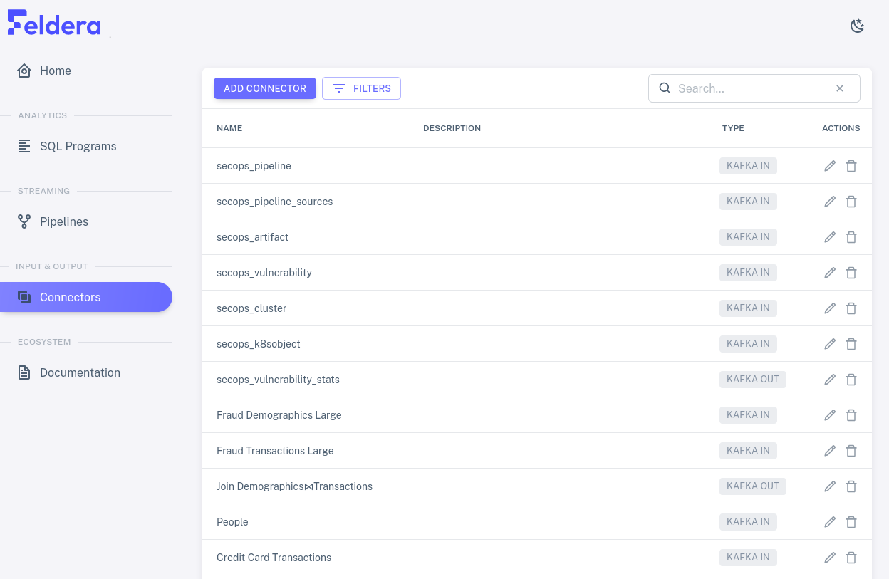

Click on one of the pencil icons to see what kinds of settings are
available for each connector. The available settings vary with the
connector type. The connectors in the demo are already set up
properly, so don't make changes.

Click on "Add Connector" to see the types of connectors that Feldera
supports for input or output or both:

The next section shows how to combine programs and connectors to form
streaming pipelines.

[Kafka]: https://kafka.apache.org/

## Pipelines

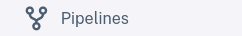

A user assembles a **pipeline** by attaching a program's tables to
input connectors and its views to output connectors.  The "Pipelines"
page allow a Feldera user to set up, manage and monitor pipelines.

Click on the "Pipelines" tab to see a list of the existing pipelines
as well as an "Add Pipeline" button for creating a new pipeline.  Each
row in the list has a
name and description (which one can edit), and an indication of whether the
pipeline is stopped, running, or paused. When you start the demo for the first
time, all of the pipelines should be shown as `READY TO RUN`, with
available actions the familiar pencil and trash can plus a new one, the play
symbol <icon icon="bx:play-circle" />, which starts the pipeline:

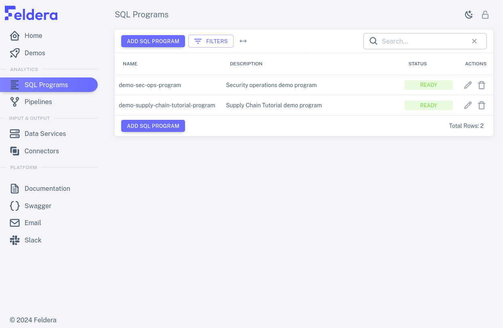

Choose a row and click on its pencil icon to view the pipeline's
connector attachments. The box in the middle of the diagram represents the SQL
program, listing its tables on the left and its views on the right.
Input connectors are listed to the left of the box, output connectors
to the right. Curved lines join input connectors with the tables to
which they input data and views with the output connectors to which
they output data. Tables and views may be left without an attached connector if the
pipeline does not need them:

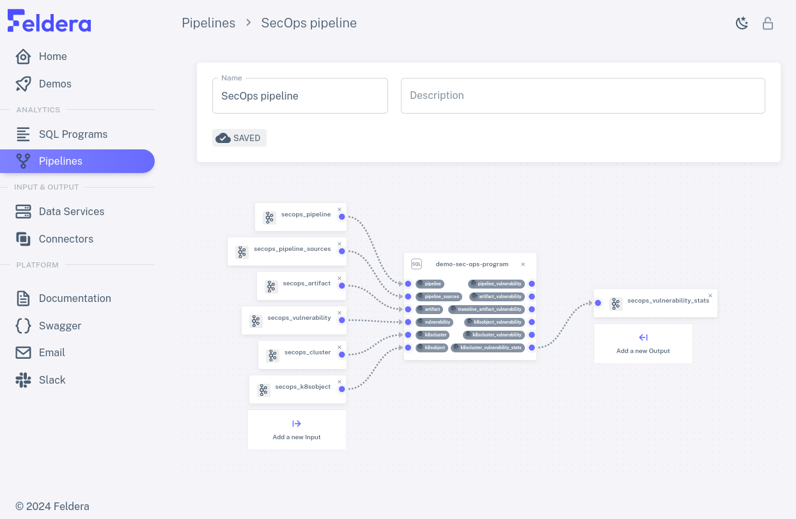

### Running a Pipeline

Click on the back button to return to the list of pipelines. Then, click on the
pipeline's play action. The pipeline status should change to `STARTING...`, then a
few seconds later to `RUNNING`. Once the pipeline has started, on the left side
of the row, a downward arrow icon <icon icon="material-symbols:expand-more" />
appears. Click it to expand. The expanded row now shows metrics for each SQL
table and view in the pipeline's program, as well as metrics for the pipeline as
a whole.

Depending on the pipeline you selected, data might continue to arrive
perpetually or for a long time, and thus the metrics continue to update just as
long, or it might be exhausted within a few seconds and the metrics stop
changing. The view of the running pipeline should look something like this:

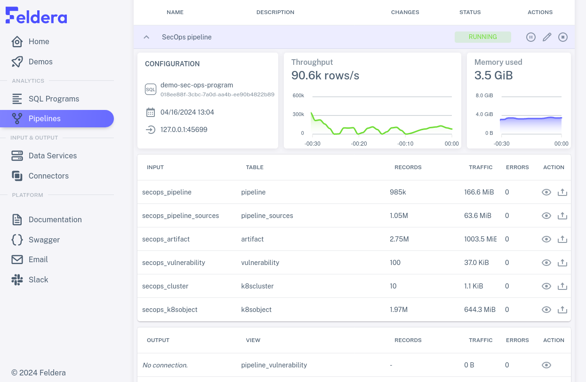

Rows for materialized tables and view includes, in addition to names
and metrics, an eye icon <icon icon="bx:show" /> for an action to view data
received or sent through the connector. Click on the eye for some
row to see how it works:

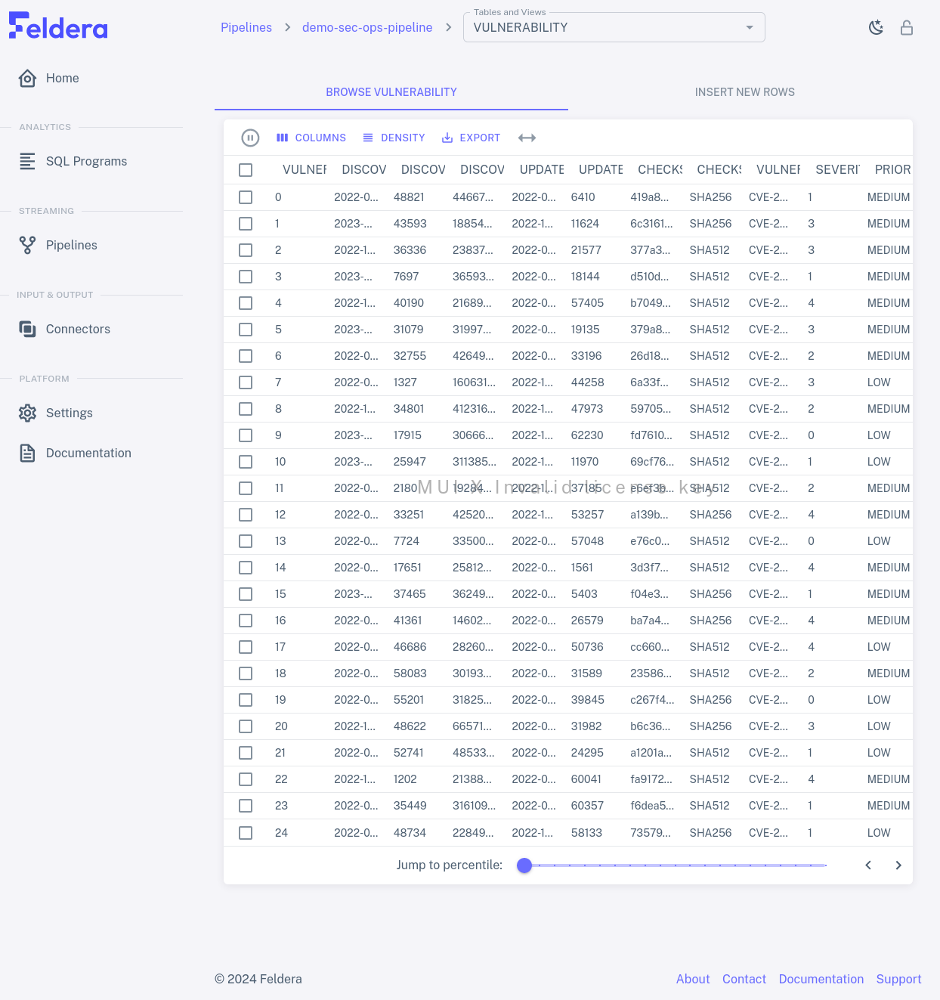

You can browse the table or view by clicking the the next or previous buttons in
the bottom right corner of the table. In larger tables or views, a slider
appears by the buttons. You can use it to jump to a given percentile in
the table by moving the slider to the desired percentile position.

When you're done with the pipeline, you can temporarily pause it by
clicking on the pause icon <icon icon="bx:pause-circle" />, which replaced the
play icon when the pipeline started, and then stop it by clicking on
the stop icon <icon icon="bx:stop-circle" /> that this reveals.

Here's an example of a whole pipeline run:

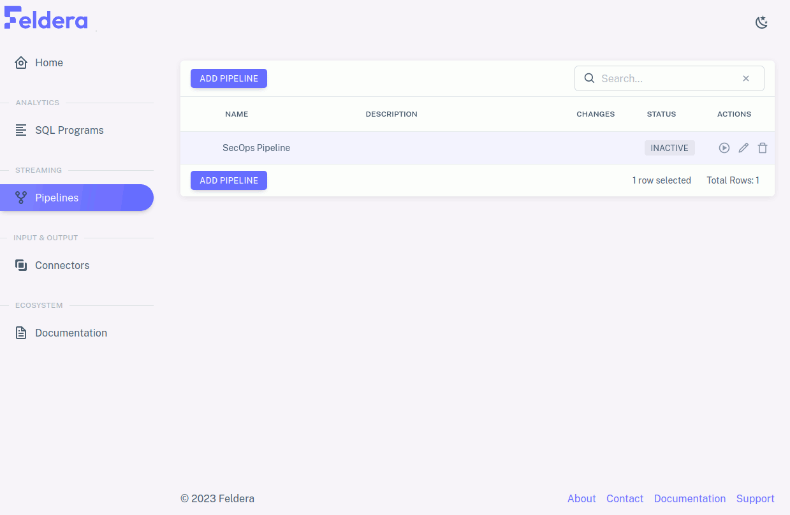
