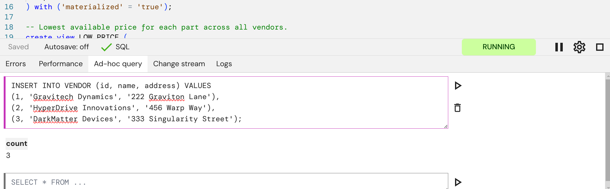
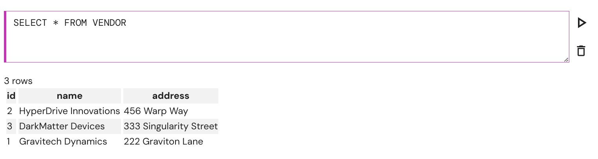
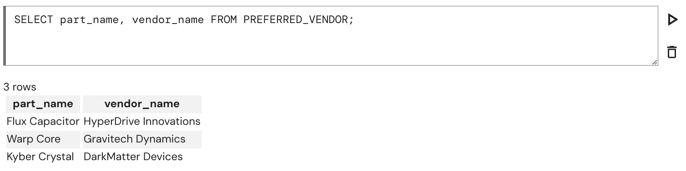
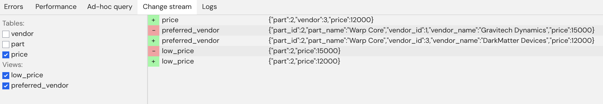

# Part 1: Writing and testing your first SQL pipeline

In this section of the tutorial we will write and test our first SQL pipeline using Feldera.

## The use case

We will build a pipeline that ingests data about
vendors, parts, and prices, and continuously tracks the lowest available
price for each part across all vendors.

## Step 0. Launch Feldera

Make sure that you have Feldera up and running by following the [Getting
Started](/get-started/docker.md) guide.  Open the Feldera Web Console on
http://localhost:8080.

## Step 1. Create a pipeline

In the Feldera Web Console,
create a new pipeline, called named "supply_chain", and paste the following code
in the SQL editor:

```sql
create table VENDOR (
    id bigint not null primary key,
    name varchar,
    address varchar
) with ('materialized' = 'true');

create table PART (
    id bigint not null primary key,
    name varchar
) with ('materialized' = 'true');

create table PRICE (
    part bigint not null,
    vendor bigint not null,
    price integer
) with ('materialized' = 'true');

-- Lowest available price for each part across all vendors.
create view LOW_PRICE (
    part,
    price
) as
    select part, MIN(price) as price from PRICE group by part;

-- Lowest available price for each part along with part and vendor details.
create materialized view PREFERRED_VENDOR (
    part_id,
    part_name,
    vendor_id,
    vendor_name,
    price
) as
    select
        PART.id as part_id,
        PART.name as part_name,
        VENDOR.id as vendor_id,
        VENDOR.name as vendor_name,
        PRICE.price
    from
        PRICE,
        PART,
        VENDOR,
        LOW_PRICE
    where
        PRICE.price = LOW_PRICE.price AND
        PRICE.part = LOW_PRICE.part AND
        PART.id = PRICE.part AND
        VENDOR.id = PRICE.vendor;
```

The first part of this listing declares inputs to the pipeline
using SQL `CREATE TABLE` statements.
Indeed, SQL's data modeling language works for streaming
data just as well as for tables stored on the disk.  No need to learn a new
language: if you know SQL, you already know streaming SQL!

Note that these declarations do not say anything
about the sources of data.  We will add that in Part 3 of the tutorial.

Finally, note the `'materialized' = 'true'` attribute on the
tables.  This annotation instructs Feldera to store the entire contents of the table,
so that the user can browse it at any time.

The second part of the listing defines queries on top of the input tables.
In Feldera we write queries as SQL views.
Views can be defined in terms of
tables and other views, making it possible to express deeply nested queries
in a modular way.
In this example we compute the lowest price for each part
across all vendors as the `LOW_PRICE` view. We then define the `PREFERRED_VENDOR`
view on top of `LOW_PRICE`.

We declare `PREFERRED_VENDOR` as a **materialized** view, instructing Feldera to
store the entire contents of the view, so that the user can browse it at any time.
This is in contrast to regular views, for which the user can only observe a stream
of **changes** to the view, but cannot inspect its current contents.

Click the Play <icon icon="bx:play" /> button to run the pipeline.

## Step 2. Insert data

When the pipeline is running it can process incoming changes. The changes can be submitted to the pipeline in three ways: automatically via [input connectors](/connectors/) attached to the pipeline tables, by sending HTTP ingress requests and by issuing `INSERT INTO ...` ad-hoc queries. You can use one of our tools - the [Python SDK](pathname:///python/feldera.html#feldera.pipeline.Pipeline.input_json), the [Feldera CLI tool](/reference/cli), the Web Console or the [REST API](/api/push-data-to-a-sql-table) directly to leverage any of these methods. For simplicity, let us use the Web Console to run an `INSERT INTO ...` query.

Open the "Ad-hoc query" tab and paste the following statement in the input field:

```sql
INSERT INTO VENDOR (id, name, address) VALUES
(1, 'Gravitech Dynamics', '222 Graviton Lane'),
(2, 'HyperDrive Innovations', '456 Warp Way'),
(3, 'DarkMatter Devices', '333 Singularity Street');
```

Press `Enter` or click the Play <icon icon="bx:play" /> button to submit the query. You will see the result containing the number of inserted rows - 3:



Ad-hoc queries can also be used to inspect current state of tables and views.
Now let us check the state of the `VENDOR` table:

```sql
SELECT * FROM VENDOR;
```



Yep, everything is in order. Let us fill the other tables:

```sql
INSERT INTO PART (id, name) VALUES
(1, 'Flux Capacitor'),
(2, 'Warp Core'),
(3, 'Kyber Crystal');
```

```sql
INSERT INTO PRICE (part, vendor, price) VALUES
(1, 2, 10000),
(2, 1, 15000),
(3, 3, 9000);
```

Keep in mind that ad-hoc queries are evaluated for a single pipeline and not the entire system.

## Step 3. Observe pipeline outputs

Feldera is an incremental view maintenance (IVM) engine. This means that when new changes arrive in SQL tables, the SQL views are automatically updated. Rather than evaluating the views from scratch, Feldera only performs computation related to new changes with resource consumption proportional to the size of these changes.

When we inserted the new data into `VENDOR`, `PART` and `PRICE` tables, Feldera already computed the results for `LOW_PRICE` and `PREFERRED_VENDOR` views. We can inspect `PREFERRED_VENDOR`:

```sql
SELECT part_name, vendor_name FROM PREFERRED_VENDOR;
```



Note that you can only use ad hoc `SELECT` queries to inspect [materialized](/sql/materialized) tables and views. In this example, the `LOW_PRICE` view is not declared as `MATERIALIZED`; therefore we cannot query it.

This limitation only concerns ad-hoc queries - SQL views declared in the main SQL program can contain arbitrary queries over both materialized and non-materialized tables and views.

Note that `SELECT` ad-hoc queries do not play part in advancing pipeline's incremental computation, they only reveal the state that was already automatically and incrementally computed.

Ad-hoc queries can also be evaluated when the pipeline is paused.

## Step 4. Observe incremental changes

Let us see Feldera's incremental computation in action!

Instead of inspecting views with queries, let's capture changes as they happen.
Open the "Change Stream" tab and tick the checkboxes next to the `PRICE` table, `LOW_PRICE` and `PREFERRED_VENDOR` views.

Switch back and execute one more ad-hoc query:
```sql
INSERT INTO PRICE (part, vendor, price) VALUES
(2, 3, 12000);
```

Here we are introducing a new, lower, price for a part from a different vendor, so we expect an updated lowest price.

Navigate to the "Change stream" tab and observe an insert in the `PRICE` table and inserts and deletes for the views:



As was the case here, Feldera incrementally updates the views by deleting old records that are no longer part of the view and inserting newly added records.

If we inspect the `PREFERRED_VENDOR` again we will see that the entry for the "Warp Core" has indeed been replaced as a result of an incremental update:

```sql
SELECT part_name, vendor_name FROM PREFERRED_VENDOR;
```

Shut down the pipeline by clicking the stop icon <icon icon="bx:stop" /> to forget all its ingested data, computed view results and any accumulated internal state.

## Takeaways

Let us recap what we have learned so far:

- Feldera executes **programs** written in standard SQL, using `CREATE TABLE` and `CREATE VIEW` statements.
  - `CREATE TABLE` statements define a schema for input data.
  - `CREATE VIEW` statements define queries over input tables and other views.

- An SQL program is instantiated as a part of a **pipeline**.

- Feldera evaluates SQL programs **incrementally**, continuously updating their results as input data changes.

- You can observe input and output changes as they happen, or query a snapshot of data in input tables and output views.

- When the pipeline is stopped, all its processed inputs and computed results are lost.
