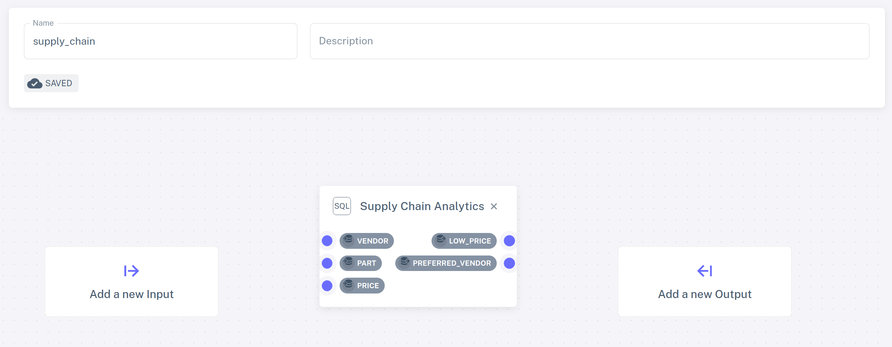
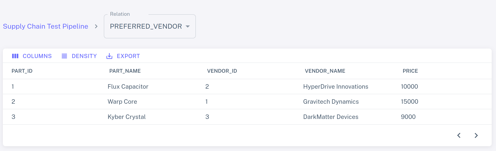
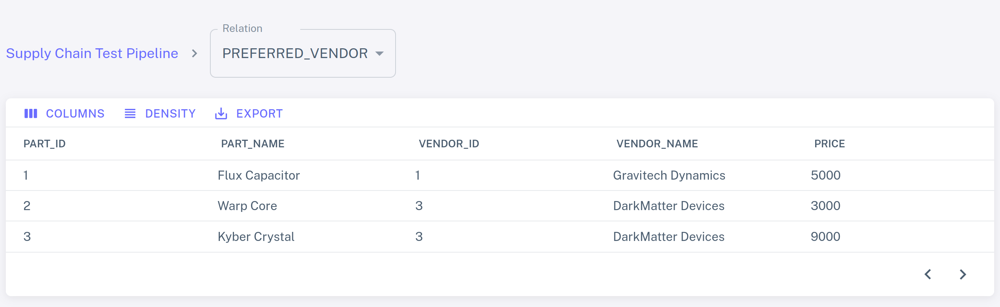

# Part 1: Writing and testing your first SQL program

In this section of the tutorial we will:
- Write and test our first SQL program using Feldera
- Introduce *continuous analytics* -- one of the key concepts behind Feldera

## The use case

We will use Feldera to implement a real-time analytics pipeline for a
supply chain management system.  The pipeline ingests data about suppliers,
customers, and orders, and maintains an up-to-date summary of
this data in an OLAP database.  The data can arrive from a variety of sources,
such as databases and event streams.  In this tutorial we will ingest data from
Amazon S3 and Redpanda, a Kafka-compatible message queue.


## Step 0. Launch Feldera

Make sure that you have Feldera up and running by following the [Getting
Started](/docker.md) guide.  Open the Feldera Web Console on
[localhost:8080](http://localhost:8080).

:::tip For the impatient

If you started Feldera using the demo profile as described in the [Getting
Started](/docker.md) guide, it has created a couple of SQL programs and
pipelines.  One of these programs, called
"Feldera Basics Tutorial" and the associated pipeline
"Feldera Basics Tutorial Pipeline" are identical to the ones
we will manually create in this three-part tutorial.

We recommend that you follow the tutorial and build your own Feldera
pipeline, but if you'd like to accelerate the journey, feel free
to skim the tutorial and explore the resulting pipeline without
going through all the steps.

:::

## Step 1. Declare input tables

We start with modeling input data as SQL tables.  In the Feldera Web Console,
navigate to the `SQL Programs` section and click on `ADD SQL PROGRAM`.  Give
the program a name, e.g., "Supply Chain Analytics" and paste the following code
in the SQL editor:

```sql
create table VENDOR (
    id bigint not null primary key,
    name varchar,
    address varchar
);

create table PART (
    id bigint not null primary key,
    name varchar
);

create table PRICE (
    part bigint not null,
    vendor bigint not null,
    price decimal
);
```

This looks familiar, just plain old SQL `CREATE TABLE` statements.
Indeed, SQL's data modeling language works for streaming
data just as well as for tables stored on the disk.  No need to learn a new
language: if you know SQL, you already know streaming SQL!

It is worth pointing out that these declarations do not say anything
about the sources of data.  Records for the `VENDOR`, `PART`, and `PRICE` tables
could arrive from a Kafka stream, a database, or an HTTP request.  Below we will
see how our SQL program can be instantiated with any of these data sources, or
even multiple data sources connected to the same table.

## Step 2. Write queries

We would like to compute the lowest price for each part
across all vendors.  Add the following statements to your SQL program:

```sql
-- Lowest available price for each part across all vendors.
create view LOW_PRICE (
    part,
    price
) as
    select part, MIN(price) as price from PRICE group by part;

-- Lowest available price for each part along with part and vendor details.
create view PREFERRED_VENDOR (
    part_id,
    part_name,
    vendor_id,
    vendor_name,
    price
) as
    select
        PART.id as part_id,
        PART.name as part_name,
        VENDOR.id as vendor_id,
        VENDOR.name as vendor_name,
        PRICE.price
    from
        PRICE,
        PART,
        VENDOR,
        LOW_PRICE
    where
        PRICE.price = LOW_PRICE.price AND
        PRICE.part = LOW_PRICE.part AND
        PART.id = PRICE.part AND
        VENDOR.id = PRICE.vendor;
```

In Feldera we write queries as SQL views.  Views can be defined in terms of
tables and other views, making it possible to express deeply nested queries.  In
this example, the `PREFERRED_VENDOR` view is expressed in terms of the
`LOW_PRICE` view.

## Step 3. Run the program

In order to run our SQL program, we must instantiate it as part of a _pipeline_.
Navigate to the `Pipelines` section and click `ADD PIPELINE`.  Give the new
pipeline the name `supply_chain` and select "Supply Chain Analytics" from the
list of SQL programs.

The selected program is visualized as a rectangle with a blue dot for each table
and view declared in the program.  These can be used to connect data sources and
sinks.  For the time being, we will run our pipeline without any sources or
sinks.  We will build more exciting pipelines in the next part of the tutorial.



Go back to the pipelines view (click on `Pipelines` in the navigation bar
on the left).  Your newly created pipeline should appear in the list.  Click the
play icon <icon icon="bx:play-circle" /> next to the pipeline.

The pipeline is now running and is ready to process inputs; however since we
have not connected any data sources to it, no data has been received yet.  Let
us add some manually.

## Step 4. Populate tables manually

Expand the runtime state of the pipeline by clicking the chevron icon <icon
icon="bx:chevron-down" /> on the left.  You should see the list
of tables and views defined in your program.  Click on the <icon
icon="bx:upload" /> icon next to the `PART` table.  This will open a
view with `BROWSE PART` and `INSERT NEW ROWS` tabs.  The `BROWSE PART`
tab should be empty because no data has been inserted yet.  Click
`INSERT NEW ROWS`, where you can insert new rows to the table using a
configurable random data generator (feel free to play around with it!)
or by entering the data manually.  For example, you might add the
following rows:

| ID          | NAME           |
| ----------- | -------------- |
| 1           | Flux Capacitor |
| 2           | Warp Core      |
| 3           | Kyber Crystal  |

Click `INSERT ROWS` to push the new rows to the table.  Switch to the
`BROWSE PART` tab to see the contents of the table, which should
contain the newly inserted rows.

Follow the same process to populate `VENDOR`:

| ID          | NAME                    | ADDRESS                |
| ----------- | ----------------------- |------------------------|
| 1           | Gravitech Dynamics      | 222 Graviton Lane      |
| 2           | HyperDrive Innovations  | 456 Warp Way           |
| 3           | DarkMatter Devices      | 333 Singularity Street |

and `PRICE`:

| PART        | VENDOR                  | PRICE                  |
| ----------- | ----------------------- |------------------------|
| 1           | 2                       | 10000                  |
| 2           | 1                       | 15000                  |
| 3           | 3                       | 9000                   |

Select the `PREFERRED_VENDOR` view from the dropdown list to see the
output of the query:



## Step 5. Make changes

Let us see what happens if we add more input rows to the `PRICE` table:


Click `INSERT ROWS` and switch back to the `PREFERRED_VENDOR` view.  The view has
changed: DarkMatter Devices is now the cheapest supplier of Warp Cores, while
Gravitech Dynamics offers lowest-priced Flux Capacitors.



As you make more changes to the input tables, Feldera will keep updating the view.

This simple example illustrates the concept of **continuous analytics**.
Feldera queries are always-on: the query engine continuously updates
all views in response to input changes, making the most up-to-date results
available at any time.

:::note

The Web Console does not yet support deleting records.  Use the REST API
described in the next part of the tutorial instead.

:::

## Step 6. Stop the pipeline

Click the stop icon <icon icon="bx:stop-circle" /> to shut down the pipeline.

:::caution

All pipeline state will be lost.

:::

## Takeaways

Let us recap what we have learned so far:

- Feldera executes **programs** written in standard SQL, using `CREATE TABLE` and `CREATE VIEW` statements.
  - `CREATE TABLE` statements define a schema for input data.
  - `CREATE VIEW` statements define queries over input tables and other views.

- A SQL program is instantiated as part of a **pipeline**.

- Feldera evaluates queries **continuously**, updating their results
  as input data changes.
