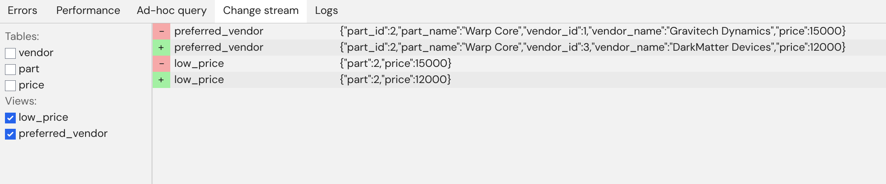

# Part 1: Writing and testing your first SQL pipeline

In this section of the tutorial we will write and test our first SQL pipeline using Feldera.

## The use case

We will build a pipeline that ingests data about
vendors, parts, and prices, and continuously tracks the lowest available
price for each part across all vendors.

## Step 0. Launch Feldera

Make sure that you have Feldera up and running by following the [Getting
Started](/docker.md) guide.  Open the Feldera Web Console on
http://localhost:8080.

## Step 1. Create a pipeline

In the Feldera Web Console,
create a new pipeline, called named "supply_chain", and paste the following code
in the SQL editor:

```sql
create table VENDOR (
    id bigint not null primary key,
    name varchar,
    address varchar
) with ('materialized' = 'true');

create table PART (
    id bigint not null primary key,
    name varchar
) with ('materialized' = 'true');

create table PRICE (
    part bigint not null,
    vendor bigint not null,
    price decimal
) with ('materialized' = 'true');

-- Lowest available price for each part across all vendors.
create view LOW_PRICE (
    part,
    price
) as
    select part, MIN(price) as price from PRICE group by part;

-- Lowest available price for each part along with part and vendor details.
create materialized view PREFERRED_VENDOR (
    part_id,
    part_name,
    vendor_id,
    vendor_name,
    price
) as
    select
        PART.id as part_id,
        PART.name as part_name,
        VENDOR.id as vendor_id,
        VENDOR.name as vendor_name,
        PRICE.price
    from
        PRICE,
        PART,
        VENDOR,
        LOW_PRICE
    where
        PRICE.price = LOW_PRICE.price AND
        PRICE.part = LOW_PRICE.part AND
        PART.id = PRICE.part AND
        VENDOR.id = PRICE.vendor;
```

The first part of this listing declares inputs to the pipeline
using SQL `CREATE TABLE` statements.
Indeed, SQL's data modeling language works for streaming
data just as well as for tables stored on the disk.  No need to learn a new
language: if you know SQL, you already know streaming SQL!

Note that these declarations do not say anything
about the sources of data.  We will add that in Part 3 of the tutorial.

Finally, note the `'materialized' = 'true'` attribute on the
tables.  This annotation instructs Feldera to store the entire contents of the table,
so that the user can browse it at any time.

The second part of the listing defines queries on top of the input tables.
In Feldera we write queries as SQL views.
Views can be defined in terms of
tables and other views, making it possible to express deeply nested queries
in a modular way.
In this example we compute the lowest price for each part
across all vendors as the `LOW_PRICE` view. We then define the `PREFERRED_VENDOR`
view on top of `LOW_PRICE`.

We declare `PREFERRED_VENDOR` as a **materialized** view, instructing Feldera to
store the entire contents of the view, so that the user can browse it at any time.
This is in contrast to regular views, for which the user can only observe a stream
of **changes** to the view, but cannot inspect its current contents.

Click the PLAY button to run the pipeline.

## Step 2. Insert data

When the pipeline is running it can process incoming changes. Let's try just that via ad-hoc queries.

Open Ad-hoc query tab and insert in the input field the following statement:

```sql
INSERT INTO VENDOR (id, name, address) VALUES
(1, 'Gravitech Dynamics', '222 Graviton Lane'),
(2, 'HyperDrive Innovations', '456 Warp Way'),
(3, 'DarkMatter Devices', '333 Singularity Street');
```

Press `Enter` or click the Play button to submit the query. You will see the result containing the number of inserted rows: 3.


Now let's check the state of the table with a quick select query that we insert into the empty input field below the result from the first query:

```sql
SELECT * FROM VENDOR
```


Yep, everything is in order. Let's fill the other table:

```sql
INSERT INTO PART (id, name) VALUES
(1, 'Flux Capacitor'),
(2, 'Warp Core'),
(3, 'Kyber Crystal')
```

```sql
INSERT INTO PRICE (part, vendor, price) VALUES
(1, 2, 10000),
(2, 1, 15000),
(3, 3, 9000);
```

The ad-hoc queries we run are executed by the same pipeline that handles the stream processing, but instead of using our incremental computation engine they are evaluated against the latest snapshot of the pipeline's tables and views.

Enough with the static SQL, let's see Feldera's incremental computation in action!

## Step 3. Observe pipeline outputs

To see the computed outputs of the pipeline switch to Change stream tab, and tick the checkboxes next to LOW_PRICE and PREFERRED_VENDOR views.

... Well, nothing happened. See, as soon as the changes were ingested by Feldera the outputs were computed and transmitted through available output connectors, and we only subscribed to a stream of changes after that. So let's introduce another change which results we could see live.

We will now insert new data into pipeline directly as a change. Paste (Ctrl + V or equivalent) the following JSON after clicking anywhere within the Change stream tab:

```json
[
    {
        "relationName": "price",
        "insert": {
            "part": 2, "vendor": 3, "price": 12000
        }
    }
]
```



There we go! We can see deletes and inserts for both low_price and preferred_vendor views. There weren't only inserts in the output stream because in this case in order to correctly communicate the new view results Feldera needs to update previously computed rows - that is, delete the old view row and insert a new one, containing the actualized data.

In our example DarkMatter Devices entered competition and undercut Gravitech Dynamics with a cheaper Warp Core, so we need to retract the statement that a Warp Core for 15,000 credits is a reasonable market offering and issue a new one.

Since preferred_vendor view is materialized we can also query its state with SELECT query if we go back to the Ad-hoc tab:

```sql
SELECT * FROM PREFERRED_VENDOR;
```

To reiterate, we can't do the same with a non-materialized view low_price. Let's make sure of it after pausing <icon icon="bx:pause" /> the pipeline (just because we can):

```sql
SELECT (part) FROM low_price
```

Now, let's shut down the pipeline by clicking the stop icon <icon icon="bx:stop" /> to forget all the ingested data, computed view results and any accumulated internal state.

## Takeaways

Let us recap what we have learned so far:

- Feldera executes **programs** written in standard SQL, using `CREATE TABLE` and `CREATE VIEW` statements.
  - `CREATE TABLE` statements define a schema for input data.
  - `CREATE VIEW` statements define queries over input tables and other views.

- An SQL program is instantiated as a part of a **pipeline**.

- Running Feldera pipeline converts input changes into output changes in the context of the running history of the pipeline.

- Feldera evaluates SQL programs **continuously**, updating their results as input data changes.

- You can observe input and output changes as they happen, or query a snapshot of data in input tables and output views.

- When the pipeline is stopped, all its processed inputs and computed results are lost.