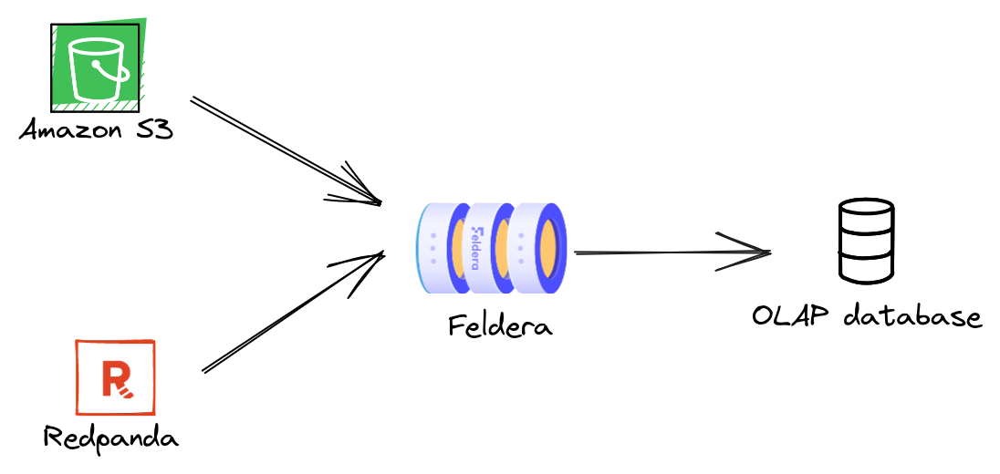

# Part 3: Input and Output Connectors

In this part of the tutorial where we will

- Learn to connect Feldera pipelines to external data sources and sinks.

- Introduce the third key concept behind Feldera: *computation over data in
  motion*.

## Computing on data in motion

A Feldera pipeline starts evaluating queries as soon as it receives
the first input record and continues updating the results incrementally as more
inputs arrive.  This enables Feldera to operate over data en-route from a source
to a destination.  The destination, be it a database, a data lake, an ML model,
or a real-time dashboard, receives the latest query results, and not the raw
data.  A Feldera pipeline can connect multiple heterogeneous sources
to multiple destinations.  In this part of the tutorial, we will build such a
pipeline:



## Step 1. Configure HTTPS GET connectors

An HTTPS GET connector retrieves data from a user-provided URL and pushes it to a
SQL table.  Let us start with adding some GET connectors to the pipeline we
created in Part 1 of this tutorial.  We uploaded minimal datasets for the three
tables in this example to a public S3 bucket:

- [https://feldera-basics-tutorial.s3.amazonaws.com/part.json](https://feldera-basics-tutorial.s3.amazonaws.com/part.json)
- [https://feldera-basics-tutorial.s3.amazonaws.com/vendor.json](https://feldera-basics-tutorial.s3.amazonaws.com/vendor.json)
- [https://feldera-basics-tutorial.s3.amazonaws.com/price.json](https://feldera-basics-tutorial.s3.amazonaws.com/price.json)

Modify your SQL table declarations adding the `WITH` clause with input connector configuration:

```sql
create table VENDOR (
    id bigint not null primary key,
    name varchar,
    address varchar
) WITH ('connectors' = '[{
    "transport": {
        "name": "url_input", "config": {"path": "https://feldera-basics-tutorial.s3.amazonaws.com/vendor.json"}
    },
    "format": { "name": "json" }
}]');

create table PART (
    id bigint not null primary key,
    name varchar
) WITH ('connectors' = '[{
    "transport": {
        "name": "url_input", "config": {"path": "https://feldera-basics-tutorial.s3.amazonaws.com/part.json"  }
    },
    "format": { "name": "json" }
}]');

create table PRICE (
    part bigint not null,
    vendor bigint not null,
    price integer
) WITH ('connectors' = '[{
    "transport": {
        "name": "url_input", "config": {"path": "https://feldera-basics-tutorial.s3.amazonaws.com/price.json"  }
    },
    "format": { "name": "json" }
}]');
```

Select the `PREFERRED_VENDOR` view in the `Change Stream` tab and start the pipeline.
The input connectors ingest data from S3 and push it to the pipeline.
You should see the outputs appear in the `Change Stream` tab.

:::note
You must select the table or view you want to monitor in the `Change Stream` tab _before_ starting the pipeline
in order to observe all updates to the view from the start of the execution.
:::

:::note
Feldera will soon support browsing and querying the entire contents of a table or view.
:::


## Step 2. Configure Kafka/Redpanda connectors

Next, we will add a pair of connectors to our pipeline to ingest changes to the `PRICE`
table from a Kafka topic and output changes to the `PREFERRED_VENDOR` table to
another Kafka topic.

### Install Redpanda

To complete this part of the tutorial, you will need access to a Kafka cluster.  For your
convenience, the Feldera Docker Compose file contains instructions to bring up a local
instance of Redpanda, a Kafka-compatible message queue.  If you started Feldera
in the demo mode (by supplying the `--profile demo` switch to `docker compose`) then
the Redpanda container should already be running.  Otherwise, you can start it
using the following command:

```bash
curl -L https://github.com/feldera/feldera/releases/latest/download/docker-compose.yml | docker compose -f - up redpanda
```

Next, you will need to install `rpk`, the Redpanda CLI, by following the instructions on
[redpanda.com](https://docs.redpanda.com/current/get-started/rpk-install/).  On
success, you will be able to retrieve the state of the Redpanda cluster using:

```bash
rpk -X brokers=127.0.0.1:19092 cluster metadata
```

### Create input/output topics

Create a pair of Redpanda topics that will be used to send input updates
to the `PRICE` table and receive output changes from the `PREFERRED_VENDOR` view.

```bash
rpk -X brokers=127.0.0.1:19092 topic create price preferred_vendor
```

### Configure connectors

Modify the `PRICE` table adding a Kafka input connector to read from the `price` topic:

```sql
create table PRICE (
    part bigint not null,
    vendor bigint not null,
    price integer
) WITH ('connectors' = '[{
    "transport": {
        "name": "url_input", "config": {"path": "https://feldera-basics-tutorial.s3.amazonaws.com/price.json"  }
    },
    "format": { "name": "json" }
},
{
    "format": {"name": "json"},
    "transport": {
        "name": "kafka_input",
        "config": {
            "topic": "price",
            "start_from": "earliest",
            "bootstrap.servers": "redpanda:9092"
        }
    }
}]');
```

This table now ingests data from two heterogeneous sources: an S3 bucket and a Kafka topic.

Add a Kafka connector to the `PREFERRED_VENDOR` view:

```sql
create view PREFERRED_VENDOR (
    part_id,
    part_name,
    vendor_id,
    vendor_name,
    price
)
WITH (
    'connectors' = '[{
        "format": {"name": "json"},
        "transport": {
            "name": "kafka_output",
            "config": {
                "topic": "preferred_vendor",
                "bootstrap.servers": "redpanda:9092"
            }
        }
    }]'
)
as
    select
        PART.id as part_id,
        PART.name as part_name,
        VENDOR.id as vendor_id,
        VENDOR.name as vendor_name,
        PRICE.price
    from
        PRICE,
        PART,
        VENDOR,
        LOW_PRICE
    where
        PRICE.price = LOW_PRICE.price AND
        PRICE.part = LOW_PRICE.part AND
        PART.id = PRICE.part AND
        VENDOR.id = PRICE.vendor;
```

Here is the final version of the program with all connector:

<details>
<summary>Click to expand SQL code</summary>

```sql
create table VENDOR (
    id bigint not null primary key,
    name varchar,
    address varchar
) WITH ('connectors' = '[{
    "transport": {
        "name": "url_input", "config": {"path": "https://feldera-basics-tutorial.s3.amazonaws.com/vendor.json"}
    },
    "format": { "name": "json" }
}]');

create table PART (
    id bigint not null primary key,
    name varchar
) WITH ('connectors' = '[{
    "transport": {
        "name": "url_input", "config": {"path": "https://feldera-basics-tutorial.s3.amazonaws.com/part.json"  }
    },
    "format": { "name": "json" }
}]');

create table PRICE (
    part bigint not null,
    vendor bigint not null,
    price integer
) WITH ('connectors' = '[{
    "transport": {
        "name": "url_input", "config": {"path": "https://feldera-basics-tutorial.s3.amazonaws.com/price.json"  }
    },
    "format": { "name": "json" }
},
{
    "format": {"name": "json"},
    "transport": {
        "name": "kafka_input",
        "config": {
            "topic": "price",
            "start_from": "earliest",
            "bootstrap.servers": "redpanda:9092"
        }
    }
}]');

-- Lowest available price for each part across all vendors.
create view LOW_PRICE (
    part,
    price
) as
    select part, MIN(price) as price from PRICE group by part;

-- Lowest available price for each part along with part and vendor details.
create view PREFERRED_VENDOR (
    part_id,
    part_name,
    vendor_id,
    vendor_name,
    price
)
WITH (
    'connectors' = '[{
        "format": {"name": "json"},
        "transport": {
            "name": "kafka_output",
            "config": {
                "topic": "preferred_vendor",
                "bootstrap.servers": "redpanda:9092"
            }
        }
    }]'
)
as
    select
        PART.id as part_id,
        PART.name as part_name,
        VENDOR.id as vendor_id,
        VENDOR.name as vendor_name,
        PRICE.price
    from
        PRICE,
        PART,
        VENDOR,
        LOW_PRICE
    where
        PRICE.price = LOW_PRICE.price AND
        PRICE.part = LOW_PRICE.part AND
        PART.id = PRICE.part AND
        VENDOR.id = PRICE.vendor;
```
</details>

### Run the pipeline

Start the pipeline.
The `GET` connectors instantly ingest input files from S3 and the output
Redpanda connector writes computed view updates to the output topic.  Use the
Redpanda CLI to inspect the outputs:

```bash
rpk -X brokers=127.0.0.1:19092 topic consume preferred_vendor -f '%v'
```

which should output:

```json
{"insert":{"PART_ID":1,"PART_NAME":"Flux Capacitor","VENDOR_ID":2,"VENDOR_NAME":"HyperDrive Innovations","PRICE":"10000"}}
{"insert":{"PART_ID":2,"PART_NAME":"Warp Core","VENDOR_ID":1,"VENDOR_NAME":"Gravitech Dynamics","PRICE":"15000"}}
{"insert":{"PART_ID":3,"PART_NAME":"Kyber Crystal","VENDOR_ID":3,"VENDOR_NAME":"DarkMatter Devices","PRICE":"9000"}}
```

In a different terminal, push input updates to the `price` topic using the JSON
format we are already familiar with from [Part2](part2.md) of the tutorial:

```bash
echo '
{"delete": {"part": 1, "vendor": 2, "price": 10000}}
{"insert": {"part": 1, "vendor": 2, "price": 30000}}
{"delete": {"part": 2, "vendor": 1, "price": 15000}}
{"insert": {"part": 2, "vendor": 1, "price": 50000}}
{"insert": {"part": 1, "vendor": 3, "price": 20000}}
{"insert": {"part": 2, "vendor": 3, "price": 11000}}' | rpk -X brokers=127.0.0.1:19092 topic produce price -f '%v'
```

You should see the following new output updates in the `preferred_vendor` topic:

```json
{"delete":{"PART_ID":1,"PART_NAME":"Flux Capacitor","VENDOR_ID":2,"VENDOR_NAME":"HyperDrive Innovations","PRICE":"10000"}}
{"insert":{"PART_ID":1,"PART_NAME":"Flux Capacitor","VENDOR_ID":3,"VENDOR_NAME":"DarkMatter Devices","PRICE":"20000"}}
{"delete":{"PART_ID":2,"PART_NAME":"Warp Core","VENDOR_ID":1,"VENDOR_NAME":"Gravitech Dynamics","PRICE":"15000"}}
{"insert":{"PART_ID":2,"PART_NAME":"Warp Core","VENDOR_ID":3,"VENDOR_NAME":"DarkMatter Devices","PRICE":"11000"}}
```

## Takeaways

To summarize Part 3 of the tutorial,

- A Feldera pipeline can ingest data from multiple sources and send outputs to
  multiple destinations using input and output connectors.

- Combined with the incremental query evaluation mechanism, this enables Feldera
  to analyze data on the fly as it moves from sources to destinations, so that
  the destination receives up-to-date query results in real time.
