# Part 3: Input and Output Connectors

This is the final part of the tutorial where we will

- Learn to connect Feldera pipelines to external data sources and sinks using
  connectors.

- Introduce the third key concept behind Feldera: *computation over data in
  motion*.

## Computing on data in motion

Feldera is not a traditional database.  In fact, it is not a database at all.
Databases follow the store-and-process model, where data must be written to the
database before it can be queried, and queries run on the complete snapshot of
all the data in the database.

In contrast, a Feldera pipeline starts evaluating queries as soon as it receives
the first input record and continues updating the results incrementally as more
inputs arrive.  This enables Feldera to operate over data en-route from a source
to a destination.  The destination, be it a database, a data lake, an ML model,
or a real-time dashboard, receives the latest query results, and not the raw
data.  A Feldera pipeline can connect multiple heterogeneous sources
to multiple destinations.  In this part of the tutorial, we will build such a
pipeline:


## Step 1. Create HTTPS GET connectors

An HTTPS GET connector retrieves data from a user-provided URL and pushes it to a
SQL table.  Let us start with adding some GET connectors to the pipeline we
created in Part 1 of this tutorial.  We uploaded minimal datasets for the three
tables in this example to a public S3 bucket:

- [https://feldera-basics-tutorial.s3.amazonaws.com/part.json](https://feldera-basics-tutorial.s3.amazonaws.com/part.json)
- [https://feldera-basics-tutorial.s3.amazonaws.com/vendor.json](https://feldera-basics-tutorial.s3.amazonaws.com/vendor.json)
- [https://feldera-basics-tutorial.s3.amazonaws.com/price.json](https://feldera-basics-tutorial.s3.amazonaws.com/price.json)

Click on `Connectors` in the navigation bar on the left to open the
connector editing section of the web console.  Click `ADD CONNECTOR`
and choose `ADD INPUT` for the `GET` connector.

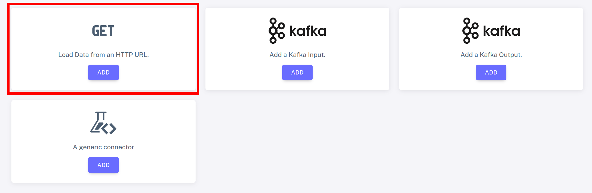

Configure the connector by choosing the following settings in the `SOURCE` and `FORMAT`
tabs:

:::tip

To avoid typing the long URL below by hand, right-click on the S3
bucket URL for `part.json` in the list above and select Copy Link,
then paste into the URL field.

:::

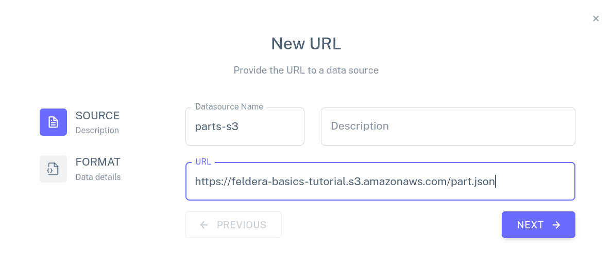
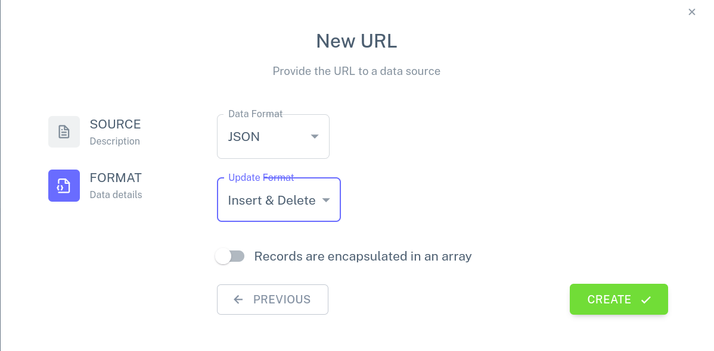

Repeat these steps to create connectors for the `VENDOR` and `PRICE` tables.

## Step 2. Attach GET connectors to the pipeline

Navigate to the `Pipelines` section of the Web Console and click the <icon icon="bx:pencil" />
next to our test pipeline to open the pipeline editor.

:::tip

You can zoom in and out in the pipeline editor with the scroll wheel on your mouse, and
pan around by clicking and dragging.

:::

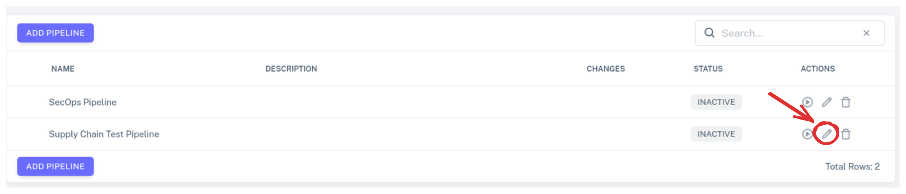

Click `Add a new input`, find the `HTTPS GET` pane, click on `SELECT`, and select the
`parts-s3` connector, which we have just created, from the list of available `GET`
connectors.  Add the other two connectors in the same way.
The pipeline editor should now look like this:

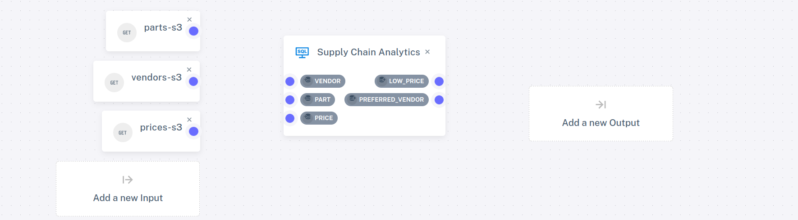

Attach each of the three connectors to the corresponding table by using the mouse to
connect the blue dot on the connector with the blue dot next to the name of the table:


We are ready to run the pipeline.  Go back to the `Pipelines` view and click the
play icon <icon icon="bx:play-circle" /> next to the pipeline.  This time there
is no need to use the table editor or `curl` to populate the tables.  The input
connectors have already ingested data from S3 and pushed it to the pipeline.
Open the detailed view of the pipeline (click the chevron icon <icon
icon="bx:chevron-down" /> next to it) and examine the contents of the input
tables and the output views.

## Step 2. Create Kafka/Redpanda connectors

Next, we will add a pair of connectors to our pipeline to ingest changes to the `PRICE`
table from a Kafka topic and output changes to the `PREFERRED_VENDOR` table to
another Kafka topic.

### Install Redpanda

To complete this part of the tutorial, you will need access to a Kafka cluster.  For your
convenience, the Feldera Docker Compose file contains instructions to bring up a local
instance of Redpanda, a Kafka-compatible message queue.  If you started Feldera
in the demo mode (by supplying the `--profile demo` switch to `docker compose`) then
the Redpanda container should already be running.  Otherwise, you can start it
using the following command:

```bash
curl -L https://github.com/feldera/feldera/releases/latest/download/docker-compose.yml | docker compose -f - up redpanda
```

Next, you will need to install `rpk`, the Redpanda CLI, by following the instructions on
[redpanda.com](https://docs.redpanda.com/current/get-started/rpk-install/).  On
success, you will be able to retrieve the state of the Redpanda cluster using:

```bash
rpk -X brokers=127.0.0.1:19092 cluster metadata
```

### Create input/output topics


Create a pair of Redpanda topics that will be used to send input updates
to the `PRICE` table and receive output changes from the `PREFERRED_VENDOR` view.

```bash
rpk -X brokers=127.0.0.1:19092 topic create price preferred_vendor
```

### Create connectors

Navigate to the `Pipelines` section of the Web Console and click the <icon icon="bx:pencil" />
icon next to our test pipeline to open the pipeline editor.

Click `Add a new input`, choose `NEW` Kafka connector, and specify the following configuration
for the connector:

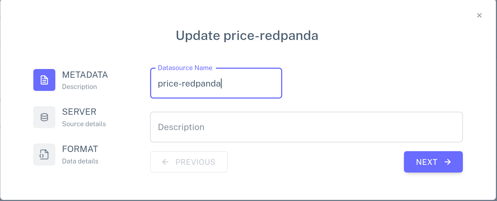
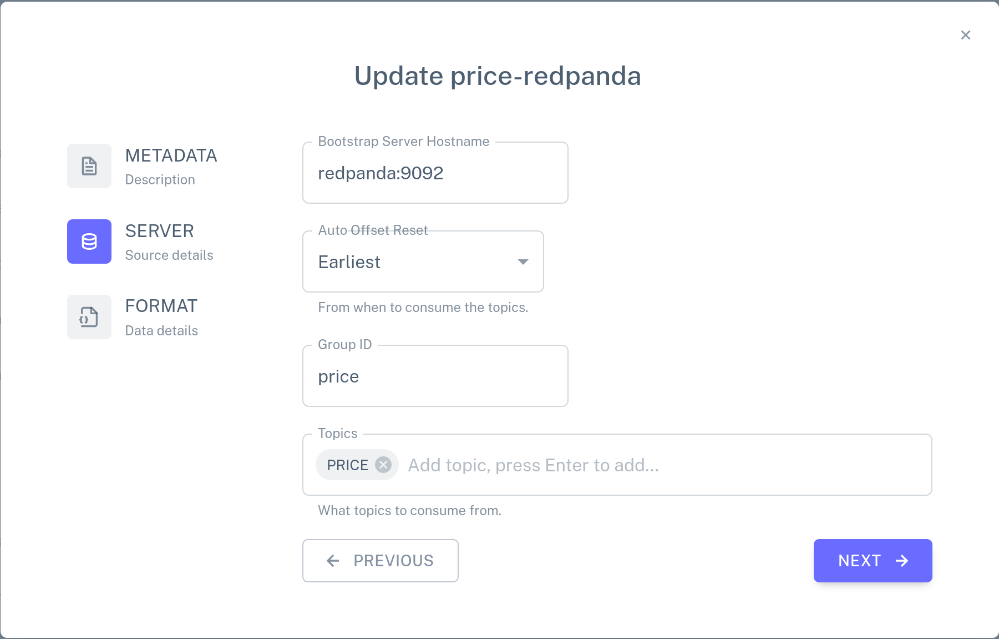
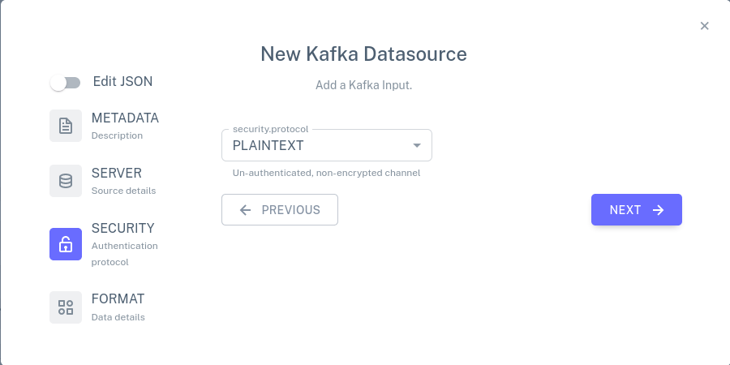
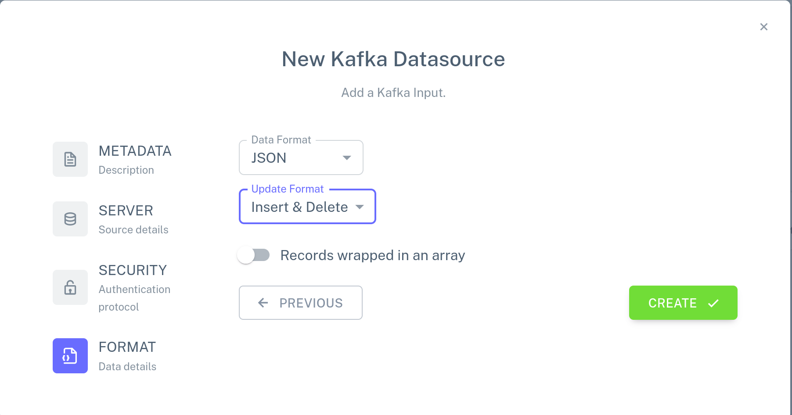

Use the mouse to attach the connector to the `PRICE` table, leaving
the existing connection in place (Feldera supports multiple input and
output connections).

Click `Add a new output`, choose `NEW` Kafka connector, and specify the following configuration
for the connector:

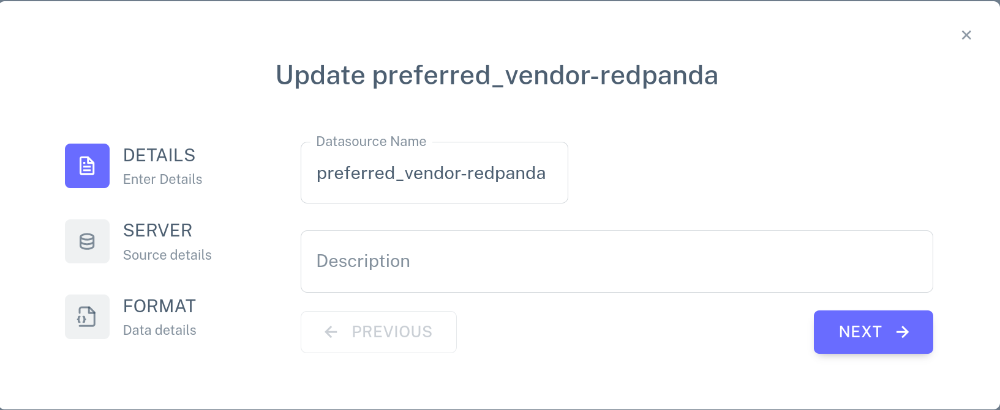
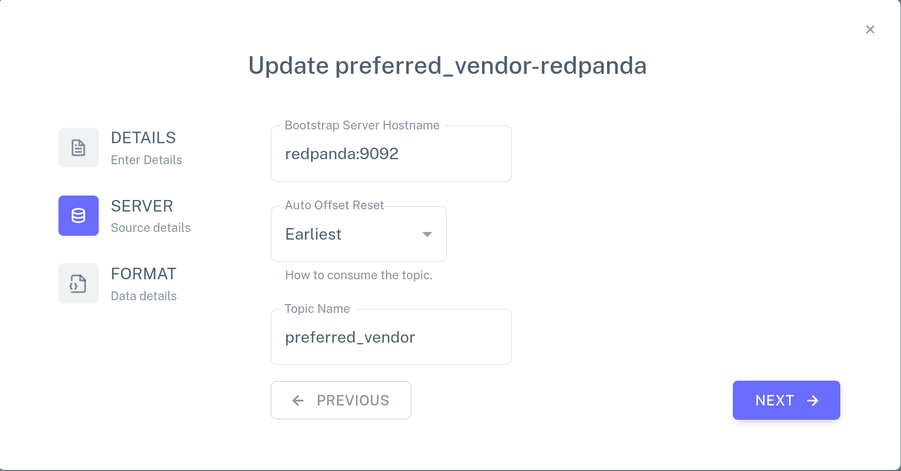
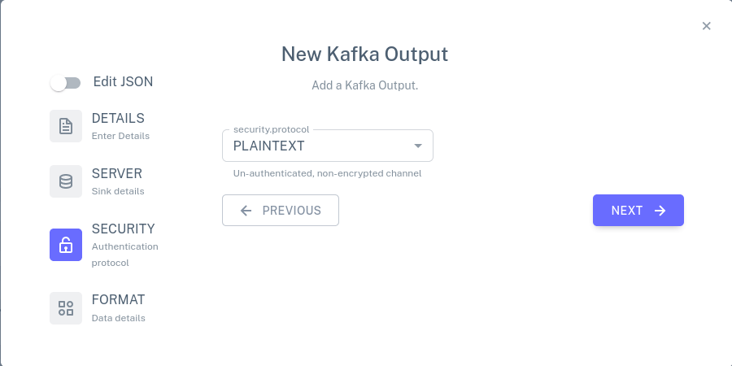
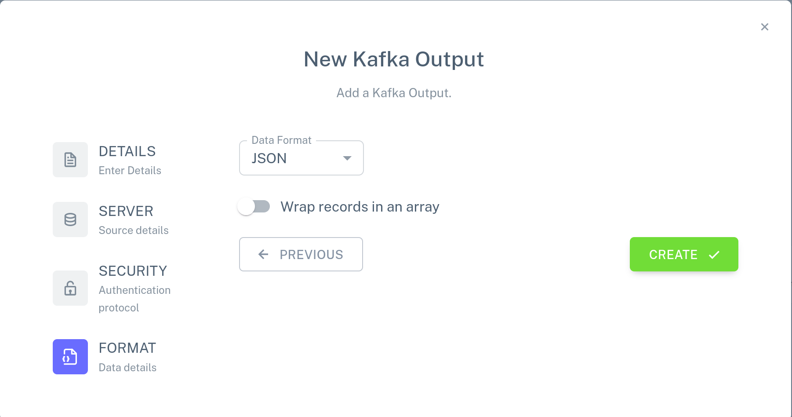

Attach this connector to the `PREFERRED_VENDOR` view.  The pipeline
configuration should now look like this:

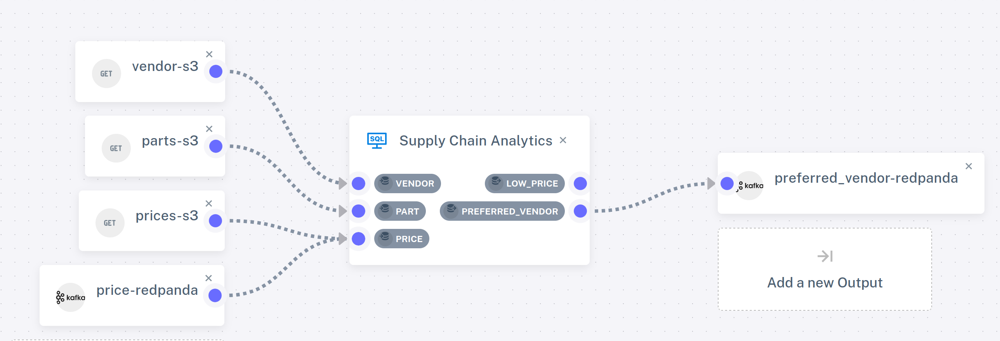

### Run the pipeline

Go back to the `Pipelines` view.  If the previous configuration of the pipeline
is still running, shut it down using the <icon icon="bx:stop" /> icon.  Start the
new configuration of the pipeline by clicking on <icon icon="bx:play-circle" />.

The `GET` connectors instantly ingest input files from S3 and the output
Redpanda connector writes computed view updates to the output topic.  Use the
Redpanda CLI to inspect the outputs:

```bash
rpk -X brokers=127.0.0.1:19092 topic consume preferred_vendor -f '%v'
```

which should output:

```json
{"insert":{"PART_ID":1,"PART_NAME":"Flux Capacitor","VENDOR_ID":2,"VENDOR_NAME":"HyperDrive Innovations","PRICE":"10000"}}
{"insert":{"PART_ID":2,"PART_NAME":"Warp Core","VENDOR_ID":1,"VENDOR_NAME":"Gravitech Dynamics","PRICE":"15000"}}
{"insert":{"PART_ID":3,"PART_NAME":"Kyber Crystal","VENDOR_ID":3,"VENDOR_NAME":"DarkMatter Devices","PRICE":"9000"}}
```

In a different terminal, push input updates to the `price` topic using the JSON
format we are already familiar with from [Part2](part2.md) of the tutorial:

```bash
echo '
{"delete": {"part": 1, "vendor": 2, "price": 10000}}
{"insert": {"part": 1, "vendor": 2, "price": 30000}}
{"delete": {"part": 2, "vendor": 1, "price": 15000}}
{"insert": {"part": 2, "vendor": 1, "price": 50000}}
{"insert": {"part": 1, "vendor": 3, "price": 20000}}
{"insert": {"part": 2, "vendor": 3, "price": 11000}}' | rpk -X brokers=127.0.0.1:19092 topic produce price -f '%v'
```

You should see the following new output updates in the `preferred_vendor` topic:

```json
{"delete":{"PART_ID":1,"PART_NAME":"Flux Capacitor","VENDOR_ID":2,"VENDOR_NAME":"HyperDrive Innovations","PRICE":"10000"}}
{"insert":{"PART_ID":1,"PART_NAME":"Flux Capacitor","VENDOR_ID":3,"VENDOR_NAME":"DarkMatter Devices","PRICE":"20000"}}
{"delete":{"PART_ID":2,"PART_NAME":"Warp Core","VENDOR_ID":1,"VENDOR_NAME":"Gravitech Dynamics","PRICE":"15000"}}
{"insert":{"PART_ID":2,"PART_NAME":"Warp Core","VENDOR_ID":3,"VENDOR_NAME":"DarkMatter Devices","PRICE":"11000"}}
```

## Takeaways

To summarize Part 3 of the tutorial,

- A Feldera pipeline can ingest data from multiple sources and send outputs to
  multiple destinations using input and output connectors.

- Combined with the incremental query evaluation mechanism, this enables Feldera
  to analyze data on the fly as it moves from sources to destinations, so that
  the destination receives up-to-date query results in real time.
