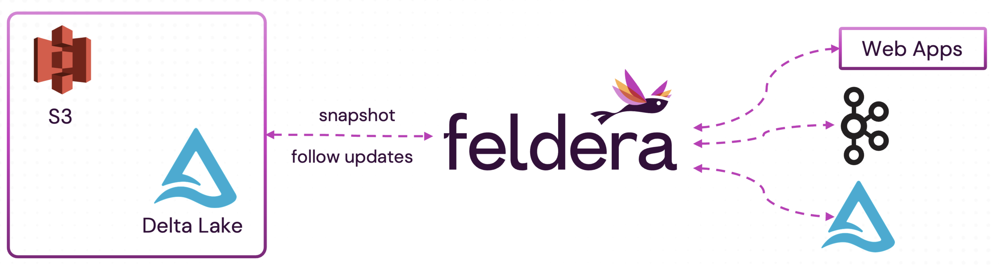

# Accelerating Batch Analytics with Feldera

## Introduction

In modern data analytics, much of the heavy lifting is done by periodic **batch
jobs** that process large volumes of historical data and generate summary tables
that power interactive queries, reports, and dashboards.

However, as data changes over time, previously computed summaries become stale
and must be updated by periodically re-running the batch job. This traditional
approach has two major drawbacks:

* **Poor data freshness:**  Batch analytics struggles to deliver up-to-date
  results, often forcing users to wait hours or even days for refreshed
insights.
* **High cost:** Each batch job reprocesses the entire dataset from scratch on
  every run. As data volume grows, batch processing becomes increasingly
expensive.

Feldera replaces traditional batch jobs with **always-on**, incremental
pipelines that continuously updates their outputs in real-time as new data
arrives.

## How it works

* **Initial backfill.** On startup, Feldera ingests historical data from a
  database or data lake, and computes the initial output views.  This step
resembles a traditional batch job, as it processes the entire dataset in one go.
* **Incremental updates.** After backfill, Feldera continuously consumes new
  changes from database tables or real-time sources (e.g., Kafka) and updates
output views incrementally.

## This guide

This guide provides a set of recipes to convert your batch pipelines into
incremental Feldera pipelines:

* Part 1: Convert a Spark SQL job into a Feldera pipeline.
* Part 2: Input connector orchestration: ingest historical and real-time data
  from multiple sources.
* Part 3: Evolving your pipeline: modify table and view definitions
