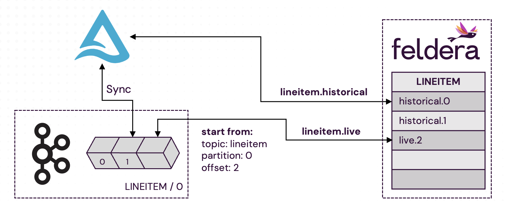

# Part 3. Working with Historical and Real Time Data


When a Feldera pipeline starts running, it often needs to ingest historical data
accumulated in the source database over an extended period (months or years)
before processing new real-time inputs. This process is known as **backfill**.

In some cases, both historical and real-time data can be ingested from the same
data source. For example, in [Part 2](part2) of this tutorial, we configured the
Delta Lake connector to read the current snapshot of the table before following
new updates in the table's transaction log.

However, in many scenarios, historical and real-time data must be ingested from
different sources. Consider the following common setup:

- Data is streamed into the system via Kafka.
- A periodic job stores Kafka messages in a database table, e.g., once per hour.
- The Kafka topic has a retention period of one day, meaning historical data older
  than a day is only available in the database.

In this case the pipeine needs to backfill historical data from the database
before switching to real-time ingest from Kafka.

## Kafka and Delta Lake

In this section of the tutorial, we will implement this scenario by configuring
the `LINEITEM` table to first read historical data from a Delta Lake table and
then ingest live data from Kafka. To achieve this, we will leverage three Feldera
features:

- **Multiple Input Connectors**: A Feldera table can be configured with multiple
  input connectors, allowing it to read from different sources.

- **Connector Orchestration**: By default, all input connectors start running
  when the pipeline initializes. Connector orchestration enables users to
  activate or deactivate connectors on demand, providing control over the timing
  and sequence of data ingestion.

- **Kafka: Starting From a Specified Offset**: Feldera supports reading a Kafka
  topic starting from a specific offset in a specific partition. This allows users to
  skip data previously synced from Kafka to the database.
  For this example, we assume that our Kafka instance has a single partition
  **(0)** and that data has been synced to Delta Lake up to **offset 41**.
  We now want Feldera to start reading from **offset 42**.

```sql
CREATE TABLE LINEITEM (
        L_ORDERKEY    INTEGER NOT NULL,
        L_PARTKEY     INTEGER NOT NULL,
        L_SUPPKEY     INTEGER NOT NULL,
        L_LINENUMBER  INTEGER NOT NULL,
        L_QUANTITY    DECIMAL(15,2) NOT NULL,
        L_EXTENDEDPRICE  DECIMAL(15,2) NOT NULL,
        L_DISCOUNT    DECIMAL(15,2) NOT NULL,
        L_TAX         DECIMAL(15,2) NOT NULL,
        L_RETURNFLAG  CHAR(1) NOT NULL,
        L_LINESTATUS  CHAR(1) NOT NULL,
        L_SHIPDATE    DATE NOT NULL,
        L_COMMITDATE  DATE NOT NULL,
        L_RECEIPTDATE DATE NOT NULL,
        L_SHIPINSTRUCT CHAR(25) NOT NULL,
        L_SHIPMODE     CHAR(10) NOT NULL,
        L_COMMENT      VARCHAR(44) NOT NULL
) WITH (
 'connectors' = '[
  {
    "labels": ["lineitem.historical"],
    "transport": {
      "name": "delta_table_input",
      "config": {
        "uri": "s3://batchtofeldera/lineitem",
        "aws_skip_signature": "true",
        "aws_region": "ap-southeast-2",
        "mode": "snapshot"
      }
    }
  },
  {
    "labels": ["lineitem.live"],
    "start_after": "lineitem.historical",
    "transport": {
        "name": "kafka_input",
        "config": {
            "bootstrap.servers": "localhost:9092",
            "topics": ["lineitem"],
            "start_from": [{
              "topic": "lineitem",
              "partition": 0,
              "offset": 42
            }]
        }
    },
    "format": {
        "name": "json",
        "config": {
            "update_format": "insert_delete",
            "array": false
        }
    }
  }]');
```

### Connector Orchestration with Labels

Connectors can be assigned arbitrary text labels for use in connector orchestration. These labels are typically chosen to reflect the connector's role in the pipeline. Here, we label the Delta Lake input connector  **lineitem.historical**
as it fetches the historical data from Delta Lake. We want the live data to be loaded only after
the historical data. To do this, in the Kafka connector definition, we specify
that it has to **start_after** the connector with label `lineitem.historical` has completed:
```json
// lineitem.live
    "start_after": "lineitem.historical",
```

:::note
It is also possible to use the Feldera API and Feldera CLI tool `fda` to **pause** and **resume**
connectors (see: [Input Connector Orchestration](https://docs.feldera.com/connectors/orchestration/)).
:::

### Start Reading Kafka Messages from a Specific Point



The Kafka input connector can be configured to start reading messages from a specific offset in the Kafka topic.
To this end, the user specifies the **start_from** property with a list of topics,
partitions, and initial offsets within each partition. It is possible to
start at different offsets in different partitions in different topics.

To start reading topic **lineitem**, partition **0** from offset **42**, in the connector configuration, we do:

```json
// lineitem.live
// config:
            "start_from": [{
              "topic": "lineitem",
              "partition": 0,
              "offset": 42
            }]
```

:::important
In cases with **multiple partitions and multiple topics**, it is necessary to
**specify the offset for each partition and topic**.
:::


## Takeaways

- Feldera simplifies working with historical and real-time data within the same pipeine by specifying multiple
  connectors for the same table to read from different data sources.
- You can specify one connector to **start_after** another connector, ensuring that the
  historical data is read first.
- You can specify the partition and offset to **start_from** a specified point in Kafka.

In upcoming articles, we will discuss how to avoid backfilling historical data every time you
restart the pipeline and send outputs of the pipeline to multiple destinations.
